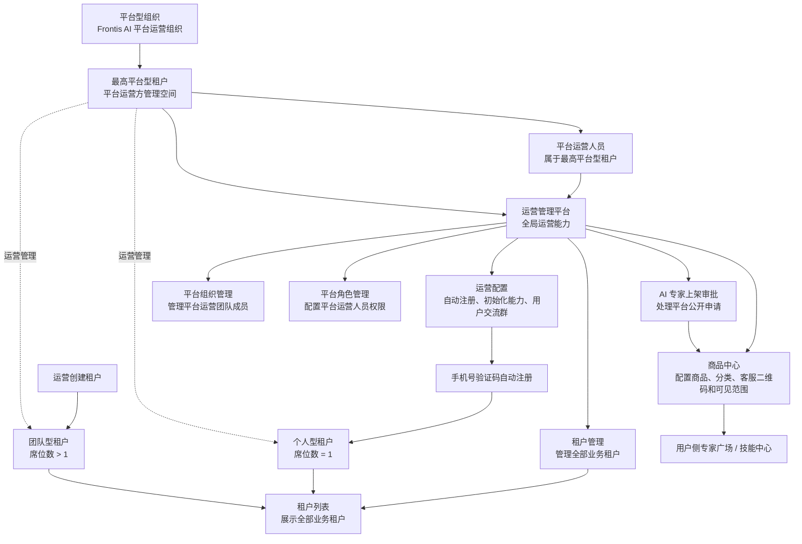

# Frontis AI · 5-15 PRD

## 1. 文档说明

### 1.1 文档目标

本文档用于定义 Frontis AI `5-15` 版本的产品需求，覆盖当前原型已经收敛后的本期范围，作为产品评审、研发排期、测试验收和需求池拆分依据。`5-15` 是独立版本需求定义，不以历史需求稿作为实现基线或差异对照。

本期重点不是继续扩展计费、资源和运营金融能力，而是把三套系统的入口、组织、角色、权限、专家广场、技能中心、商品中心和发布审核链路收敛成一套可落地的业务闭环。

### 1.2 本期纳入范围

| 系统         | 本期纳入能力                                                                                                                              |
| ------------ | ----------------------------------------------------------------------------------------------------------------------------------------- |
| 工作台       | ME、专家列表、专家广场、技能中心、进化实验室                                                                                              |
| 管理后台     | AI 专家管理、组织管理、角色管理                                                                                                           |
| 运营管理平台 | 租户管理、组织管理、角色管理、商品中心、AI 专家上架审批、运营配置                                                                         |
| 权限体系     | 同一套租户组织、成员、角色、权限树同时驱动工作台、管理后台和运营管理平台入口                                                              |
| 登录注册     | 手机号验证码登录、密码登录、验证码注册后设置密码；运营配置未注册手机号准入和新用户初始化能力；后续购买或升级后按套餐与租户内角色重新决定权限 |
| 发布链路     | 进化实验室发布 AI 专家 / Skill；AI 专家可企业内发布、提交平台公开申请或具备权限时直接平台公开；Skill 可企业内发布或具备权限时直接平台公开 |
| 商品链路     | 运营商品中心维护 AI 专家商品、专家广场分类、技能中心分类、客服二维码；用户侧专家广场和技能中心读取运营配置                                |

### 1.3 术语定义

| 术语        | 定义                                                                                   |
| ----------- | -------------------------------------------------------------------------------------- |
| ME          | 工作台默认入口，承接用户自然语言需求、文件需求和多专家协同任务                         |
| 专家列表    | 展示当前用户默认可用和已授权可用的 AI 专家，自动注册新用户进入后已有预置专家可用       |
| 专家广场    | 用户浏览当前租户可见 AI 专家的入口，来源包括我的、团队分享、FrontisAI 发布             |
| 技能中心    | 用户浏览 Skill 和 MCP 的入口，Skill 与 MCP 是一级切换                                  |
| 进化实验室  | 用户开发 AI 专家与 Skill，并进行发布的入口                                             |
| 角色        | 组织成员的权限集合；成员通过选择角色获得工作台、管理后台、运营管理平台的功能权限       |
| 系统入口    | 工作台、管理后台、运营管理平台入口；不作为独立权限项维护，由角色包含的功能权限自动推导 |
| 自动注册    | 未注册手机号通过手机号验证码入口完成验证后，由系统自动创建账号和个人版租户的流程 |
| 新用户初始化模板 | 运营配置中的自动注册初始化能力集合，只在未注册手机号自动注册创建租户时生效       |
| 平台型组织  | Frontis AI 平台自身的运营组织，系统初始化生成，用于管理平台内全部业务租户       |
| 最高平台型租户 | 平台型组织对应的根租户，初始化拥有平台级运营权限，承载运营管理平台的全局运营能力 |
| 平台公开    | AI 专家、Skill 或 MCP 面向平台范围公开，不只在当前企业内可见                           |
| 企业内发布  | AI 专家、Skill 或 MCP 仅在当前企业租户内可见可用                                       |

## 2. 全局业务原则

### 2.1 三系统统一权限原则

1. 系统一级为 `工作台`、`管理后台`、`运营管理平台`。
2. 权限树按 `一级系统 -> 二级菜单 -> 三级功能` 组织。
3. 工作台中 `ME`、`专家列表` 是二级菜单即权限项；`进化实验室` 下继续拆开发与发布动作。
4. 管理后台和运营管理平台只配置到二级菜单，二级菜单即权限项，暂不拆查看、编辑、删除等三级动作。
5. 系统入口不单独作为权限项配置。
6. 只要角色拥有某个系统下任意一个菜单或功能权限，用户菜单就展示该系统入口。
7. 没有任何运营管理平台权限的用户，不展示运营管理平台入口。
8. 没有任何管理后台权限的用户，不展示管理后台入口。
9. 用户拥有多个系统入口或多个租户时，可在系统内切换有权限的系统和租户；切换时不改变当前登录账号。

### 2.2 组织与角色统一原则

1. 运营管理平台的组织管理复用管理后台的组织树、部门、成员、角色和权限模型。
2. 管理后台与运营管理平台都不在组织管理页内用 Tab 混排“组织 / 角色”；二者在侧边菜单中是独立页面。
3. 成员添加或邀请时必须选择角色，系统根据角色权限决定成员可进入哪些系统和可使用哪些功能。
4. 角色创建只配置角色名称和权限项，不配置生效范围。
5. 角色权限选择支持全部权限、按一级系统全选、按二级菜单全选和单项选择。
6. 角色详情展示已拥有权限，不在权限详情底部展示成员列表。
7. 系统不初始化任何固定角色，不内置组织管理员、普通成员、新用户等角色；所有角色都由管理员在角色管理中创建。
8. 创建租户时不依赖已创建角色，运营直接为初始管理员勾选权限项；邀请成员和编辑成员仍从当前租户角色管理中选择已创建且可分配的角色。

### 2.3 租户创建原则

1. 运营创建租户时不选择计费模式。
2. 运营创建租户时不选择“是否开通运营系统”。
3. 运营创建租户时必须录入初始管理员姓名和手机号，并直接为初始管理员勾选权限项。
4. 初始管理员能进入哪些系统，由勾选的权限项自动推导；勾选某系统下任一权限项，即可展示该系统入口。
5. 席位数量只用于判断租户规模和组织容量；席位数为 1 时视为个人版，席位数大于 1 时视为团队版。
6. 租户创建后初始状态为待启用，运营可在租户详情中启用或停用租户。
7. 运营可在租户详情中编辑初始管理员资料和初始管理员权限项；权限保存后立即影响该管理员可进入的系统、菜单和功能。

#### 2.3.1 平台租户架构逻辑

平台需要初始化一个平台型组织及其对应的最高平台型租户。最高平台型租户是 Frontis AI 平台运营方的组织与权限载体，承载运营管理平台的全局运营能力，包括租户管理、商品中心、AI 专家上架审批、运营配置、平台组织管理和平台角色管理。普通个人型租户和团队型租户是平台服务对象，由最高平台型租户下的运营人员统一管理。

平台租户架构规则：

1. 平台型组织和最高平台型租户是系统初始化数据，代表 Frontis AI 平台运营方，不通过自动注册或运营创建租户流程生成。
2. 最高平台型租户拥有平台级运营权限；平台运营人员属于该租户，并按平台角色进入运营管理平台不同模块。
3. 最高平台型租户承载运营管理平台的完整全局能力，不只承载租户管理。
4. 租户管理用于查看和管理平台内全部业务租户，包括自动注册产生的个人型租户和运营创建的团队型租户。
5. 商品中心、AI 专家上架审批和运营配置维护的是平台级运营数据，可影响全平台或指定业务租户。
6. 平台组织管理和平台角色管理管理的是平台运营团队自身成员和权限，不与普通业务租户的组织、角色混用。
7. 普通业务租户之间互相不可见；业务租户只能管理自身组织、成员、角色和权限，不能查看或管理其他租户，也不能进入平台级运营配置。

### 2.4 发布与审核原则

1. 开发 AI 专家与开发 Skill 统一归入进化实验室的“开发 AI 专家与 Skill”权限。
2. AI 专家发布到企业内专家广场需要 `发布 AI 专家到专家广场（企业内）` 权限。
3. AI 专家提交平台公开申请需要 `提交 AI 专家进入专家广场平台公开申请` 权限。
4. AI 专家直接平台公开需要 `直接发布 AI 专家到专家广场（平台公开）` 权限；有该权限时不需要经过运营审核。
5. Skill 直接平台公开需要 `直接发布 Skill 到技能中心（平台公开）` 权限。
6. MCP 发布和上架入口在技能中心 MCP 页签，不在进化实验室。
7. 发布 MCP 到组织内使用需要 `发布 MCP 到技能中心（组织内）` 权限；上架 MCP 到全平台公开需要 `上架 MCP 到技能中心（平台公开）` 权限。
8. 没有直接平台公开权限时，AI 专家仍可先发布到企业内，再提交平台公开申请，由运营在 AI 专家上架审批中审核。
9. 运营审核通过 AI 专家平台公开申请后，系统在商品中心生成一条待完善商品，运营需补齐商品信息后才能上架。

### 2.5 商品与分类原则

1. 商品中心本期只管理 AI 专家商品。
2. AI 专家商品必须绑定一个已审核通过的 AI 专家。
3. 专家广场分类由运营在商品中心维护，用户侧专家广场业务场景 Tab 读取启用分类并按排序展示。
4. 技能中心分类由运营在商品中心维护，用户侧技能中心分类 Tab 读取启用分类并按排序展示。
5. 分类停用后不在用户侧展示；用户当前选中分类失效时回到“全部”。
6. 商品获取方式支持免费添加、免费试用、联系客服。
7. 选择联系客服的商品，在用户侧专家广场点击“联系我们”时弹出二维码弹窗。
8. 商品可配置使用平台默认客服二维码，也可配置商品专属二维码。

### 2.6 登录注册与新用户初始化原则

1. 登录页提供验证码登录和密码登录两个 Tab，用户可在同一页面切换登录方式。
2. 验证码登录承接手机号验证和自动注册准入；手机号已存在时进入登录流程，手机号不存在时进入自动注册判断。
3. 密码登录只面向已设置密码的账号；账号未设置密码时，提示用户先使用验证码登录并设置密码。
4. 手机号不存在时，由运营管理平台的自动注册配置决定是否允许继续：开启时自动注册，关闭时提示“暂无权限”。
5. 自动注册成功后，系统创建 1 席个人版租户，并把该用户作为该租户的首个成员。
6. 自动注册账号和未设置密码的新用户账号，在验证码校验通过后必须先设置登录密码。
7. 设置密码弹窗包含“登录密码”和“确认密码”两个输入框；两次输入一致且通过密码规则后，才能继续进入后续流程。
8. 自动注册用户完成密码设置后，再进入 ME 并展示新用户首登资料补充弹窗。
9. 自动注册用户不绑定“普通成员”或“新用户”等固定角色，初始能力由新用户初始化模板直接生成。
10. 登录成功后，如果账号只属于一个租户，则直接使用该租户；如果账号属于多个租户，则先进入租户选择页。
11. 选定租户后，根据该用户在当前租户内拥有的系统权限决定进入路径：只有一个系统权限时直接进入该系统，拥有多个系统权限时默认进入对话工作台。
12. 用户进入系统后，可在系统内切换自己有权限的租户和系统；切换租户后按新租户内权限重新计算可进入系统和默认落点。
13. “新用户”只作为初始化阶段展示标签，不是角色管理中的角色。
14. 新用户初始可见功能由运营配置中的“新用户初始化模板”决定。
15. 默认初始化能力为 ME、专家列表、专家广场、技能中心、进化实验室。
16. 初始化模板只能选择权限树中已有的功能权限，支持增删；保存时至少保留一个初始化能力。
17. 初始化模板只影响自动注册创建时刻；用户后续购买团队版、升级套餐、被管理员分配角色后，权限按套餐与租户内已创建角色重新决定。
18. 自动注册初始化逻辑不影响企业管理员邀请成员；被邀请成员仍通过成员角色获得权限。

### 2.7 登录注册交互设计

#### 2.7.1 登录页 Tab

| Tab      | 字段                         | 提交规则                                                                 | 成功后处理                                                                 |
| -------- | ---------------------------- | ------------------------------------------------------------------------ | -------------------------------------------------------------------------- |
| 验证码登录 | 手机号、验证码、获取验证码按钮 | 手机号必须为 11 位；验证码必须为 6 位；验证码必须匹配当前手机号          | 已设置密码账号直接进入登录后分流；未设置密码账号先弹出设置密码弹窗         |
| 密码登录 | 手机号、密码                 | 手机号必须为 11 位；密码不能为空；账号必须已设置密码                     | 校验通过后进入登录后分流；账号未设置密码时提示先使用验证码登录并设置密码   |

登录页默认选中验证码登录。切换 Tab 时保留手机号输入；验证码和密码输入互不影响。选择预置账号时，系统自动填充手机号和验证码；如果该账号已设置默认密码，也可用于密码登录；如果该账号为沈一新这类新用户账号，则验证码登录后先进入设置密码弹窗。

#### 2.7.2 设置密码弹窗

| 场景                 | 触发时机                         | 字段                 | 校验规则                                     | 下一步                                             |
| -------------------- | -------------------------------- | -------------------- | -------------------------------------------- | -------------------------------------------------- |
| 新用户首次登录       | 已存在账号验证码校验通过但未设置密码 | 登录密码、确认密码   | 至少 8 位；同时包含字母和数字；两次输入一致 | 保存密码后进入登录后分流；沈一新进入 ME 首登资料弹窗 |
| 手机号验证码注册     | 自动注册创建账号和个人版租户后     | 登录密码、确认密码   | 至少 8 位；同时包含字母和数字；两次输入一致 | 保存密码后进入 ME，并展示首登资料补充弹窗           |
| 密码登录前置校验     | 用户在密码登录 Tab 输入未设密码账号 | 无                   | 不允许直接密码登录                           | 提示“当前账号尚未设置密码，请先使用验证码登录并设置密码” |

设置密码弹窗是登录注册链路的一步，不承担资料收集和权限配置。资料补充仍由 ME 首登资料弹窗处理，权限仍由运营配置的新用户初始化模板决定。

## 3. 权限项设计

### 3.1 权限树和权限项生效逻辑

权限树必须与原型中的角色权限选择器和运营租户初始管理员权限下拉选项保持一致。系统入口不单独配置；用户拥有某个一级系统下任意一个权限项时，才展示该一级系统入口。

| 一级系统     | 二级菜单        | 权限项                                    | 生效逻辑和作用范围                                                                 | 开通后效果                                                                 |
| ------------ | --------------- | ----------------------------------------- | ---------------------------------------------------------------------------------- | -------------------------------------------------------------------------- |
| 工作台       | ME              | ME                                        | 作用于当前租户工作台 ME 对话入口。                                                  | 用户可进入工作台并使用 ME 发起对话、上传附件、查看本轮过程消息和文件结果。 |
| 工作台       | 专家列表        | 专家列表                                  | 作用于当前租户工作台专家列表入口。                                                  | 用户可查看并使用当前租户已授权、系统预置或管理员分配的 AI 专家。           |
| 工作台       | 专家广场        | 专家广场                                  | 作用于当前租户工作台专家广场入口。                                                  | 用户可浏览当前租户可见的专家广场内容，并按来源和业务场景筛选专家。         |
| 工作台       | 技能中心        | 浏览 Skill 和 MCP                         | 作用于当前租户工作台技能中心入口。                                                  | 用户可进入技能中心浏览可见 Skill 和 MCP，按分类搜索和查看详情。            |
| 工作台       | 技能中心        | 发布 MCP 到技能中心（组织内）             | 作用于当前租户技能中心 MCP 发布动作。                                               | 用户可把 MCP 发布为当前组织内可用，发布后仅当前租户成员可见和使用。        |
| 工作台       | 技能中心        | 上架 MCP 到技能中心（平台公开）           | 作用于当前租户技能中心 MCP 上架动作。                                               | 用户可提交或执行 MCP 平台公开上架，使通过后的 MCP 面向平台租户公开。       |
| 工作台       | 进化实验室      | 查看进化实验室                            | 作用于当前租户工作台进化实验室入口。                                                | 用户侧边栏展示进化实验室入口，并可进入查看自己有权限的开发资源。           |
| 工作台       | 进化实验室      | 开发 AI 专家与 Skill                      | 作用于当前租户进化实验室开发动作。                                                  | 用户可创建、编辑、调试自己负责的 AI 专家和 Skill。                         |
| 工作台       | 进化实验室      | 发布 AI 专家到专家广场（企业内）          | 作用于当前租户 AI 专家发布动作。                                                    | 用户可把 AI 专家发布到当前企业内专家广场，供当前租户成员添加和使用。       |
| 工作台       | 进化实验室      | 提交 AI 专家进入专家广场平台公开申请      | 作用于当前租户 AI 专家平台公开申请动作。                                            | 用户可提交平台公开申请，运营管理平台 AI 专家上架审批生成待审核记录。       |
| 工作台       | 进化实验室      | 直接发布 AI 专家到专家广场（平台公开）    | 作用于平台级 AI 专家直发动作，通常只授予平台运营或受信任发布方。                    | 用户可绕过租户内企业可见范围，把 AI 专家直接发布为平台公开可见。           |
| 工作台       | 进化实验室      | 直接发布 Skill 到技能中心（平台公开）     | 作用于平台级 Skill 直发动作，通常只授予平台运营或受信任发布方。                     | 用户可把 Skill 直接发布到平台公开技能中心，供平台租户浏览和使用。          |
| 管理后台     | AI 专家管理     | AI 专家管理                               | 作用于当前租户管理后台 AI 专家管理菜单。                                            | 用户可管理当前租户 AI 专家资产、可见范围、发布状态和版本信息。             |
| 管理后台     | 组织管理        | 组织管理                                  | 作用于当前租户管理后台组织管理菜单。                                                | 用户可新增、编辑、删除部门，设置部门负责人，查看成员列表，邀请、编辑、停用、删除成员。 |
| 管理后台     | 角色管理        | 角色管理                                  | 作用于当前租户管理后台角色管理菜单。                                                | 用户可创建、编辑、删除当前租户角色，并为角色配置统一权限树中的权限项。     |
| 运营管理平台 | 租户管理        | 租户管理                                  | 作用于最高平台型租户的运营管理平台租户管理菜单，数据范围为平台内业务租户。          | 用户可创建租户、配置初始管理员权限、查看租户详情、编辑租户资料和启停租户。 |
| 运营管理平台 | 组织管理        | 组织管理                                  | 作用于最高平台型租户的运营组织管理菜单，管理对象为平台运营团队自身组织。            | 用户可维护平台运营团队部门和成员，包括新增、编辑、删除部门，邀请、编辑、停用、删除运营成员。 |
| 运营管理平台 | 角色管理        | 角色管理                                  | 作用于最高平台型租户的运营角色管理菜单，管理对象为平台运营团队角色。                | 用户可创建、编辑、删除平台运营角色，并配置运营人员可进入的运营菜单和功能权限。 |
| 运营管理平台 | 商品中心        | 商品中心                                  | 作用于最高平台型租户的运营商品中心菜单，数据范围为平台商品和分类配置。              | 用户可维护 AI 专家商品、专家广场分类、技能中心分类、商品可见范围和客服二维码。 |
| 运营管理平台 | AI 专家上架审批 | AI 专家上架审批                           | 作用于最高平台型租户的 AI 专家平台公开申请审批菜单。                                | 用户可查看租户提交的 AI 专家平台公开申请，并执行通过或驳回；通过后生成待完善商品。 |
| 运营管理平台 | 运营配置        | 运营配置                                  | 作用于最高平台型租户的运营配置菜单。                                                | 用户可配置用户交流群、自动注册开关、新用户初始化模板等平台级运营配置。     |

说明：管理后台的组织管理和角色管理服务普通业务租户自身组织；运营管理平台的组织管理和角色管理服务最高平台型租户的运营团队。两者使用同一套组织、成员、角色和权限模型，但作用对象由当前进入的租户决定。

### 3.2 角色创建与分配规则

| 规则         | 说明                                                                                 |
| ------------ | ------------------------------------------------------------------------------------ |
| 角色来源     | 系统不初始化任何固定角色；所有租户角色都由管理员在角色管理中创建                     |
| 角色配置     | 创建或编辑角色时填写角色名称，并在权限树中选择该角色拥有的权限项                     |
| 角色命名     | 角色名称只作为业务命名，不绑定固定系统逻辑；实际权限由角色勾选的权限项决定           |
| 租户创建     | 创建租户时不选择角色，运营直接为初始管理员勾选权限项；保存后按权限项推导系统入口和菜单 |
| 成员管理     | 邀请成员和编辑成员时，只能选择当前租户角色管理中已创建且可分配的角色                 |
| 无可选角色   | 当前没有可分配角色时，不影响租户创建；只阻断成员邀请或成员角色变更，需要先创建角色   |
| 新用户初始化 | 自动注册新用户不生成新的角色记录；初始功能能力由运营配置的新用户初始化模板直接生成   |

## 4. 工作台 PRD

### 4.1 侧边导航

| 菜单        | 路径含义                   | 页面要求                   |
| ----------- | -------------------------- | -------------------------- |
| ME          | 默认工作入口               | 用户进入工作台默认打开 ME  |
| 专家列表    | 查看可用 AI 专家           | 新用户进入后已有预置专家   |
| 专家广场    | 浏览可见 AI 专家           | 页面顶部不展示额外页面标题 |
| 技能中心    | 浏览 Skill 和 MCP          | 页面顶部不展示额外页面标题 |
| 进化实验室  | 开发和发布 AI 专家 / Skill | 仅拥有开发权限时可进入     |

### 4.2 ME 对话体验

ME 是工作台默认任务入口，承接用户自然语言需求、文件处理、工具调用、Skill 调用和 AI 专家协同。本期 ME 的目标不是展示底层执行日志，而是把执行过程整理成用户能理解的“过程摘要 + 状态 + 成果”。所有过程消息必须围绕当前任务顺序展示，不能把多个工具调用集中堆叠到同一段里。

#### 4.2.0 ME 能力总表

| 能力范围       | 页面中文名称       | 核心规则                                                     | 详见章节 |
| -------------- | ------------------ | ------------------------------------------------------------ | -------- |
| 基础对话       | ME 对话            | 承接用户任务输入、附件提交、消息展示和返回状态保留           | 4.2.1    |
| 过程消息       | 任务过程           | 按真实执行顺序展示思考块、工具、Skill、MCP、Workbench Task 和专家协同 | 4.2.2    |
| 本地工具       | 工具调用           | 每个工具固定中文名称和摘要规则；过程展示规则见本地工具明细   | 4.2.3    |
| Skill 与 MCP   | Skill 或 MCP 调用  | 中文名称来自技能中心或 MCP 配置；过程展示规则见 Skill/MCP 明细 | 4.2.4    |
| 子任务协同     | 任务分发/任务继续/任务完成/任务失败 | 展示实际被调用 AI 专家名称、头像、任务名称和状态             | 4.2.5    |
| 统一工作卡片   | 任务/今日成果      | 任务展示本轮专家协同；今日成果展示当日 ME 产出文件           | 4.2.6    |
| 任务结束文件   | 文件卡片           | 本轮创建或编辑文件时在最终回复结尾展示，可点击预览           | 4.2.7    |
| 工作记录       | 工作记录           | 仅 ME 页展示入口，记录按日期倒序，可搜索和筛选               | 4.2.8    |

#### 4.2.1 基础对话能力

| 能力             | 页面中文名称 | 页面位置       | 具体规则                                                                 |
| ---------------- | ------------ | -------------- | ------------------------------------------------------------------------ |
| 默认入口         | ME           | 工作台侧边菜单 | 用户进入工作台时默认打开 ME 会话页                                       |
| 输入框           | 任务输入     | 页面底部       | 空输入框占位文案固定为“请告诉我你的需求或问题”；支持输入文本和携带附件   |
| 发送消息         | 提交任务     | 页面底部       | 用户提交后追加为本轮用户消息；附件跟随本轮消息提交，不单独形成任务轮次   |
| 返回状态保留     | 会话保留     | ME 页面        | 用户从其他工作台菜单返回 ME 时，保留当前消息列表、已上传附件和输入草稿   |
| 用户消息头       | 用户消息     | 对话区         | 用户消息不展示“你”作为消息头                                             |
| Agent 消息头     | ME 消息      | 对话区         | 智能体为 ME 时不展示“ME”消息头；其他 AI 专家消息按专家名称展示           |
| 用户消息时间     | 消息时间     | 用户消息右下角 | 用户消息时间默认隐藏；仅 hover 或键盘 focus 当前用户消息时显示           |
| Agent 消息时间   | Agent 时间   | 对话区         | Agent 消息不展示时间；过程消息状态由状态文案表达                         |

#### 4.2.2 过程消息统一规则

| 事件类型          | 页面中文名称             | 触发条件                         | 展示字段                                                         | 状态范围                       | 交互规则 |
| ----------------- | ------------------------ | -------------------------------- | ---------------------------------------------------------------- | ------------------------------ | -------- |
| 思考块            | 思考过程                 | ME 需要展示任务分析、拆解或中间判断 | 中文标题、状态、思考摘要；必要时展示分步内容                     | 执行中、执行完成、执行失败     | 可展开查看详细思考过程 |
| 本地工具          | 按工具中文名称展示       | ME 调用文件、搜索、命令、网页等工具 | 中文名称、状态、一句话摘要；失败时展示失败原因                   | 执行中、执行完成、执行失败     | 按工具明细规则处理展开和收起 |
| Skill 调用        | 按 Skill 中文名称展示    | ME 调用用户侧 Skill 能力           | Skill 名称、状态、一句话摘要；若产生文件则进入任务结束文件卡片   | 执行中、执行完成、执行失败     | 按 Skill 或 MCP 配置处理展开和收起 |
| Workbench Task    | 按任务工具中文名称展示   | ME 分发、继续、完成或失败子任务    | 工具中文名、AI 专家名称、任务名称、状态、一句话摘要              | 执行中、执行完成、执行失败     | 按任务工具明细规则处理展开和收起 |
| AI 专家协同       | 按实际 AI 专家名称展示   | 本轮任务调用一个或多个 AI 专家     | AI 专家头像、AI 专家名称、任务名称、状态、任务结果摘要           | 执行中、执行完成、执行失败     | 状态同步到右上角统一工作卡片 |

过程消息在对话中按真实执行顺序出现：ME 可以先输出思考或说明，再调用工具或分发子任务，再继续输出结果。工具和专家调用完成后，ME 应补充下一步解释或结论；本轮任务结束时如有文件产出，最终回复结尾必须追加文件卡片。

#### 4.2.3 本地工具中文名称与展开规则

| 工具名称       | 页面中文名称     | 是否展开 | 摘要展示规则                                                   | 展开内容规则                                               |
| -------------- | ---------------- | -------- | -------------------------------------------------------------- | ---------------------------------------------------------- |
| `write_file`   | 创建/写入文件    | 是       | 展示写入的文件名、文件类型和执行状态                           | 展开后展示文件路径、写入结果摘要和可预览文件入口           |
| `read_file`    | 读取文件         | 否       | 展示读取的文件名和执行状态                                     | 不提供展开；只保留摘要和状态                               |
| `edit_file`    | 编辑文件         | 是       | 展示编辑的文件名、修改范围摘要和执行状态                       | 展开后展示文件路径、修改摘要和可预览文件入口               |
| `ls`           | 列出目录         | 否       | 展示目录名称、匹配数量和执行状态                               | 不提供展开；避免把目录列表撑开对话                         |
| `glob`         | 文件模式搜索     | 否       | 展示搜索模式、匹配数量和执行状态                               | 不提供展开；只保留搜索摘要                                 |
| `grep`         | 内容搜索         | 是       | 展示搜索关键词、命中范围和执行状态                             | 展开后展示关键命中摘要，不展示无关原始日志                 |
| `shell`        | 执行 Shell 命令  | 是       | 展示命令用途、执行状态和结果摘要                               | 展开后展示命令名称、关键输出摘要和失败原因                 |
| `http_request` | HTTP 请求        | 是       | 展示请求对象、执行状态和结果摘要                               | 展开后展示请求目标、响应状态和关键响应摘要                 |
| `fetch_url`    | 网页抓取         | 是       | 展示网页标题或域名、执行状态和抓取摘要                         | 展开后展示目标地址、抓取结果摘要和失败原因                 |
| `write_todos`  | 任务列表管理     | 否       | 展示任务清单更新摘要和执行状态                                 | 不提供展开；任务变化直接体现在后续过程消息或结论中         |

本地工具消息只服务于用户理解当前任务进展，不展示调试日志、原始参数和完整输出。若工具执行失败，消息状态显示为“执行失败”，摘要中说明失败原因；后续 ME 需要说明是否重试、换方案或结束任务。

#### 4.2.4 Skill 调用展示规则

| 能力             | 页面中文名称       | 是否展开 | 展示规则                                                                 |
| ---------------- | ------------------ | -------- | ------------------------------------------------------------------------ |
| 普通 Skill 调用  | Skill 名称         | 按配置   | 若 Skill 结果是一句话摘要、简单判断或无文件产出，默认不展开             |
| 文件类 Skill     | Skill 名称         | 是       | 若 Skill 创建或编辑文件，过程消息可展开；最终回复结尾必须追加文件卡片   |
| 数据查询类 Skill | Skill 名称         | 按配置   | 若结果需要用户核对明细则可展开；只需要结论时不展开                       |
| MCP 能力调用     | MCP 服务名称       | 按配置   | 展示 MCP 服务中文名称、状态和结果摘要；是否展开由该 MCP 能力配置决定     |

Skill 与 MCP 的中文名称来自技能中心或 MCP 配置，不在 ME 内硬编码。每个 Skill 或 MCP 能力必须在配置中给出是否需要展开；没有配置时默认不展开，只展示状态和结果摘要。

#### 4.2.5 Workbench Task 与 AI 专家调用规则

| 工具名称                  | 页面中文名称 | 标题格式                               | 是否展开 | 展示规则                                                               |
| ------------------------- | ------------ | -------------------------------------- | -------- | ---------------------------------------------------------------------- |
| `workbench-task dispatch` | 任务分发     | 任务分发 - AI 专家名称：任务名称       | 是       | 分发给 AI 专家时展示实际专家头像、专家名称、任务名称和输入摘要         |
| `workbench-task continue` | 任务继续     | 任务继续 - AI 专家名称：任务名称       | 是       | 继续某个专家子任务时展示继续原因、补充输入摘要和执行状态               |
| `workbench-task done`     | 任务完成     | 任务完成 - AI 专家名称：任务名称       | 否       | 只展示该专家返回的结果摘要和成果，不展示原始输入                       |
| `workbench-task fail`     | 任务失败     | 任务失败 - AI 专家名称：任务名称       | 否       | 只展示失败原因、影响范围和后续处理方式                                 |

AI 专家清单不在本 PRD 中固化。页面按本轮实际被调用的 AI 专家展示头像和名称，标题格式固定为“工具中文名 - AI 专家名称：任务名称”，例如“任务分发 - 数据洞察师：定义灰度期最该盯的异常信号”。如果同一轮调用多个 AI 专家，过程消息按调用顺序展示，不合并成一个大块。

#### 4.2.6 右上角统一工作卡片

统一工作卡片只在 ME 对话页展示。其他 AI 专家独立对话页不展示工作记录入口，也不展示 ME 的任务卡片。卡片位于对话区右上角，整体为浮层卡片，支持展开和收起。

| 区域     | 触发条件                         | 展示字段                                             | 展开状态                                                             | 收起状态                                               |
| -------- | -------------------------------- | ---------------------------------------------------- | -------------------------------------------------------------------- | ------------------------------------------------------ |
| 任务     | 本轮任务调用任意 AI 专家          | 目标标题、目标下任务数量、任务状态图标、任务描述、AI 专家头像、AI 专家名称 | 顶部标题固定为“任务”；按目标分组展示本轮全部 AI 专家任务，每个目标组展示目标标题和任务数量，组内展示任务卡片 | 只保留“任务”标题和展开按钮，并展示当前最新任务的状态图标和任务描述 |
| 今日成果 | 当日存在 ME 创建或编辑的产出文件  | 文件图标、文件名                                     | 仅在卡片展开时展示；标题固定为“今日成果”，文件列表按最近产出或更新时间倒序排列，点击文件打开预览面板 | 不展示今日成果列表，也不展示最新文件摘要               |

任务状态只允许三种：执行中、执行完成、执行失败。状态在卡片中以状态图标表达，鼠标悬停或无障碍标签可读取状态文案。未调用 AI 专家且没有当日成果文件时，整个统一工作卡片不展示；未调用 AI 专家但存在当日成果文件时，只展示今日成果区域；没有当日文件产出时不展示今日成果空列表。

#### 4.2.7 任务结束文件卡片

| 能力         | 页面中文名称 | 触发条件                  | 展示位置         | 卡片字段                                           | 交互规则                     |
| ------------ | ------------ | ------------------------- | ---------------- | -------------------------------------------------- | ---------------------------- |
| 创建文件卡片 | 文件卡片     | 本轮 ME 任务创建了文件     | 最终回复正文结尾 | 文件图标、文件名、文件类型、文件大小或更新时间、点击预览 | 点击卡片打开预览面板         |
| 编辑文件卡片 | 文件卡片     | 本轮 ME 任务编辑了已有文件 | 最终回复正文结尾 | 文件图标、文件名、文件类型、文件大小或更新时间、点击预览 | 点击卡片打开预览面板         |
| 多文件展示   | 文件卡片组   | 本轮创建或编辑多个文件     | 最终回复正文结尾 | 每个文件一张卡片                                   | 按本轮生成或修改时间倒序展示 |
| 去重规则     | 文件去重     | 本轮同一路径文件被多次修改 | 最终回复正文结尾 | 只展示同一路径最新卡片                             | 点击后预览最新版本           |

如果本轮任务没有创建或编辑文件，最终回复不展示文件卡片。文件卡片只代表本轮实际产出，不把历史文件或仅被读取的文件混入。

#### 4.2.8 工作记录

| 能力         | 页面中文名称 | 展示位置     | 展示规则                                                 | 交互规则                           |
| ------------ | ------------ | ------------ | -------------------------------------------------------- | ---------------------------------- |
| 工作记录入口 | 工作记录     | ME 页右上角  | 仅 ME 对话页展示；其他 AI 专家页面不展示                 | 点击后打开工作记录面板             |
| 记录列表     | 工作记录列表 | 工作记录面板 | 按日期倒序展示系统自动生成的记录                         | 支持滚动查看                       |
| 记录内容     | 工作记录详情 | 工作记录面板 | 每条记录展示日期、记录标题、生成摘要、成果高亮和成果文件 | 点击记录定位到对应会话位置         |
| 搜索         | 搜索工作记录 | 工作记录面板 | 支持按工作记录标题、生成摘要、成果文件名称搜索           | 输入关键词后刷新列表               |
| 日期筛选     | 日期范围筛选 | 工作记录面板 | 支持选择开始日期和结束日期                               | 筛选后只展示日期范围内的工作记录   |

### 4.3 专家列表

专家列表用于展示当前用户可直接使用的 AI 专家。本期要求系统预置一组默认可用 AI 专家，所有用户默认可见；自动注册新用户首次进入工作台后，专家列表中已经存在这些预置专家，不需要用户从专家广场手动添加，也不需要管理员单独分配。

| 规则       | 说明                                                                       |
| ---------- | -------------------------------------------------------------------------- |
| 展示对象   | 所有拥有专家列表权限的用户                                                 |
| 默认内容   | 系统预置的默认可用 AI 专家                                                 |
| 新用户表现 | 自动注册用户首次进入工作台后，专家列表直接展示预置专家卡片                 |
| 卡片字段   | 专家名称、简介、业务场景标签、可用状态                                     |
| 权限关系   | 预置专家默认对所有用户可用；后续新增或分配专家仍按专家可用范围和角色权限控制 |

### 4.4 新用户首登初始化

自动注册新用户完成手机号验证码注册并设置登录密码后默认进入 ME。若该用户仍处于初始化阶段，系统展示首登资料补充弹窗。弹窗字段包括姓名或昵称、团队或公司名称、岗位角色、主要使用场景；用户点击提交后保存这些资料并标记首登资料已完成；用户点击跳过时只关闭弹窗并记录已跳过。弹窗只用于保存上述首登资料，不承担权限配置；用户可见菜单和能力仍以运营配置的新用户初始化模板为准。

| 规则         | 说明                                                                                 |
| ------------ | ------------------------------------------------------------------------------------ |
| 展示对象     | 自动注册创建个人版租户的新用户                                                       |
| 展示时机     | 新用户设置登录密码并首次进入 ME 后展示；提交或跳过后本轮会话不再重复弹出              |
| 填写字段     | 姓名或昵称、团队或公司名称、岗位角色、主要使用场景                                     |
| 提交结果     | 保存用户填写资料，标记首登资料已完成，关闭弹窗并回到 ME 会话                           |
| 跳过结果     | 不保存资料字段，只记录已跳过首登资料补充，关闭弹窗并回到 ME 会话                       |
| 权限来源     | 不从弹窗字段推导权限；权限来自运营配置的新用户初始化模板                               |
| 后续变化     | 用户购买团队版、升级套餐或被重新分配角色后，按新套餐和角色重新计算权限                 |

### 4.5 专家广场

#### 4.5.1 页面结构

1. 页面不展示外层标题。
2. 顶部第一行展示来源分类 Tab：全部、我的、团队分享、FrontisAI发布。
3. 个人版租户不展示团队分享入口。
4. 顶部第二行展示业务场景 Tab：全部 + 运营商品中心启用的专家广场分类。
5. 专家卡片展示专家名称、来源标签、业务场景标签、简介和“联系我们”按钮。

#### 4.5.2 数据来源

| 来源          | 数据规则                                       |
| ------------- | ---------------------------------------------- |
| 我的          | 当前用户在进化实验室开发并发布的 AI 专家       |
| 团队分享      | 当前团队内其他成员分享的 AI 专家；个人版不展示 |
| FrontisAI发布 | 运营商品中心已上架、当前租户可见的 AI 专家商品 |

#### 4.5.3 分类联动

1. 专家广场业务场景分类读取运营商品中心的专家广场分类。
2. 只读取启用状态分类。
3. 分类按排序值升序展示；排序相同时按更新时间展示。
4. FrontisAI发布商品的分类取商品配置的商品分类。
5. 分类停用后，用户侧不再展示该分类 Tab，已选中停用分类时回到全部。

#### 4.5.4 联系我们

1. 用户点击专家卡片“联系我们”后打开联系弹窗。
2. 若商品配置了专属客服二维码，则弹窗展示商品专属二维码和商品联系说明。
3. 若商品未配置专属二维码，则读取运营商品中心“客服配置”的平台默认客服二维码。
4. 若平台默认客服二维码未启用或未填写二维码内容，则弹窗展示“运营后台暂未启用客服二维码”。

#### 4.5.5 删除自己发布的 AI 专家

1. 仅“我的”来源下由当前用户自己发布的 AI 专家展示删除入口。
2. 团队分享、FrontisAI发布、运营商品中心上架的 AI 专家不展示删除入口。
3. 用户点击删除后必须二次确认；确认后该 AI 专家从当前用户专家广场列表中移除。
4. 删除后，该 AI 专家不再出现在“我的”和“全部”列表；若该专家已进入平台公开申请或商品化链路，删除当前广场展示不自动删除运营侧审批记录或商品记录。

### 4.6 技能中心

#### 4.6.1 页面结构

1. 页面不展示外层标题。
2. 顶部第一优先级为 `Skill / MCP` 切换。
3. `Skill / MCP` 切换右侧展示搜索框。
4. 第二行展示业务分类 Tab：全部 + 运营商品中心启用的技能中心分类。
5. 不展示 Workflow、Skill、模型等类型筛选。

#### 4.6.2 筛选规则

| 筛选项      | 规则                                                     |
| ----------- | -------------------------------------------------------- |
| Skill / MCP | 选择 Skill 时展示所有非 MCP 项；选择 MCP 时只展示 MCP 项 |
| 分类 Tab    | 分类来自运营商品中心启用的技能中心分类；全部不限制分类   |
| 搜索        | 按名称、描述、标签匹配                                   |

#### 4.6.3 卡片信息

每张卡片展示图标、名称、描述、发布方、分类、发布时间。分类字段用于对齐技能中心分类 Tab。

#### 4.6.4 删除自己发布的 Skill 和 MCP

1. 用户自己发布的 Skill 展示删除入口，删除后该 Skill 从技能中心列表移除。
2. 用户自己发布或上架的 MCP 展示删除入口，删除后该 MCP 从技能中心 MCP 页签移除。
3. Frontis 官方、团队其他成员、平台公开商品化来源的 Skill 或 MCP 不展示删除入口。
4. 删除前必须二次确认；确认后立即刷新当前列表和筛选结果。
5. 删除只处理当前用户发布物在技能中心的展示和可用状态，不代替运营后台商品、分类或审批记录删除。

#### 4.6.5 MCP 上架权限

MCP 发布和上架入口位于技能中心的 MCP 页签。用户拥有 `发布 MCP 到技能中心（组织内）` 或 `上架 MCP 到技能中心（平台公开）` 任一权限时，MCP 页签展示发布 / 上架入口；两个权限都没有时不展示入口，用户仍可按 `浏览 Skill 和 MCP` 权限浏览当前租户可见的 MCP。

| 范围 | 权限要求 | 结果 |
| -------- | -------- | -------- |
| 组织内发布 | 发布 MCP 到技能中心（组织内） | MCP 只在当前组织 / 租户技能中心 MCP 页签可见 |
| 平台公开上架 | 上架 MCP 到技能中心（平台公开） | MCP 在平台范围可见，并按分类进入各租户技能中心 MCP 页签 |

MCP 发布 / 上架字段包括 MCP 名称、版本号、服务地址、分类、发布范围和描述。分类读取运营商品中心维护的技能中心分类；发布范围按用户权限展示，只有组织内发布权限时只能选择组织内，只有平台公开上架权限时只能选择平台公开，两个权限都有时可二选一。

### 4.7 进化实验室

#### 4.7.1 开发权限

拥有“开发 AI 专家与 Skill”权限的用户可进入进化实验室进行 AI 专家和 Skill 开发。该权限不拆成“开发 AI 专家”和“开发 Skill”两个权限项。

#### 4.7.2 发布到技能中心

1. 用户在发布面板选择“发布到技能中心”。
2. 用户选择要发布的 Skill。
3. 用户填写展示名称、版本、类型、描述和发布范围。
4. 若发布范围选择平台公开，必须拥有“直接发布 Skill 到技能中心（平台公开）”权限。
5. 没有该权限时，用户可选择企业公开、团队或仅自己。

#### 4.7.3 发布到专家广场

1. 用户在发布面板选择“发布到专家广场”。
2. 用户填写 AI 专家名称、版本、类型、描述和发布范围。
3. 发布为企业内范围后，AI 专家在本企业内按权限范围可见可用。
4. 若发布范围选择平台公开，必须拥有“直接发布 AI 专家到专家广场（平台公开）”权限。
5. 没有直接平台公开权限但拥有平台公开申请权限时，用户可提交平台公开申请。

#### 4.7.4 平台公开申请

1. 平台公开申请只适用于 AI 专家。
2. 申请字段包括 AI 专家名称、专家广场展示名、申请理由、适用客户、补充说明。
3. 专家广场展示名和申请理由必填。
4. 提交后生成一条运营侧 AI 专家上架审批记录，状态为待审核。
5. 审核前该 AI 专家仍只在企业内可见。

## 5. 管理后台 PRD

### 5.1 管理后台菜单

| 菜单        | 权限        | 说明                                           |
| ----------- | ----------- | ---------------------------------------------- |
| AI 专家管理 | AI 专家管理 | 管理当前租户内 AI 专家资产、权限范围和版本状态 |
| 组织管理    | 组织管理    | 管理部门、成员、席位和成员角色                 |
| 角色管理    | 角色管理    | 创建、编辑、删除角色，并配置角色权限           |

个人版租户不展示组织管理和角色管理；团队版租户展示组织管理和角色管理。

### 5.2 组织管理

#### 5.2.1 页面结构

1. 左侧为部门结构。
2. 右侧为当前部门成员列表。
3. 不展示团队版标签、席位概览卡片、租户名称说明等无业务操作意义信息。
4. 组织管理与角色管理是独立菜单，不使用同一页面内 Tab 切换。

#### 5.2.2 部门管理

| 操作       | 规则                                             |
| ---------- | ------------------------------------------------ |
| 新增部门   | 在当前组织树下新增部门                           |
| 编辑部门   | 修改部门名称                                     |
| 删除部门   | 一级根部门不可删除；有子部门或成员的部门不可删除 |
| 设置负责人 | 为部门选择一个成员作为负责人                     |

#### 5.2.3 成员管理

| 操作     | 规则                                                   |
| -------- | ------------------------------------------------------ |
| 邀请成员 | 填写姓名、手机号、所属部门、角色；角色只能选择当前租户已创建且可分配的角色；席位不足时不允许邀请 |
| 编辑成员 | 修改姓名、手机号、所属部门、角色；角色只能改为当前租户已创建且可分配的角色                       |
| 停用成员 | 停用后成员不可继续使用系统入口                         |
| 删除成员 | 从当前租户成员列表移除                                 |
| 分配角色 | 成员可选择一个或多个角色，最终权限为角色权限合集       |

### 5.3 角色管理

#### 5.3.1 角色列表

角色列表只展示当前租户已创建的角色，字段包括角色名称、成员数量和权限数量。系统不自动插入固定角色；选择角色后，右侧展示该角色拥有的权限树。

#### 5.3.2 创建 / 编辑角色

| 字段     | 规则               |
| -------- | ------------------ |
| 角色名称 | 必填               |
| 权限     | 必须至少选择一项   |
| 生效范围 | 本期不配置生效范围 |

权限选择器按 `工作台 / 管理后台 / 运营管理平台` 分组展示，支持：

1. 全部权限。
2. 一级系统全选。
3. 二级菜单全选。
4. 单个功能项选择。

#### 5.3.3 删除角色

已有成员绑定的角色不可删除；必须先从成员身上移除该角色，再删除角色。

## 6. 运营管理平台 PRD

### 6.1 运营平台菜单

| 菜单            | 权限            | 说明                                                     |
| --------------- | --------------- | -------------------------------------------------------- |
| 租户管理        | 租户管理        | 创建租户、编辑租户、启停租户、查看租户详情               |
| 组织管理        | 组织管理        | 复用管理后台组织树和成员管理                             |
| 角色管理        | 角色管理        | 复用管理后台角色权限管理                                 |
| 商品中心        | 商品中心        | 管理 AI 专家商品、专家广场分类、技能中心分类、客服二维码 |
| AI 专家上架审批 | AI 专家上架审批 | 审核租户提交的 AI 专家平台公开申请                       |
| 运营配置        | 运营配置        | 配置用户交流群、自动注册开关和新用户初始化模板           |

运营侧菜单按照当前账号权限过滤，没有权限的菜单不展示。平台运营人员进入最高平台型租户的运营管理平台时，组织管理和角色管理维护的是平台运营团队自身组织、成员和平台运营角色；普通业务租户进入自身管理后台时，组织管理和角色管理维护的是该业务租户自己的组织、成员和业务角色。

### 6.2 租户管理

#### 6.2.1 租户列表

列表展示租户名称、租户编码、租户类型、创建来源、版本、初始管理员、管理员权限数量、席位数量、模块范围、租户状态、更新时间和操作。租户类型包括个人型租户和团队型租户；创建来源包括自动注册和运营创建。

租户列表是最高平台型租户运营管理平台中的一个业务模块，数据范围固定为平台内全部业务租户：

1. 自动注册产生的个人型租户必须进入该列表。
2. 运营创建的团队型租户必须进入该列表。
3. 最高平台型租户是该列表的管理主体，不按普通业务租户在列表中编辑、启用或停用。
4. 平台运营账号在最高平台型租户下进入运营管理平台时，可通过租户管理统一查看和管理上述业务租户。
5. 租户管理只负责业务租户生命周期；商品、审批、自动注册等平台级配置分别由商品中心、AI 专家上架审批和运营配置承接。

#### 6.2.2 创建租户

| 字段             | 必填 | 规则                                                     |
| ---------------- | ---- | -------------------------------------------------------- |
| 租户名称         | 是   | 创建后作为租户展示名称                                   |
| 租户编码         | 否   | 输入后转为大写；为空时由系统生成或后续补充               |
| 行业             | 否   | 用于运营识别租户行业                                     |
| 初始管理员姓名   | 是   | 创建租户时同步创建初始管理员成员                         |
| 初始管理员手机号 | 是   | 必须为 11 位数字                                         |
| 初始管理员权限   | 是   | 直接从统一权限树中勾选权限项，至少选择一项；保存后决定初始管理员可进入哪些系统、菜单和功能 |
| 席位数量         | 是   | 必须大于等于 1；席位数为 1 推导个人版，大于 1 推导团队版 |
| 生效时间         | 是   | 租户合同或服务开始日期                                   |
| 失效时间         | 是   | 租户合同或服务结束日期                                   |

创建租户时不出现计费模式字段，不出现运营系统开通字段，不出现角色下拉。初始管理员权限使用多选下拉输入框，选项与角色管理中的权限树保持同源，并按工作台、管理后台、运营管理平台分组展示；弹窗表单中不直接铺开完整权限树。

#### 6.2.3 编辑租户

编辑租户支持修改租户名称、租户编码、行业、初始管理员姓名、初始管理员手机号、初始管理员权限、席位数量、生效时间、失效时间。初始管理员权限可在租户详情中重新勾选并保存，保存后立即重算该管理员可进入的系统、菜单和功能；席位数量不能小于当前已加入成员数量。

#### 6.2.4 启停租户

租户详情支持启用或停用租户。停用后租户状态变为已停用；启用后状态变为已启用。

### 6.3 运营组织管理

运营组织管理复用管理后台组织管理能力：

1. 使用同一套组织树。
2. 使用同一套成员字段。
3. 使用同一套角色和权限树。
4. 运营组织管理与运营角色管理在侧边栏中是两个独立菜单。
5. 运营平台超管可创建运营账号、分配运营角色；平台运营可按角色权限进入租户、商品和审批模块。

### 6.4 商品中心

#### 6.4.1 商品中心页面结构

商品中心包含三个页签：

| 页签     | 功能                                   |
| -------- | -------------------------------------- |
| 商品列表 | 创建、编辑、上架、下架 AI 专家商品     |
| 分类管理 | 管理专家广场分类和技能中心分类         |
| 客服配置 | 配置专家广场“联系我们”的平台默认二维码 |

#### 6.4.2 AI 专家商品

| 字段         | 规则                                                                         |
| ------------ | ---------------------------------------------------------------------------- |
| 商品名称     | 必填                                                                         |
| 绑定 AI 专家 | 必填，只能选择已审核通过的 AI 专家                                           |
| 获取方式     | 免费添加、免费试用、联系客服                                                 |
| 商品分类     | 读取专家广场分类                                                             |
| 可见范围     | 全平台或指定租户                                                             |
| 指定租户     | 可见范围为指定租户时必填                                                     |
| 计费方式     | 可多选积分计费、成本计费；仅用于标识商品适用租户口径，不在本期创建租户时选择 |
| 上架状态     | 上架或下架                                                                   |
| 试用方式     | 获取方式为免费试用时展示，支持按天或按次数                                   |
| 试用规则     | 获取方式为免费试用时必填，必须大于 0                                         |
| 商品描述     | 商品卡片和详情说明                                                           |

商品创建或编辑后：

1. 上架状态为上架时，商品状态为已上架并进入用户侧专家广场。
2. 上架状态为下架时，商品不在用户侧专家广场展示。
3. 可见范围为指定租户时，只有指定租户能在专家广场看到该商品。
4. 获取方式为联系客服时，用户侧专家卡片仍展示“联系我们”，点击后弹出二维码。

#### 6.4.3 分类管理

分类管理包含专家广场分类和技能中心分类两个范围。

| 字段     | 规则                         |
| -------- | ---------------------------- |
| 分类名称 | 必填；同一分类范围内不可重名 |
| 排序     | 必填；数字越小越靠前         |
| 状态     | 启用或停用                   |
| 更新时间 | 系统记录                     |

至少保留一个启用分类。停用分类后，用户侧对应分类 Tab 不展示。

#### 6.4.4 客服配置

| 字段       | 规则                                                                 |
| ---------- | -------------------------------------------------------------------- |
| 启用状态   | 关闭时用户侧无法展示平台默认二维码                                   |
| 客服名称   | 必填                                                                 |
| 二维码内容 | 启用状态为开启时必填，可填写微信二维码链接、企微名片链接或客服识别码 |
| 联系说明   | 展示在用户侧联系弹窗中，支持使用 `{agentName}` 替换当前专家名称      |

### 6.5 AI 专家上架审批

#### 6.5.1 审批列表

列表支持按状态筛选：全部、待审核、审核通过、审核驳回。列表展示申请专家、版本、提交人、提交时间、申请类型、当前状态和操作。

#### 6.5.2 审批详情

审批详情展示 AI 专家名称、版本、提交人、提交时间、专家广场展示名、申请理由、适用客户、补充说明和当前企业内发布范围。

#### 6.5.3 审批操作

| 操作 | 规则                                                   |
| ---- | ------------------------------------------------------ |
| 通过 | 状态变为审核通过；系统在商品中心生成待完善 AI 专家商品 |
| 驳回 | 必须填写驳回原因；状态变为审核驳回                     |

审核通过后，商品不会直接上架。运营必须进入商品中心补齐商品分类、获取方式、计费方式、可见范围、上架状态和描述后，用户侧专家广场才展示。

### 6.6 运营配置

运营配置用于承接不属于租户管理、商品中心或审批流的全局运营开关。本期只保留用户交流群和自动注册配置两个配置页签，不承接积分运营、资源计量或计费规则配置。

#### 6.6.1 用户交流群

| 字段       | 规则                                                                 |
| ---------- | -------------------------------------------------------------------- |
| 启用状态   | 关闭后用户侧不展示交流群入口                                         |
| 群名称     | 必填，用于用户侧弹窗或入口展示                                       |
| 二维码内容 | 启用状态为开启时必填，可填写二维码链接、图片识别码或运营维护的群标识 |
| 说明文案   | 展示在用户侧入群说明中                                               |

#### 6.6.2 自动注册配置

| 配置项           | 规则                                                         |
| ---------------- | ------------------------------------------------------------ |
| 自动注册开关     | 控制未注册手机号是否可通过手机号验证码入口自动注册           |
| 关闭态提示       | 自动注册关闭时，未注册手机号验证通过后提示“暂无权限”         |
| 新用户初始化模板 | 维护自动注册完成后立即授予的功能权限集合                     |
| 初始化能力       | 来源于统一权限树中已有的工作台、管理后台、运营管理平台权限项 |
| 保存校验         | 自动注册开启时，初始化能力至少保留一项                       |

默认初始化能力为 ME、专家列表、专家广场、技能中心、进化实验室。该模板不是角色模板，不在角色管理中出现，也不会限制用户后续购买或升级。用户升级团队版或由管理员重新分配角色后，以新的套餐和租户角色为准。

## 7. 关键联动关系

| 联动                           | 触发点                   | 结果                                               |
| ------------------------------ | ------------------------ | -------------------------------------------------- |
| 角色权限 -> 系统入口           | 成员角色变更             | 用户菜单自动增减工作台、管理后台、运营管理平台入口 |
| 租户创建 -> 初始管理员         | 运营创建租户并勾选权限项 | 系统创建初始管理员成员，成员获得所选权限项         |
| 专家广场分类 -> 用户侧业务场景 | 运营启用、停用、编辑分类 | 用户侧专家广场分类 Tab 同步变化                    |
| 技能中心分类 -> 用户侧分类     | 运营启用、停用、编辑分类 | 用户侧技能中心分类 Tab 同步变化                    |
| AI 专家申请 -> 审批            | 用户提交平台公开申请     | 运营侧生成待审核记录                               |
| 审批通过 -> 商品中心           | 运营通过 AI 专家申请     | 商品中心生成待完善商品                             |
| 商品上架 -> 专家广场           | 运营上架 AI 专家商品     | 当前可见租户的专家广场展示该商品                   |
| 联系客服配置 -> 专家广场弹窗   | 用户点击“联系我们”       | 展示商品专属二维码或平台默认二维码                 |
| 自动注册配置 -> 准入判断       | 未注册手机号完成验证码校验 | 开启时自动注册，关闭时提示“暂无权限”               |
| 自动注册 -> 新用户初始化       | 用户完成自动注册         | 创建个人版租户，并按初始化模板授予初始功能权限，不生成或绑定固定角色 |
| 验证码注册 -> 设置密码         | 自动注册账号创建完成     | 弹出设置密码弹窗，要求输入并确认登录密码           |
| 新用户验证码登录 -> 设置密码   | 已存在账号未设置密码     | 验证码校验通过后先绑定密码，再进入系统             |
| 用户升级 -> 权限重算           | 用户购买团队版或被分配角色 | 初始模板失效，权限按套餐与租户内角色重新决定       |

## 8. 验收口径

1. ME 会话中用户消息不展示“你”，ME 消息不展示“ME”；用户消息时间默认隐藏，仅在 hover 或 focus 当前用户消息时显示在右下角；Agent 消息不展示时间。
2. ME 过程消息按真实执行顺序展示，允许“说明 -> 调用工具 -> 输出结果 -> 分发专家 -> 汇总结论”的自然顺序，不允许把多个工具或专家调用集中堆叠成一组。
3. ME 本地工具必须按 PRD 表格展示中文名称、状态、摘要和展开规则；读取文件、列出目录、文件模式搜索、任务列表管理默认不展开。
4. ME 调用 Skill、MCP 或 Workbench Task 时，状态只允许执行中、执行完成、执行失败；失败时必须展示失败原因。
5. Workbench Task 调用 AI 专家时，标题格式固定为“工具中文名 - AI 专家名称：任务名称”，AI 专家头像和名称按实际调用对象展示，不在页面写死专家清单。
6. 本轮 ME 任务创建或编辑文件时，最终回复正文结尾必须追加文件卡片；文件卡片点击后打开预览面板；同一路径文件只展示最新卡片。
7. ME 右上角统一工作卡片只在 ME 页展示；任务区标题为“任务”，调用 AI 专家时按目标分组展示本轮专家任务，收起态只展示最新任务的状态图标和任务描述；今日成果只在展开态展示当天由 ME 创建或编辑的文件图标和文件名。
8. 工作记录入口只出现在 ME 对话页；其他 AI 专家页面不展示工作记录入口，也不展示 ME 的进度卡片。
9. 自动注册新用户首次进入工作台后，专家列表直接展示系统预置的默认可用 AI 专家。
10. 专家广场没有外层页面标题；点击“联系我们”能弹出二维码弹窗。
11. 专家广场中当前用户自己发布的 AI 专家展示删除入口，删除前二次确认；团队分享和 FrontisAI发布不展示删除入口。
12. 技能中心没有外层页面标题；顶部只保留 Skill / MCP 切换、搜索和分类 Tab，不出现公共 / 我的和类型筛选。
13. 技能中心中当前用户自己发布的 Skill 和 MCP 展示删除入口，删除前二次确认；Frontis 官方、团队其他成员和平台商品化来源不展示删除入口。
14. 管理后台只展示 AI 专家管理、组织管理、角色管理；不展示模型配置、ME 管理、积分管理、驾驶舱。
15. 管理后台组织管理和角色管理是侧边栏独立页面，不是同一页面 Tab。
16. 运营管理平台只展示租户管理、组织管理、角色管理、商品中心、AI 专家上架审批、运营配置。
17. 运营创建租户弹窗不包含计费模式和运营系统开通字段，不选择角色，必须直接为初始管理员勾选至少一个权限项。
18. 租户详情可编辑初始管理员权限，保存后管理员系统入口、菜单和功能权限立即按最新权限项刷新。
19. 角色权限树按工作台、管理后台、运营管理平台分组；技能中心保留浏览 Skill 和 MCP、发布 MCP 到技能中心（组织内）、上架 MCP 到技能中心（平台公开）权限项；进化实验室保留查看进化实验室、开发 AI 专家与 Skill、发布 AI 专家到专家广场、提交平台公开申请、直接平台公开、发布 Skill 到技能中心等功能项；管理后台和运营平台权限到二级菜单即可。
20. 商品中心分类管理同时支持专家广场分类和技能中心分类。
21. AI 专家审批通过后只生成待完善商品，不直接在用户侧上架。
22. 技能中心 MCP 页签的发布 / 上架入口只对拥有“发布 MCP 到技能中心（组织内）”或“上架 MCP 到技能中心（平台公开）”权限的用户展示；组织内发布和平台公开上架是两个独立权限项。
23. 登录页提供验证码登录和密码登录两个 Tab；切换 Tab 时保留手机号输入，验证码和密码字段互不串值。
24. 登录和注册共用手机号验证码准入；手机号已存在时登录，手机号不存在且自动注册开启时自动注册，关闭时提示“暂无权限”。
25. 自动注册账号创建完成后必须先设置登录密码；密码需要输入两次，两次一致且满足规则后才能继续。
26. 沈一新这类未设置密码的新用户账号，验证码校验通过后先弹出设置密码弹窗；密码设置成功后再进入 ME 首登资料弹窗。
27. 密码登录只允许已设置密码账号使用；未设置密码账号在密码登录 Tab 提示先使用验证码登录并设置密码。
28. 登录后多租户账号先选择租户；单租户账号直接使用该租户。
29. 选定租户后，单系统权限直接进入对应系统，多系统权限默认进入对话工作台。
30. 用户进入系统后可切换有权限的租户和系统；切换租户后重新计算可进入系统和默认落点。
31. 运营配置中可开关自动注册，并可增删新用户初始化能力；保存时至少保留一个能力。
32. 自动注册用户不绑定“普通成员”或“新用户”等固定角色，初始权限来自新用户初始化模板。
33. 自动注册用户升级或被重新分配角色后，权限按套餐和租户内已创建角色重新计算，不继续受初始化模板限制。
34. 系统初始化一个平台型组织和最高平台型租户；最高平台型租户拥有平台级运营权限，可进入运营管理平台使用租户管理、商品中心、AI 专家上架审批、运营配置、平台组织管理和平台角色管理。
35. 自动注册产生的个人型租户和运营创建的团队型租户，都必须出现在最高平台型租户运营管理平台的租户管理列表中。

## 9. 需求池映射

需求池拆分见 `Frontis AI · 5-15 需求池整理.md`。需求池按 `模块 -> 一级功能 -> 二级功能` 组织，模块固定为登陆注册、工作台、管理后台和运营后台；一级功能对应系统菜单或核心入口，二级功能对应可排期、可验收的具体能力。单条需求描述必须边界清晰，避免把租户创建、成员邀请、角色权限管理等不同职责混在同一条里。
