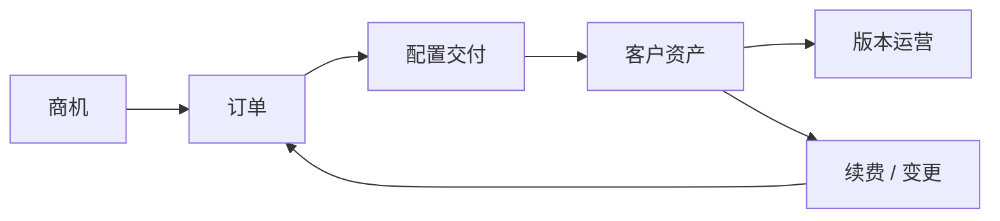
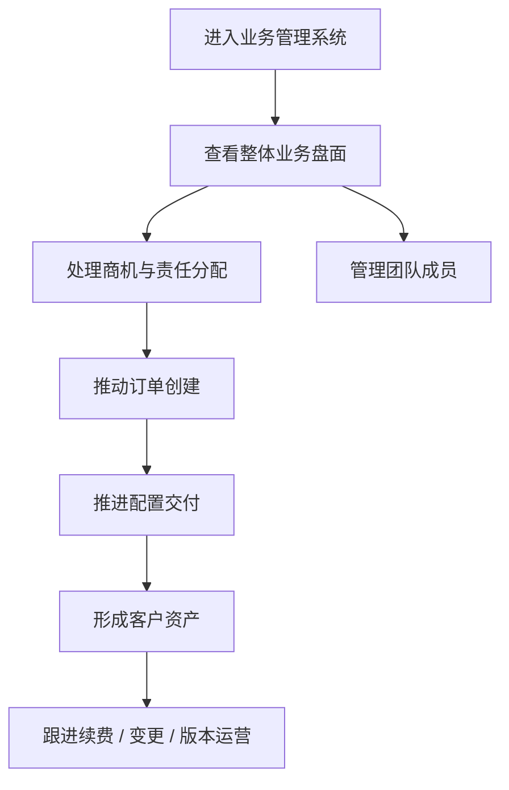
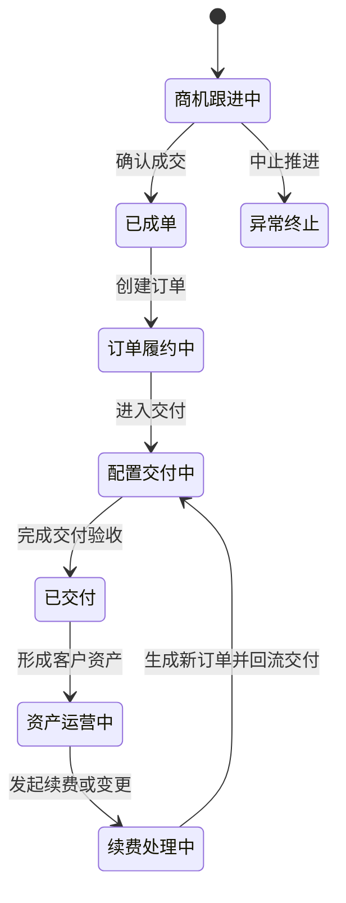
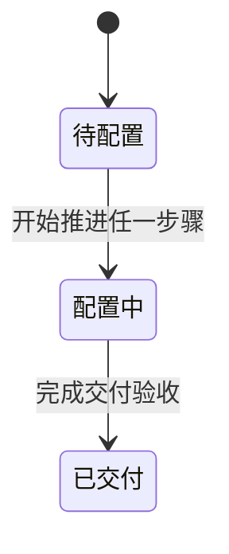
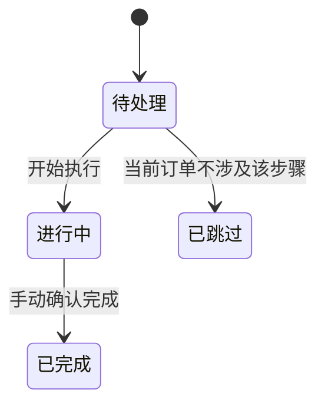
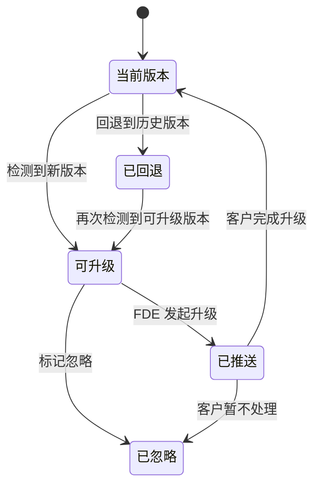

# Frontis AI · FDE配置交付 PRD

## 1. 文档说明

### 1.1 文档目标

本文档用于沉淀 Frontis AI 在 FDE 侧业务管理系统的正式产品设计。虽然沿用 `FDE配置交付 PRD` 文件名，但本文实际覆盖的是原型中 `FDE成员-业务管理登录` 与 `FDE负责人-业务管理登录` 进入后的完整业务管理链路，聚焦 FDE 团队如何围绕商机、订单、交付、客户资产、版本运营与团队管理完成业务闭环。

### 1.2 文档范围

**纳入范围**

- 首页看板
- 商机管理
- 订单管理
- 配置交付
- 客户资产管理
- 成员权限管理
- AI 专家版本管理
- FDE 团队负责人 / 团队管理员 / 普通成员的完整业务旅程

**不纳入范围**

- FDE 开发管理
- 营销门户获客链路
- 企业管理后台内部配置细节
- 用户工作台对话协作体验

### 1.3 上下游关系

1. 上游承接门户线索、销售线索和 FDE 手动录入的商机。
2. 商机确认成单后，由 FDE 在租户下创建正式订单。
3. 订单进入配置交付后，围绕设备、AI 专家和企业后台初始化完成落地。
4. 交付完成后形成客户资产，并继续进入续费、扩容和版本运营阶段。
5. 团队成员和权限配置贯穿整条业务链路，决定谁能看到和推进哪些业务对象。

## 2. 系统定位

FDE 业务管理系统是 FDE 团队的统一作业台，核心目标是：

1. 让 FDE 团队在一个系统内完成从商机到持续运营的完整业务闭环。
2. 让每个业务对象都具备清晰责任归属，避免商机、订单、交付和资产割裂。
3. 让负责人可以统筹全量业务，普通成员只聚焦自己负责的对象。
4. 让交付后的续费、变更和版本升级继续回到统一业务主线，而不是旁路处理。

## 3. 用户角色与用户故事旅程

### 3.1 FDE 团队负责人旅程

1. 负责人进入业务管理系统后，先查看整体业务盘面，快速判断当前应优先盯商机转化、交付收口还是资产与版本运营。
2. 负责人在商机管理中查看全量商机，补录线索，并将重点商机明确分配给具体成员跟进。
3. 当商机确认成单后，负责人推动在对应租户下创建订单，明确客户购买的设备、AI 专家和 Tokens 内容。
4. 负责人持续跟进配置中的订单，确保设备分配、Agent 下发、企业后台配置和交付验收最终完成。
5. 对已交付客户，负责人继续关注资产到期、续费机会和版本升级节奏。
6. 在需要时，负责人通过成员权限管理完成成员新增、角色调整、启用禁用和团队协同调度。

### 3.2 FDE 普通成员旅程

1. 普通成员进入系统后，直接处理分配给自己的执行任务，不需要先看全局总览。
2. 成员只查看归属于自己的商机、订单、交付对象、客户资产和版本任务。
3. 成员围绕自己负责的订单推进具体交付步骤，并在交付完成后继续跟进客户资产和版本问题。
4. 成员可以记录商机动态、创建订单、推进交付、处理续费，但不能管理团队成员，也不需要处理与自己无关的客户。

### 3.3 FDE 团队管理员旅程

1. 团队管理员与负责人一样可以处理全量业务对象，但不承担负责人首页总览职责。
2. 团队管理员重点承担业务执行与协同管理工作，包括订单、交付、客户资产、版本运营和成员管理。
3. 团队管理员是负责人之外的业务运行保障角色。

## 4. 功能列表

| 功能模块 | 一级功能 | 二级功能 | 功能描述 | 优先级 |
|---|---|---|---|---|
| 首页看板 | 总览 | 业务指标总览 | 负责人进入系统后，系统需汇总展示商机总金额、已成交金额、配置中订单数和已交付租户数，帮助负责人快速判断当前业务重心。 | P1 |
| 首页看板 | 总览 | 团队负载总览 | 系统需从成员维度展示当前状态、配置交付数、运行租户数和版本任务数，支撑负责人调度人力。 | P2 |
| 商机管理 | 商机录入 | 手动创建商机 | FDE 需能把线下沟通或非门户来源的线索录入系统，确保商机统一沉淀。手动创建时系统自动记录创建方式、创建人和创建时间，录入人只需补齐需求联系人和需求内容。 | P1 |
| 商机管理 | 商机流转 | 分配负责人 | 负责人和团队管理员需能将商机分配给具体成员，明确后续跟进责任。 | P1 |
| 商机管理 | 商机流转 | 修改商机状态 | 系统需支持商机按未开始、对接中、已成单、异常终止进行流转。 | P1 |
| 商机管理 | 商机信息 | 查看完整需求信息 | 商机需完整承接业务场景、行业、需求联系人、创建方式、创建人、预算和需求描述；若商机来自自动同步，再补充展示来源入口，供后续订单与交付复用。 | P1 |
| 商机管理 | 商机留痕 | 评论与回复 | 系统需支持围绕商机持续记录动态、结论和问题回复，避免过程信息丢失。 | P2 |
| 商机管理 | 商机视角 | 列表与分布视图 | 系统既要支持逐条查看商机，也要支持按状态查看整体商机结构。 | P2 |
| 订单管理 | 订单创建 | 关联租户创建订单 | 订单必须在已有租户下创建，确保订单、交付和资产都围绕同一业务主体沉淀。 | P0 |
| 订单管理 | 商品配置 | 设备商品录入 | 系统需支持云端工作站、本地工作站、本地客户端授权等设备商品录入。 | P0 |
| 订单管理 | 商品配置 | AI 专家商品录入 | 系统需支持从专家范围中选择 AI 专家加入订单，明确客户购买的能力范围。 | P0 |
| 订单管理 | 商品配置 | Tokens 商品录入 | 系统需支持录入 Tokens 类资源包，补齐客户购买内容。 | P0 |
| 订单管理 | 履约追踪 | 查看履约状态与执行记录 | 系统需展示订单当前状态、履约进度、执行记录及后续是否已落成资产。 | P1 |
| 订单管理 | 业务衔接 | 进入配置交付 | 订单需要能直接进入对应交付过程，保证业务链路连续。 | P1 |
| 配置交付 | 交付组织 | 先按租户组织交付对象 | 配置交付需先围绕租户组织，再在租户下承接多张订单和多次交付。 | P0 |
| 配置交付 | 交付组织 | 一订单一交付 | 每张订单都需对应独立交付过程，避免多笔售卖动作混成一个交付黑盒。 | P0 |
| 配置交付 | 交付推进 | 订单内容预填 | 订单中的设备和 AI 专家信息需自动带入交付，减少重复录入，但不自动视为完成。 | P0 |
| 配置交付 | 交付推进 | 设备分配 | 交付中需支持确认设备额度、设备结果和生效准备。 | P0 |
| 配置交付 | 交付推进 | Agent 下发 | 交付中需支持专家团下发和单个 AI 专家下发两种方式。 | P0 |
| 配置交付 | 交付推进 | 企业后台配置 | 系统需承接企业管理员还需完成的初始化动作，确保客户具备使用条件。 | P1 |
| 配置交付 | 交付推进 | 交付验收 | 在关键步骤完成后，系统需支持交付收口与最终确认。 | P0 |
| 配置交付 | 交付推进 | 跳过不适用步骤 | 当订单不涉及某类内容时，系统需允许跳过对应步骤，但保留记录。 | P2 |
| 客户资产管理 | 资产概况 | 查看已交付客户资产总览 | 系统需围绕已交付客户持续展示设备和 AI 专家资产现状。 | P1 |
| 客户资产管理 | 资产明细 | 查看设备资产 | 系统需展示设备资产标识、状态、到期时间和剩余时间，支撑续费与扩容判断。 | P1 |
| 客户资产管理 | 资产明细 | 查看 AI 专家资产 | 系统需展示 AI 专家资产现状，并能回溯交付来源和当前运行情况。 | P1 |
| 客户资产管理 | 经营动作 | 发起资产续费 | 对设备资产和 AI 专家资产，系统需支持发起续费，并回流到订单和交付链路。 | P1 |
| 客户资产管理 | 过程回溯 | 查看充值记录与交付变更 | 系统需承接充值记录、设备追加、Agent 追加和续费等历史动作。 | P1 |
| 成员权限管理 | 成员维护 | 添加 / 编辑成员 | 负责人和团队管理员需能维护 FDE 成员基础信息与角色。 | P1 |
| 成员权限管理 | 成员维护 | 启用 / 禁用 / 移除成员 | 系统需支持成员状态管理，及时响应团队变化。 | P2 |
| 成员权限管理 | 成员维护 | 批量导入成员 | 团队初始化或扩张时，系统需支持批量导入成员。 | P2 |
| AI 专家版本管理 | 版本识别 | 查看版本状态 | 系统需让 FDE 查看客户当前 AI 专家的版本状态，识别升级机会。 | P1 |
| AI 专家版本管理 | 版本操作 | 推送升级 | FDE 需能向客户侧发起升级动作，推动客户使用更高版本。 | P1 |
| AI 专家版本管理 | 版本操作 | 忽略升级 | 当客户暂不适合升级时，系统需支持明确忽略本次升级。 | P2 |
| AI 专家版本管理 | 版本操作 | 版本回退 | 当上线后出现问题时，系统需支持回退到历史版本。 | P1 |
| AI 专家版本管理 | 版本追踪 | 查看版本历史与企业响应 | 系统需承接版本说明、历史版本和客户响应结果，支撑后续运营决策。 | P1 |

## 5. 核心业务逻辑梳理

### 5.1 角色与数据归属逻辑

1. 负责人和团队管理员查看全量业务数据。
2. 普通成员只查看归属于自己的业务数据。
3. 归属关系必须贯穿商机、订单、交付、客户资产和版本任务。
4. 普通成员不进入成员管理链路。
5. 负责人拥有业务总览能力，普通成员以执行视角为主。

### 5.2 商机逻辑

1. 商机可来自门户线索，也可由 FDE 手动录入。
2. 商机进入系统后必须支持明确负责人。
3. 商机需沉淀完整需求背景，包括业务场景、行业、联系人、预算和需求详情。
4. 商机状态至少覆盖：
   - 未开始
   - 对接中
   - 已成单
   - 异常终止
5. 商机过程信息必须可追踪，不能只保留最终状态。
6. 商机确认成单后，由 FDE 在租户下创建正式订单，不要求系统自动转单。

### 5.3 订单逻辑

1. 订单必须绑定已有租户，不能脱离租户独立存在。
2. 订单需明确客户购买内容，至少包括设备、AI 专家和 Tokens。
3. 订单需区分新购和续费两类业务场景。
4. 订单要承接履约信息，但订单不等于交付完成。
5. 订单中的商品信息需要作为交付的预填输入。
6. 订单详情需追踪后续是否已落成资产。

### 5.4 配置交付逻辑

1. 配置交付首先按租户组织，其次才是订单。
2. 同一租户下可以有多张订单和多次交付。
3. 每张订单必须对应一个独立交付过程。
4. 交付必须按标准步骤推进，至少包括：
   - 设备分配
   - Agent 下发
   - 企业后台配置
   - 交付验收
5. 订单预填只用于减少重复录入，不代表步骤自动完成。
6. 步骤推进必须以人工确认为准。
7. 若本次订单不涉及某类内容，系统应支持跳过对应步骤，但必须保留过程记录。
8. 已完成和已跳过步骤默认进入结果态，不应被反复改写。
9. 交付完成的业务含义是客户具备正式开始使用条件，而不是仅写入资源记录。

### 5.5 客户资产逻辑

1. 客户资产只能在交付完成后形成。
2. 客户资产至少分为设备资产和 AI 专家资产两类。
3. 每个资产都应具备独立标识、状态和有效期。
4. 只有已交付客户才进入资产运营阶段。
5. 续费、扩容和变更应在资产侧发起，但不能直接改资产结果，而应回到订单和交付闭环。

### 5.6 版本运营逻辑

1. 版本运营的对象是租户下的单个 AI 专家。
2. 即使多个 AI 专家来自同一个专家团，也不能把专家团当成一个整体版本对象。
3. 版本运营必须支持：
   - 检测新版本
   - 推送升级
   - 忽略升级
   - 回退版本
   - 查看历史版本和版本说明
4. FDE 需要看到企业侧是否已响应版本动作，而不是只记录自己是否发起过。
5. 总览层更应该突出当前状态和最近动作，而不是把版本号作为主信息。

### 5.7 团队管理逻辑

1. 团队管理的目标不是维护通讯录，而是维护业务执行权限。
2. 成员角色会直接影响：
   - 默认进入系统后的工作重点
   - 能看见哪些业务对象
   - 能否管理其他成员
3. 团队负责人和团队管理员都需要具备成员管理能力。
4. 普通成员不进入成员管理能力范围。

## 6. 状态机

### 6.1 FDE 业务主线状态机

### 6.2 配置交付状态机

### 6.3 交付步骤状态机

### 6.4 版本处理状态机

## 7. 状态与字典

### 7.1 FDE 角色字典

| 角色 | 说明 |
|---|---|
| 团队负责人 | 负责整体业务统筹、任务分配和成员管理 |
| 团队管理员 | 负责业务执行与成员管理，但不承担负责人总览职责 |
| 普通成员 | 负责自己归属业务对象的执行推进 |

### 7.2 商机状态字典

| 状态 | 说明 |
|---|---|
| 未开始 | 商机已进入系统，但尚未正式推进 |
| 对接中 | 正在沟通、演示、方案或商务推进 |
| 已成单 | 商机已确认转化为订单机会 |
| 异常终止 | 商机停止推进，但历史记录仍需保留 |

### 7.3 订单状态与业务类型字典

| 类型 | 取值 | 说明 |
|---|---|---|
| 订单状态 | 待履约 / 履约中 / 已完成 | 描述订单当前推进阶段 |
| 订单业务类型 | 新购 / 续费 | 描述订单对应业务场景 |

### 7.4 交付状态字典

| 类型 | 取值 | 说明 |
|---|---|---|
| 交付状态 | 待配置 / 配置中 / 已交付 | 描述订单交付整体进度 |
| 步骤状态 | 待处理 / 进行中 / 已完成 / 已跳过 | 描述单个交付步骤状态 |
| 步骤名称 | 设备分配 / Agent 下发 / 企业后台配置 / 交付验收 | 当前正式交付步骤集 |

### 7.5 资产状态字典

| 状态 | 说明 |
|---|---|
| 生效中 | 当前资产正常有效 |
| 即将到期 | 资产临近到期，需要关注续费 |
| 已到期 | 资产已超过有效期 |
| 待确认 | 资产信息已创建，但有效状态尚未完全确认 |

### 7.6 版本状态字典

| 状态 | 说明 |
|---|---|
| 当前版本 | 当前线上正在运行的版本 |
| 可升级 | 已检测到更新版本，等待处理 |
| 已推送 | FDE 已向客户发起升级动作 |
| 已忽略 | 本次升级已被明确忽略 |
| 已回退 | 当前已回退到历史版本 |
