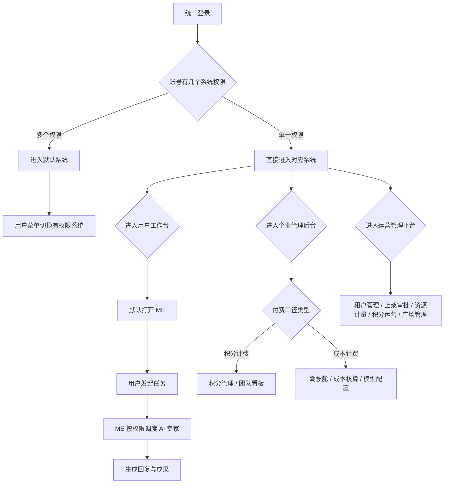

# Frontis AI · V0.6 PRD

## 1. 文档说明

### 1.1 文档目标

本文档用于定义 Frontis AI `V0.6` 版本的产品需求，覆盖当前原型已经收敛后的本期范围，作为研发、测试和产品验收依据。

V0.6 的核心目标不是扩大平台商业闭环，而是完成以下几类基础能力：

1. 统一登录与多系统权限切换。
2. 新用户注册后直接进入 ME。
3. 租户在同一套租户模型下通过付费口径类型区分能力。
4. 公有云保留积分体系、注册赠送积分和邀请奖励。
5. 成本计费租户不展示积分体系，按调用成本和人力成本做企业侧核算。
6. 企业管理后台按公有云个人版、公有云团队版和私有化租户展示不同功能。
7. 团队版提供 AI 专家使用看板；私有化租户看板使用成本口径。
8. AI 专家管理支持权限、模型和私有化成本参数配置。
9. 运营管理平台只保留 V0.6 必要后台能力，移除本期不上线模块。

### 1.2 本期纳入范围

| 模块         | 纳入能力                                                                                           |
| ------------ | -------------------------------------------------------------------------------------------------- |
| 登录与账号   | 统一登录、单系统直达、多系统用户菜单切换                                                           |
| 租户模型     | 付费口径类型：积分计费 / 成本计费；积分计费按席位数决定个人版 / 团队版，成本计费按企业团队租户处理 |
| 用户工作台   | ME 默认入口、ME 专家列表、AI专家广场、技能中心、进化实验室                                   |
| ME    | 新用户默认进入、单线程对话、按权限调度 AI 专家                                                     |
| AI 专家广场  | 我的 / 团队分享 / FrontisAI发布，按权限、运营分类和投放范围展示                                    |
| 企业管理后台 | 驾驶舱、ME 管理、积分管理、AI专家管理、模型配置、组织管理、角色权限管理                      |
| 私有化成本   | AI 专家调用成本、我的人力成本、行业标准成本                                                        |
| 运营平台     | 租户管理、AI专家上架审批、商品中心、模型与接口资源计量、积分运营、运营组织管理                     |

### 1.3 术语定义

| 术语       | 定义                                                             |
| ---------- | ---------------------------------------------------------------- |
| 租户       | Frontis AI 的客户空间，用户、积分、模型、AI专家权限都归属于租户  |
| 公有云租户 | 使用平台统一云服务的租户，可使用积分体系                         |
| 私有化租户 | 私有化部署客户租户，不展示积分体系，以企业团队成本核算为主       |
| 个人版     | 公有云中只有 1 个席位的租户形态，不开放组织管理和团队看板        |
| 团队版     | 公有云多席位租户或私有化租户形态，开放组织管理和团队 AI 看板     |
| ME  | 用户进入系统后的默认协同入口，负责理解任务并调度有权限的 AI 专家 |
| AI 专家    | 可被用户直接使用，也可被 ME 调度的业务 Agent              |
| 成果       | AI 专家或 ME 产出的文件、报告、页面、图片等可复用结果     |
| 资源成本   | 由运营资源计量维护的模型或外部接口成本口径                       |
| 人力成本   | 私有化企业管理员为 AI 专家配置的人工替代成本基准                 |

## 2. 全局业务原则

### 2.1 统一登录原则

1. 登录入口统一，不区分运营平台登录和用户侧登录。
2. 用户通过手机号和验证码登录。
3. 登录成功后，系统根据当前账号拥有的系统模块权限决定进入路径。
4. 如果账号只有一个系统模块权限，登录后直接进入该系统。
5. 如果账号拥有多个系统模块权限，登录后进入默认系统，并可在用户菜单中切换到其他有权限系统。
6. 用户菜单只展示当前账号有权限的入口，没有权限的系统不展示按钮。
7. 从用户侧切换到运营管理平台或从运营管理平台切回用户侧时，必须保持当前登录用户身份一致。

### 2.2 付费口径类型原则

1. 不在登录侧让用户选择付费口径。
2. 付费口径类型在运营管理平台创建租户时确定，枚举为 `积分计费` 和 `成本计费`。
3. 同一套企业管理后台根据付费口径类型自动展示不同功能。
4. 积分计费租户展示积分相关能力。
5. 成本计费租户不展示积分相关能力。
6. 成本计费租户以调用成本、人力成本、行业标准成本作为核算口径。

### 2.3 个人版 / 团队版原则

1. 租户不需要单独配置“租户版本”字段。
2. 个人版 / 团队版只用于积分计费租户。
3. 积分计费租户席位数为 1 时，业务上视为个人版。
4. 积分计费租户席位数大于 1 时，业务上视为团队版。
5. 成本计费租户默认按企业团队租户处理。
6. 公有云个人版不展示组织管理、租户驾驶舱和团队用量看板。
7. 公有云团队版和私有化租户展示组织管理和团队 AI 看板。
8. 公有云个人版也可以开发和使用 AI 专家，但不允许配置企业级模型供应商。

### 2.4 公有云积分原则

1. 积分只存在于公有云租户。
2. 公有云用户注册后获得注册送积分。
3. 公有云支持邀请奖励，邀请人和被邀请人满足规则后获得积分。
4. 积分消耗来自模型 Tokens、AI 专家运行、Skill 和第三方接口调用。
5. 公有云企业管理后台的积分管理只展示积分流水，使用分析统一进入驾驶舱查看。

### 2.5 成本计费原则

1. 成本计费租户不展示积分余额、积分管理、邀请奖励和积分包。
2. 成本计费租户模型配置由企业管理员维护。
3. 成本计费租户模型配置提供默认模型供应商。
4. 成本计费租户新增或编辑模型时不配置模型成本。
5. 成本计费租户不需要配置平台利润倍率或积分换算。
6. 成本计费租户驾驶舱按成本、Tokens、调用次数、调用成员、调用专家统计。
7. 成本计费 AI 专家调用明细不展示 `单次平均 Tokens`，展示 `单次平均成本`。
8. 成本计费 AI 专家详情支持配置 `我的人力成本` 和 `行业标准成本`。
9. `我的人力成本` 与 `行业标准成本`用于企业管理员核算 AI 系统替代人工的价值和有效性。

### 2.6 AI 专家版本原则

1. AI 专家开发者发布新版本后，用户已添加到工作台的 AI 专家自动升级。
2. 用户不需要手动升级。
3. 历史对话和历史成果应保留当时使用版本，用于追溯。
4. ME 的调度范围由权限决定，不局限于用户是否已添加到工作台。

## 3. 系统架构与角色

### 3.1 系统模块

| 模块         | 定位                   | V0.6 目标                                                  |
| ------------ | ---------------------- | ---------------------------------------------------------- |
| 用户工作台   | 用户日常使用 AI 的入口 | 让用户进入 ME、ME 专家列表和AI专家广场               |
| 企业管理后台 | 租户管理员后台         | 按付费口径类型和席位展示积分、驾驶舱、专家、模型、组织能力 |
| 运营管理平台 | 平台运营后台           | 管理租户、AI专家上架审批、商品中心、资源计量和积分运营     |

### 3.2 用户角色

| 角色       | 所属范围     | 核心能力                                                 |
| ---------- | ------------ | -------------------------------------------------------- |
| 普通用户   | 用户工作台   | 使用 ME、ME 专家列表和AI专家广场                   |
| 租户管理员 | 企业管理后台 | 管理当前租户的积分或成本、AI专家、模型和组织             |
| 平台运营   | 运营管理平台 | 创建租户、审核 AI 专家、维护商品中心、资源计量和积分规则 |
| 平台超管   | 运营管理平台 | 拥有全部运营管理权限                                     |

### 3.3 主流程

## 4. 登录与租户

### 4.1 统一登录

#### 4.1.1 页面目标

登录页负责完成身份验证，不负责让用户选择产品形态。用户不需要在登录页理解公有云、私有化、运营平台等概念。

#### 4.1.2 功能要求

| 功能       | 说明                                       |
| ---------- | ------------------------------------------ |
| 手机号输入 | 用户输入手机号                             |
| 验证码输入 | 用户输入 6 位验证码                        |
| 获取验证码 | 用户点击后获取登录验证码                   |
| 权限识别   | 登录成功后识别当前账号可进入的系统模块     |
| 登录跳转   | 单系统权限直接进入；多系统权限进入默认系统 |

#### 4.1.3 多系统切换

1. 用户菜单中展示当前账号可进入的系统入口。
2. 有运营权限时，展示 `进入运营管理平台`。
3. 有企业管理后台权限时，展示 `进入管理后台`。
4. 有工作台权限时，展示 `返回工作台`。
5. 没有权限的入口不展示。
6. 切换系统不改变当前登录账号。

### 4.2 注册逻辑

#### 4.2.1 新用户注册

1. 新用户通过手机号和验证码注册。
2. 注册成功后系统创建 1 席公有云个人租户。
3. 系统将注册用户设为租户管理员。
4. 系统为公有云个人租户发放注册送积分。
5. 注册完成后直接进入 ME，而不是进入 AI 专家广场。

#### 4.2.2 注册后默认体验

| 项目             | 规则                   |
| ---------------- | ---------------------- |
| 默认系统         | 用户工作台             |
| 默认页面         | ME              |
| 默认付费口径类型 | 积分计费               |
| 默认租户形态     | 个人版                 |
| 默认席位         | 1                      |
| 默认积分         | 按运营平台积分规则发放 |

#### 4.2.3 首次进入引导

新用户首次进入 ME 时，系统需要展示一条预置引导消息，帮助用户理解默认工作入口，而不是让用户面对空白对话。

| 项目     | 要求                                                                 |
| -------- | -------------------------------------------------------------------- |
| 展示时机 | 新用户注册成功后首次进入 ME                                   |
| 消息形态 | 作为 ME 的首条助手消息展示                                    |
| 内容结构 | 使用 Markdown 渲染，包含自然分段、列表和重点文字，不展示为整段长文本 |
| 内容重点 | 说明 ME 可以承接目标、文件和业务场景，调度有权限的 AI 专家    |
| 个性化   | 提示用户可以为 ME 命名，并设置回答风格或工作偏好              |

预置引导消息只用于首登体验，用户发送消息后进入正常 ME 对话流程。

### 4.3 租户创建

#### 4.3.1 运营创建租户

运营管理平台在租户管理中创建租户。

| 字段            | 说明                                 |
| --------------- | ------------------------------------ |
| 租户名称        | 客户或个人空间名称                   |
| 付费口径类型    | 积分计费 / 成本计费                  |
| 行业            | 可选行业信息                         |
| 管理员姓名      | 初始管理员                           |
| 管理员手机号    | 初始管理员登录手机号                 |
| 席位数          | 决定个人版或团队版                   |
| AI 专家上架服务 | 是否允许租户成员提交 AI 专家上架审批 |
| 运营系统        | 是否为该租户开通租户运营管理后台     |

租户创建成功后，初始管理员默认具备该租户的 `工作台` 和 `企业管理后台` 权限。若运营在创建租户时开启 `运营系统`，则该初始管理员同时默认成为该租户的运营管理员，可在用户菜单中进入本租户的运营管理后台；未开启时不展示运营管理后台入口。

#### 4.3.2 租户列表

租户列表必须体现：

1. 租户名称。
2. 付费口径类型：积分计费 / 成本计费。
3. 租户形态：个人版 / 团队版。
4. 席位数。
5. 管理员。
6. 运营系统开通状态。
7. 状态。
8. 计费口径：积分计费租户使用积分口径，成本计费租户使用成本口径。

## 5. 用户工作台

### 5.1 一级导航

用户工作台一级导航包括：

| 导航       | 说明                                   |
| ---------- | -------------------------------------- |
| ME   | ME 默认工作入口                 |
| ME 专家列表 | 进入其他 AI 专家的多 topic 工作模式    |
| 专家广场   | 浏览当前租户可见并可添加使用的 AI 专家 |
| 技能中心   | 查看和使用技能能力                     |
| 进化实验室 | 面向 AI 专家能力进化的实验入口         |

### 5.2 ME

#### 5.2.1 页面定位

ME 是用户进入系统后的默认工作入口，用于承接自然语言任务、判断任务意图、调度有权限的 AI 专家并返回结果。

#### 5.2.2 功能要求

| 功能       | 要求                                                 |
| ---------- | ---------------------------------------------------- |
| 默认进入   | 新用户注册后、已有用户进入工作台后默认打开 ME |
| 单线程对话 | ME 当前保持一条持续工作线程                   |
| 消息输入   | 支持文本输入和附件引用                               |
| 专家调度   | 可调度当前用户有权限的 AI 专家                       |
| 权限边界   | 未授权 AI 专家不可被调度                             |
| 结果输出   | 以消息形式展示回复，并可产生成果文件                 |
| 首登引导   | 新用户首次进入时展示 Markdown 分段引导消息           |
| 飞书连接   | 租户已配置飞书渠道时，展示扫码连接飞书入口           |

#### 5.2.3 调度范围

1. ME 调度范围等于当前用户拥有使用权限的 AI 专家集合。
2. AI 专家是否被用户添加到工作台，不影响 ME 调度。
3. 添加到工作台只影响用户是否有显式入口。
4. AI 专家权限由企业管理后台 AI 专家管理配置。

#### 5.2.4 首登引导内容规范

ME 首登引导需要满足：

1. 语气自然，避免把能力点堆成一整段说明。
2. 内容使用 Markdown 渲染，支持段落、列表和重点文字。
3. 第一段说明 ME 的身份和入口定位。
4. 第二段说明用户可以输入目标、上传文件或描述业务场景。
5. 列表说明可配置项，包括名称、回答风格和工作偏好。

#### 5.2.5 工作台扫码连接飞书

当企业管理员已在 `ME 管理 - 渠道管理` 中完成飞书渠道连接并配置飞书应用二维码后，用户侧工作台需要提供扫码连接能力。

要求：

1. 入口位置：用户进入工作台 ME 后，在页面右上角展示 `扫码连接飞书` 按钮。
2. 展示范围：租户下普通成员和管理员均展示；未配置飞书渠道或未配置二维码时不展示。
3. 点击按钮后弹出二维码弹窗，二维码内容来自企业管理员在飞书渠道中配置的二维码链接或上传图片。
4. 用户扫码后在飞书中打开机器人应用对话，系统将该飞书用户身份与当前 Frontis AI 用户绑定。
5. 绑定成功后，工作台右上角按钮状态变为 `已连接`，不再重复展示扫码入口。
6. 已连接用户在飞书机器人私聊中发送消息时，同步进入该用户工作台 ME 会话历史。
7. 用户在工作台 ME 中继续对话时，与飞书私聊保持同一用户会话上下文。
8. 原型阶段允许点击二维码模拟扫码和绑定成功，点击后按钮立即变为 `已连接`。

### 5.3 ME 专家列表

1. ME 专家列表用于直接使用某个具体 AI 专家。
2. ME 专家列表与 ME 是不同工作模式。
3. ME 专家列表可以保留多 topic / 多会话结构。
4. ME 专家列表内 AI 专家列表只展示当前用户有权限的专家。

### 5.5 AI 专家广场

#### 5.5.1 分类与来源

AI 专家广场采用 Tab 方式筛选，不使用下拉筛选。

| 来源          | 说明                                   |
| ------------- | -------------------------------------- |
| 我的          | 用户自己开发或已添加的 AI 专家         |
| 团队分享      | 团队版租户内开放给当前用户的 AI 专家   |
| FrontisAI发布 | 平台运营上架并对当前租户可见的 AI 专家 |

来源分类作为第一组 Tab，用户可在 `全部`、`我的`、`团队分享`、`FrontisAI发布`之间切换。个人版不展示团队分享入口。

业务场景作为第二组 Tab，用户可在 `全部业务` 和运营后台商品中心启用的商品分类之间切换。业务场景分类不在用户侧写死，必须读取运营管理平台 `商品中心 - 商品分类` 中的启用分类，并按运营配置的排序展示。

#### 5.5.2 可见规则

1. 广场只展示当前用户可见的 AI 专家。
2. FrontisAI发布专家来源于运营平台商品中心已上架的 AI 专家商品，商品必须绑定已审核通过的 AI 专家，并配置商品分类、获取方式、计费模式、可见范围和上架状态。
3. 团队分享专家由企业管理员配置可用范围。
4. 已添加专家在开发者发布新版本后自动升级。
5. 当运营后台停用某个商品分类后，该分类不再出现在用户侧业务场景 Tab 中。
6. 若当前已选业务场景被停用或删除，用户侧自动回到 `全部业务`。

## 6. 企业管理后台

### 6.1 菜单与能力矩阵

| 菜单              | 公有云个人版 | 公有云团队版 | 私有化租户 |
| ----------------- | ------------ | ------------ | ---------- |
| 驾驶舱 / 租户总览 | 不展示       | 展示         | 展示       |
| 积分管理          | 展示         | 展示         | 不展示     |
| AI专家管理        | 展示         | 展示         | 展示       |
| 模型配置          | 不展示       | 展示         | 展示       |
| 组织管理          | 不展示       | 展示         | 展示       |

### 6.2 公有云积分管理

#### 6.2.1 页面定位

积分管理用于公有云租户查看积分余额、积分增加、积分消耗和积分流水，不承担私有化成本核算。企业后台只查看积分流水，不提供增加积分操作。

#### 6.2.2 功能要求

| 功能     | 要求                                               |
| -------- | -------------------------------------------------- |
| 积分流水 | 展示积分流水，包含增加和消耗两类记录               |
| 当前余额 | 在流水页展示当前积分余额，但不恢复顶部重复概览卡片 |
| 时间范围 | 支持本周、本月、全部                               |
| 类型筛选 | 流水支持全部、增加、消耗筛选                       |
| 流水字段 | 类型、来源、积分、操作人、时间                     |
| 顶部卡片 | 不展示重复的积分概览卡片                           |

积分流水来源枚举：

| 方向 | 来源枚举       | 触发逻辑                                   | 操作人显示 |
| ---- | -------------- | ------------------------------------------ | ---------- |
| 增加 | 注册送积分     | 新用户注册并创建个人租户后系统自动发放     | FrontisAI  |
| 增加 | 邀请奖励       | 被邀请人完成注册并满足邀请奖励规则后发放   | FrontisAI  |
| 增加 | 购买标准积分包 | 运营后台在租户详情中为租户开通积分包       | FrontisAI  |
| 消耗 | ME 调用 | 用户通过 ME 调用模型或调度专家      | 使用人     |
| 消耗 | 具体 AI 专家名 | 用户直接调用 AI 专家，例如商品运营素材助手 | 使用人     |
| 消耗 | Skill 调用     | 用户调用 Skill 或 Skill 内部接口           | 使用人     |
| 消耗 | 第三方接口调用 | AI 专家或 Skill 调用外部接口               | 使用人     |

#### 6.2.3 个人版与团队版差异

1. 公有云个人版展示本人所属租户的积分流水。
2. 公有云团队版展示租户积分流水。
3. 公有云团队版通过驾驶舱查看团队 AI 用量、成员排行和专家排行。

### 6.3 团队驾驶舱

#### 6.3.1 展示门槛

1. 只有团队版展示驾驶舱。
2. 个人版不展示驾驶舱。
3. 公有云团队版使用积分口径。
4. 私有化租户使用成本口径。

#### 6.3.2 顶部指标

| 指标       | 公有云团队版 | 私有化租户 |
| ---------- | ------------ | ---------- |
| 团队消耗   | 团队积分     | 总成本     |
| 调用次数   | 展示         | 展示       |
| 使用成员   | 展示         | 展示       |
| 被调用专家 | 展示         | 展示       |

`被调用专家`表示在当前时间范围内被成员或 ME 实际调用过的 AI 专家数量，不表示全部已授权专家数量。

#### 6.3.3 时间范围

1. 驾驶舱顶部使用统一时间范围控件。
2. 时间范围包括今日、本周、本月、全部、自定义。
3. 自定义必须是真实时间范围选择器。
4. 时间范围统一影响顶部指标、消耗趋势、成员用量排行、AI 专家用量排行。
5. AI 专家开发分布不受使用时间范围影响，因为它统计的是资产建设情况，不是运行消耗。

#### 6.3.4 四宫格看板

驾驶舱主体使用四宫格：

| 区块            | 图表              | 说明                       |
| --------------- | ----------------- | -------------------------- |
| 消耗趋势        | 折线 / 面积趋势图 | 展示企业积分或成本消耗趋势 |
| AI 专家用量排行 | 柱状图            | 展示 Top 5 被调用 AI 专家  |
| 成员用量排行    | 横向条形图        | 展示 Top 5 成员消耗        |
| AI 专家开发分布 | 横向条形图        | 展示 Top 5 开发者开发数量  |

#### 6.3.5 二级明细

| 明细页          | 入口                    | 字段                                                                |
| --------------- | ----------------------- | ------------------------------------------------------------------- |
| 成员用量明细    | 成员用量排行查看更多    | 成员、部门、消耗、Tokens、调用次数、使用 AI 专家、最近使用时间      |
| AI 专家调用明细 | AI 专家用量排行查看更多 | AI 专家、消耗、Tokens、调用次数、调用成员、调用成员数、单次平均指标 |
| AI 专家开发明细 | AI 专家开发分布查看更多 | 开发者、AI 专家数量、AI 专家列表                                    |

#### 6.3.6 私有化 AI 专家调用明细

私有化租户的 AI 专家调用明细字段为：

| 字段         | 说明                                       |
| ------------ | ------------------------------------------ |
| AI 专家      | 被调用的 AI 专家名称                       |
| 成本         | 当前时间范围内的总调用成本                 |
| Tokens       | 当前时间范围内总 Tokens                    |
| 调用次数     | 当前时间范围内调用次数                     |
| 调用成员     | 调用过该专家的成员                         |
| 调用成员数   | 调用过该专家的成员数量                     |
| 单次平均成本 | 成本 / 调用次数                            |
| 我的人力成本 | 管理员在 AI 专家详情配置的内部人力成本基准 |
| 行业标准成本 | 管理员在 AI 专家详情配置的行业标准成本基准 |

### 6.4 AI 专家管理

#### 6.4.1 页面定位

AI 专家管理用于企业管理员查看和配置当前租户内可管理的 AI 专家。

#### 6.4.2 列表筛选

团队版筛选：

1. 全部 AI 专家。
2. 企业公开。
3. 团队共享。
4. 个人发布。

个人版筛选：

1. 全部 AI 专家。
2. 自己开发。
3. 已订阅。

#### 6.4.3 专家详情

| 区块     | 功能                                             |
| -------- | ------------------------------------------------ |
| 权限管理 | 配置全公司可用或按组织范围可用                   |
| 模型配置 | 为单个 AI 专家选择模型                           |
| 成本核算 | 仅私有化展示，独立配置我的人力成本和行业标准成本 |
| 版本记录 | 查看 AI 专家版本发布记录                         |

#### 6.4.4 权限管理

1. 不依赖设备的 AI 专家可直接配置可用范围。
2. 需要设备绑定的 AI 专家先分配设备，再按设备配置权限。
3. 可用范围支持企业、部门、个人混选。
4. 权限保存后影响用户工作台专家列表和 ME 调度范围。

#### 6.4.5 模型配置

1. 个人版不展示企业管理后台模型配置菜单。
2. 个人版在 AI 专家开发和 AI 专家详情中仍可以选择模型。
3. 个人版可选模型仅来自平台提供模型。
4. 团队版管理员可在 AI 专家详情为专家指定模型。
5. 私有化租户模型选择来自企业后台配置的模型供应商和模型清单。
6. 模型配置 Tab 只承接模型选择，不承接人力成本或行业成本配置。

#### 6.4.6 私有化成本核算

私有化 AI 专家详情通过独立 `成本核算` Tab 展示成本核算配置：

| 字段         | 类型     | 说明                                 |
| ------------ | -------- | ------------------------------------ |
| 我的人力成本 | 数字金额 | 企业内部同岗位或同任务的人力成本基准 |
| 行业标准成本 | 数字金额 | 行业通用人工成本或外包服务成本基准   |

保存后，这两个字段展示在私有化驾驶舱 `AI 专家调用明细` 中，用于企业管理员判断 AI 调用成本是否低于人工替代成本。

### 6.5 模型配置

#### 6.5.1 展示规则

| 租户形态     | 是否展示模型配置 |
| ------------ | ---------------- |
| 公有云个人版 | 不展示           |
| 公有云团队版 | 展示             |
| 私有化租户   | 展示             |

#### 6.5.2 公有云团队版

1. 保持原有模型配置能力。
2. 管理员可查看供应商、模型清单、接口格式、输入模态、推理开关等。
3. 具体运行消耗仍按积分体系扣减。

#### 6.5.3 私有化租户

1. 提供默认模型供应商。
2. 企业管理员可在默认供应商基础上维护 API Key、Base URL。
3. 模型清单支持新增、编辑、删除模型。
4. 模型字段包括模型名称、模型 ID、接口格式、输入模态、推理开关。
5. 新增或编辑模型时不配置模型成本。
6. 私有化企业后台不配置利润倍率和积分换算。

### 6.6 组织管理与角色权限

1. 只有团队版展示组织管理。
2. 个人版不展示组织管理。
3. 组织管理支持部门、成员和席位基础信息。
4. 团队版管理员可邀请成员。
5. 席位不足时禁止继续邀请。

#### 6.6.1 角色管理入口

1. 组织管理菜单下提供二级菜单 `角色管理`。
2. 角色管理用于维护当前租户内的组织角色和后台功能权限。
3. 角色创建后不在创建弹窗中设置生效范围；成员归属角色统一在组织成员管理中设置。

#### 6.6.2 预设角色

系统提供 3 个平台预设角色：

| 角色       | 定位                   | 编辑规则           |
| ---------- | ---------------------- | ------------------ |
| 组织管理员 | 管理当前租户后台能力   | 平台预设，不可编辑 |
| 部门负责人 | 管理所在部门成员和资源 | 平台预设，不可编辑 |
| 普通成员   | 使用工作台基础能力     | 平台预设，不可编辑 |

企业管理员可以创建租户自定义角色，并为自定义角色配置权限。自定义角色支持编辑和删除；删除前若角色下仍有成员，需要先在组织成员中调整成员角色。

#### 6.6.3 权限项设计原则

权限项以完整功能为最小授权单位，不拆成过细的页面字段或低价值动作。权限项不包含“查看本人成果”等天然由工作台能力覆盖的细碎权限。

| 权限模块       | 权限项                                                         |
| -------------- | -------------------------------------------------------------- |
| 工作台         | 使用 ME、使用ME 专家列表                                 |
| AI 专家开发    | 开发本人 AI 专家、开发本人 Skill、发布给团队使用               |
| 组织成员       | 查看组织架构、管理部门、邀请成员、编辑成员、成员启停、移除成员 |
| 角色权限       | 查看角色、管理自定义角色、分配成员角色                         |
| ME 管理 | 管理会话配置、管理渠道连接                                     |
| AI 专家管理    | 管理团队 AI 专家、管理可用范围、配置专家模型、配置成本核算     |
| 模型配置       | 管理模型配置                                                   |
| 积分管理       | 查看积分管理                                                   |
| 数据看板       | 查看团队看板                                                   |

说明：

1. `申请上架到商品中心`不是企业侧角色权限项。是否允许租户成员申请上架，由运营后台在租户维度配置 `AI 专家上架服务`。
2. `模型配置`作为完整功能授权；拥有该权限后可进入模型配置并管理供应商和模型清单。
3. 成本计费租户才展示 AI 专家 `配置成本核算`相关能力。

#### 6.6.4 角色详情展示

1. 角色详情只展示角色基础信息和权限树，不在权限列表下方展示成员列表。
2. 权限树按权限模块分组，只展示当前角色已拥有的权限项。
3. 权限树不展示 `开启 / 关闭`状态文本，避免用户误解为可直接在详情页切换。
4. 成员查看、成员角色调整在组织成员管理中完成。

#### 6.6.5 创建和编辑角色

1. 创建/编辑角色弹窗固定宽高，弹窗内部滚动，不触发页面全局滚动。
2. 权限选择使用树状层级展示。
3. 支持全部权限一键选择。
4. 支持按权限模块批量选择。
5. 支持单个权限项选择。
6. 创建角色时只填写角色名称和权限，不设置生效范围。

### 6.7 ME 管理

ME 管理是企业管理后台的独立菜单，用于管理租户下 ME 在外部渠道和不同会话中的响应方式。

#### 6.7.1 会话管理

1. 会话管理展示当前租户下 ME 已承载的会话。
2. 会话类型包括已绑定成员、群聊和外部会话。
3. 会话列表支持按会话类型筛选。
4. 会话列表只展示会话名称、会话类型、绑定对象、最近活跃、启停开关和进入配置按钮。
5. 启停开关只控制该会话是否可继续响应，不进入配置页。
6. 点击 `进入配置` 后进入会话配置二级页面。
7. 平台内绑定成员会话、外部会话和群聊会话在列表中必须明确区分，避免管理员误把外部访客会话当作内部成员会话处理。

#### 6.7.2 会话配置

会话配置用于控制不同会话中的 ME 人设、响应边界和可调度 AI 专家范围。不同会话类型的配置逻辑不同：

| 会话类型           | 产生方式                                                         | 配置内容                                                            | 可调度 AI 专家规则                                                                          |
| ------------------ | ---------------------------------------------------------------- | ------------------------------------------------------------------- | ------------------------------------------------------------------------------------------- |
| 平台内绑定成员会话 | Frontis AI 用户扫码连接飞书后形成，与该用户工作台 ME 绑定 | 可查看该用户会话绑定信息、`user.md`、`soul.md` 和可调度 AI 专家列表 | 来源于该成员在 Frontis AI 内的权限范围，后台只读展示，不在会话内直接添加或移除              |
| 外部会话           | 非 Frontis AI 用户通过飞书机器人私聊形成                         | 管理员可配置 `user.md`、`soul.md` 和可调度 AI 专家列表              | 由管理员从当前租户可见且可用的 AI 专家商品中添加和移除，作为该外部访客会话的可调度范围      |
| 群聊会话           | 飞书机器人被拉入群聊后按群创建                                   | 管理员可配置群聊维度的 `user.md`、`soul.md` 和可调度 AI 专家列表    | 由管理员从当前租户可见且可用的 AI 专家商品中添加和移除，作为该群聊内 ME 的可调度范围 |

要求：

1. 会话配置二级页面包含 `配置文件` 和 `可调度 Agent` 两类配置。
2. `配置文件` 中维护 `user.md` 和 `soul.md`，用于定义该会话中的用户背景、偏好、ME 响应风格和任务边界。
3. 平台内绑定成员会话的 `user.md`、`soul.md` 可作为该成员个人 ME 配置的后台视图；可调度 Agent 不允许在该页面增删，必须通过成员权限和 AI 专家可用范围控制。
4. 外部会话没有 Frontis AI 用户身份，不进入个人工作台，不同步到任何成员个人 ME 历史；其配置完全由企业管理员在会话配置中维护。
5. 群聊会话按群维度隔离，一个飞书群对应一条群聊会话配置；群聊配置不继承群内某个成员的个人 ME 配置。
6. 外部会话和群聊会话的可调度 Agent 支持从当前租户可见且可用的 AI 专家商品中添加和移除；添加范围仍受租户可见、上架状态和企业可用范围约束。
7. 停用会话后，该会话不再响应飞书消息，但历史记录和配置仍保留在后台。

#### 6.7.3 渠道管理

1. 渠道管理当前只支持飞书渠道。
2. 飞书渠道连接弹窗填写 App ID、App Secret 和飞书应用二维码。
3. 弹窗支持验证配置、保存并连接。
4. 飞书应用二维码支持输入链接或上传图片。
5. 租户配置二维码后，租户下普通成员和管理员在工作台 ME 右上角均展示 `扫码连接飞书`。
6. 用户点击后展示二维码，扫码成功后按钮变为已连接状态；原型阶段点击二维码模拟扫码成功。

#### 6.7.4 飞书会话同步规则

1. Frontis AI 用户扫码连接飞书后，飞书机器人私聊会话与该用户工作台 ME 会话绑定。
2. 已绑定用户在飞书机器人私聊中发送的消息，需要同步到该用户自己的工作台 ME 历史中。
3. 已绑定用户在工作台 ME 中继续对话，也应保持同一用户会话上下文，避免飞书和工作台形成两套割裂记录。
4. 非 Frontis AI 用户通过飞书机器人私聊时，不创建 Frontis 用户账号；系统创建一条 `外部会话`，只在企业管理后台 `ME 管理 - 会话管理` 中展示和配置。
5. 不论发起人是否为 Frontis AI 用户，只要飞书机器人被拉入群聊，都创建独立的 `群聊` 会话。
6. 群聊会话按飞书群维度隔离，不与任何成员个人工作台 ME 会话合并。
7. 外部会话和群聊会话默认由企业管理员在后台维护 `user.md`、`soul.md` 和可调度 AI 专家范围。
8. 已绑定成员会话的可调度 AI 专家由该成员权限范围决定，不在会话内单独增删。

## 7. 运营管理平台

### 7.1 平台定位

运营管理平台服务 Frontis AI 平台运营人员，用于维护 V0.6 所需的最小平台治理能力。

### 7.2 本期菜单

| 菜单           | 说明                                                               |
| -------------- | ------------------------------------------------------------------ |
| 租户管理       | 创建租户、查看租户列表、进入租户详情、配置积分、上架服务和运营系统 |
| 组织管理       | 管理运营账号、运营角色和平台预设角色                               |
| AI专家上架审批 | 审核租户提交的 AI 专家上架申请                                     |
| 资源计量       | 仅保留模型与接口资源计量配置                                       |
| 积分运营       | 配置积分规则、邀请奖励、消耗对账                                   |
| 商品中心       | 管理 AI 专家商品、商品分类、获取方式、计费模式、可见范围和上架状态 |

### 7.3 租户管理

#### 7.3.1 租户列表

列表字段：

| 字段         | 说明                                      |
| ------------ | ----------------------------------------- |
| 租户名称     | 租户展示名                                |
| 付费口径类型 | 积分计费 / 成本计费                       |
| 租户形态     | 个人版 / 团队版，积分计费租户根据席位推导 |
| 席位         | 已用席位 / 总席位                         |
| 管理员       | 初始管理员                                |
| 运营系统     | 已开通 / 未开通                           |
| 状态         | 待启用 / 已启用 / 已停用                  |

#### 7.3.2 创建租户

创建租户时必须选择：

1. 租户名称。
2. 付费口径类型：积分计费 / 成本计费。
3. 管理员姓名。
4. 管理员手机号。
5. 席位数。
6. 是否开通 AI 专家上架服务。
7. 是否开通运营系统。

租户创建成功后，系统默认将初始管理员设为该租户组织管理员，具备工作台和企业管理后台权限。若 `运营系统` 开通，则初始管理员同时默认具备租户运营管理员权限，可通过统一登录后的用户菜单进入该租户的运营管理后台；若未开通，则该账号不展示运营管理后台入口。

积分计费租户根据席位数自动推导：

| 席位数 | 租户形态 |
| ------ | -------- |
| 1      | 个人版   |
| 大于 1 | 团队版   |

成本计费租户默认按企业团队租户处理。

#### 7.3.3 付费口径类型影响

| 付费口径类型 | 影响                                                             |
| ------------ | ---------------------------------------------------------------- |
| 积分计费     | 展示积分体系，可参与注册赠送和邀请奖励                           |
| 成本计费     | 不展示积分体系，使用成本核算，不在企业后台模型配置中填写模型成本 |

#### 7.3.4 租户积分配置

运营人员可在租户详情中为 `积分计费` 租户配置积分。该能力用于平台运营为租户开通或补充标准积分包，企业后台流水统一记为 `购买标准积分包`。

展示规则：

1. 仅积分计费租户展示 `配置积分` 操作。
2. 成本计费租户不展示配置积分入口。
3. 租户详情中展示当前积分余额；未初始化积分账户时，配置积分后自动初始化积分账户。

配置字段：

| 字段         | 说明                         |
| ------------ | ---------------------------- |
| 当前余额     | 当前租户积分余额，只读展示   |
| 本次增加积分 | 正整数，必须大于 0           |
| 备注         | 记录本次积分包开通或补充原因 |

保存逻辑：

1. 保存后增加当前租户积分余额。
2. 生成一条积分流水，方向为 `收入`，来源为 `购买标准积分包`。
3. 流水记录操作人、积分数量、备注、操作时间。
4. 该流水进入租户积分管理和运营积分消耗/对账相关数据口径。

### 7.4 AI 专家上架审批

1. 仅对已开通 AI 专家上架服务的租户生效。
2. 租户成员可提交 AI 专家上架申请。
3. 运营人员审核通过后，AI 专家进入广场管理可配置范围。
4. 审核内容包括 AI 专家名称、介绍、版本、提交人、租户、状态。

### 7.5 资源计量

#### 7.5.1 页面边界

V0.6 的运营平台 `资源计量` 用于维护模型与外部接口的计量配置，不提供资源池容量、资源分配或资源库存管理。

计量范围：

1. 模型供应商计量配置。
2. 模型服务成本价和资源计量单价。
3. 外部接口服务成本价和资源计量单价。

#### 7.5.2 模型资源计量

| 字段     | 说明            |
| -------- | --------------- |
| 供应商   | 模型供应商      |
| 模型名称 | 模型展示名      |
| 模型 ID  | 实际调用模型 ID |
| 接口格式 | OpenAI 格式等   |
| 输入模态 | Text / Image 等 |
| 成本价   | 平台资源成本    |
| 计量单价 | 平台计量金额    |
| 状态     | 启用 / 停用     |

#### 7.5.3 外部接口计量

| 字段     | 说明                    |
| -------- | ----------------------- |
| 服务名称 | 第三方接口或 Skill 服务 |
| 服务商   | 外部服务商              |
| 计量单位 | 次数、Token、服务等     |
| 成本价   | 平台资源成本            |
| 计量单价 | 平台计量金额            |
| 状态     | 启用 / 停用             |

### 7.6 积分运营

#### 7.6.1 页面定位

积分运营只服务公有云租户。

#### 7.6.2 积分规则

| 配置项       | 说明                                                                 |
| ------------ | -------------------------------------------------------------------- |
| 注册送积分   | 新公有云个人租户注册成功后自动发放的初始积分                         |
| 积分汇率     | 将资源计量金额换算为积分扣减值的比例                                 |
| 最小扣减     | 单次资源消耗换算后低于最小扣减值时，按最小扣减值扣除                 |
| 取整单位     | 消耗积分的取整粒度，例如按 1、10 或 100 积分向上取整                 |
| 规则启用状态 | 当前积分规则是否生效；停用后不影响历史流水，仅影响后续注册和消耗换算 |

消耗换算逻辑：

1. 先按资源计量金额和积分汇率计算基础扣减积分。
2. 再应用最小扣减规则。
3. 最后按取整单位向上取整。
4. 最终扣减结果写入积分流水；团队用量分析进入驾驶舱统计口径。

运营管理不需要单独设置是否开放个人版注册。

#### 7.6.3 邀请奖励

1. 公有云用户可通过邀请获得积分。
2. 邀请关系只用于增长归因，不等同于团队成员邀请。
3. 被邀请人完成注册并创建 1 席个人租户后，触发奖励。
4. 可配置邀请人奖励积分、被邀请人额外奖励、每日上限、每月上限。
5. 每日上限用于限制单个邀请人在自然日内可获得的邀请奖励总积分。
6. 每月上限用于限制单个邀请人在自然月内可获得的邀请奖励总积分。
7. 超过日上限或月上限后，本次邀请关系可记录，但不再发放超出部分积分。

#### 7.6.4 消耗对账

1. 按客户和时间范围汇总运行消耗。
2. 展示资源成本、计量金额、扣减积分。
3. 支持核对资源计量记录与租户积分扣减流水是否一致。
4. 对账结果用于平台运营排查异常扣减、补发积分或调整后续规则。

### 7.7 商品中心

#### 7.7.1 商品分类

运营人员可在商品中心维护用户侧 AI 专家广场使用的商品分类：

| 字段     | 说明                      |
| -------- | ------------------------- |
| 分类名称 | 用户侧业务场景 Tab 展示名 |
| 排序     | 分类展示顺序              |
| 状态     | 启用 / 停用               |
| 更新时间 | 最近更新时间              |

分类管理规则：

1. 启用分类会同步成为用户侧 AI 专家广场的业务场景 Tab。
2. 停用分类不在用户侧展示，但不删除历史上架数据。
3. 用户侧业务场景 Tab 按运营配置的排序字段展示。
4. 分类名称变更后，已归属该分类的 AI 专家商品同步使用新名称。

#### 7.7.2 AI 专家商品

运营人员在商品中心将已审核通过的 AI 专家配置为可投放商品。商品配置用于决定用户侧 AI 专家广场展示什么、如何获取、适用于哪类计费租户，以及对哪些租户可见可用。

| 字段         | 说明                                                                   |
| ------------ | ---------------------------------------------------------------------- |
| 商品名称     | 用户侧 AI 专家广场展示的商品名称                                       |
| 绑定 AI 专家 | 选择已审核通过的 AI 专家，商品必须绑定一个 AI 专家后才可上架           |
| 商品分类     | 选择商品中心维护的启用分类，用户侧作为业务场景 Tab 归类展示            |
| 获取方式     | 免费添加 / 免费试用；选择免费试用时需配置试用方式和试用额度            |
| 计费模式     | 积分计费 / 成本计费 / 同时支持两种计费口径，用于匹配不同租户的付费口径 |
| 可见范围     | 全平台 / 指定租户；指定租户时仅被选中的租户可在用户侧看到该商品        |
| 上架状态     | 上架 / 下架；上架后用户侧可见，下架后用户侧不展示                      |
| 商品描述     | 用户侧商品详情和列表展示的介绍内容                                     |

#### 7.7.3 展示与获取规则

1. 商品上架后，用户侧 AI 专家广场按商品分类展示该商品。
2. 用户获取商品时，系统根据租户的计费口径展示可用的获取方式和计费模式。
3. 免费添加的商品可直接添加使用；免费试用的商品需生成试用记录，并按试用方式限制可用额度。
4. 商品下架后用户侧不再展示，已添加或已开通的存量使用关系不在本期处理。
5. 分类名称变更后，已归属该分类的 AI 专家商品同步使用新分类名称。

### 7.8 运营组织管理

#### 7.8.1 页面定位

运营组织管理用于管理平台运营人员自身的后台账号、运营角色，以及运营给全平台租户提供的预设角色模板。

本期只保留以下 3 个 Tab：

| Tab          | 说明                               |
| ------------ | ---------------------------------- |
| 运营账号     | 创建运营账号，并为账号分配运营角色 |
| 运营角色     | 创建和查看运营后台角色及其功能权限 |
| 平台预设角色 | 管理下发到租户侧的组织预设角色模板 |

#### 7.8.2 运营角色权限

运营角色权限项以运营后台完整功能为最小单位。角色创建和编辑时不设置生效范围。

| 权限模块 | 权限项                                                                           |
| -------- | -------------------------------------------------------------------------------- |
| 租户     | 查看租户、创建租户、编辑租户、启停租户、配置租户积分、配置上架服务、配置运营系统 |
| 积分     | 管理积分规则、管理邀请奖励、查看积分对账                                         |
| AI 专家  | 审核上架申请、管理 AI 专家商品、管理商品分类                                     |
| 资源计量 | 管理模型计量、管理接口计量                                                       |
| 平台组织 | 管理运营账号、管理运营角色、管理平台预设角色                                     |

运营角色详情展示要求：

1. 使用权限树按模块分组展示。
2. 只展示当前角色已拥有的权限项。
3. 不展示 `开启 / 关闭`状态文本。
4. 系统角色不可编辑；自定义角色可编辑。

#### 7.8.3 平台预设角色

平台预设角色用于维护租户侧默认角色模板，包括组织管理员、部门负责人和普通成员。

要求：

1. 平台预设角色使用租户侧权限项体系。
2. 详情页使用权限树展示当前预设角色拥有的权限。
3. 创建和编辑预设角色时使用树状权限选择。
4. 创建和编辑预设角色时不设置生效范围。
5. 预设角色模板的变更用于后续租户初始化或模板管理，不直接替代租户内已分配成员角色。

## 8. 公有云与私有化差异

### 8.1 用户侧差异

| 能力         | 公有云 | 私有化 |
| ------------ | ------ | ------ |
| 积分余额     | 展示   | 不展示 |
| 注册赠送积分 | 支持   | 不支持 |
| 邀请奖励     | 支持   | 不支持 |
| AI 专家使用  | 支持   | 支持   |
| ME    | 支持   | 支持   |

### 8.2 企业管理后台差异

| 能力            | 公有云       | 私有化                                   |
| --------------- | ------------ | ---------------------------------------- |
| 积分管理        | 展示         | 不展示                                   |
| 驾驶舱消耗口径  | 积分         | 成本                                     |
| ME 管理  | 展示         | 展示                                     |
| 模型配置        | 团队版展示   | 展示，提供默认模型供应商，不配置模型成本 |
| AI 专家成本参数 | 不展示       | 展示                                     |
| 邀请奖励        | 公有云侧能力 | 不展示                                   |

### 8.3 运营平台差异

| 能力     | 积分计费租户 | 成本计费租户 |
| -------- | ------------ | ------------ |
| 创建租户 | 可创建       | 可创建       |
| 积分运营 | 生效         | 不生效       |
| 资源计量 | 生效         | 生效         |
| 商品投放 | 生效         | 生效         |

## 9. 数据与统计口径

### 9.1 积分消耗

积分消耗 = 资源计量金额按积分规则换算后的扣减值。

适用范围：

1. 公有云个人版。
2. 公有云团队版。

不适用：

1. 私有化租户。

### 9.2 私有化成本

私有化成本来自：

1. 模型调用成本。
2. 外部接口成本。
3. AI 专家调用成本聚合。

驾驶舱展示：

1. 总成本。
2. 成本趋势。
3. 成员成本排行。
4. AI 专家成本排行。
5. AI 专家调用明细中的单次平均成本。

### 9.3 人力成本基准

`我的人力成本`和`行业标准成本`由企业管理员在 AI 专家详情中配置。

用途：

1. 与 AI 调用成本对比。
2. 判断 AI 专家是否具备成本替代价值。
3. 为私有化客户复盘 ROI 提供依据。

### 9.4 AI 专家开发数量

1. 按 AI 专家资产的开发者字段统计。
2. 不按调用时间范围过滤。
3. 一级看板展示 Top 5。
4. 二级明细展示全部开发者、开发数量和对应 AI 专家列表。

## 10. 权限与可见性

### 10.1 系统权限

1. 系统入口按账号权限展示。
2. 无权限入口不展示。
3. 切换系统时不能切换成其他账号身份。

### 10.2 租户权限

1. 用户只能进入自己有身份的租户。
2. 多租户账号可在用户菜单中切换租户。
3. 切换租户后，工作台和管理后台均按新租户权限展示。

### 10.3 AI 专家权限

1. AI 专家可配置全企业可用。
2. AI 专家可配置按部门或成员可用。
3. 权限影响 ME 专家列表可见列表。
4. 权限影响 ME 可调度范围。
5. 未授权 AI 专家不在用户侧暴露。

### 10.4 角色权限管理原则

1. 权限配置分为租户侧角色权限和运营侧角色权限。
2. 租户侧角色权限用于控制企业管理后台和用户工作台功能。
3. 运营侧角色权限用于控制运营管理平台功能。
4. 权限项以完整功能为最小授权单位，避免按低价值按钮或只读字段拆分。
5. 创建角色不设置生效范围；角色对成员是否生效由成员当前被分配的角色决定。
6. 角色详情页只展示权限树，不在权限树下展示成员列表。
7. 预设角色由平台定义，不允许租户管理员编辑；租户管理员可创建自定义角色。

## 11. 验收标准

### 11.1 登录验收

1. 统一登录页可以完成手机号验证码登录。
2. 单系统账号登录后直接进入对应系统。
3. 多系统账号登录后可以在用户菜单切换系统。
4. 无运营权限账号不展示运营管理平台入口。
5. 切换系统后用户身份保持一致。

### 11.2 注册验收

1. 新用户注册后自动创建 1 席公有云个人租户。
2. 注册后直接进入 ME。
3. 公有云新租户获得注册送积分。
4. 首次进入 ME 时展示 Markdown 分段引导消息。

### 11.3 工作台验收

1. ME 是默认入口。
2. ME 可正常发送消息。
3. ME 可调度有权限 AI 专家。
4. 租户已配置飞书渠道和二维码时，普通成员和管理员的工作台 ME 右上角展示 `扫码连接飞书`。
5. 点击 `扫码连接飞书` 后展示企业管理员配置的飞书应用二维码。
6. 用户扫码并打开飞书机器人应用对话后，工作台按钮状态变为 `已连接`。
7. 已连接用户在飞书机器人私聊中的消息同步到该用户工作台 ME 会话历史。
8. ME 专家列表只展示当前用户有权限的 AI 专家。
9. AI 专家广场按来源和权限展示可用专家。

### 11.4 企业管理后台验收

1. 公有云个人版不展示驾驶舱、组织管理、模型配置。
2. 公有云个人版展示积分管理和 AI 专家管理。
3. 公有云团队版展示驾驶舱和组织管理。
4. 私有化租户展示驾驶舱、组织管理和模型配置。
5. 私有化租户模型配置提供默认模型供应商，新增或编辑模型时不配置模型成本。
6. 私有化 AI 专家详情可配置我的人力成本和行业标准成本。
7. 私有化 AI 专家调用明细展示单次平均成本、我的人力成本、行业标准成本。
8. 组织管理下展示角色管理二级菜单。
9. 企业角色权限包含工作台、AI 专家开发、组织成员、角色权限、ME 管理、AI 专家管理、模型配置、积分管理、数据看板。
10. 企业角色详情按模块树展示已拥有权限，不展示成员列表和开启/关闭矩阵。
11. 企业创建角色弹窗固定宽高并内部滚动，支持全部权限、模块权限和单项权限选择。
12. 企业创建角色不展示生效范围字段。
13. ME 管理支持会话管理、会话配置和飞书渠道连接。
14. Frontis AI 用户扫码连接飞书后，飞书机器人私聊消息同步到该用户工作台 ME 会话。
15. 非 Frontis AI 用户通过飞书机器人私聊时，只生成后台可管理的外部会话，不自动注册用户。
16. 飞书机器人被拉入群聊时，按群聊创建独立会话，不与个人会话合并。

### 11.5 运营平台验收

1. 运营平台只展示 V0.6 本期菜单。
2. 租户创建可选择付费口径类型：积分计费或成本计费。
3. 积分计费租户席位数为 1 时列表展示个人版，大于 1 时展示团队版；成本计费租户展示企业租户。
4. 积分计费租户显示积分口径，成本计费租户显示成本口径。
5. 租户详情支持为积分计费租户配置积分，并生成购买标准积分包收入流水。
6. 积分运营包含积分规则、邀请奖励和消耗对账。
7. 资源计量只展示模型与接口计量配置，不展示资源池容量和资源分配。
8. 商品中心包含 AI 专家商品、绑定 AI 专家、商品分类、获取方式、计费模式、试用规则、可见范围和上架状态。
9. 用户侧 AI 专家广场来源分类和业务场景均使用 Tab 切换。
10. 用户侧业务场景 Tab 必须读取运营后台商品中心启用分类，并按运营排序展示。
11. 运营组织管理包含运营账号、运营角色、平台预设角色 3 个 Tab。
12. 运营角色权限包含租户、积分、AI 专家、资源计量、平台组织。
13. 运营角色和平台预设角色详情按模块树展示已拥有权限，不展示开启/关闭矩阵。
14. 运营角色创建和平台预设角色创建不展示生效范围字段。
15. 运营角色创建和编辑支持全部权限、按模块全选和单项选择。

## 12. 需求池映射

| 前后端 | 模块           | 需求                     | 描述                                                                                                                                                                                                                                                                                                                                                                                                                                               | 需求类型 | 版本规划 | 优先级 | 提报人 |
| ------ | -------------- | ------------------------ | -------------------------------------------------------------------------------------------------------------------------------------------------------------------------------------------------------------------------------------------------------------------------------------------------------------------------------------------------------------------------------------------------------------------------------------------------- | -------- | -------- | ------ | ------ |
| 前端   | 登录           | 统一登录入口             | 登录入口不区分用户工作台、企业管理后台或运营管理平台；用户输入手机号和验证码后，系统按账号拥有的系统模块权限决定进入路径。                                                                                                                                                                                                                                                                                                                         | 功能     | V0.6     | P0     | 杨万权 |
| 前端   | 登录           | 单系统直达               | 当账号只有一个系统模块权限时，登录后直接进入该系统，不展示额外系统选择或无权限入口。                                                                                                                                                                                                                                                                                                                                                               | 功能     | V0.6     | P0     | 杨万权 |
| 前端   | 登录           | 多系统用户菜单切换       | 当账号拥有多个系统模块权限时，登录后进入默认系统，并可在用户菜单中切换工作台、企业管理后台、运营管理平台；切换时保持当前登录身份不变。                                                                                                                                                                                                                                                                                                             | 功能     | V0.6     | P0     | 杨万权 |
| 前端   | 登录           | 无权限入口隐藏           | 用户菜单只展示当前账号有权限进入的系统入口；没有运营权限不展示运营入口，没有企业后台权限不展示管理后台入口。                                                                                                                                                                                                                                                                                                                                       | 功能     | V0.6     | P0     | 杨万权 |
| 前后端 | 注册           | 注册创建个人租户         | 新用户通过手机号验证码注册后，系统自动创建 1 席积分计费个人租户，并将注册用户设为该租户管理员。                                                                                                                                                                                                                                                                                                                                                    | 功能     | V0.6     | P0     | 杨万权 |
| 前后端 | 注册           | 注册赠送积分             | 新用户注册创建个人租户后，系统按运营平台积分规则自动发放注册送积分，并生成积分收入流水。                                                                                                                                                                                                                                                                                                                                                           | 功能     | V0.6     | P0     | 杨万权 |
| 前端   | 注册           | 注册后进入 ME     | 新用户完成注册后直接进入用户工作台的 ME，不跳转 AI 专家广场或其他营销页面。                                                                                                                                                                                                                                                                                                                                                                 | 功能     | V0.6     | P0     | 杨万权 |
| 前后端 | 租户           | 付费口径类型             | 运营创建租户时选择付费口径类型：积分计费或成本计费；积分计费展示积分体系，成本计费不展示积分体系并使用成本核算。                                                                                                                                                                                                                                                                                                                                   | 功能     | V0.6     | P0     | 杨万权 |
| 前后端 | 租户           | 积分计费席位推导版本     | 积分计费租户不单独配置版本字段，席位数为 1 自动视为个人版，席位数大于 1 自动视为团队版；成本计费租户默认按企业团队租户处理。                                                                                                                                                                                                                                                                                                                       | 规则     | V0.6     | P0     | 杨万权 |
| 前后端 | 租户           | 租户运营系统开通         | 运营创建或编辑租户时可设置是否开通运营系统；开通后该租户初始管理员默认具备租户运营管理员权限，可在统一登录后的用户菜单进入本租户运营管理后台；未开通时账号只默认具备工作台和企业管理后台权限，不展示运营管理后台入口。                                                                                                                                                                                                                             | 功能     | V0.6     | P0     | 杨万权 |
| 前端   | 工作台         | ME 默认入口       | 用户进入工作台后默认打开 ME，ME 作为承接自然语言任务、文件任务和业务场景描述的主入口。                                                                                                                                                                                                                                                                                                                                               | 体验     | V0.6     | P0     | 杨万权 |
| 前端   | ME      | 新用户首登引导           | 新用户首次进入 ME 时展示一条 Markdown 分段引导消息，说明 ME 能承接目标、文件和业务场景，并可调度有权限的 AI 专家。                                                                                                                                                                                                                                                                                                                   | 体验     | V0.6     | P0     | 杨万权 |
| 前端   | ME      | 个性化提示               | 首登引导中提示用户可为 ME 命名，并设置回答风格、工作偏好等个性化配置；引导不堆叠成长段说明。                                                                                                                                                                                                                                                                                                                                                | 体验     | V0.6     | P0     | 杨万权 |
| 前后端 | ME      | 工作台扫码连接飞书       | 当租户已完成飞书渠道连接并配置二维码后，普通成员和管理员的工作台 ME 右上角展示扫码连接飞书按钮；点击后展示企业管理员配置的飞书应用二维码，用户扫码打开飞书机器人应用对话后完成绑定，按钮变为已连接，后续飞书私聊消息同步到该用户工作台 ME 会话历史。                                                                                                                                                                                 | 功能     | V0.6     | P0     | 杨万权 |
| 前后端 | ME      | 按权限调度 AI 专家       | ME 调度范围等于当前用户拥有使用权限的 AI 专家集合，不局限于用户是否已添加到工作台；未授权专家不可被调度。                                                                                                                                                                                                                                                                                                                                   | 功能     | V0.6     | P0     | 杨万权 |
| 前后端 | AI 专家        | 自动版本升级             | AI 专家开发者发布新版本后，已添加到用户工作台的专家自动升级到最新版本；历史对话和成果保留当时使用版本用于追溯。                                                                                                                                                                                                                                                                                                                                    | 规则     | V0.6     | P0     | 杨万权 |
| 前端   | AI 专家广场    | 来源分类                 | AI 专家广场按来源组织专家：我的、团队分享、FrontisAI发布；个人版不展示团队分享入口。                                                                                                                                                                                                                                                                                                                                                               | 体验     | V0.6     | P0     | 杨万权 |
| 前端   | AI 专家广场    | Tab 筛选体验             | 专家广场来源分类和业务场景均使用 Tab 切换，不使用下拉筛选；移动端 Tab 可横向滚动，避免压缩卡片区域。                                                                                                                                                                                                                                                                                                                                               | 体验     | V0.6     | P0     | 杨万权 |
| 前后端 | AI 专家广场    | 业务场景分类联动         | 业务场景 Tab 读取运营后台商品中心启用的商品分类，并按运营配置的排序展示；分类停用后用户侧不再展示，当前选中分类失效时回到全部业务。                                                                                                                                                                                                                                                                                                                | 功能     | V0.6     | P0     | 杨万权 |
| 前后端 | AI 专家广场    | 商品展示联动             | FrontisAI发布专家来源于运营平台商品中心已上架的 AI 专家商品；用户侧按商品绑定的 AI 专家、商品分类、获取方式、计费模式和可见范围展示当前租户可用商品；商品下架后不在用户侧 AI 专家广场展示，分类停用或改名后用户侧业务场景 Tab 同步更新。                                                                                                                                                                                                           | 功能     | V0.6     | P0     | 杨万权 |
| 前端   | AI 专家广场    | 添加使用                 | 用户可将当前租户可见且有权限使用的 AI 专家添加到工作台；添加后可直接使用，后续版本由系统自动升级。                                                                                                                                                                                                                                                                                                                                                 | 功能     | V0.6     | P0     | 杨万权 |
| 前端   | 企业后台       | 功能按付费口径展示       | 企业后台按付费口径展示功能：积分计费展示积分管理，成本计费不展示积分管理并展示成本口径的驾驶舱和明细。                                                                                                                                                                                                                                                                                                                                             | 功能     | V0.6     | P0     | 杨万权 |
| 前端   | 企业后台       | 个人版隐藏团队能力       | 积分计费个人版不展示驾驶舱、组织管理和模型配置；个人版仍可使用 AI 专家管理，并在开发和专家详情中选择平台提供模型。                                                                                                                                                                                                                                                                                                                                 | 功能     | V0.6     | P0     | 杨万权 |
| 前端   | 积分管理       | 移除顶部重复卡片         | 企业后台积分管理不展示顶部积分概览卡片，不重复展示“积分消耗”标题；页面只保留积分流水，不再提供消耗分析 Tab，使用分析统一进入驾驶舱查看。                                                                                                                                                                                                                                                                                                           | 体验     | V0.6     | P0     | 杨万权 |
| 前后端 | 积分管理       | 积分流水                 | 公有云租户默认展示积分流水，支持本周、本月、全部时间筛选，以及全部、增加、消耗类型筛选；字段包括类型、来源、积分、操作人、时间；来源包括注册送积分、邀请奖励、购买标准积分包、ME 调用、具体 AI 专家名称、Skill 名称、第三方接口名称；增加类操作人统一显示 FrontisAI，消耗类操作人显示使用人。                                                                                                                                               | 功能     | V0.6     | P0     | 杨万权 |
| 前后端 | 驾驶舱         | 团队 AI 看板             | 团队版展示团队 AI 看板，包括顶部指标、企业消耗趋势、成员用量排行、AI 专家用量排行、AI 专家开发分布；个人版不展示驾驶舱。                                                                                                                                                                                                                                                                                                                           | 功能     | V0.6     | P0     | 杨万权 |
| 前端   | 驾驶舱         | 自定义时间范围选择器     | 驾驶舱时间范围支持今日、本周、本月、全部、自定义；自定义必须使用真实日期范围选择器，并联动顶部指标、趋势和用量排行。                                                                                                                                                                                                                                                                                                                               | 体验     | V0.6     | P0     | 杨万权 |
| 前后端 | 驾驶舱         | 成本计费口径             | 成本计费租户驾驶舱按成本、Tokens、调用次数、使用成员、被调用专家统计，不展示积分余额、积分消耗或积分排行。                                                                                                                                                                                                                                                                                                                                         | 功能     | V0.6     | P0     | 杨万权 |
| 前后端 | 驾驶舱         | AI 专家调用明细成本字段  | 成本计费租户的 AI 专家调用明细展示 AI 专家、成本、Tokens、调用次数、调用成员、调用成员数、单次平均成本、我的人力成本、行业标准成本。                                                                                                                                                                                                                                                                                                               | 功能     | V0.6     | P0     | 杨万权 |
| 前后端 | AI 专家管理    | 私有化成本核算配置       | 成本计费租户的 AI 专家详情通过独立成本核算 Tab 配置我的人力成本和行业标准成本，用于企业管理员核算 AI 系统替代人工的价值。                                                                                                                                                                                                                                                                                                                          | 功能     | V0.6     | P0     | 杨万权 |
| 前后端 | AI 专家管理    | 权限范围配置             | 管理员可配置 AI 专家的可用范围，支持全企业、部门、成员混选；保存后影响 ME 专家列表和 ME 调度范围。                                                                                                                                                                                                                                                                                                                                        | 功能     | V0.6     | P0     | 杨万权 |
| 前后端 | ME 管理 | 会话管理                 | 企业管理员可在 ME 管理中查看已绑定成员、群聊和外部会话；列表支持按会话类型筛选，展示会话名称、类型、绑定对象、最近活跃、启停开关和进入配置按钮；启停只控制会话响应状态，不进入配置页。                                                                                                                                                                                                                                                      | 功能     | V0.6     | P0     | 杨万权 |
| 前后端 | ME 管理 | 会话配置                 | 点击会话的进入配置后进入二级页面，按平台内绑定成员会话、外部会话、群聊会话区分配置逻辑；平台内绑定成员会话与用户工作台 ME 绑定，可查看 user.md、soul.md 和权限范围内可调度专家，但不在会话内增删专家；外部会话和群聊会话不绑定平台成员，由管理员维护 user.md、soul.md，并从当前租户可见且可用的 AI 专家商品中添加或移除可调度专家。                                                                                                         | 功能     | V0.6     | P0     | 杨万权 |
| 前后端 | ME 管理 | 飞书渠道连接             | 渠道管理当前只支持飞书；企业管理员填写 App ID、App Secret 和飞书应用二维码，支持验证配置、保存并连接；二维码支持链接或图片上传，租户配置后普通成员和管理员的 ME 工作台右上角均展示扫码连接飞书入口。                                                                                                                                                                                                                                        | 功能     | V0.6     | P0     | 杨万权 |
| 前后端 | ME 管理 | 飞书会话同步             | Frontis AI 用户扫码连接飞书后，飞书机器人私聊消息同步到该用户工作台 ME 会话；非 Frontis AI 用户私聊机器人时只创建外部会话并在后台会话管理中展示；机器人被拉入群聊时按群创建独立群聊会话，不与个人会话合并。                                                                                                                                                                                                                                 | 功能     | V0.6     | P0     | 杨万权 |
| 前后端 | 模型配置       | 私有化默认模型供应商     | 成本计费租户模型配置提供默认模型供应商；管理员可维护供应商和模型清单，但新增或编辑模型时不配置模型成本、利润倍率或积分换算。                                                                                                                                                                                                                                                                                                                       | 功能     | V0.6     | P0     | 杨万权 |
| 前端   | 模型配置       | 公有云个人版隐藏模型配置 | 公有云个人版不展示企业后台模型配置菜单；但 AI 专家开发和 AI 专家详情中的模型选择仍保留，只能选择平台提供模型。                                                                                                                                                                                                                                                                                                                                     | 功能     | V0.6     | P0     | 杨万权 |
| 前后端 | 组织管理       | 团队成员管理             | 团队版企业管理员可查看部门、成员和席位基础信息，并邀请成员；个人版不展示组织管理。                                                                                                                                                                                                                                                                                                                                                                 | 功能     | V0.6     | P0     | 杨万权 |
| 前后端 | 组织管理       | 企业角色管理             | 团队版企业管理后台在组织管理下提供角色管理二级菜单；平台预设组织管理员、部门负责人、普通成员不可编辑；管理员可创建、编辑、删除租户自定义角色，并在组织成员中为成员分配角色。                                                                                                                                                                                                                                                                       | 功能     | V0.6     | P1     | 杨万权 |
| 前端   | 组织管理       | 企业权限树展示           | 企业角色详情按工作台、AI 专家开发、组织成员、角色权限、ME 管理、AI 专家管理、模型配置、积分管理、数据看板分组展示已拥有权限；不展示开启/关闭矩阵，不在权限列表下方展示成员列表。                                                                                                                                                                                                                                                            | 体验     | V0.6     | P1     | 杨万权 |
| 前端   | 组织管理       | 企业角色弹窗交互         | 企业创建和编辑角色弹窗固定宽高并内部滚动，权限选择使用树状层级，支持全部权限、按模块全选和单项选择；创建角色不配置生效范围。                                                                                                                                                                                                                                                                                                                       | 体验     | V0.6     | P1     | 杨万权 |
| 前后端 | 运营平台       | 租户管理                 | 运营可创建租户、查看租户列表和进入租户详情；创建时配置租户名称、付费口径类型、管理员姓名与手机号、席位数、AI 专家上架服务和运营系统开通状态；席位数自动推导个人版或团队版；列表与详情展示计费模式、版本、管理员、开通范围、运营系统状态、租户状态和更新时间。                                                                                                                                                                                      | 功能     | V0.6     | P0     | 杨万权 |
| 前后端 | 运营平台       | 租户积分配置             | 运营可在积分计费租户详情中查看当前积分余额并手动增加积分；填写增加积分数和备注后，系统增加余额并生成“购买标准积分包”的收入流水，成本计费租户不展示该入口。                                                                                                                                                                                                                                                                                         | 功能     | V0.6     | P0     | 杨万权 |
| 前后端 | 运营平台       | AI 专家上架审批          | 运营审核租户提交的 AI 专家上架申请，可查看申请专家、版本、提交人、申请说明、目标客户和当前范围，并进行通过或驳回。                                                                                                                                                                                                                                                                                                                                 | 功能     | V0.6     | P0     | 杨万权 |
| 前后端 | 运营平台       | 资源计量                 | 资源计量只保留模型和外部接口计量配置，不提供资源池容量、资源分配或资源库存管理；模型计量维护供应商、模型名称、模型 ID、接口格式、输入模态、成本价、计量单价和状态；外部接口计量维护服务名称、服务商、计量单位、成本价、计量单价和状态。                                                                                                                                                                                                            | 功能     | V0.6     | P0     | 杨万权 |
| 前后端 | 运营平台       | 积分规则配置             | 积分运营支持配置注册送积分、积分汇率、最小扣减、取整单位和规则启用状态；消耗换算时先按汇率计算，再应用最小扣减，最后按取整单位向上取整并写入积分流水。                                                                                                                                                                                                                                                                                             | 功能     | V0.6     | P0     | 杨万权 |
| 前后端 | 运营平台       | 邀请奖励配置             | 积分运营支持配置邀请人奖励积分、被邀请人额外奖励、每日上限、每月上限；被邀请人完成注册并创建 1 席个人租户后触发奖励，超过日/月上限的部分不再发放。                                                                                                                                                                                                                                                                                                 | 功能     | V0.6     | P0     | 杨万权 |
| 前后端 | 运营平台       | 积分消耗对账             | 积分运营支持按客户和时间范围汇总运行消耗，展示资源成本、计量金额、扣减积分，并用于核对资源计量记录与租户积分流水是否一致。                                                                                                                                                                                                                                                                                                                         | 功能     | V0.6     | P0     | 杨万权 |
| 前后端 | 运营平台       | 商品分类管理             | 运营可在商品中心维护用户侧 AI 专家广场业务场景分类，字段包括分类名称、排序、状态、更新时间；启用分类同步为用户侧业务场景 Tab，停用分类不在用户侧展示。                                                                                                                                                                                                                                                                                             | 功能     | V0.6     | P0     | 杨万权 |
| 前后端 | 运营平台       | AI 专家商品管理          | 运营可在商品中心创建和编辑 AI 专家商品；创建商品时必须选择已审核通过的 AI 专家进行绑定，并配置商品名称、商品分类、获取方式、计费模式、可见范围、上架状态和商品描述；获取方式支持免费添加和免费试用，选择免费试用时需配置试用方式和试用额度；计费模式支持积分计费、成本计费或同时支持两种计费口径；可见范围支持全平台和指定租户；上架后商品按商品分类展示在用户侧 AI 专家广场，下架后用户侧不再展示；已归属商品在分类名称变更后同步使用新分类名称。 | 功能     | V0.6     | P0     | 杨万权 |
| 前后端 | 运营组织管理   | 运营账号管理             | 运营组织管理提供运营账号 Tab，支持创建运营账号并分配运营角色；账号列表展示账号、手机号、角色和启停状态。                                                                                                                                                                                                                                                                                                                                           | 功能     | V0.6     | P1     | 杨万权 |
| 前后端 | 运营组织管理   | 运营角色管理             | 运营组织管理提供运营角色 Tab，系统角色不可编辑，自定义运营角色可创建和编辑；权限覆盖租户、积分、AI 专家、资源计量、平台组织能力，其中租户权限包含查看租户、创建租户、编辑租户、启停租户、配置租户积分、配置上架服务和配置运营系统；创建角色不配置生效范围。                                                                                                                                                                                        | 功能     | V0.6     | P1     | 杨万权 |
| 前端   | 运营组织管理   | 运营权限树展示           | 运营角色和平台预设角色详情按权限模块树展示已拥有权限，不展示开启/关闭矩阵；创建和编辑角色使用树状层级，支持全部权限、按模块全选和单项选择。                                                                                                                                                                                                                                                                                                        | 体验     | V0.6     | P1     | 杨万权 |
| 前后端 | 运营组织管理   | 平台预设角色管理         | 运营组织管理提供平台预设角色 Tab，用于维护租户侧组织管理员、部门负责人、普通成员等预设角色模板；预设角色使用租户侧权限项体系，创建和编辑时不设置生效范围。                                                                                                                                                                                                                                                                                         | 功能     | V0.6     | P1     | 杨万权 |
