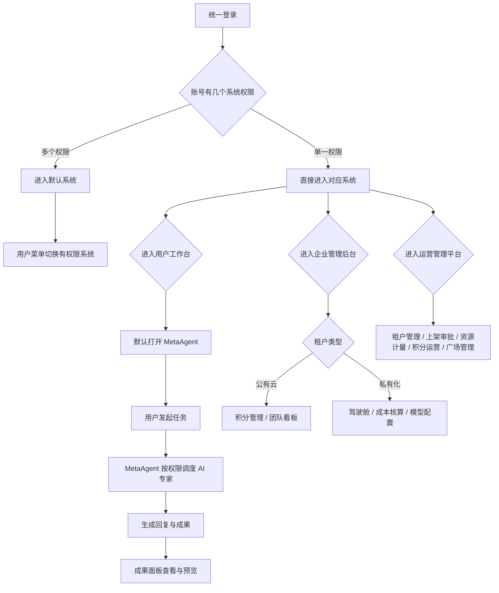

# Frontis AI · V0.6 PRD

## 1. 文档说明

### 1.1 文档目标

本文档用于定义 Frontis AI `V0.6` 版本的产品需求，覆盖当前原型已经收敛后的本期范围，作为研发、测试和产品验收依据。

V0.6 的核心目标不是扩大平台商业闭环，而是完成以下几类基础能力：

1. 统一登录与多系统权限切换。
2. 新用户注册后直接进入 MetaAgent。
3. 公有云与私有化租户在同一套租户模型下通过租户类型区分能力。
4. 公有云保留积分体系、注册赠送积分和邀请奖励。
5. 私有化租户不展示积分体系，按模型成本、调用成本和人力成本做企业侧核算。
6. 企业管理后台按个人版 / 团队版、公有云 / 私有化展示不同功能。
7. 团队版提供 AI 专家使用看板；私有化团队版看板使用成本口径。
8. AI 专家管理支持权限、模型和私有化成本参数配置。
9. 用户侧成果面板恢复为单纯成果列表和成果预览。
10. 运营管理平台只保留 V0.6 必要后台能力，移除本期不上线模块。

### 1.2 本期纳入范围

| 模块         | 纳入能力                                                                     |
| ------------ | ---------------------------------------------------------------------------- |
| 登录与账号   | 统一登录、单系统直达、多系统用户菜单切换                                     |
| 租户模型     | 租户类型：公有云 / 私有化；席位数决定个人版 / 团队版                         |
| 用户工作台   | MetaAgent 默认入口、专家工作室、AI专家广场、技能中心、进化实验室             |
| MetaAgent    | 新用户默认进入、单线程对话、按权限调度 AI 专家                               |
| 成果面板     | 成果入口、成果列表、搜索、成果预览、下载                                     |
| AI 专家广场  | 我的 / 团队分享 / FrontisAI发布，按权限和运营投放展示                        |
| 企业管理后台 | 驾驶舱、积分管理、AI专家管理、模型配置、组织管理                             |
| 私有化成本   | 模型成本、AI 专家调用成本、我的人力成本、行业标准成本                        |
| 运营平台     | 租户管理、AI专家上架审批、资源池中的模型与接口计量、积分运营、AI专家广场管理 |

### 1.3 术语定义

| 术语       | 定义                                                             |
| ---------- | ---------------------------------------------------------------- |
| 租户       | Frontis AI 的客户空间，用户、积分、模型、AI专家权限都归属于租户  |
| 公有云租户 | 使用平台统一云服务的租户，可使用积分体系                         |
| 私有化租户 | 私有化部署客户租户，不展示积分体系，以成本核算为主               |
| 个人版     | 只有 1 个席位的租户形态，不开放组织管理和团队看板                |
| 团队版     | 多席位租户形态，开放组织管理和团队 AI 看板                       |
| MetaAgent  | 用户进入系统后的默认协同入口，负责理解任务并调度有权限的 AI 专家 |
| AI 专家    | 可被用户直接使用，也可被 MetaAgent 调度的业务 Agent              |
| 成果       | AI 专家或 MetaAgent 产出的文件、报告、页面、图片等可复用结果     |
| 模型成本   | 私有化企业管理员配置的模型输入、输出或调用成本                   |
| 人力成本   | 私有化企业管理员为 AI 专家配置的人工替代成本基准                 |

## 2. 全局业务原则

### 2.1 统一登录原则

1. 登录入口统一，不区分运营平台登录和用户侧登录。
2. 用户通过手机号和验证码登录。
3. 登录成功后，系统根据当前账号拥有的系统模块权限决定进入路径。
4. 如果账号只有一个系统模块权限，登录后直接进入该系统。
5. 如果账号拥有多个系统模块权限，登录后进入默认系统，并可在用户菜单中切换到其他有权限系统。
6. 用户菜单只展示当前账号有权限的入口，没有权限的系统不展示按钮。
7. 从用户侧切换到运营管理平台或从运营管理平台切回用户侧时，必须保持当前登录用户身份一致。

### 2.2 租户类型原则

1. 不在登录侧让用户选择公有云或私有化。
2. 租户类型在运营管理平台创建租户时确定，枚举为 `公有云` 和 `私有化`。
3. 同一套企业管理后台根据租户类型自动展示不同功能。
4. 公有云租户展示积分相关能力。
5. 私有化租户不展示积分相关能力。
6. 私有化租户以模型成本、调用成本、人力成本、行业标准成本作为核算口径。

### 2.3 个人版 / 团队版原则

1. 租户不需要单独配置“租户版本”字段。
2. 席位数为 1 时，业务上视为个人版。
3. 席位数大于 1 时，业务上视为团队版。
4. 个人版不展示组织管理、租户驾驶舱和团队用量看板。
5. 团队版展示组织管理和团队 AI 看板。
6. 个人版也可以开发和使用 AI 专家，但不允许配置企业级模型供应商。

### 2.4 公有云积分原则

1. 积分只存在于公有云租户。
2. 公有云用户注册后获得注册送积分。
3. 公有云支持邀请奖励，邀请人和被邀请人满足规则后获得积分。
4. 积分消耗来自模型 Tokens、AI 专家运行、Skill 和第三方接口调用。
5. 公有云企业管理后台的积分管理展示消耗统计。

### 2.5 私有化成本原则

1. 私有化租户不展示积分余额、积分管理、邀请奖励和积分包。
2. 私有化模型配置由企业管理员维护。
3. 私有化模型配置允许录入模型成本。
4. 私有化不需要配置平台利润倍率或积分换算。
5. 私有化团队版驾驶舱按成本、Tokens、调用次数、调用成员、调用专家统计。
6. 私有化 AI 专家调用明细不展示 `单次平均 Tokens`，展示 `单次平均成本`。
7. 私有化 AI 专家详情支持配置 `我的人力成本` 和 `行业标准成本`。
8. `我的人力成本` 与 `行业标准成本`用于企业管理员核算 AI 系统替代人工的价值和有效性。

### 2.6 AI 专家版本原则

1. AI 专家开发者发布新版本后，用户已添加到工作台的 AI 专家自动升级。
2. 用户不需要手动升级。
3. 历史对话和历史成果应保留当时使用版本，用于追溯。
4. MetaAgent 的调度范围由权限决定，不局限于用户是否已添加到工作台。

## 3. 系统架构与角色

### 3.1 系统模块

| 模块         | 定位                   | V0.6 目标                                              |
| ------------ | ---------------------- | ------------------------------------------------------ |
| 用户工作台   | 用户日常使用 AI 的入口 | 让用户进入 MetaAgent、专家工作室、AI专家广场和成果面板 |
| 企业管理后台 | 租户管理员后台         | 按租户类型和席位展示积分、驾驶舱、专家、模型、组织能力 |
| 运营管理平台 | 平台运营后台           | 管理租户、AI专家上架审批、资源计量、积分运营和广场投放 |

### 3.2 用户角色

| 角色       | 所属范围     | 核心能力                                                     |
| ---------- | ------------ | ------------------------------------------------------------ |
| 普通用户   | 用户工作台   | 使用 MetaAgent、专家工作室、AI专家广场和成果                 |
| 租户管理员 | 企业管理后台 | 管理当前租户的积分或成本、AI专家、模型和组织                 |
| 平台运营   | 运营管理平台 | 创建租户、审核 AI 专家、维护资源计量、配置积分规则和广场投放 |
| 平台超管   | 运营管理平台 | 拥有全部运营管理权限                                         |

### 3.3 主流程

## 4. 登录与租户

### 4.1 统一登录

#### 4.1.1 页面目标

登录页负责完成身份验证，不负责让用户选择产品形态。用户不需要在登录页理解公有云、私有化、运营平台等概念。

#### 4.1.2 功能要求

| 功能       | 说明                                       |
| ---------- | ------------------------------------------ |
| 手机号输入 | 用户输入手机号                             |
| 验证码输入 | 用户输入 6 位验证码                        |
| 获取验证码 | 用户点击后获取登录验证码                   |
| 权限识别   | 登录成功后识别当前账号可进入的系统模块     |
| 登录跳转   | 单系统权限直接进入；多系统权限进入默认系统 |

#### 4.1.3 多系统切换

1. 用户菜单中展示当前账号可进入的系统入口。
2. 有运营权限时，展示 `进入运营管理平台`。
3. 有企业管理后台权限时，展示 `进入管理后台`。
4. 有工作台权限时，展示 `返回工作台`。
5. 没有权限的入口不展示。
6. 切换系统不改变当前登录账号。

### 4.2 注册逻辑

#### 4.2.1 新用户注册

1. 新用户通过手机号和验证码注册。
2. 注册成功后系统创建 1 席公有云个人租户。
3. 系统将注册用户设为租户管理员。
4. 系统为公有云个人租户发放注册送积分。
5. 注册完成后直接进入 MetaAgent，而不是进入 AI 专家广场。

#### 4.2.2 注册后默认体验

| 项目         | 规则                   |
| ------------ | ---------------------- |
| 默认系统     | 用户工作台             |
| 默认页面     | MetaAgent              |
| 默认租户类型 | 公有云                 |
| 默认租户形态 | 个人版                 |
| 默认席位     | 1                      |
| 默认积分     | 按运营平台积分规则发放 |

#### 4.2.3 首次进入引导

新用户首次进入 MetaAgent 时，系统需要展示一条预置引导消息，帮助用户理解默认工作入口，而不是让用户面对空白对话。

| 项目     | 要求                                                                 |
| -------- | -------------------------------------------------------------------- |
| 展示时机 | 新用户注册成功后首次进入 MetaAgent                                   |
| 消息形态 | 作为 MetaAgent 的首条助手消息展示                                    |
| 内容结构 | 使用 Markdown 渲染，包含自然分段、列表和重点文字，不展示为整段长文本 |
| 内容重点 | 说明 MetaAgent 可以承接目标、文件和业务场景，调度有权限的 AI 专家    |
| 个性化   | 提示用户可以为 MetaAgent 命名，并设置回答风格或工作偏好              |
| 飞书接入 | 提示右上角飞书按钮可一键接入飞书，接入后支持围绕飞书协作场景工作     |

预置引导消息只用于首登体验，用户发送消息后进入正常 MetaAgent 对话流程。

### 4.3 租户创建

#### 4.3.1 运营创建租户

运营管理平台在租户管理中创建租户。

| 字段            | 说明                                 |
| --------------- | ------------------------------------ |
| 租户名称        | 客户或个人空间名称                   |
| 租户类型        | 公有云 / 私有化                      |
| 行业            | 可选行业信息                         |
| 管理员姓名      | 初始管理员                           |
| 管理员手机号    | 初始管理员登录手机号                 |
| 席位数          | 决定个人版或团队版                   |
| AI 专家上架服务 | 是否允许租户成员提交 AI 专家上架审批 |

#### 4.3.2 租户列表

租户列表必须体现：

1. 租户名称。
2. 租户类型：公有云 / 私有化。
3. 租户形态：个人版 / 团队版。
4. 席位数。
5. 管理员。
6. 状态。
7. 计费口径：公有云为积分计费，私有化为金额计费。

## 5. 用户工作台

### 5.1 一级导航

用户工作台一级导航包括：

| 导航       | 说明                                   |
| ---------- | -------------------------------------- |
| MA工作台   | MetaAgent 默认工作入口                 |
| 专家工作室 | 进入其他 AI 专家的多 topic 工作模式    |
| 专家广场   | 浏览当前租户可见并可添加使用的 AI 专家 |
| 技能中心   | 查看和使用技能能力                     |
| 进化实验室 | 面向 AI 专家能力进化的实验入口         |

### 5.2 MetaAgent

#### 5.2.1 页面定位

MetaAgent 是用户进入系统后的默认工作入口，用于承接自然语言任务、判断任务意图、调度有权限的 AI 专家并返回结果。

#### 5.2.2 功能要求

| 功能       | 要求                                                 |
| ---------- | ---------------------------------------------------- |
| 默认进入   | 新用户注册后、已有用户进入工作台后默认打开 MetaAgent |
| 单线程对话 | MetaAgent 当前保持一条持续工作线程                   |
| 消息输入   | 支持文本输入和附件引用                               |
| 专家调度   | 可调度当前用户有权限的 AI 专家                       |
| 权限边界   | 未授权 AI 专家不可被调度                             |
| 结果输出   | 以消息形式展示回复，并可产生成果文件                 |
| 首登引导   | 新用户首次进入时展示 Markdown 分段引导消息           |
| 飞书接入   | 新用户引导场景下在右上角展示飞书接入按钮             |

#### 5.2.3 调度范围

1. MetaAgent 调度范围等于当前用户拥有使用权限的 AI 专家集合。
2. AI 专家是否被用户添加到工作台，不影响 MetaAgent 调度。
3. 添加到工作台只影响用户是否有显式入口。
4. AI 专家权限由企业管理后台 AI 专家管理配置。

#### 5.2.4 首登引导内容规范

MetaAgent 首登引导需要满足：

1. 语气自然，避免把能力点堆成一整段说明。
2. 内容使用 Markdown 渲染，支持段落、列表和重点文字。
3. 第一段说明 MetaAgent 的身份和入口定位。
4. 第二段说明用户可以输入目标、上传文件或描述业务场景。
5. 列表说明可配置项，包括名称、回答风格和工作偏好。
6. 末段说明右上角飞书入口的作用。

### 5.3 成果面板

#### 5.3.1 设计原则

成果面板只承接成果列表、搜索、预览和下载。预览态聚焦文件本身。

#### 5.3.2 功能要求

| 功能     | 说明                                   |
| -------- | -------------------------------------- |
| 成果入口 | 页面右侧提供成果按钮，点击展开成果面板 |
| 成果列表 | 展示成果文件名称、类型、大小、生成时间 |
| 搜索     | 支持按文件名、任务关键词、产出人搜索   |
| 预览     | 点击成果进入预览                       |
| 下载     | 支持下载成果文件                       |
| 关闭     | 支持关闭成果面板或返回列表             |

#### 5.3.3 成果预览

1. 预览页顶部聚焦文件标题和预览操作。
2. 预览内容聚焦文件本身。
3. 支持 Markdown、HTML、图片、文本等常见成果格式。
4. Office 类文件可展示不可预览提示或下载入口。

### 5.4 专家工作室

1. 专家工作室用于直接使用某个具体 AI 专家。
2. 专家工作室与 MetaAgent 是不同工作模式。
3. 专家工作室可以保留多 topic / 多会话结构。
4. 专家工作室内 AI 专家列表只展示当前用户有权限的专家。

### 5.5 AI 专家广场

#### 5.5.1 分类与来源

| 来源          | 说明                                   |
| ------------- | -------------------------------------- |
| 我的          | 用户自己开发或已添加的 AI 专家         |
| 团队分享      | 团队版租户内开放给当前用户的 AI 专家   |
| FrontisAI发布 | 平台运营上架并对当前租户可见的 AI 专家 |

#### 5.5.2 可见规则

1. 广场只展示当前用户可见的 AI 专家。
2. FrontisAI发布专家由运营平台配置分类、上架状态和可见范围。
3. 团队分享专家由企业管理员配置可用范围。
4. 已添加专家在开发者发布新版本后自动升级。

## 6. 企业管理后台

### 6.1 菜单与能力矩阵

| 菜单              | 公有云个人版 | 公有云团队版 | 私有化个人版 | 私有化团队版 |
| ----------------- | ------------ | ------------ | ------------ | ------------ |
| 驾驶舱 / 租户总览 | 不展示       | 展示         | 不展示       | 展示         |
| 积分管理          | 展示         | 展示         | 不展示       | 不展示       |
| AI专家管理        | 展示         | 展示         | 展示         | 展示         |
| 模型配置          | 不展示       | 展示         | 不展示       | 展示         |
| 组织管理          | 不展示       | 展示         | 不展示       | 展示         |

### 6.2 公有云积分管理

#### 6.2.1 页面定位

积分管理用于公有云租户查看积分消耗，不承担私有化成本核算。

#### 6.2.2 功能要求

| 功能     | 要求                                                     |
| -------- | -------------------------------------------------------- |
| 时间范围 | 支持本周、本月、全部                                     |
| 消耗统计 | 按使用人聚合展示积分消耗                                 |
| 消耗字段 | 使用人、消耗积分、使用次数、占比、主要来源、最近使用时间 |
| 详情     | 点击使用人查看按能力类型聚合的消耗和最近明细             |
| 顶部卡片 | 不展示重复的积分概览卡片                                 |
| 标题     | 不重复展示“积分消耗”标题                                 |

#### 6.2.3 个人版与团队版差异

1. 公有云个人版只展示本人积分消耗。
2. 公有云团队版展示成员积分消耗排行。
3. 公有云团队版仍可通过驾驶舱查看团队 AI 用量。

### 6.3 团队驾驶舱

#### 6.3.1 展示门槛

1. 只有团队版展示驾驶舱。
2. 个人版不展示驾驶舱。
3. 公有云团队版使用积分口径。
4. 私有化团队版使用成本口径。

#### 6.3.2 顶部指标

| 指标       | 公有云团队版 | 私有化团队版 |
| ---------- | ------------ | ------------ |
| 团队消耗   | 团队积分     | 总成本       |
| 调用次数   | 展示         | 展示         |
| 使用成员   | 展示         | 展示         |
| 被调用专家 | 展示         | 展示         |

`被调用专家`表示在当前时间范围内被成员或 MetaAgent 实际调用过的 AI 专家数量，不表示全部已授权专家数量。

#### 6.3.3 时间范围

1. 驾驶舱顶部使用统一时间范围控件。
2. 时间范围包括今日、本周、本月、全部、自定义。
3. 自定义必须是真实时间范围选择器。
4. 时间范围统一影响顶部指标、消耗趋势、成员用量排行、AI 专家用量排行。
5. AI 专家开发分布不受使用时间范围影响，因为它统计的是资产建设情况，不是运行消耗。

#### 6.3.4 四宫格看板

驾驶舱主体使用四宫格：

| 区块            | 图表              | 说明                       |
| --------------- | ----------------- | -------------------------- |
| 消耗趋势        | 折线 / 面积趋势图 | 展示企业积分或成本消耗趋势 |
| AI 专家用量排行 | 柱状图            | 展示 Top 5 被调用 AI 专家  |
| 成员用量排行    | 横向条形图        | 展示 Top 5 成员消耗        |
| AI 专家开发分布 | 横向条形图        | 展示 Top 5 开发者开发数量  |

#### 6.3.5 二级明细

| 明细页          | 入口                    | 字段                                                                |
| --------------- | ----------------------- | ------------------------------------------------------------------- |
| 成员用量明细    | 成员用量排行查看更多    | 成员、部门、消耗、Tokens、调用次数、使用 AI 专家、最近使用时间      |
| AI 专家调用明细 | AI 专家用量排行查看更多 | AI 专家、消耗、Tokens、调用次数、调用成员、调用成员数、单次平均指标 |
| AI 专家开发明细 | AI 专家开发分布查看更多 | 开发者、AI 专家数量、AI 专家列表                                    |

#### 6.3.6 私有化 AI 专家调用明细

私有化租户的 AI 专家调用明细字段为：

| 字段         | 说明                                       |
| ------------ | ------------------------------------------ |
| AI 专家      | 被调用的 AI 专家名称                       |
| 成本         | 当前时间范围内的总调用成本                 |
| Tokens       | 当前时间范围内总 Tokens                    |
| 调用次数     | 当前时间范围内调用次数                     |
| 调用成员     | 调用过该专家的成员                         |
| 调用成员数   | 调用过该专家的成员数量                     |
| 单次平均成本 | 成本 / 调用次数                            |
| 我的人力成本 | 管理员在 AI 专家详情配置的内部人力成本基准 |
| 行业标准成本 | 管理员在 AI 专家详情配置的行业标准成本基准 |

### 6.4 AI 专家管理

#### 6.4.1 页面定位

AI 专家管理用于企业管理员查看和配置当前租户内可管理的 AI 专家。

#### 6.4.2 列表筛选

团队版筛选：

1. 全部 AI 专家。
2. 企业公开。
3. 团队共享。
4. 个人发布。

个人版筛选：

1. 全部 AI 专家。
2. 自己开发。
3. 已订阅。

#### 6.4.3 专家详情

| 区块     | 功能                                         |
| -------- | -------------------------------------------- |
| 权限管理 | 配置全公司可用或按组织范围可用               |
| 模型配置 | 为单个 AI 专家选择模型                       |
| 成本核算 | 仅私有化展示，独立配置我的人力成本和行业标准成本 |
| 版本记录 | 查看 AI 专家版本发布记录                     |

#### 6.4.4 权限管理

1. 不依赖设备的 AI 专家可直接配置可用范围。
2. 需要设备绑定的 AI 专家先分配设备，再按设备配置权限。
3. 可用范围支持企业、部门、个人混选。
4. 权限保存后影响用户工作台专家列表和 MetaAgent 调度范围。

#### 6.4.5 模型配置

1. 个人版不展示企业管理后台模型配置菜单。
2. 个人版在 AI 专家开发和 AI 专家详情中仍可以选择模型。
3. 个人版可选模型仅来自平台提供模型。
4. 团队版管理员可在 AI 专家详情为专家指定模型。
5. 私有化团队版模型选择来自企业后台配置的模型供应商和模型清单。
6. 模型配置 Tab 只承接模型选择，不承接人力成本或行业成本配置。

#### 6.4.6 私有化成本核算

私有化 AI 专家详情通过独立 `成本核算` Tab 展示成本核算配置：

| 字段         | 类型     | 说明                                 |
| ------------ | -------- | ------------------------------------ |
| 我的人力成本 | 数字金额 | 企业内部同岗位或同任务的人力成本基准 |
| 行业标准成本 | 数字金额 | 行业通用人工成本或外包服务成本基准   |

保存后，这两个字段展示在私有化驾驶舱 `AI 专家调用明细` 中，用于企业管理员判断 AI 调用成本是否低于人工替代成本。

### 6.5 模型配置

#### 6.5.1 展示规则

| 租户形态 | 是否展示模型配置 |
| -------- | ---------------- |
| 个人版   | 不展示           |
| 团队版   | 展示             |

#### 6.5.2 公有云团队版

1. 保持原有模型配置能力。
2. 管理员可查看供应商、模型清单、接口格式、输入模态、推理开关等。
3. 具体运行消耗仍按积分体系扣减。

#### 6.5.3 私有化团队版

1. 不预置模型供应商。
2. 企业管理员自行新增模型供应商。
3. 供应商配置包括供应商名称、API Key、Base URL。
4. 模型清单支持新增、编辑、删除模型。
5. 模型字段包括模型名称、模型 ID、接口格式、输入模态、推理开关。
6. 私有化模型需要支持配置模型成本。
7. 私有化企业后台不配置利润倍率和积分换算。

### 6.6 组织管理

1. 只有团队版展示组织管理。
2. 个人版不展示组织管理。
3. 组织管理支持部门、成员和席位基础信息。
4. 团队版管理员可邀请成员。
5. 席位不足时禁止继续邀请。

## 7. 运营管理平台

### 7.1 平台定位

运营管理平台服务 Frontis AI 平台运营人员，用于维护 V0.6 所需的最小平台治理能力。

### 7.2 本期菜单

| 菜单           | 说明                                     |
| -------------- | ---------------------------------------- |
| 租户管理       | 创建租户、查看租户列表、进入租户详情     |
| AI专家上架审批 | 审核租户提交的 AI 专家上架申请           |
| 资源池         | 仅保留模型与接口资源计量配置             |
| 积分运营       | 配置积分规则、邀请奖励、消耗对账         |
| AI专家广场管理 | 配置 AI 专家广场分类、上架状态和可见范围 |

### 7.3 租户管理

#### 7.3.1 租户列表

列表字段：

| 字段     | 说明                          |
| -------- | ----------------------------- |
| 租户名称 | 租户展示名                    |
| 租户类型 | 公有云 / 私有化               |
| 租户形态 | 个人版 / 团队版，根据席位推导 |
| 席位     | 已用席位 / 总席位             |
| 管理员   | 初始管理员                    |
| 状态     | 待启用 / 已启用 / 已停用      |
| 计费口径 | 积分计费 / 金额计费           |

#### 7.3.2 创建租户

创建租户时必须选择：

1. 租户名称。
2. 租户类型：公有云 / 私有化。
3. 管理员姓名。
4. 管理员手机号。
5. 席位数。
6. 是否开通 AI 专家上架服务。

系统根据席位数自动推导：

| 席位数 | 租户形态 |
| ------ | -------- |
| 1      | 个人版   |
| 大于 1 | 团队版   |

#### 7.3.3 租户类型影响

| 租户类型 | 影响                                                     |
| -------- | -------------------------------------------------------- |
| 公有云   | 展示积分体系，使用积分计费，可参与注册赠送和邀请奖励     |
| 私有化   | 不展示积分体系，使用金额和成本核算，企业侧可配置模型成本 |

### 7.4 AI 专家上架审批

1. 仅对已开通 AI 专家上架服务的租户生效。
2. 租户成员可提交 AI 专家上架申请。
3. 运营人员审核通过后，AI 专家进入广场管理可配置范围。
4. 审核内容包括 AI 专家名称、介绍、版本、提交人、租户、状态。

### 7.5 资源池

#### 7.5.1 页面边界

V0.6 的运营平台 `资源池` 用于维护资源计量。

计量范围：

1. 模型供应商计量配置。
2. 模型服务成本价和资源计量单价。
3. 外部接口服务成本价和资源计量单价。

#### 7.5.2 模型资源计量

| 字段     | 说明            |
| -------- | --------------- |
| 供应商   | 模型供应商      |
| 模型名称 | 模型展示名      |
| 模型 ID  | 实际调用模型 ID |
| 接口格式 | OpenAI 格式等   |
| 输入模态 | Text / Image 等 |
| 成本价   | 平台资源成本    |
| 计量单价 | 平台计量金额    |
| 状态     | 启用 / 停用     |

#### 7.5.3 外部接口计量

| 字段     | 说明                    |
| -------- | ----------------------- |
| 服务名称 | 第三方接口或 Skill 服务 |
| 服务商   | 外部服务商              |
| 计量单位 | 次数、Token、服务等     |
| 成本价   | 平台资源成本            |
| 计量单价 | 平台计量金额            |
| 状态     | 启用 / 停用             |

### 7.6 积分运营

#### 7.6.1 页面定位

积分运营只服务公有云租户。

#### 7.6.2 积分规则

| 配置项     | 说明                       |
| ---------- | -------------------------- |
| 注册送积分 | 新公有云个人租户注册后发放 |
| 积分汇率   | 资源计量金额折算积分       |
| 最小扣减   | 单次扣减的最低积分         |
| 取整单位   | 消耗积分取整规则           |

运营管理不需要单独设置是否开放个人版注册。

#### 7.6.3 邀请奖励

1. 公有云用户可通过邀请获得积分。
2. 邀请关系只用于增长归因，不等同于团队成员邀请。
3. 被邀请人完成注册并创建 1 席个人租户后，触发奖励。
4. 可配置邀请人奖励积分、被邀请人额外奖励、每日上限、每月上限。

#### 7.6.4 消耗对账

1. 按客户和时间范围汇总运行消耗。
2. 展示资源成本、计量金额、扣减积分。
### 7.7 AI 专家广场管理

#### 7.7.1 分类管理

运营人员可维护用户侧 AI 专家广场分类：

| 字段     | 说明           |
| -------- | -------------- |
| 分类名称 | 广场筛选项名称 |
| 排序     | 分类展示顺序   |
| 状态     | 启用 / 停用    |
| 更新时间 | 最近更新时间   |

#### 7.7.2 上架配置

| 字段     | 说明                 |
| -------- | -------------------- |
| AI 专家  | 已审批通过的 AI 专家 |
| 分类     | 归属广场分类         |
| 可见范围 | 全平台 / 指定租户    |
| 上架状态 | 上架 / 下架          |

#### 7.7.3 可见范围

1. 全平台可见时，符合权限的租户均可看到。
2. 指定租户可见时，仅选中的租户可看到。
3. 下架后用户侧不展示。

## 8. 公有云与私有化差异

### 8.1 用户侧差异

| 能力         | 公有云 | 私有化 |
| ------------ | ------ | ------ |
| 积分余额     | 展示   | 不展示 |
| 注册赠送积分 | 支持   | 不支持 |
| 邀请奖励     | 支持   | 不支持 |
| AI 专家使用  | 支持   | 支持   |
| 成果面板     | 支持   | 支持   |
| MetaAgent    | 支持   | 支持   |

### 8.2 企业管理后台差异

| 能力            | 公有云       | 私有化                     |
| --------------- | ------------ | -------------------------- |
| 积分管理        | 展示         | 不展示                     |
| 驾驶舱消耗口径  | 积分         | 成本                       |
| 模型配置        | 团队版展示   | 团队版展示，需配置模型成本 |
| AI 专家成本参数 | 不展示       | 展示                       |
| 邀请奖励        | 公有云侧能力 | 不展示                     |

### 8.3 运营平台差异

| 能力     | 公有云租户 | 私有化租户 |
| -------- | ---------- | ---------- |
| 创建租户 | 可创建     | 可创建     |
| 计费口径 | 积分计费   | 金额计费   |
| 积分运营 | 生效       | 不生效     |
| 资源计量 | 生效       | 生效       |
| 广场投放 | 生效       | 生效       |

## 9. 数据与统计口径

### 9.1 积分消耗

积分消耗 = 资源计量金额按积分规则换算后的扣减值。

适用范围：

1. 公有云个人版。
2. 公有云团队版。

不适用：

1. 私有化个人版。
2. 私有化团队版。

### 9.2 私有化成本

私有化成本来自：

1. 模型调用成本。
2. 外部接口成本。
3. AI 专家调用成本聚合。

驾驶舱展示：

1. 总成本。
2. 成本趋势。
3. 成员成本排行。
4. AI 专家成本排行。
5. AI 专家调用明细中的单次平均成本。

### 9.3 人力成本基准

`我的人力成本`和`行业标准成本`由企业管理员在 AI 专家详情中配置。

用途：

1. 与 AI 调用成本对比。
2. 判断 AI 专家是否具备成本替代价值。
3. 为私有化客户复盘 ROI 提供依据。

### 9.4 AI 专家开发数量

1. 按 AI 专家资产的开发者字段统计。
2. 不按调用时间范围过滤。
3. 一级看板展示 Top 5。
4. 二级明细展示全部开发者、开发数量和对应 AI 专家列表。

## 10. 权限与可见性

### 10.1 系统权限

1. 系统入口按账号权限展示。
2. 无权限入口不展示。
3. 切换系统时不能切换成其他账号身份。

### 10.2 租户权限

1. 用户只能进入自己有身份的租户。
2. 多租户账号可在用户菜单中切换租户。
3. 切换租户后，工作台和管理后台均按新租户权限展示。

### 10.3 AI 专家权限

1. AI 专家可配置全企业可用。
2. AI 专家可配置按部门或成员可用。
3. 权限影响专家工作室可见列表。
4. 权限影响 MetaAgent 可调度范围。
5. 未授权 AI 专家不在用户侧暴露。

## 11. 验收标准

### 11.1 登录验收

1. 统一登录页可以完成手机号验证码登录。
2. 单系统账号登录后直接进入对应系统。
3. 多系统账号登录后可以在用户菜单切换系统。
4. 无运营权限账号不展示运营管理平台入口。
5. 切换系统后用户身份保持一致。

### 11.2 注册验收

1. 新用户注册后自动创建 1 席公有云个人租户。
2. 注册后直接进入 MetaAgent。
3. 公有云新租户获得注册送积分。
4. 首次进入 MetaAgent 时展示 Markdown 分段引导消息。
5. 新用户引导场景下右上角展示飞书接入按钮。

### 11.3 工作台验收

1. MetaAgent 是默认入口。
2. MetaAgent 可正常发送消息。
3. MetaAgent 可调度有权限 AI 专家。
4. 成果按钮展开成果面板。
5. 成果预览页聚焦成果文件内容。

### 11.4 企业管理后台验收

1. 公有云个人版不展示驾驶舱、组织管理、模型配置。
2. 公有云个人版展示积分管理和 AI 专家管理。
3. 私有化个人版不展示积分管理、驾驶舱、组织管理、模型配置。
4. 团队版展示驾驶舱和组织管理。
5. 私有化团队版模型配置可维护模型成本。
6. 私有化 AI 专家详情可配置我的人力成本和行业标准成本。
7. 私有化 AI 专家调用明细展示单次平均成本、我的人力成本、行业标准成本。

### 11.5 运营平台验收

1. 运营平台只展示 V0.6 本期菜单。
2. 租户创建可选择公有云或私有化。
3. 席位数为 1 时列表展示个人版，大于 1 时展示团队版。
4. 公有云租户显示积分计费，私有化租户显示金额计费。
5. 积分运营包含积分规则、邀请奖励和消耗对账。
6. 资源池只展示模型与接口计量配置。
7. AI 专家广场管理包含分类和上架可见范围。

## 12. 需求池映射

| 前后端 | 模块        | 需求                    | 描述                                                               | 需求类型 | 版本规划 | 优先级 | 提报人 |
| ------ | ----------- | ----------------------- | ------------------------------------------------------------------ | -------- | -------- | ------ | ------ |
| 前端   | 登录        | 统一登录入口            | 不区分运营或用户登录入口，登录后按账号权限进入对应系统。           | 功能     | V0.6     | P0     | 杨万权 |
| 前端   | 登录        | 多系统用户菜单切换      | 多系统权限账号在用户菜单中切换工作台、企业管理后台和运营平台。     | 功能     | V0.6     | P0     | 杨万权 |
| 前端   | 登录        | 无权限入口隐藏          | 用户菜单不展示当前账号无权限进入的系统入口。                       | 功能     | V0.6     | P0     | 杨万权 |
| 前端   | 注册        | 注册后进入 MetaAgent    | 新用户完成注册后直接进入 MetaAgent，而不是 AI 专家广场。           | 功能     | V0.6     | P0     | 杨万权 |
| 前后端 | 租户        | 租户类型                | 租户创建时选择公有云或私有化，影响积分、成本和后台展示。           | 功能     | V0.6     | P0     | 杨万权 |
| 前后端 | 租户        | 席位推导个人版 / 团队版 | 租户不单独配置版本，席位数为 1 是个人版，多席位是团队版。          | 规则     | V0.6     | P0     | 杨万权 |
| 前端   | 工作台      | MetaAgent 默认入口      | 用户工作台默认打开 MetaAgent。                                     | 体验     | V0.6     | P0     | 杨万权 |
| 前端   | MetaAgent   | 新用户首登引导          | 新用户首次进入 MetaAgent 时展示 Markdown 分段引导消息。            | 体验     | V0.6     | P0     | 杨万权 |
| 前端   | MetaAgent   | 飞书接入入口            | 新用户引导场景下在右上角展示飞书接入按钮。                         | 功能     | V0.6     | P0     | 杨万权 |
| 前后端 | MetaAgent   | 按权限调度 AI 专家      | MetaAgent 可调度当前用户有权限的 AI 专家，不局限于已添加到工作台。 | 功能     | V0.6     | P0     | 杨万权 |
| 前端   | 成果        | 单纯成果面板            | 恢复成果按钮、成果列表、成果搜索和成果预览。                       | 功能     | V0.6     | P0     | 杨万权 |
| 前端   | 成果        | 成果预览聚焦文件        | 成果预览态只展示文件内容和预览操作。                               | 体验     | V0.6     | P0     | 杨万权 |
| 前后端 | AI 专家     | 自动版本升级            | 开发者发布新版本后，已添加用户自动使用最新版本。                   | 规则     | V0.6     | P0     | 杨万权 |
| 前端   | 企业后台    | 功能按租户类型展示      | 公有云展示积分，私有化不展示积分并展示成本口径。                   | 功能     | V0.6     | P0     | 杨万权 |
| 前端   | 企业后台    | 个人版隐藏团队能力      | 个人版不展示驾驶舱、组织管理和模型配置。                           | 功能     | V0.6     | P0     | 杨万权 |
| 前端   | 积分管理    | 移除顶部重复卡片        | 积分管理不展示顶部积分概览卡片，不重复展示积分消耗标题。           | 体验     | V0.6     | P0     | 杨万权 |
| 前后端 | 驾驶舱      | 团队 AI 看板            | 团队版展示消耗趋势、成员用量、AI 专家用量和开发分布。              | 功能     | V0.6     | P0     | 杨万权 |
| 前端   | 驾驶舱      | 自定义时间范围选择器    | 驾驶舱自定义时间必须使用真实日期范围选择器。                       | 体验     | V0.6     | P0     | 杨万权 |
| 前后端 | 驾驶舱      | 私有化成本口径          | 私有化驾驶舱按成本统计，不按积分统计。                             | 功能     | V0.6     | P0     | 杨万权 |
| 前后端 | 驾驶舱      | AI 专家调用明细成本字段 | 私有化调用明细展示单次平均成本、我的人力成本和行业标准成本。       | 功能     | V0.6     | P0     | 杨万权 |
| 前后端 | AI 专家管理 | 私有化成本核算配置      | 私有化 AI 专家详情支持配置我的人力成本和行业标准成本。             | 功能     | V0.6     | P0     | 杨万权 |
| 前后端 | 模型配置    | 私有化模型成本          | 私有化团队版模型配置支持录入模型成本，不配置利润倍率。             | 功能     | V0.6     | P0     | 杨万权 |
| 前端   | 模型配置    | 个人版隐藏模型配置      | 个人版不展示模型配置菜单，但开发和专家详情仍可选择平台提供模型。   | 功能     | V0.6     | P0     | 杨万权 |
| 前后端 | 运营平台    | 租户管理                | 创建租户时选择公有云或私有化，列表体现个人版 / 团队版和计费口径。  | 功能     | V0.6     | P0     | 杨万权 |
| 前后端 | 运营平台    | AI 专家上架审批         | 审核租户提交的 AI 专家上架申请。                                   | 功能     | V0.6     | P0     | 杨万权 |
| 前后端 | 运营平台    | 资源计量                | 资源池只保留模型和外部接口计量配置。                               | 功能     | V0.6     | P0     | 杨万权 |
| 前后端 | 运营平台    | 积分运营                | 配置注册送积分、积分汇率、邀请奖励和消耗对账。                     | 功能     | V0.6     | P0     | 杨万权 |
| 前后端 | 运营平台    | AI 专家广场管理         | 维护广场分类、上架状态和可见范围。                                 | 功能     | V0.6     | P0     | 杨万权 |
