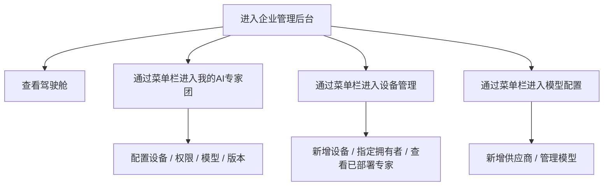
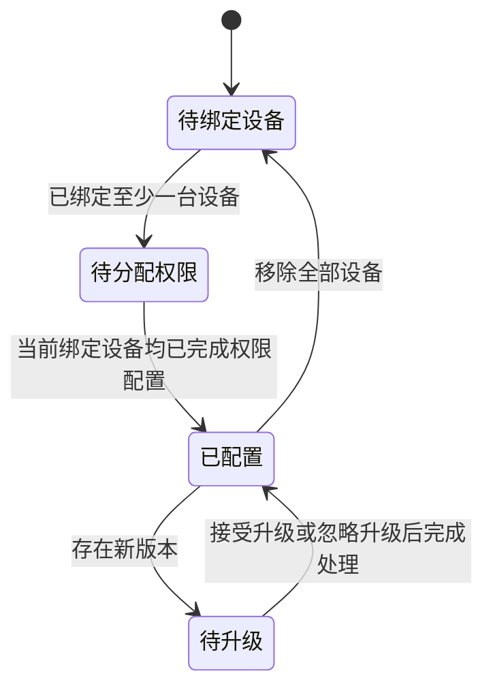
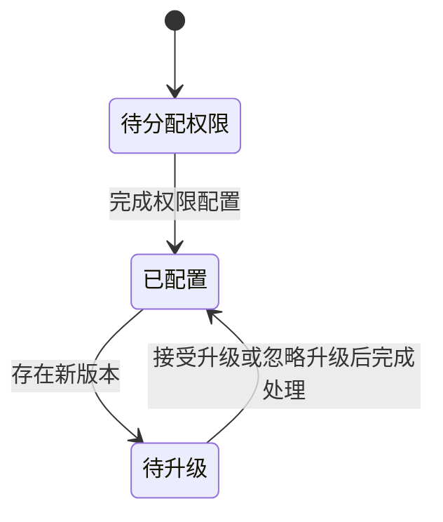
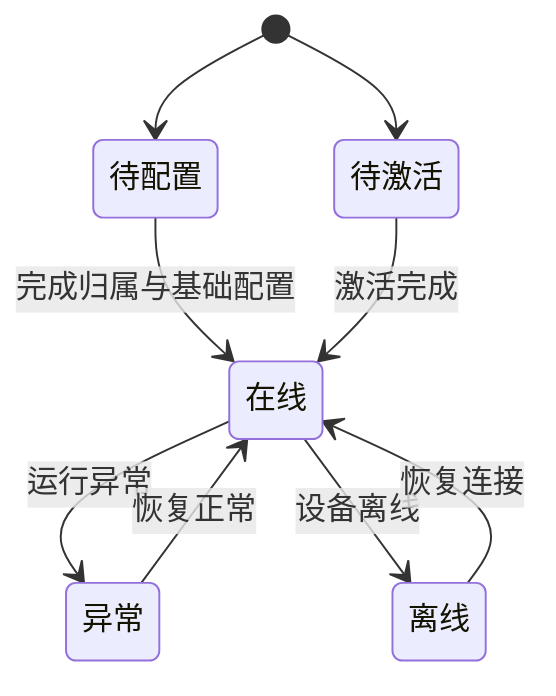
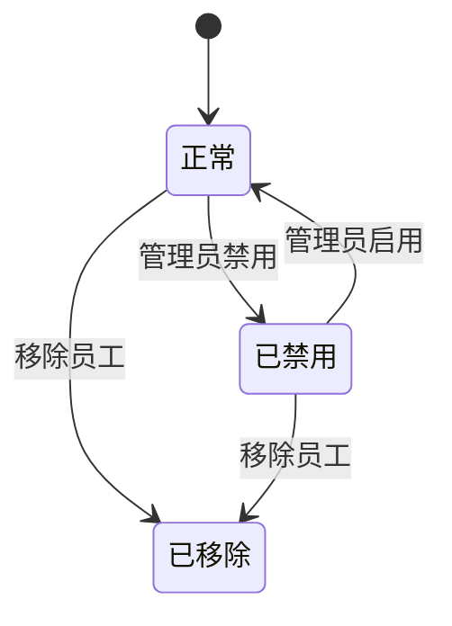

# Frontis AI · 企业管理后台 PRD

## 1. 文档说明

### 1.1 文档目标

本文档用于沉淀 Frontis AI 企业管理后台的正式产品设计，聚焦企业管理员如何管理 AI 专家、设备、模型与版本，并承接 FDE 交付后的企业侧落地配置。

### 1.2 文档范围

**纳入范围**

- 驾驶舱
- 我的 AI 专家团
- 设备管理
- 模型配置

**不纳入范围**

- 用户工作台对话协作体验
- FDE 商机、订单与交付执行流程
- 营销门户与开发管理链路

### 1.3 上下游关系

1. 上游承接 FDE 交付完成后的设备和 AI 专家资产。
2. FDE 在配置交付的“企业后台配置”步骤中，可按当前订单内容直接把企业管理员带到企业管理后台对应页签：
   - 含 AI 专家的订单进入「我的AI专家团」
   - 纯设备订单进入「设备管理」
3. 企业管理后台负责配置企业内部“谁能用哪些 AI 专家”，并承接 FDE 已指定的交付结果与交付版本。
4. 用户工作台只消费企业管理后台最终配置结果，不承担配置职责。

## 2. 系统定位

企业管理后台是企业内部配置中心，核心目标是：

1. 管理企业已拥有的 AI 专家与专家团。
2. 完成设备、权限、模型和组织配置。
3. 承接 FDE 交付后企业侧的落地操作。
4. 让企业管理员持续监控 AI 能力运行情况。

## 3. 用户角色与用户故事旅程

### 3.1 企业管理员旅程

1. 从“我的AI专家团”查看企业已拥有的专家和推荐专家团。
2. 如果本次是由 FDE 交付带入的 AI 专家订单，管理员会直接进入对应专家页签，继续完成设备绑定、权限配置、模型选择和版本处理。
3. 如果本次是纯设备交付，管理员会直接进入设备管理，继续完成设备归属指定、设备核对和客户端分发。
4. 在模型配置里维护供应商和模型清单。

## 4. 功能列表

| 功能模块 | 一级功能 | 二级功能 | 功能描述 | 优先级 |
|---|---|---|---|---|
| 驾驶舱 | 总览 | 经营总览卡片 | 为企业管理员提供一个“一眼看全局”的入口，集中展示任务量、运行时长、节省工时、活跃 AI 专家等核心指标。 | P1 |
| 驾驶舱 | 总览 | 专家团配置概况 | 以专家团为维度展示企业当前 AI 能力资产的整体配置情况，包括专家数量、可用范围、活跃专家、待升级和运行主体。 | P1 |
| 驾驶舱 | 动态 | AI 专家动态信息流 | 按时间展示 AI 专家最近产生的重要动态。 | P1 |
| 我的AI专家团 | 资产列表 | 已拥有专家与专家团 | 统一展示企业当前已拥有的专家团和单个专家，支持按全部、专家团、专家分类查看。 | P0 |
| 我的AI专家团 | 资产列表 | 推荐AI专家团 | 在推荐页签中展示适合当前企业补充的专家团。 | P2 |
| 我的AI专家团 | 配置流程 | 先绑定设备再配置权限 | 针对需要运行设备支撑的 AI 专家，管理员先明确运行设备，再决定哪些成员可以使用。 | P0 |
| 我的AI专家团 | 配置流程 | 直接配置可用权限 | 对无需先绑定设备的 AI 专家，管理员可直接按组织范围设置开放对象。 | P0 |
| 我的AI专家团 | 配置流程 | 按设备分配权限 | 同一个 AI 专家被绑定到多台设备时，管理员可分别按设备配置组织范围。 | P0 |
| 我的AI专家团 | 配置流程 | 组织范围选择 | 权限配置基于组织树进行，支持全公司、部门、个人，以及多个并列部门或部门与个人混合授权。 | P0 |
| 我的AI专家团 | 模型配置 | 单个专家选择模型 | 在专家详情中为单个 AI 专家指定模型。 | P1 |
| 我的AI专家团 | 版本处理 | 查看版本说明 | 企业管理员在做升级决策前，可直接查看本次版本更新说明；若 AI 专家由 FDE 交付时已指定版本，则当前版本即承接该交付版本。 | P1 |
| 我的AI专家团 | 版本处理 | 接受或忽略升级 | 企业管理员可根据业务节奏决定是否接受本次升级。 | P1 |
| 我的AI专家团 | FDE 承接 | 承接 FDE 交付入口 | 当 FDE 在交付中需要企业继续完成专家配置时，系统需支持直接进入「我的AI专家团」对应页签，减少企业管理员在后台内再次查找专家的成本。 | P1 |
| 设备管理 | 概览 | 设备与额度总览 | 集中展示企业当前设备资源的额度使用情况和待处理设备数量。 | P1 |
| 设备管理 | 设备资产 | 设备列表与筛选 | 通过统一设备列表查看设备名称、类型、状态、所属员工和部署位置，并支持按状态和类型筛选。 | P1 |
| 设备管理 | 设备资产 | 指定设备拥有者 | 管理员可为设备指定或修改所属员工；选择方式基于组织树，但只能选择具体个人。 | P1 |
| 设备管理 | 设备详情 | 查看部署 AI 专家 | 在设备详情中查看当前已经部署到该设备上的 AI 专家。 | P2 |
| 设备管理 | FDE 承接 | 承接 FDE 设备交付入口 | 当 FDE 在交付中需要企业继续完成设备确认时，系统需支持直接进入「设备管理」，让管理员在设备上下文中继续操作，而不是回到后台首页重新定位。 | P1 |
| 设备管理 | 设备新增 | 添加设备与激活码 | 支持新增云端或本地设备；其中本地工作站和本地客户端在创建设备后会生成默认 1 天有效的激活码，激活成功后即销毁，未激活前可重新生成。 | P1 |
| 设备管理 | 客户端分发 | 下载客户端安装包 | 为企业管理员提供统一的客户端分发入口，支持下载不同平台安装包。 | P1 |
| 模型配置 | 供应商管理 | 查看供应商列表 | 集中查看企业当前已接入的模型供应商、连通状态和模型覆盖情况。 | P1 |
| 模型配置 | 供应商管理 | 新增 / 编辑供应商 | 支持企业新增或调整模型供应商配置。 | P1 |
| 模型配置 | 模型管理 | 管理模型清单 | 对每个供应商下的模型清单进行维护。 | P1 |

## 5. 核心业务逻辑梳理

### 5.1 企业后台访问逻辑

1. 当前企业侧存在三个业务角色：企业管理员、部门负责人、普通员工。
2. 只有企业管理员具备进入企业管理后台的权限。
3. 部门负责人和普通员工当前暂不区分后台功能能力，统一不进入企业管理后台。

### 5.2 AI 专家配置逻辑

企业侧的 AI 专家配置存在两条实际业务路径，但页面只呈现管理员需要完成的配置动作，不要求管理员额外区分系统背后的实现路径：

1. **路径一：先绑定设备再配置权限**
   - 适用于需要依赖设备运行的 AI 专家。
   - 先绑定设备，再针对每台设备配置可用成员。
   - 未完成权限配置前，不能算“已配置”。

2. **路径二：直接配置权限**
   - 适用于不需要先绑定设备的 AI 专家。
   - 直接配置组织范围。
   - 支持“全公司可用 / 按组织范围配置”。

3. **组织范围配置规则**
   - 每个租户创建后默认已有一级部门，权限配置不从空白开始。
   - 组织范围的授权主体支持企业、部门、个人。
   - 支持并列选择多个部门，也支持部门与个人混选。
   - 选择部门时默认包含其下属部门和成员。

### 5.3 用户侧可见性逻辑

1. 企业管理后台的授权结果会直接影响用户工作台是否展示某个 AI 专家。
2. 当设备被分配给员工后，员工工作台会自动生成该设备对应的默认 Agent，一台设备对应一个默认 Agent。
3. 对于设备绑定型专家，用户是否可用取决于“设备绑定结果 + 设备上的权限配置结果”。
4. 对于直接权限型专家，根据“全公司可用 / 按组织范围配置”直接决定可见范围。
5. 如果某个 AI 专家由 FDE 在订单阶段指定了交付版本，则企业后台当前看到的初始版本即为该交付版本，企业侧不需要重新选择首次版本。

### 5.4 设备管理逻辑

1. 设备分为云端工作站、本地工作站和本地客户端。
2. 云端设备新增后更偏向进入“待配置”。
3. 本地工作站和本地客户端新增后更偏向进入“待激活”，并在创建时生成激活码。
4. 本地设备激活码默认有效期为 1 天；激活成功后立即销毁，未激活前管理员可重新生成新码。
5. 设备分配给员工后，员工工作台会自动生成该设备对应的默认 Agent，设备与默认 Agent 1:1 对应。
6. 默认 Agent 支持在工作台编辑展示名称，但不改变后台设备归属关系。
7. 设备所属员工的选择基于组织树进行，但仅允许指定具体个人，不允许直接选择部门。
8. 当企业管理员从 FDE 的企业后台配置步骤进入后台时，若本次订单不含 AI 专家，仅需在设备管理上下文中继续完成设备相关配置即可。

### 5.5 模型配置逻辑

1. 企业管理后台统一维护模型供应商。
2. 供应商下面维护可用模型清单。
3. AI 专家在详情中选择的模型必须来自企业当前可用的模型供应商清单。
4. 如果管理员尚未完成模型配置，AI 专家详情会出现引导文案。

### 5.6 版本处理逻辑

1. 企业侧版本处理以版本说明为核心入口，先帮助管理员快速理解本次变化。
2. 管理员无需进入额外页面做差异比对，版本说明即可直接支撑升级判断。
3. 企业管理员可执行接受升级或忽略升级。
4. 如果当前版本已经处理完成，页面只保留说明，不再要求额外动作。
5. 即使某个 AI 专家属于专家团，企业侧的版本处理仍按团内单个 AI 专家分别执行。
6. 如果某个 AI 专家在 FDE 下单时已指定交付版本，则企业后台的当前版本展示应直接承接该交付版本；后续是否升级，再由企业管理员在版本处理里单独决定。

## 6. 状态机

### 6.1 AI 专家配置状态机

#### 路径一：先绑定设备再配置权限

#### 路径二：直接配置可用权限

### 6.2 设备状态机

### 6.3 员工账号状态机

## 7. 状态与字典

### 7.1 AI 专家卡片状态字典

| 状态 | 含义 | 触发条件 |
|---|---|---|
| 待绑定设备 | 当前专家还未绑定运行设备 | 设备型专家未绑定任何设备 |
| 待分配权限 | 当前专家尚未完成权限开放 | 未设置全公司或指定成员权限 |
| 待升级 | 当前专家存在待处理新版本 | 新版本已可见但尚未处理 |
| 已配置 | 当前专家已满足使用条件 | 配置完整且无待处理升级 |

### 7.2 权限模式字典

| 状态 | 含义 |
|---|---|
| 全公司可用 | 企业全部成员都可使用该 AI 专家 |
| 按组织范围配置 | 按组织树中的部门和个人配置可用范围 |

### 7.3 组织范围授权主体字典

| 类型 | 含义 |
|---|---|
| 企业 | 表示该 AI 专家对全公司开放 |
| 部门 | 表示该 AI 专家对某个部门及其下级部门开放 |
| 个人 | 表示该 AI 专家仅对指定个人开放 |

### 7.4 设备状态字典

| 状态 | 含义 |
|---|---|
| 待配置 | 设备已存在，但尚未完成归属和基础配置 |
| 待激活 | 设备需要激活后才能正式使用 |
| 在线 | 设备可正常承载服务 |
| 异常 | 设备存在运行异常 |
| 离线 | 设备当前未在线 |

### 7.5 模型供应商状态字典

| 状态 | 含义 |
|---|---|
| 已连通 | 供应商配置已通过连通性检测 |
| 连接异常 | 供应商配置当前不可用或检测失败 |

### 7.6 企业成员角色字典

| 类型 | 取值 | 说明 |
|---|---|---|
| 成员角色 | 企业管理员 / 部门负责人 / 普通员工 | 用于标识企业内部组织职责；当前仅企业管理员可进入后台 |
