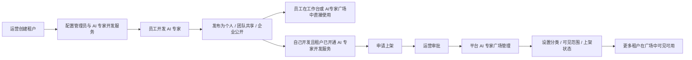
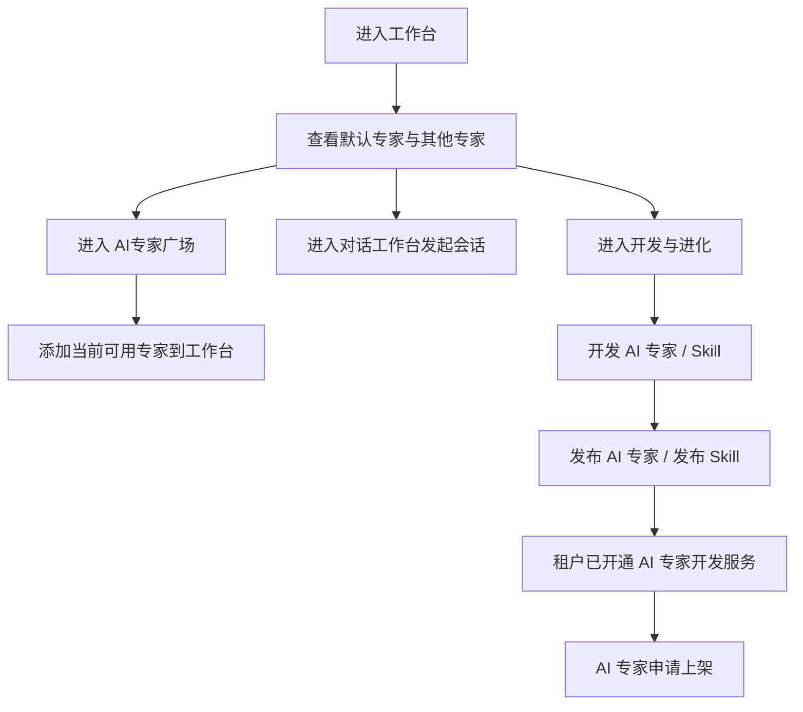
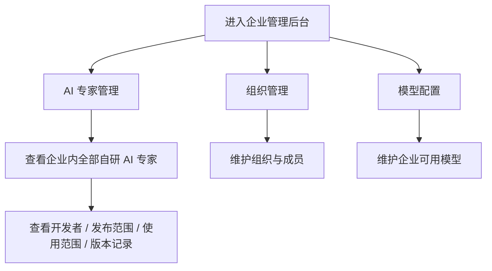
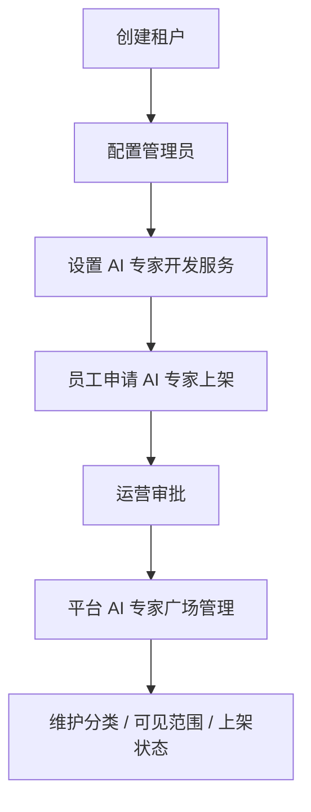

# Frontis AI · 完整 PRD V2

## 1. 文档说明

### 1.1 文档目标

本文档用于沉淀当前版本 Frontis AI 的完整产品设计，统一描述以下 3 个核心系统：

1. 员工工作台
2. 企业管理后台
3. 运营管理平台

### 1.2 文档范围

**纳入范围**

- 员工工作台：对话工作台、AI专家广场、开发与进化
- 企业管理后台：AI 专家管理、模型配置、组织管理
- 运营管理平台：租户管理、AI 专家上架审批、平台 AI 专家广场管理

### 1.3 当前版本核心范围

当前版本的最小闭环为：

1. 运营平台创建租户，并配置租户管理员与 AI 专家开发服务。
2. 企业员工开发 AI 专家，并发布为 `个人 / 团队共享 / 企业公开`。
3. 企业员工在已开通 AI 专家开发服务的租户下，可对自己开发的 AI 专家发起 `申请上架`。
4. 运营人员审核上架申请。
5. 运营人员在平台 AI 专家广场管理中维护分类、上架状态和可见范围。
6. 企业员工与企业管理员在工作台与 AI专家广场中直接添加和使用当前租户可用的 AI 专家。

### 1.4 全局业务原则

1. `发布` 不等于 `上架`。
   发布只解决租户内可见和可用；上架是把 AI 专家提交到平台侧，由运营审批后进入平台 AI 专家广场。
2. `购买` 和 `订单` 当前版本不纳入范围。
   当前 AI专家广场与平台 AI 专家广场管理都以直接使用和上架申请为主，不承接交易流程。
3. `AI 专家开发服务` 不是独立系统入口，而是租户级能力开关。
   只有开通 AI 专家开发服务的租户，员工才可以申请上架。
4. `平台 AI 专家广场管理` 不是商品运营中心。
   它只负责已审批通过 AI 专家的分类、可见范围和上架状态。
5. `企业公开` 仅表示在当前租户内对全员可见可用，不代表自动进入平台 AI 专家广场。
6. 当前版本企业管理后台只管理企业自研 AI 专家；`FrontisAI发布` 的平台专家在当前阶段默认可直接使用，不进入企业管理后台治理。
7. 购买、订阅或企业级启用逻辑当前版本不纳入范围；未来如引入平台 AI 专家购买能力，再补充企业管理员对已购买平台专家的管理逻辑。
8. 用户工作台和企业管理后台服务于企业内部使用；运营管理平台服务于平台级治理。

---

## 2. 系统总览

### 2.1 系统定位

Frontis AI 当前是一套统一体验的企业 AI 协作系统，由三个模块共同构成：

| 模块 | 系统定位 | 核心目标 |
|---|---|---|
| 员工工作台 | 企业内部成员使用 AI 专家的统一入口 | 让员工快速找到、添加并使用 AI 专家完成工作 |
| 企业管理后台 | 企业内部 AI 资产和配置治理后台 | 让企业管理员管理企业内 AI 专家、组织和模型能力 |
| 运营管理平台 | 平台级租户和广场供给治理后台 | 让平台运营管理租户准入、AI 专家上架审批与广场投放 |

### 2.2 系统主流程

### 2.3 角色分工

| 角色 | 所属模块 | 核心职责 |
|---|---|---|
| 普通员工 | 员工工作台 | 使用 AI 专家、开发 AI 专家、发布 AI 专家、申请上架 |
| 企业管理员 | 员工工作台、企业管理后台 | 使用 AI 专家、治理企业内 AI 专家、维护组织与模型配置 |
| 平台运营 | 运营管理平台 | 创建租户、配置 AI 专家开发服务、审批 AI 专家上架、管理平台广场投放 |

---

## 3. 员工工作台 PRD

### 3.1 系统定位

员工工作台是企业成员使用 AI 专家的统一入口，核心目标是：

1. 让员工快速找到当前可用的 AI 专家。
2. 让员工围绕 AI 专家发起会话、处理任务并沉淀成果。
3. 让员工能够在同一入口完成 AI 专家的开发、发布和使用。
4. 让具备条件的员工可以发起 AI 专家上架申请。

### 3.2 用户故事旅程

#### 3.2.1 普通员工旅程

1. 员工进入工作台后，看到默认专家 `MetaAegnt` 和其它可用专家。
2. 员工默认直接进入 `MetaAegnt` 的持续对话线程发起任务；`MetaAegnt` 不区分多会话，不展示 `新对话` 按钮和历史会话列表，所有对话记录都持续沉淀在同一条线程中。
3. `MetaAegnt` 会在当前用户已有权限的 AI 专家范围内自动判断是否需要调度其它专家协同处理。
4. 员工在 AI专家广场中浏览当前租户可用的 AI 专家，包括企业自研专家与 FrontisAI发布的专家。
5. 员工可将当前有权限使用的 AI 专家直接添加到工作台。
6. 如果员工在左侧专家列表中选择其它 AI 专家，则进入该专家的一对一独立使用模式；其它 AI 专家仍保留独立会话与历史会话管理。
7. 员工在开发与进化中开发自己的 AI 专家与 Skill。
8. 员工可将自己开发并已发布的 AI 专家直接添加到工作台使用。
9. 员工可发布 AI 专家为 `个人 / 团队共享 / 企业公开`，也可按对应规则发布 Skill。
10. 如果当前租户已开通 AI 专家开发服务，员工可在自己开发的 AI 专家详情中申请上架。

### 3.3 功能列表

| 功能模块 | 一级功能 | 二级功能 | 功能描述 | 优先级 |
|---|---|---|---|---|
| 对话工作台 | 专家列表 | 默认专家分组 | 工作台左侧专家列表需要固定分为 `默认专家 / 其他专家` 两个分组，其中默认专家分组在当前版本下仅展示系统默认专家 `MetaAegnt`。该分组用于承接用户首次进入系统后的默认会话入口，确保每个用户在没有主动选择其他专家时，也能直接开始使用统一默认专家。 | P0 |
| 对话工作台 | 专家列表 | 其他专家分组 | 除默认专家外，当前账号已经可用并已进入工作台的全部 AI 专家统一展示在 `其他专家` 分组下，包括企业自研专家、FrontisAI发布专家和用户自己主动添加的专家。该分组需要支持快速切换不同专家，并让用户明确感知当前自己还可以使用哪些能力。 | P0 |
| 对话工作台 | 专家列表 | 默认与其他专家切换规则 | 工作台中的 `MetaAegnt` 与其它 AI 专家在产品语义上不是同一类入口。`MetaAegnt` 代表系统默认协同入口，适合用户在不明确应找哪位专家时直接发起任务；而 `其他专家` 代表用户已经有权限且可以直接单独使用的具体专家。该规则需要在列表分组、当前选中态和切换反馈上保持一致，让用户明确知道“当前是在走系统协同入口，还是直接与某位专家一对一工作”。 | P0 |
| 对话工作台 | 会话管理 | MetaAegnt 单线程会话 | 当当前专家为 `MetaAegnt` 时，工作台不提供 `新对话` 按钮，也不展示历史会话列表。`MetaAegnt` 的全部消息、调度过程和后续追问都持续沉淀在同一条工作线程中，用户始终围绕这条线程连续对话。该规则用于强化 `MetaAegnt` 作为默认协同入口的连续工作心智。 | P0 |
| 对话工作台 | 会话管理 | 其他专家新建会话 | 用户可围绕某一个具体 AI 专家发起新的独立会话，新会话默认继承当前专家身份，但不继承其他历史会话的上下文。该能力仅适用于 `MetaAegnt` 之外的其他 AI 专家，用于保证不同任务之间的信息隔离。 | P0 |
| 对话工作台 | 会话管理 | 其他专家历史会话 | 用户可在左侧历史会话区回看同一专家下的历史对话，并支持按时间切换和继续追问。该能力仅适用于 `MetaAegnt` 之外的其他 AI 专家，用于承接未完成任务、回看前序输出，以及在相同专家下恢复连续工作过程。 | P0 |
| 对话工作台 | 会话交互 | 发送消息 | 用户可通过自然语言输入向当前 AI 专家发起任务请求，这是工作台最核心的交互入口。系统应支持多轮追问、连续补充信息和上下文延续，确保用户能够围绕当前任务逐步推进。 | P0 |
| 对话工作台 | 会话交互 | MetaAegnt 协同调度 | 当当前会话专家为 `MetaAegnt` 时，系统需要具备“按需求自动调度”能力。`MetaAegnt` 在收到任务后，应先理解用户意图，再从“当前用户已拥有权限的 AI 专家集合”中判断是否需要调度其他专家协同处理。被调度的专家应在会话流中以独立 AI 专家身份出现，展示各自头像、名称、消息内容和工具执行过程，最后再由 `MetaAegnt` 做统一汇总与交付。该能力用于承接复杂任务场景，让用户不需要自己判断该找哪位专家、也不需要手工切换多个专家完成协同。 | P0 |
| 对话工作台 | 会话交互 | 权限内专家调度范围 | `MetaAegnt` 的调度范围不是平台上的全部 AI 专家，而只能是“当前用户已经有权限使用”的专家集合。该规则需要同时受工作台内已添加专家、当前租户内可用的企业自研专家、FrontisAI发布专家和用户自身权限范围约束。产品上需要明确保证：用户看不到、用不到的专家，也不会被 `MetaAegnt` 在后台调起参与当前任务。这样才能保证调度逻辑与企业内权限体系一致。 | P0 |
| 对话工作台 | 会话交互 | 其他专家一对一使用 | 当用户在左侧专家列表中主动选择 `MetaAegnt` 之外的其它 AI 专家时，该专家应进入一对一单独使用模式。此时当前会话只围绕该专家自身的能力展开，不再由 `MetaAegnt` 作为调度入口介入，也不应自动拉起其它专家加入。该能力用于满足用户“我已经明确知道要找哪位专家，希望直接和他完成任务”的使用心智。 | P0 |
| 对话工作台 | 会话交互 | 快捷问题 | 为降低首次使用门槛，工作台可提供预置快捷问题或推荐提问模板，帮助用户快速理解当前专家擅长的任务类型，并减少从“进入页面”到“真正发起任务”之间的操作成本。 | P1 |
| 对话工作台 | 会话交互 | 附件上传 | 用户在发送消息前或会话过程中可上传文档、表格、图片等附件，让 AI 专家在首轮或后续轮次获取完整业务材料。该能力用于支持真实工作场景中的资料输入，而不是只依赖文本提问。 | P0 |
| 对话工作台 | 会话交互 | 停止生成 | 当当前轮输出方向偏离预期、生成内容已经足够、或用户希望立即中止本轮时，可主动停止生成。该能力用于提升会话过程的可控性，避免用户必须等待整轮输出结束。 | P1 |
| 对话工作台 | 成果管理 | 成果列表 | `成果` 指当前会话过程中产生的全部文件型输出，包括文档、表格、图片、Markdown、导出文件及其他可落地保存的文件。成果列表需要统一沉淀这些输出，让用户可以明确区分“本轮回答内容”与“已经产出的文件成果”。 | P0 |
| 对话工作台 | 成果管理 | 成果预览与继续使用 | 用户可对会话中产生的成果进行预览、再次打开、继续补充使用或带入后续会话。该能力的本质是让成果成为会话中的可持续工作对象，而不是一次性展示结果。 | P1 |
| 对话工作台 | 结果展示 | 结构化结果卡片 | 对于摘要、结论、步骤建议、提炼要点等非文件型输出，系统以结构化结果卡片方式展示。结果卡片用于承载“便于快速阅读的结论”，而不是文件成果，因此需要与成果区在产品语义上明确区分。 | P1 |
| AI专家广场 | 广场浏览 | 分类浏览 | AI专家广场提供 `全部 / 企业自研 / FrontisAI发布 / 我的` 等分类入口，帮助用户基于来源和归属快速定位当前可用的专家。分类浏览强调“我现在可以直接使用什么”，而不是后台治理属性。 | P0 |
| AI专家广场 | 广场浏览 | 业务领域筛选 | 在分类浏览之外，广场还应支持按业务领域进一步筛选，例如销售、通用、供应链等。该能力用于帮助用户在大量专家中快速缩小范围，按业务场景找到更匹配的专家。 | P1 |
| AI专家广场 | 专家详情 | 基础信息查看 | AI 专家详情页需要展示该专家的简介、开发者或发布方、资产来源、业务领域、适用场景、版本信息和必要说明。详情页的作用是帮助用户判断“这个专家是什么、能做什么、我是否应添加使用”。 | P0 |
| AI专家广场 | 专家详情 | 添加到工作台 | 对当前用户有使用权限的 AI 专家，详情页及卡片区都应提供 `添加到工作台` 操作。添加完成后，该专家应进入工作台侧边列表，用户可立即围绕它创建会话并开始工作。 | P0 |
| AI专家广场 | 上架申请 | 提交上架申请 | 对“自己开发”的 AI 专家，在当前租户已开通 AI 专家开发服务时，详情页需提供 `申请上架` 入口。用户提交上架申请时，需要填写上架名称和申请理由，以便该专家进入运营平台的上架审批流程。 | P0 |
| AI专家广场 | 上架申请 | 查看上架状态 | 对已经提交过上架申请的 AI 专家，详情页需要明确显示当前申请状态，包括 `待审批 / 已通过待投放 / 已驳回` 以及必要的处理结果说明。该能力用于避免重复提交，并让开发者随时了解当前上架进度。 | P1 |
| 开发与进化 | 开发能力 | AI 专家开发 | 员工可在开发与进化模块中持续开发 AI 专家，包括基础信息配置、角色定位、业务描述、运行配置与后续迭代优化。该能力用于承接企业员工从“有一个专家想法”到“形成可发布对象”的完整过程。 | P0 |
| 开发与进化 | 开发能力 | Skill 开发 | 员工可在开发与进化模块中开发 Skill，并完成能力定义、输入输出设计、调用逻辑配置和后续迭代。该能力用于沉淀可复用的原子能力，并支持后续发布与复用。 | P0 |
| 开发与进化 | 发布管理 | AI 专家发布 | AI 专家发布时需支持 `个人 / 团队共享 / 企业公开` 等范围配置。发布后决定该 AI 专家在当前租户内谁能看到、谁能使用，以及是否具备进一步申请上架的前置条件。 | P0 |
| 开发与进化 | 发布管理 | Skill 发布 | Skill 开发完成后应支持发布，使其进入可被使用或复用的状态。Skill 发布用于承接开发与分发闭环，并与 AI 专家发布能力保持统一的产品入口。 | P0 |

### 3.4 核心业务逻辑梳理

#### 3.4.1 AI 专家可见逻辑

1. 用户工作台中默认会有一个系统默认专家 `MetaAegnt`。
2. 其他 AI 专家来源于当前账号在企业内可用的企业自研专家与 FrontisAI发布专家，也包括用户自己开发并可见的个人专家。
3. `个人` AI 专家仅开发者自己可见。
4. `团队共享` AI 专家仅被共享的组织或成员可见。
5. `企业公开` AI 专家仅在当前租户内对所有成员可见可用。
6. 平台投放到本租户的 AI 专家由运营侧控制是否进入当前租户的 AI专家广场。

#### 3.4.2 工作台会话模式逻辑

1. 工作台当前存在两种对话模式：`MetaAegnt 单线程协同模式` 和 `单专家一对一模式`。
2. 当用户选择默认专家 `MetaAegnt` 发起对话时，系统进入 `MetaAegnt 单线程协同模式`：
   - `MetaAegnt` 始终只维护一条连续工作线程；
   - 不提供 `新对话` 按钮；
   - 不展示历史会话列表；
   - 用户的所有消息、系统调度过程、专家协同输出和后续追问都直接追加到同一条线程中。
3. 在这条 `MetaAegnt` 工作线程内：
   - `MetaAegnt` 先理解需求；
   - 再基于用户当前已拥有权限的专家集合判断是否需要调度其它专家；
   - 被调度的专家在当前线程中作为独立 AI 专家出现；
   - 各专家可各自输出消息、执行工具并沉淀中间结果；
   - 最终由 `MetaAegnt` 统一汇总，向用户交付最终结论和成果。
4. `MetaAegnt` 不允许调度超出当前用户权限范围的专家。用户没有权限使用的专家，即使平台内存在，也不能被系统在当前线程中调用。
5. 当用户主动选择 `MetaAegnt` 之外的其它 AI 专家时，系统进入 `单专家一对一模式`：
   - 当前会话只绑定当前专家；
   - 专家直接围绕自己的能力处理任务；
   - 不再自动调度其它专家加入；
   - 其他 AI 专家仍支持新建独立会话与历史会话切换。
6. `MetaAegnt` 的定位是“默认协同入口”，不是“替代所有专家的唯一界面”；其它专家的定位是“明确能力边界的一对一使用入口”。

#### 3.4.3 发布与上架逻辑

1. 员工在开发与进化中可开发 AI 专家与 Skill，并按对应规则完成发布。
2. AI 专家发布后可进入 AI专家广场，被当前有权限的用户直接添加和使用；Skill 发布后进入对应使用与复用范围。
3. 发布只解决当前租户内的使用范围，不经过运营审批。
4. 只有自己开发的 AI 专家才允许发起上架申请。
5. 只有当前租户开通了 AI 专家开发服务，才允许发起上架申请。
6. 上架申请提交后，进入运营平台的 `AI 专家上架审批`。
7. 审批通过后，AI 专家进入平台 AI 专家广场管理，由运营决定是否投放以及投放给哪些租户。

#### 3.4.4 上架申请逻辑

1. 上架申请入口位于“自己开发”的 AI 专家详情页。
2. 提交时需要填写：
   - 上架名称
   - 申请理由
3. 同一个 AI 专家在同一个租户下只有一条有效申请记录。
4. 申请状态分为：
   - 待审批
   - 已通过
   - 已驳回
5. 已驳回的申请允许重新提交。

### 3.5 状态与字典

#### 3.5.1 发布范围字典

| 范围 | 含义 | 可见对象 |
|---|---|---|
| 个人 | 仅开发者自己使用 | 当前开发者 |
| 团队共享 | 面向指定组织或成员共享 | 被共享部门和成员 |
| 企业公开 | 当前租户内所有成员均可见可用 | 当前租户全员 |

#### 3.5.2 上架申请状态字典

| 状态 | 含义 | 用户动作 |
|---|---|---|
| 待审批 | 已提交，等待运营处理 | 不可重复提交 |
| 已通过待投放 | 已通过平台审批，等待运营投放 | 等待平台侧投放结果 |
| 已驳回 | 已被驳回 | 可修改后重新申请 |

---

## 4. 企业管理后台 PRD

### 4.1 系统定位

企业管理后台是企业内部 AI 能力治理中心，核心目标是：

1. 让企业管理员查看企业内自研 AI 专家资产。
2. 让企业管理员治理企业自研 AI 专家的开发者、共享范围、版本记录和当前状态。
3. 让企业管理员维护组织和模型配置，为企业内使用提供基础能力支撑。

### 4.2 用户故事旅程

1. 企业管理员进入后台后，默认进入 `AI 专家管理`。
2. 管理员查看企业内全部自研 AI 专家。
3. 管理员查看某个 AI 专家的开发者、发布范围、使用范围和版本记录。
4. 管理员进入 `组织管理` 调整组织成员和角色。
5. 管理员进入 `模型配置` 管理企业当前可用模型。

### 4.3 功能列表

| 功能模块 | 一级功能 | 二级功能 | 功能描述 | 优先级 |
|---|---|---|---|---|
| AI 专家管理 | 资产总览 | AI 专家列表 | `AI 专家管理` 是企业后台的一级核心功能，列表页当前只展示企业内自研 AI 专家资产。列表的目标不是展示交易状态，而是帮助管理员从企业治理视角看清“当前企业里有哪些自研专家正在存在和被管理”。 | P0 |
| AI 专家管理 | 资产识别 | 开发者识别 | 在 AI 专家列表中，每个专家都必须明确展示开发者和基础状态，帮助管理员判断这个专家是谁创建的、当前应该由谁负责。该功能用于解决企业内自研 AI 资产归属不清的问题。 | P0 |
| AI 专家管理 | 资产识别 | 企业内发布范围查看 | 对企业自研专家，管理员需要直接看到其企业内发布范围是 `企业公开 / 团队共享 / 个人`。该字段用于帮助管理员理解该专家在本企业中的覆盖面和治理方式。 | P0 |
| AI 专家管理 | AI 专家配置 | 使用范围与权限配置 | `AI 专家配置` 是 AI 专家管理下的二级核心能力之一。企业管理员需要基于企业组织结构，为某个 AI 专家设置具体的可用范围，例如全企业、指定部门或指定成员。权限配置用于决定“这个专家在企业内部到底谁可以用”，是后台治理的核心能力。 | P0 |
| AI 专家管理 | AI 专家配置 | 模型配置 | `AI 专家配置` 的另一项核心能力是模型配置。管理员需要能够查看当前 AI 专家绑定的模型，并在企业已开通模型范围内选择、调整或切换模型。模型配置用于决定该专家实际运行时的底层模型能力，是专家可用性和效果治理的重要组成部分。 | P0 |
| AI 专家管理 | AI 专家配置 | 版本记录查看 | 管理员需要能够查看当前 AI 专家的完整版本记录，包括版本号、发布时间、版本说明和当前有效版本。当前版本处理仅用于记录和追溯，不承担企业管理员审核职责。 | P1 |
| AI 专家管理 | AI 专家详情 | 基本信息查看 | 管理员进入某个 AI 专家详情后，应看到完整的业务说明、开发者信息、发布范围、使用范围、当前模型和版本记录。详情页的作用是承接列表页的识别结果，并进入更深入的配置和治理动作。 | P0 |
| 组织管理 | 组织治理 | 组织树查看与维护 | 组织管理负责维护企业的部门结构和成员归属，是团队共享和权限配置的底层基础能力。企业管理员需要能够查看组织树、调整部门层级，并保证组织结构与企业真实管理关系一致。 | P0 |
| 组织管理 | 角色治理 | 企业角色管理 | 企业后台需要维护管理员、部门负责人和普通员工等角色定义，以支撑后台权限、共享范围和使用范围配置。角色治理的重点不是复杂审批，而是明确“谁可以配置、谁只是使用、谁参与部门管理”。 | P1 |
| 模型配置 | 模型能力 | 模型供应商管理 | 企业管理员需要在模型配置模块中查看和维护当前企业已接入的模型供应商，明确企业当前可使用哪些模型来源。供应商管理是后续模型清单与专家模型配置的前提。 | P0 |
| 模型配置 | 模型能力 | 模型清单管理 | 基于已接入的模型供应商，企业后台应展示企业当前已开通和可配置的模型清单。模型清单用于约束 AI 专家可引用的模型范围，避免专家配置超出企业实际可用能力。 | P0 |
| 模型配置 | 模型治理 | 默认模型与可用模型治理 | 企业管理员需要对企业默认模型、可用模型范围和模型治理策略进行统一维护，确保 AI 专家配置时始终引用企业已授权且已接入的模型能力，而不是自由使用未开通模型。 | P1 |

### 4.4 核心业务逻辑梳理

#### 4.4.1 AI 专家资产逻辑

1. 企业管理后台当前看到的是企业内全部自研 AI 专家资产。
2. `FrontisAI发布` 的平台专家在当前版本默认直接进入用户侧 AI专家广场使用，不进入企业管理后台治理。
3. 当前版本不再围绕订单、购买、试用、待开通进行管理。
4. 企业管理员关心的核心维度是：
   - 谁开发的
   - 企业内发布范围是什么
   - 现在谁能用
   - 当前版本是什么
   - 历史版本记录是什么

#### 4.4.2 企业内可见范围逻辑

1. `企业公开` AI 专家代表当前租户内所有成员都可直接使用。
2. `团队共享` AI 专家只面向被共享的组织或成员开放。
3. `个人` AI 专家只由开发者本人可见。
4. 企业管理员可以看到全部企业自研 AI 专家，但“看得到”不等于“所有人都能用”。

#### 4.4.3 版本记录逻辑

1. 企业自研 AI 专家需要保留完整版本记录，包括每个版本的版本号、发布时间、版本说明和当前生效状态。
2. 当前版本中的 `版本处理` 本质是版本记录与追溯，不承担企业管理员审核职责。
3. 企业内新版本发布后可直接生效或按发布规则生效，当前阶段不引入企业管理员版本审核流程。
4. 企业管理员查看版本记录的核心目的是理解“当前正在用哪一版”和“历史迭代过什么变化”。

#### 4.4.4 模型与组织支撑逻辑

1. AI 专家的企业内运行依赖企业的模型配置和组织配置基础能力。
2. 模型配置负责提供企业可用的模型能力范围。
3. 组织管理负责定义共享范围和成员结构。
4. 企业管理后台本身不负责运营审批和广场投放。

### 4.5 状态与字典

#### 4.5.1 企业 AI 专家来源字典

| 来源 | 含义 |
|---|---|
| 企业自研 | 本企业员工开发并在企业内发布，且当前由企业管理后台治理的 AI 专家 |

#### 4.5.2 企业角色字典

| 角色 | 含义 |
|---|---|
| 企业管理员 | 可进入企业管理后台并管理企业配置 |
| 部门负责人 | 企业内部业务管理角色，不进入后台治理模块 |
| 普通员工 | 企业内部使用角色，不进入后台治理模块 |

---

## 5. 运营管理平台 PRD

### 5.1 系统定位

运营管理平台是平台级供给与租户治理后台，核心目标是：

1. 创建租户并配置管理员。
2. 维护租户是否已开通 AI 专家开发服务。
3. 审批企业员工提交的 AI 专家上架申请。
4. 对已审批通过的 AI 专家进行平台 AI 专家广场分类、上架状态和可见范围管理。

### 5.2 用户故事旅程

1. 平台运营创建租户，并录入管理员信息。
2. 平台运营为租户设置是否开通 AI 专家开发服务。
3. 员工在已开通 AI 专家开发服务的租户中开发 AI 专家并申请上架。
4. 平台运营在 `AI 专家上架审批` 中查看申请并审批。
5. 审批通过后，平台运营在 `平台 AI 专家广场管理` 中维护分类、上架状态和租户可见范围。

### 5.3 功能列表

| 功能模块 | 一级功能 | 二级功能 | 功能描述 | 优先级 |
|---|---|---|---|---|
| 租户管理 | 租户准入 | 创建租户 | 运营平台通过 `创建租户` 完成企业客户的基础开通，录入租户名称、管理员、所属行业和有效期等基础信息。该能力的目标是让平台可以快速完成一个企业的初始准入，并形成后续员工使用和后台治理的基础租户对象。 | P0 |
| 租户管理 | 服务开通 | AI 专家开发服务开关 | 运营可在租户级配置是否开通 `AI 专家开发服务`。该服务用于决定租户下员工开发的 AI 专家是否允许发起 `申请上架`，因此它不是普通展示字段，而是影响客户端上架入口显隐和业务链路的核心开关。 | P0 |
| 租户管理 | 租户维护 | 编辑租户资料 | 对已创建租户，运营可持续维护租户名称、管理员信息、有效期和 AI 专家开发服务等基础资料。该能力用于保证租户基础数据与真实业务状态保持一致，而不是一次性录入后不再变更。 | P0 |
| 租户管理 | 租户维护 | 启用 / 停用租户 | 运营可根据业务状态对租户执行启用或停用操作。启用 / 停用用于反映租户当前是否处于正常服务状态，并直接影响其后续在平台上的使用资格。 | P1 |
| AI 专家上架审批 | 审批列表 | 上架申请列表 | `AI 专家上架审批` 是运营平台的一级功能之一。审批列表需要展示待处理申请的完整关键信息，包括 AI 专家名称、版本、提交人、所属租户、当前发布范围、提交时间和当前审批状态，帮助运营快速识别这是哪一个专家、由谁提交、当前处于什么背景下申请上架。 | P0 |
| AI 专家上架审批 | 审批处理 | 审批通过 | 运营对申请进行审批通过后，该 AI 专家应进入 `平台 AI 专家广场管理` 的可运营范围。审批通过的含义是“允许它进入平台级广场运营”，而不是改变其在原租户内的使用状态。 | P0 |
| AI 专家上架审批 | 审批处理 | 驳回申请 | 对不满足平台要求的上架申请，运营可填写驳回原因并完成驳回。驳回结果需要回写到申请记录中，并让申请人在客户端详情页看到处理结果，以便后续修改后重新提交。 | P0 |
| 平台 AI 专家广场管理 | 广场运营 | 分类管理 | `平台 AI 专家广场管理` 是运营平台的另一个一级功能，用于维护已审批通过专家在广场中的展示组织方式。运营需要为 AI 专家设置广场分类，使客户端用户能够按分类浏览平台公开或定向投放的专家能力。 | P0 |
| 平台 AI 专家广场管理 | 广场运营 | 可见范围管理 | 对已审批通过的 AI 专家，运营需要维护其在广场中的可见范围，可见范围至少支持 `全平台可见` 和 `指定租户可见`。该功能用于实现同一个 AI 专家在不同租户之间的差异化投放。 | P0 |
| 平台 AI 专家广场管理 | 广场运营 | 上架状态管理 | 运营需要能够控制某个 AI 专家当前是否在广场中上架。上架状态管理用于控制专家在客户端是否真正对用户生效，是广场运营中最直接的上架/下架管理动作。 | P0 |

### 5.4 核心业务逻辑梳理

#### 5.4.1 租户与 AI 专家开发服务逻辑

1. 租户是平台治理的根对象。
2. 每个租户在创建时都可以配置管理员。
3. 每个租户可独立设置 `AI 专家开发服务` 是否开通。
4. 只有已开通 AI 专家开发服务的租户，员工才允许提交上架申请。
5. 租户 AI 专家开发服务调整后，需要同步影响客户端是否显示申请入口。

#### 5.4.2 AI 专家上架审批逻辑

1. 审批对象是企业员工提交的 AI 专家上架申请。
2. 审批不改变该 AI 专家在原租户内的发布和使用状态。
3. 审批通过后，该 AI 专家才可以进入平台级 AI 专家广场管理。
4. 审批驳回后，申请保留驳回原因，员工可再次修改后重提。

#### 5.4.3 平台 AI 专家广场管理逻辑

1. 广场管理对象只包括 `已审批通过` 的 AI 专家。
2. 广场管理负责：
   - 分类
   - 上架状态
   - 可见范围
3. 可见范围支持两种：
   - 全平台可见
   - 指定租户可见
4. 指定租户可见时，需要维护租户 id 和租户名称。
5. 广场管理不处理订单、价格、支付和商品化售卖逻辑。

### 5.5 状态与字典

#### 5.5.1 租户状态字典

| 状态 | 含义 |
|---|---|
| 待开通 | 租户已创建，待进一步启用 |
| 已启用 | 租户正常可用 |
| 已停用 | 租户已停用，不再继续使用 |

#### 5.5.2 AI 专家上架审批状态字典

| 状态 | 含义 |
|---|---|
| 待审批 | 平台运营尚未处理 |
| 已通过 | 已通过审批，可进入广场管理 |
| 已驳回 | 已驳回，需补充或修改后重提 |

#### 5.5.3 平台 AI 专家广场可见范围字典

| 范围 | 含义 |
|---|---|
| 全平台可见 | 所有租户都可以在广场中看到该 AI 专家 |
| 指定租户可见 | 只有指定租户可以在广场中看到该 AI 专家 |

#### 5.5.4 平台 AI 专家广场上架状态字典

| 状态 | 含义 |
|---|---|
| 上架 | 当前在平台 AI 专家广场中对可见范围生效 |
| 下架 | 当前不在平台 AI 专家广场中展示 |

---

## 6. 跨模块业务边界

### 6.1 员工工作台与企业管理后台

1. 员工工作台负责使用和开发。
2. 企业管理后台负责企业内治理和配置。
3. 企业管理员既可以使用工作台，也可以进入后台做治理。

### 6.2 员工工作台与运营管理平台

1. 员工工作台中的上架申请，是运营管理平台审批链路的上游入口。
2. 运营审批通过并完成投放后，平台 AI 专家才会进入对应租户的 AI专家广场生效。
3. 运营平台不负责员工会话和日常使用。

### 6.3 企业管理后台与运营管理平台

1. 企业管理后台关注企业内部 AI 专家治理。
2. 运营管理平台关注平台级租户和广场供给治理。
3. 企业后台不处理上架审批；运营平台不处理企业内共享治理。

---

## 7. 当前版本结论

当前版本 Frontis AI 的完整产品结构，可以概括为：

1. 员工工作台解决 `开发、企业内发布、使用、申请上架`。
2. 企业管理后台解决 `企业内 AI 专家、组织、模型治理`。
3. 运营管理平台解决 `租户准入、AI 专家开发服务、AI 专家上架审批、平台 AI 专家广场投放`。

本版本的核心不是交易闭环，而是：

`企业内部 AI 专家从开发到使用，再到平台级上架治理的最小闭环。`
