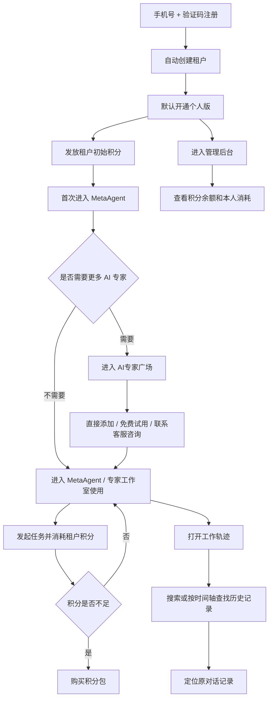

# Frontis AI · 完整 PRD V430

## 1. 文档说明

### 1.1 文档目标

本文档用于沉淀 Frontis AI `430` 版本当前迭代的产品设计，并与当前原型保持一致。

本次文档只覆盖当前迭代已经明确的核心变化，重点包括：

1. 个人用户自主注册
2. 注册即创建租户，但默认落在 `个人版`
3. `个人版 / 团队版` 的租户版本模型
4. 个人版注册送积分、积分消耗与积分包购买
5. AI 专家广场的 `我的 / 团队分享 / FrontisAI发布` 多来源模型
6. 个人版可见的 FrontisAI 发布 AI 专家，按 `直接添加 / 免费试用 / 联系客服` 承接
7. 平台运营对 AI 专家可见范围、试用规则、客服入口和二维码的配置
8. 团队版、席位和 AI 专家直接订阅购买作为底层能力保留，但不作为个人版一期主链路
9. 管理后台能力随租户版本变化
10. `MetaAgent` 一级菜单独立化
11. `MetaAgent` 单线程持续对话与 `工作轨迹`
12. 团队版管理后台新增 `组织管理 / 角色管理` 权限治理能力
13. 运营平台新增 `组织管理`，统一管理运营账号、运营角色和全平台预设角色

### 1.2 文档范围

**纳入范围**

- 用户侧：注册、登录、首次进入、MetaAgent、工作轨迹、专家工作室、AI专家广场直接添加/试用/联系客服
- 管理后台：租户总览、积分管理、积分购买、个人版/团队版能力差异展示、团队版组织管理、角色管理
- 平台侧：自注册开关、默认注册版本、注册赠送积分、积分包设置、商品中心、AI专家广场投放、客服配置、资源计量、运营账号与角色管理、全平台预设角色管理

### 1.3 当前版本核心范围

当前版本的最小闭环为：

1. 用户通过手机号 + 验证码完成自主注册。
2. 注册成功后，系统自动创建一个新的租户。
3. 新注册租户默认是 `个人版`，只有 1 个管理员席位，不具备组织管理和添加成员能力。
4. 系统向该租户发放初始积分。
5. 用户首次进入系统时，直接进入 `MetaAgent`；`AI专家广场`作为用户主动浏览和添加专家的入口。
6. 租户积分统一归属于租户，积分仅用于模型、第三方接口及 Agent / Skill 运行时消耗。
7. 个人版管理员可在管理后台查看积分、AI 专家与模型，但不展示租户总览和组织管理。
8. 个人版一期主转化为积分包购买和客服咨询，不把团队版开通作为主链路暴露。
9. 团队版、席位扩容和组织管理作为底层能力保留，面向已开通团队版租户或后续迭代开放。
10. 积分包购买统一走扫码支付原型链路。
11. 管理后台的积分消耗按 `本周 / 本月 / 全部` 做时间范围统计，第一层按使用人聚合展示，不默认展示逐条调用明细。
12. AI 专家广场承接两类供给：
    - `团队分享`：租户内部分享的 AI 专家
    - `FrontisAI发布`：平台运营的商品化 AI 专家
13. 个人版可见的 `FrontisAI发布` AI 专家按商品规则分为：
    - 免费可直接添加
    - 支持免费试用
    - 需要联系客服咨询
14. 个人版不直接展示 AI 专家包月、包季、包年订阅购买；付费或高客单专家通过「联系我们」承接。
15. 平台侧商品中心配置 AI 专家获取方式、试用规则、可见范围和客服入口；AI专家广场管理配置投放、分类和默认客服二维码。
16. `MetaAgent` 作为一级独立入口，采用单线程持续对话模式。
17. `MetaAgent` 可调度当前用户有权限的 AI 专家，不局限于已添加到工作台的 AI 专家。
18. 系统按自然日自动总结 MetaAgent 工作内容，生成工作轨迹标题、摘要、任务和成果归档。
19. 用户可通过 `工作轨迹` 搜索、筛选和按时间轴浏览历史工作记录，并定位到原始对话位置。
20. MetaAgent 右侧提供统一 `任务与成果` 面板，用户可在同一面板内切换任务和成果。
21. 用户可进入 `专家工作室` 使用其他 AI 专家的多 topic / 多会话能力。
22. 已添加到工作台的 AI 专家在开发者发布新版本后自动升级，用户不需要手动操作。
23. 团队版管理后台在 `组织管理` 下提供二级菜单 `角色管理`，用于查看平台预设角色、创建自定义角色并配置可下放权限。
24. 运营平台提供 `组织管理`，支持创建运营账号、维护运营角色，以及创建和编辑租户侧全平台预设角色。

### 1.4 本次迭代不纳入范围

以下内容在本次迭代中不展开：

1. 设备购买与订阅的用户侧链路
2. 个人版直接购买 AI 专家的订阅支付链路
3. 团队版开通和席位扩容在个人版一期的强引导链路
4. 团队版订单、积分订单与 AI 专家订单的统一订单中心
5. 多种积分余额类型
6. 积分收益分账
7. 复杂审批、预算审批或报销流

### 1.5 全局业务原则

1. **个人注册，本质上是自助创建租户。**
   个人用户注册后，不是获得一个“个人空间”，而是自动创建一个新的租户。
2. **新注册租户默认落在个人版。**
   个人版只服务单人使用，不开放组织管理和邀请成员。
3. **团队协作能力通过团队版开通。**
   只有开通团队版后，管理后台才具备组织管理、成员邀请和席位治理能力；但个人版一期不把团队版购买作为核心转化路径。
4. **团队版按年订阅购买。**
   团队版不是一次性权限开关，而是带有效期的年付套餐。
5. **团队版套餐决定基础席位。**
   团队版套餐本身包含固定席位数，席位不足后再按单席位年付价格扩容。
6. **积分属于租户，不属于个人。**
   430 当前版本不区分个人钱包和企业钱包，租户内所有成员共用一份积分余额。
7. **积分只用于运行时消耗。**
   包括大模型、第三方接口、集成到 Agent / Skill 中的外部工具调用。
8. **AI 专家广场区分 `团队分享` 和 `FrontisAI发布`。**
   团队分享是租户内共享能力；FrontisAI发布是平台商品化能力。
9. **个人版现金主链路先聚焦积分包，AI 专家付费需求由客服承接。**
   积分包走现金购买；免费/试用 AI 专家开通后消耗积分；高价值或定价不清晰的 AI 专家先通过「联系我们」沉淀线索和方案。
10. **MetaAgent 与其他 AI 专家是两种不同工作模式。**
   MetaAgent 是默认协同入口；专家工作室是其他 AI 专家的一对一使用入口。
11. **MetaAgent 的调度范围由权限决定，不由工作台快捷入口决定。**
    只要当前用户对某个 AI 专家具备有效使用权限，MetaAgent 就可以在任务编排中调度该专家；是否添加到工作台只影响用户是否有显式入口，不影响 MetaAgent 的可调度范围。
12. **MetaAgent 工作轨迹按自然日自动生成。**
    MetaAgent 不要求用户每次判断是否新建任务轨迹；系统每天基于当天对话、任务调用和成果产出自动总结生成工作轨迹标题与摘要，并把任务和成果挂到对应工作轨迹下。
13. **任务和成果是同一工作上下文的两类产出。**
    MetaAgent 右侧统一使用 `任务与成果` 面板承接任务列表和成果列表，任务与成果均按工作轨迹归档；点击任务或成果可定位到对应历史记录。
14. **AI 专家版本更新对已添加用户自动生效。**
    AI 专家开发者发布新版本后，已添加到工作台的用户自动升级到最新可用版本，不需要用户手动点击升级；历史工作记录仍保留当时使用的版本信息用于追溯。
15. **团队版兼容个人版能力。**
    团队版不是另一套后台体系，而是在个人版能力基础上增加组织、成员、席位和多人消耗统计维度。
16. **团队版才展示租户总览，并融合 AI 专家用量 Dashboard。**
    团队版企业管理员在租户总览中查看团队成员与 AI 专家的 tokens / 调用次数统计；个人版不展示租户总览，继续通过积分管理查看本人积分消耗统计。
17. **个人版看到的 AI 专家必须经过运营设计。**
    个人版不是平台所有 AI 专家的自然曝光面，运营需要通过可见范围控制哪些专家适合个人版、哪些只适合团队版或指定租户。
18. **角色权限分为租户侧授权和平台侧治理。**
    租户侧只能创建自定义角色并在平台允许的权限范围内授权；平台预设角色由运营平台维护，团队版租户侧只能查看，不允许编辑。

---

## 2. 系统总览

### 2.1 系统定位

430 版本的 Frontis AI 是一套支持用户自助注册、自助创建租户、按租户版本解锁能力、并通过统一积分运行 AI 的 SaaS 产品，当前由三个模块构成：

| 模块 | 系统定位 | 核心目标 |
|---|---|---|
| 用户侧 | 用户使用 AI 能力的统一入口 | 让用户完成注册、进入租户、发起协同、查找历史记录 |
| 管理后台 | 租户管理员治理后台 | 让管理员理解当前租户版本、管理积分、查看消耗、完成积分购买，并在团队版下管理组织与角色权限 |
| 平台侧 | 平台治理后台 | 让平台控制自注册、赠送积分、积分包、AI专家商品、投放范围、客服咨询承接、运营账号和全平台预设角色 |

### 2.2 系统主流程

### 2.3 角色分工

| 角色 | 所属模块 | 核心职责 |
|---|---|---|
| 普通用户 | 用户侧 | 注册、进入租户、使用 MetaAgent 与 AI 专家、消耗租户积分 |
| 个人版管理员 | 用户侧、管理后台 | 查看个人版租户状态、购买积分、查看本人消耗统计 |
| 团队版管理员 | 管理后台 | 管理组织、成员、席位和多人消耗统计，属于底层能力和后续扩展主链路 |
| 平台运营 | 平台侧 | 管理自注册策略、注册赠送积分、积分包、AI专家商品、投放范围和客服配置 |

---

## 3. 用户侧 PRD

### 3.1 系统定位

本次迭代中，用户侧需要同时解决三类问题：

1. 让任何用户都可以自助注册并直接开始使用。
2. 让新注册用户以 `个人版` 低门槛开始体验。
3. 让用户通过免费/试用专家完成首次价值体验，并通过积分消耗理解后续付费逻辑。
4. 让高价值或定价不清晰的 AI 专家需求进入客服咨询，而不是在个人版里直接定价售卖。

### 3.2 用户故事旅程

#### 3.2.1 新用户注册并进入个人版

1. 新用户进入注册页。
2. 通过手机号 + 验证码完成注册。
3. 系统自动创建一个新的租户。
4. 系统将当前用户设为该租户管理员。
5. 系统为该租户初始化 `个人版` 和一笔初始积分。
6. 用户首次进入系统时，直接进入 `MetaAgent`。
7. 用户可先在 `MetaAgent` 开始第一次任务；需要更多专家能力时，再主动进入 `AI专家广场` 浏览、试用或添加 AI 专家。
8. 首次任务结束后，用户能够理解：
   - 当前用的是租户积分
   - 当前租户版本是个人版
   - 免费/试用专家会消耗积分
   - 高价值专家可通过联系客服确认方案

#### 3.2.2 个人版管理员管理积分

1. 个人版管理员进入 `管理后台`。
2. 默认进入 `积分管理`，不展示 `租户总览`、组织管理和成员邀请。
3. 管理员看到当前积分余额、近期消耗和购买积分入口。
4. 管理员查看本人维度的积分消耗统计。
5. 当余额不足或预期不足时，点击 `购买积分`。
6. 系统打开积分购买弹窗，展示积分包、到账积分、支付金额和到账后余额。
7. 管理员扫码支付后，积分自动到账。
8. 管理员回到工作台后继续使用 MetaAgent 或 AI 专家。

#### 3.2.3 团队版与席位扩容底层能力

1. 团队版仍是统一租户模型下的版本能力，不另建一套后台。
2. 团队版开通后，管理后台展示组织管理、成员邀请、席位和多人积分消耗统计。
3. 席位不足时，团队版管理员可通过席位扩容增加席位。
4. 该能力服务团队协作和企业治理场景，不作为个人版一期的主转化链路。
5. 个人版一期界面可以弱化或隐藏团队版购买入口，避免分散“先试用、再充值积分/联系客服”的主目标。
6. 团队版管理员可在 `组织管理` 下进入二级菜单 `角色管理`，查看平台预设角色并创建自定义角色。
7. 组织管理员、部门负责人、普通成员为平台预设角色，租户侧不可编辑；租户管理员只能基于平台允许的权限清单创建和维护自定义角色。
8. 团队版租户在 `租户总览` 中融合展示团队 AI 专家用量 Dashboard；统计口径包括团队总 tokens、调用次数、使用成员数、使用 AI 专家数。
9. 团队 AI 专家用量 Dashboard 使用顶部唯一时间范围控件，统一控制总览指标、企业 Tokens 消耗趋势、成员用量排行和 AI 专家消耗排行。
10. Dashboard 一级看板排行默认展示 Top 5，完整成员用量和 AI 专家调用数据进入二级明细页查看。
11. AI 专家开发分布按 AI 专家资产的开发者归属统计，一级看板展示开发数量 Top 5；管理员可进入开发明细查看每个开发者的 AI 专家数量和对应 AI 专家列表，该统计不受用量时间范围控制。
12. 个人版不展示 `租户总览` 和团队 tokens 用量 Dashboard，仍通过 `积分管理` 查看积分余额、本人消耗和订单。

#### 3.2.4 租户管理员购买积分包

1. 租户管理员在工作台头像浮窗或管理后台 `积分管理` 页看到当前积分余额。
2. 当余额不足或接近阈值时，管理员点击 `购买积分`。
3. 系统打开积分购买弹窗，默认提供三档积分包：
   - 基础积分包 `5,000 积分 / ¥29`
   - 标准积分包 `20,000 积分 / ¥99`
   - 增长积分包 `60,000 积分 / ¥249`
4. 管理员选择一档积分包后，系统展示订单摘要：
   - 当前积分余额
   - 到账积分
   - 支付金额
   - 到账后余额
   - 当前租户
5. 管理员进入统一扫码支付页，扫码后自动完成支付。
6. 支付成功后，系统自动：
   - 为当前租户增加对应积分
   - 写入一条积分到账流水
7. 管理员返回后台后，继续查看积分余额、积分消耗统计和订单记录。

#### 3.2.5 AI专家广场浏览与获取 FrontisAI发布 AI 专家

1. 用户默认进入 `MetaAgent` 后，可通过菜单主动进入 `AI专家广场` 浏览和获取更多 AI 专家。
2. 个人版用户只看到“我的”和运营投放给个人版的 `FrontisAI发布` 专家，不展示团队分享。
3. 团队版用户的 AI 专家广场中同时存在两类来源：
   - `团队分享`
   - `FrontisAI发布`
4. 用户浏览 `团队分享` 时，只看到当前租户内部可直接使用的 AI 专家。
5. 用户浏览 `FrontisAI发布` 时，看到平台运营设计后投放的 AI 专家。
6. 个人版可见的 FrontisAI 发布商品按售卖规则分为三类：
   - 免费可直接添加到工作台
   - 支持免费试用
   - 联系客服
7. 免费商品点击后直接添加到工作台，系统同步为当前租户开通权益，不再要求用户先领取再二次添加。
8. 试用商品按平台配置的试用天数或次数开通，试用过程消耗租户积分。
9. 联系客服商品不展示价格和订阅方案，用户点击后弹出客服二维码。
10. 客服弹窗只承担“添加客服联系方式和备注咨询对象”的目标，不展示个人版、价格、套餐等无关信息。
11. 客服二维码优先读取商品专属配置；未配置时读取平台默认客服配置。

#### 3.2.6 租户成员日常使用

1. 用户进入某个租户后，通过 `MetaAgent`、`专家工作室` 或 AI 专家发起任务。
2. 系统在任务发起前或任务过程中校验当前租户积分是否足够。
3. 如果积分足够，系统执行任务，并按实际运行消耗扣减租户积分。
4. 如果积分不足：
   - 普通成员提示联系管理员购买积分
   - 租户管理员直接获得购买积分入口
5. 用户能够看到本次消耗结果和当前余额反馈。

#### 3.2.7 MetaAgent 默认协同与工作轨迹

1. 用户进入工作台后，默认直接进入 `MetaAgent`。
2. `MetaAgent` 在菜单层独立存在，不再放在 AI 专家列表中。
3. `MetaAgent` 采用单线程持续对话模式，不展示 `新对话` 和历史会话列表。
4. `MetaAgent` 的可调度范围是当前用户有权限使用的 AI 专家，不要求该 AI 专家已经添加到工作台。
5. 工作台中的 AI 专家入口是用户主动打开专家工作室的快捷入口，不作为 MetaAgent 调度范围判断依据。
6. 用户围绕同一条工作线程持续补充需求、上传资料并查看协同结果。
7. MetaAgent 对话过程中每一次被调度的 AI 专家执行都沉淀为任务，任务记录归属于当天工作轨迹。
8. 系统按自然日自动总结当天工作内容，生成工作轨迹标题和摘要；不要求用户手动创建或判断新轨迹。
9. 当用户需要查找以前某次工作记录时，打开 `工作轨迹`。
10. 如果用户知道时间范围，可通过时间下拉直接筛选。
11. 如果用户记得工作内容、AI 专家或成果文件，可直接搜索。
12. 点击任意工作记录卡片后，打开工作轨迹详情；详情内通过 `任务 / 成果` 切换查看当日任务和成果。
13. 点击详情中的任务或成果后，系统定位到对应原始对话位置。
14. MetaAgent 右侧提供 `任务与成果` 面板，点击入口后展开侧边面板。
15. `任务与成果` 面板内通过 `任务 / 成果` Tab 切换：
    - 任务按工作轨迹分组展示，默认只展开最新工作轨迹分组。
    - 成果按工作轨迹标题分组展示，默认只展开最新工作轨迹分组，历史分组默认收起。
16. 成果分组只使用工作轨迹标题作为上下文，不重复展示日期、任务数等与成果本身无关的信息。

### 3.3 功能列表

| 功能模块 | 一级功能 | 二级功能 | 功能描述 | 优先级 |
|---|---|---|---|---|
| 注册与登录 | 自主注册 | 手机号 + 验证码注册 | 用户通过手机号 + 验证码自主完成注册，不再依赖人工开账号。 | P0 |
| 注册与登录 | 租户创建 | 注册即创建租户 | 注册成功后系统自动创建一个新的租户，并将当前用户设为租户管理员。 | P0 |
| 注册与登录 | 默认版本 | 个人版初始化 | 新注册租户默认开通个人版，只有 1 个管理员席位，不开放组织管理。 | P0 |
| 注册与登录 | 首次进入 | 默认进入 MetaAgent | 注册成功并首次进入系统时，直接进入 `MetaAgent`；`AI专家广场`作为用户主动浏览和添加专家的入口。 | P0 |
| AI专家广场 | 来源分类 | 我的 / 团队分享 / FrontisAI发布 | 个人版只展示我的和 FrontisAI发布；团队版可展示团队分享。 | P0 |
| AI专家广场 | 可见范围 | 个人版可见控制 | 平台运营必须能够控制哪些 FrontisAI发布专家对个人版可见，避免把大 B 定制或重交付专家直接暴露给个人用户。 | P0 |
| AI专家广场 | 获取方式 | 直接添加 / 试用 / 联系客服 | 个人版可见的 FrontisAI 发布 AI 专家支持直接添加到工作台、免费试用和联系客服三种获取方式。 | P0 |
| AI专家广场 | 版本升级 | 已添加专家自动升级 | AI 专家开发者发布新版本后，已添加到工作台的用户自动升级到最新可用版本，不需要手动操作。 | P0 |
| AI专家广场 | 联系客服 | 客服二维码弹窗 | 需要咨询的专家不展示价格，点击后打开客服二维码，用户扫码添加客服确认使用方案。 | P0 |
| AI专家广场 | 试用 | 试用规则 | 支持试用的商品可配置试用天数或次数，试用过程按运行消耗扣减租户积分。 | P0 |
| MetaAgent | 入口结构 | 一级菜单独立化 | `MetaAgent` 作为一级独立菜单存在，不归属于 AI 专家列表体系。 | P0 |
| MetaAgent | 布局结构 | 去除专家侧栏和切换下拉 | `MetaAgent` 页面不展示左侧 AI 专家侧栏，也不提供专家切换下拉。 | P0 |
| MetaAgent | 会话管理 | 单线程持续对话 | `MetaAgent` 不提供 `新对话`，也不展示历史会话列表，所有消息沉淀在同一条工作线程中。 | P0 |
| MetaAgent | 调度范围 | 按权限调度 AI 专家 | `MetaAgent` 可调度当前用户有权限的 AI 专家，不局限于用户已添加到工作台的 AI 专家。 | P0 |
| MetaAgent | 任务沉淀 | Agent 调用即任务 | MetaAgent 对话过程中每一次被调度的 AI 专家执行都沉淀为任务，并归属到当天工作轨迹。 | P0 |
| MetaAgent | 任务与成果面板 | 统一侧边面板 | 右侧通过 `任务与成果` 入口打开统一面板，面板内用 `任务 / 成果` Tab 切换，不把任务和成果拆成多个入口。 | P0 |
| 工作轨迹 | 入口 | 浮窗入口 | `工作轨迹` 通过浮窗形式打开，不进入新页面。 | P0 |
| 工作轨迹 | 生成逻辑 | 按自然日自动总结 | 系统每天自动总结 MetaAgent 工作内容，生成工作轨迹标题、摘要、任务列表和成果列表，不要求用户手动创建轨迹。 | P0 |
| 工作轨迹 | 搜索 | 统一搜索框 | 支持按时间、工作内容、AI 专家、成果文件查找历史记录。 | P0 |
| 工作轨迹 | 时间筛选 | 时间下拉 | 时间筛选通过下拉交互承接，选项包括 `今天 / 最近一周 / 最近一个月 / 最近三个月 / 自定义范围`。 | P0 |
| 工作轨迹 | 浏览 | 时间轴浏览 | 搜索框为空时，默认按时间轴浏览历史记录。左侧为时间轴，右侧为当前时间段下的记录卡片。 | P0 |
| 工作轨迹 | 详情查看 | 任务 / 成果切换 | 点击工作轨迹记录后进入详情层，详情内通过 `任务 / 成果` Tab 查看对应内容，并支持定位到原始对话。 | P0 |
| 成果管理 | 轨迹归档 | 按工作轨迹分组成果 | MetaAgent 成果列表按工作轨迹标题分组，默认展开最新分组，历史分组默认收起；搜索时展开命中的分组。 | P0 |
| 积分使用 | 租户积分 | 统一积分余额 | 用户在租户内使用系统时，共用当前租户的统一积分余额。 | P0 |
| 积分购买 | 购买入口 | 双入口触发 | 租户管理员可从工作台头像浮窗和管理后台积分页发起购买积分。 | P0 |
| 积分购买 | 积分包选择 | 三档积分包 | 当前版本提供基础、标准、增长三档积分包供管理员选择。 | P0 |
| 积分购买 | 支付方式 | 统一扫码支付 | 积分包统一通过扫码支付完成到账。 | P0 |
| 团队版本 | 版本状态 | 个人版/团队版能力差异 | 管理后台按版本控制租户总览、组织管理、成员邀请和多人积分消耗统计；个人版默认进入积分管理。 | P0 |
| 租户总览 | 展示门槛 | 团队版可见 | 只有团队版管理员展示租户总览入口；个人版不展示租户总览。 | P0 |
| 租户总览 | 团队用量 Dashboard | 团队 AI 专家用量总览 | 团队版展示，按 tokens、调用次数、使用成员和使用 AI 专家汇总团队用量。 | P0 |
| 租户总览 | 团队用量 Dashboard | 统一时间范围 | 顶部 `本周 / 本月 / 全部` 统一控制总览指标、企业 Tokens 消耗趋势、成员用量排行和 AI 专家消耗排行；AI 专家开发分布不受用量时间范围控制。 | P0 |
| 租户总览 | 团队用量 Dashboard | Top 5 与明细 | 一级看板成员用量排行、AI 专家消耗排行和 AI 专家开发分布默认展示 Top 5；成员、AI 专家调用和开发者全量数据进入二级明细页查看。 | P0 |
| 租户总览 | 团队用量 Dashboard | AI 专家开发明细 | 按 AI 专家资产开发者聚合展示开发数量，明细页展示每个开发者、AI 专家数量和对应 AI 专家列表。 | P0 |
| 租户总览 | 团队用量 Dashboard | 个人版隐藏规则 | 个人版不展示租户总览和团队 tokens 用量，继续在积分管理查看本人积分消耗统计。 | P0 |
| 团队版本 | 版本升级 | 开通团队版 | 团队版购买作为底层能力保留，个人版一期可弱化或隐藏入口，不作为主转化链路。 | P1 |
| 席位扩容 | 扩容入口 | 组织管理内扩容 | 只有团队版管理员才能在组织管理中扩容席位。 | P1 |
| 角色管理 | 入口结构 | 组织管理二级菜单 | 团队版管理后台在组织管理下提供 `角色管理` 二级菜单，进入角色与权限治理页面。 | P0 |
| 角色管理 | 平台预设角色 | 组织管理员 / 部门负责人 / 普通成员 | 预设角色由平台统一维护，租户侧只读展示，不允许编辑。 | P0 |
| 角色管理 | 自定义角色 | 创建与编辑自定义角色 | 组织管理员可创建自定义角色，配置角色名称、生效范围和权限项。 | P0 |
| 角色管理 | 权限范围 | 用户侧可下放权限清单 | 可配置权限按工作台、组织成员、角色权限、AI 专家、模型与设备、积分与统计分组展示。 | P0 |
| 专家工作室 | 结构边界 | 与 MetaAgent 分离 | `专家工作室` 与 `MetaAgent` 在菜单层和使用逻辑上明确分离。 | P0 |

### 3.4 核心业务逻辑梳理

#### 3.4.1 租户版本逻辑

1. 每个租户在 430 当前版本只有两种版本状态：
   - 个人版
   - 团队版
2. 新注册租户默认是个人版。
3. 个人版只能服务单人使用。
4. 团队版才具备组织管理、成员邀请和席位治理能力。
5. 个人版升级团队版后，当前租户不变，只是版本能力变化。
6. 个人版一期不把升级团队版作为首要转化动作，首要转化动作是购买积分包和联系客服。
7. 团队版才展示 `组织管理 / 角色管理`，个人版不展示角色治理入口。

#### 3.4.2 角色权限逻辑

1. 租户侧平台预设角色包括：
   - 组织管理员
   - 部门负责人
   - 普通成员
2. 预设角色用于保证团队版租户开通后的基础权限模型稳定，租户侧不可编辑和删除。
3. 组织管理员可以创建自定义角色，并在平台允许的权限清单内配置授权范围。
4. 自定义角色的生效范围至少包括：
   - 全租户
   - 所属部门
   - 指定成员
5. 租户侧可下放权限分为：
   - 工作台：使用 MetaAgent、使用专家工作室、查看本人轨迹、查看本人成果
   - 组织成员：查看组织架构、管理部门、邀请成员、编辑成员、成员启停、移除成员、席位管理
   - 角色权限：查看角色、管理自定义角色、分配成员角色
   - AI 专家：查看 AI 专家、开通 AI 专家、专家授权、团队分享管理
   - 模型与设备：查看模型配置、编辑模型配置、查看设备、管理设备
   - 积分与统计：查看积分、购买积分、查看订单、本人统计、部门统计、全租户统计
6. 权限配置页面采用左侧角色列表、右侧详情矩阵的结构，权限状态以开启/关闭展示。

#### 3.4.3 席位逻辑

1. 个人版默认只有 1 个管理员席位。
2. 团队版套餐本身带固定席位数。
3. 团队版席位不足后，可继续按单席位价格扩容。
4. 席位控制“当前最多可有多少成员”，与积分无关。

#### 3.4.4 积分逻辑

1. 430 当前版本只有一个统一积分余额，不区分充值积分和赠送积分余额类型。
2. 该积分余额归属于租户，由租户内所有成员共同使用。
3. 积分只用于：
   - 大模型调用
   - 第三方接口调用
   - 集成到 Agent / Skill 中的外部工具调用
4. 积分不用于购买团队版、席位、AI 专家或设备。
5. 积分在个人版中承担“使用成本感知”作用，用户通过赠送积分完成试用，通过积分余额和消耗理解后续充值逻辑。

#### 3.4.5 AI专家广场商品逻辑

1. AI 专家广场同时承接 `团队分享` 和 `FrontisAI发布` 两类供给。
2. `团队分享` 是租户内部共享能力，不涉及商品化购买。
3. `FrontisAI发布` 是平台商品化能力，只有平台侧配置为在售且对当前租户可见的商品才会出现在广场。
4. `FrontisAI发布` AI 专家必须支持按个人版、团队版、指定租户做可见范围控制。
5. 个人版可见的 `FrontisAI发布` AI 专家根据商品规则分为：
   - 免费可直接添加到工作台
   - 支持试用
   - 联系客服
6. 免费和试用专家开通后按运行消耗扣减租户积分。
7. 联系客服专家不在个人版展示包月、包季、包年价格，点击后展示平台默认或商品专属客服二维码。
8. AI 专家直接订阅购买可作为团队版或后续商业化能力保留，不进入个人版一期主链路。
9. 用户点击直接添加或试用后，系统建立当前用户 / 租户对该 AI 专家的使用权限，并可在工作台生成快捷入口。
10. `添加到工作台` 只代表用户侧显式入口和快捷访问，不代表 MetaAgent 的调度权限边界。
11. AI 专家开发者发布新版本后，已添加到工作台的用户自动升级到最新可用版本；用户不需要手动确认升级。
12. 历史对话、成果和工作轨迹需要保留当时使用的 AI 专家版本号，用于问题追溯和效果复盘。

---

## 4. 管理后台 PRD

### 4.1 系统定位

本次迭代中，管理后台统一作为租户管理员后台，核心目标是：

1. 让管理员快速理解当前租户状态。
2. 让个人版管理员管理积分余额、积分购买和本人消耗。
3. 让团队版管理员管理组织、成员、席位与角色权限。
4. 通过版本能力差异避免个人版看到不应出现的租户总览、组织治理和团队用量能力。

### 4.2 用户旅程

#### 4.2.1 个人版管理员查看积分

1. 个人版管理员进入 `管理后台`。
2. 默认进入 `积分管理`。
3. 页面展示当前积分余额、近期消耗、本人使用概况和购买积分入口。
4. 页面不展示 `租户总览`、组织管理和成员邀请入口。
5. 团队版升级入口可作为弱提示或后续能力保留，不作为个人版一期主操作。

#### 4.2.2 团队版管理员邀请成员并扩容席位

1. 团队版管理员进入 `组织管理`。
2. 查看当前已用席位 / 总席位。
3. 当席位充足时，可直接邀请成员。
4. 当席位不足时，先点击 `扩容席位`。
5. 扩容成功后，再邀请成员。

#### 4.2.3 团队版管理员配置角色权限

1. 团队版管理员进入 `组织管理`。
2. 点击二级菜单 `角色管理`。
3. 页面左侧展示角色列表，默认包括：
   - 组织管理员
   - 部门负责人
   - 普通成员
4. 管理员点击预设角色后，可查看角色生效范围、权限矩阵和已分配成员；预设角色不可编辑。
5. 管理员创建角色时，填写角色名称、生效范围，并在权限清单中勾选可下放权限。
6. 保存后，新角色进入角色列表，并可用于后续成员分配。

#### 4.2.4 管理员查看积分消耗统计

1. 管理员进入 `积分管理`。
2. 切换到 `积分消耗`。
3. 选择时间范围：
   - 本周
   - 本月
   - 全部
4. 系统按当前时间范围汇总消耗数据，而不是默认展示逐条调用流水。
5. 个人版下，列表只展示当前管理员本人一行，重点展示本人消耗积分、使用次数、主要消耗来源和最近使用时间。
6. 团队版下，列表按使用人聚合展示成员消耗排行，帮助管理员判断谁消耗最多、是否存在异常使用。
7. 管理员点击某个使用人后，再查看该使用人的能力构成和少量最近明细。

#### 4.2.5 管理员购买积分

1. 管理员进入 `积分管理`。
2. 查看当前积分余额和当前时间范围内的消耗情况。
3. 当余额不足时，点击 `购买积分`。
4. 选择积分包并扫码支付。
5. 支付成功后，积分自动到账。
6. 管理员可在 `订单管理` 中查看对应积分购买订单。

### 4.3 功能列表

| 功能模块 | 一级功能 | 二级功能 | 功能描述 | 优先级 |
|---|---|---|---|---|
| 租户总览 | 展示门槛 | 团队版可见 | 只有团队版管理员才展示租户总览入口；个人版默认进入积分管理。 | P0 |
| 租户总览 | 团队用量 | AI 专家用量 Dashboard | 团队版展示，融合在租户总览中，按 tokens 和调用次数展示总览图表、企业 Tokens 消耗趋势、成员用量排行、AI 专家消耗排行和 AI 专家开发分布。 | P0 |
| 租户总览 | 团队用量 | 统一时间范围 | 顶部 `本周 / 本月 / 全部` 控件统一控制用量总览指标、趋势图和消耗排行图表；趋势图不再单独提供时间维度切换，AI 专家开发分布不参与时间范围联动。 | P0 |
| 租户总览 | 团队用量 | Top 5 与明细 | 一级看板成员用量排行、AI 专家消耗排行和 AI 专家开发分布默认展示 Top 5；完整数据进入二级明细页。 | P0 |
| 租户总览 | 团队用量 | AI 专家开发明细 | 管理员可查看每个开发者开发的 AI 专家数量，以及该开发者对应的 AI 专家列表。 | P0 |
| 租户总览 | 团队用量 | 个人版隐藏 | 个人版不展示租户总览和团队 tokens 统计，只保留积分管理中的本人积分消耗统计。 | P0 |
| 团队版本 | 版本购买 | 开通团队版 | 作为底层能力和后续转化入口保留，个人版一期可弱化或隐藏。 | P1 |
| 积分管理 | 余额查看 | 当前积分余额 | 查看当前租户可用积分余额。 | P0 |
| 积分管理 | 时间范围 | 本周 / 本月 / 全部 | 管理员按时间范围查看积分消耗统计，避免直接暴露大量调用明细。 | P0 |
| 积分管理 | 消耗统计 | 使用人聚合 | 按使用人汇总消耗积分、使用次数、占比、主要来源和最近使用时间。 | P0 |
| 积分管理 | 个人版适配 | 本人消耗概览 | 个人版只有本人一行，重点展示本人消耗和来源构成。 | P0 |
| 积分管理 | 团队版适配 | 成员消耗排行 | 团队版按成员列出消耗排行，辅助管理员发现高消耗成员。 | P0 |
| 积分管理 | 消耗详情 | 使用人详情 | 点击使用人后查看该成员按能力类型聚合的消耗和少量最近明细。 | P0 |
| 积分管理 | 积分购买 | 积分包选择与扫码支付 | 管理员通过现金方式购买积分包，并统一通过扫码支付完成到账。 | P0 |
| 积分管理 | 订单管理 | 积分购买订单 | 查看积分包购买订单和订单详情。 | P0 |
| 组织管理 | 能力门槛 | 团队版解锁 | 只有团队版才出现组织管理入口。 | P0 |
| 组织管理 | 成员管理 | 邀请成员 | 团队版管理员邀请其他账号加入当前租户。 | P1 |
| 组织管理 | 席位管理 | 已用席位 / 总席位查看 | 管理员查看当前团队版席位使用情况。 | P1 |
| 组织管理 | 席位管理 | 单席位扩容 | 席位不足时按单席位价格发起扩容支付。 | P1 |
| 角色管理 | 入口结构 | 组织管理二级菜单 | 在组织管理菜单下增加 `角色管理` 二级入口，点击后进入角色权限页面。 | P0 |
| 角色管理 | 平台预设角色 | 预设角色只读 | `组织管理员`、`部门负责人`、`普通成员` 为平台预设角色，团队版租户侧不可编辑。 | P0 |
| 角色管理 | 自定义角色 | 创建角色 | 组织管理员可创建自定义角色，配置名称、生效范围和权限项。 | P0 |
| 角色管理 | 权限矩阵 | 权限查看 | 按权限分组展示当前角色开启/关闭状态，避免权限项横向撑开页面。 | P0 |

### 4.4 关键业务规则

1. 管理后台统一定义为 `管理后台`，不再限定为“企业管理后台”。
2. 个人版和团队版共用同一套后台入口，但可见能力不同。
3. 个人版不展示租户总览和组织管理入口，管理后台默认落到积分管理。
4. 团队版才展示组织管理入口，并允许邀请成员。
5. 团队版按年订阅购买，席位扩容也按年计费；但不作为个人版一期主链路。
6. 席位和积分都归属于租户，但两者是两种不同资源。
7. 积分消耗的第一层视图是统计，不是调用流水。
8. 个人版和团队版共用同一套积分消耗统计结构；个人版天然只有一个使用人，团队版按成员聚合排行。
9. 团队版才展示租户总览和角色管理入口；个人版不展示租户总览、组织管理和角色管理。
10. 租户侧平台预设角色不可编辑，自定义角色可由组织管理员创建和编辑。
11. 租户侧可配置权限必须受平台预设权限清单约束，不能自行新增权限项。

### 4.5 页面清单

| 页面 | 页面目标 | 核心内容 |
|---|---|---|
| 租户总览 | 让团队版管理员快速查看团队 AI 专家使用与建设结构 | 团队 Tokens、调用次数、使用成员、使用 AI 专家、Tokens 趋势、成员用量 Top 5、AI 专家消耗 Top 5、AI 专家开发分布 Top 5，以及成员用量、专家调用和开发者全量明细入口；个人版不展示 |
| 团队版购买弹窗 | 完成团队版开通 | 套餐选择、席位数、订阅周期、订单摘要、扫码支付；个人版一期非主链路 |
| 积分管理页 | 管理积分 | 当前余额、时间范围筛选、按使用人聚合的积分消耗、订单管理、购买积分 |
| 积分购买弹窗 | 完成积分包购买 | 积分包选择、订单摘要、扫码支付 |
| 组织管理页 | 管理团队成员与席位 | 部门结构、成员列表、席位情况、邀请成员、扩容席位 |
| 角色管理页 | 管理团队角色与权限 | 平台预设角色、自定义角色、权限矩阵、成员列表、角色创建/编辑弹窗 |
| 席位扩容弹窗 | 完成按席位扩容 | 当前席位、扩容数量、单席位价格、扫码支付 |

---

## 5. 平台侧 PRD

### 5.1 系统定位

本次迭代中，平台侧需要管理四类核心配置：

1. 是否开放个人自注册，以及注册后默认是什么版本。
2. 注册赠送积分、邀请奖励和积分包商品配置。
3. FrontisAI 发布 AI 专家的获取方式、试用规则、可见范围和客服入口。
4. 默认客服二维码、商品专属客服二维码和咨询备注模板。
5. 团队版套餐、单席位价格、订单与资源池作为底层能力保留。
6. 运营账号、运营角色和租户侧平台预设角色的统一治理。

### 5.2 用户旅程

#### 5.2.1 平台配置默认注册策略

1. 平台运营进入平台侧。
2. 配置：
   - 是否开放个人注册
   - 默认注册版本：个人版
   - 默认赠送积分
3. 保存后，新注册租户按该策略初始化。

#### 5.2.2 平台配置积分包

1. 平台运营进入 `积分包设置`。
2. 查看当前在售积分包。
3. 调整积分数量、价格、推荐标记和上下架状态。
4. 保存后，用户侧和管理后台购买入口同步读取最新配置。

#### 5.2.3 平台配置 FrontisAI 发布 AI 专家商品

1. 平台运营进入 `商品中心`。
2. 查看当前 FrontisAI 发布商品。
3. 当商品供给类型为 AI 专家时，可配置：
   - 商品名称
   - 获取方式：直接添加 / 免费试用 / 联系客服 / 后续订阅购买
   - 是否支持试用
   - 试用时长
   - 是否展示联系客服
   - 使用平台默认客服或商品专属客服
   - 在售状态
4. 保存后，用户侧 AI 专家广场同步读取最新商品规则。
5. AI 专家开发者发布新版本后，系统将最新可用版本同步给已添加到工作台的用户；用户侧不出现手动升级动作。
6. 平台需要保留 AI 专家版本记录，确保历史对话、成果和工作轨迹可追溯到当时调用的专家版本。

#### 5.2.4 平台配置 AI 专家广场投放与客服

1. 平台运营进入 `AI专家广场管理`。
2. 在 `投放管理` 中配置商品是否上架、广场分类和可见范围。
3. 可见范围至少支持：
   - 全平台可见
   - 个人版可见
   - 团队版可见
   - 指定租户可见
4. 在 `分类管理` 中维护用户侧广场分类。
5. 在 `客服配置` 中维护平台默认客服名称、二维码内容和默认备注提示。
6. 商品未配置专属客服时，用户侧「联系我们」弹窗读取平台默认客服配置。

#### 5.2.5 平台维护团队版、订单与资源底层能力

1. 平台运营可配置团队套餐、单席位价格。
2. 平台运营进入 `订单与开通`，查看当前商品订单和开通记录。
3. 当商品涉及资源交付时，可查看资源池、分配目标和交付状态。
4. 平台运营进入 `资源池`，维护：
   - 实体设备池
   - 云端工作站池
   - 第三方接口池
5. 资源分配和开通结果会回写到订单与开通记录中。

#### 5.2.6 平台维护运营组织与预设角色

1. 平台运营进入 `组织管理`。
2. 查看并创建运营账号，为运营账号分配运营角色。
3. 查看平台运营角色，创建自定义运营角色并配置运营后台权限。
4. 查看、创建和编辑租户侧全平台预设角色。
5. 平台预设角色用于控制团队版租户侧默认可见的角色模板和权限范围，保存后影响后续租户侧角色管理的预设基础。

### 5.3 功能列表

| 功能模块 | 一级功能 | 二级功能 | 功能描述 | 优先级 |
|---|---|---|---|---|
| 注册治理 | 默认策略 | 开放个人注册 | 配置平台是否允许个人手机号自助注册。 | P0 |
| 注册治理 | 默认策略 | 默认注册版本 | 配置新注册租户默认落在个人版。 | P0 |
| 注册治理 | 默认策略 | 默认赠送积分 | 配置新注册租户的初始积分。 | P0 |
| 积分包治理 | 商品配置 | 积分包列表 | 配置积分包名称、积分数量、价格、状态和推荐标记。 | P0 |
| AI专家商品治理 | 商品中心 | FrontisAI 发布商品 | 配置 AI 专家商品的获取方式、试用规则、联系客服入口和在售状态。 | P0 |
| AI专家商品治理 | 版本发布 | 已添加用户自动升级 | AI 专家开发者发布新版本后，已添加到工作台的用户自动使用最新可用版本，并保留历史调用版本用于追溯。 | P0 |
| AI专家广场治理 | 投放管理 | 可见范围 | 配置 AI 专家是否对个人版、团队版、全平台或指定租户可见。 | P0 |
| AI专家广场治理 | 客服配置 | 默认客服二维码 | 配置平台默认客服名称、二维码内容和备注模板。 | P0 |
| 团队套餐治理 | 套餐配置 | 团队套餐列表 | 配置团队版套餐名称、席位数、年付价格和推荐标记，作为底层能力保留。 | P1 |
| 团队套餐治理 | 单价配置 | 单席位价格 | 配置团队版扩容时的单席位年付价格。 | P1 |
| AI专家商品治理 | 订单与开通 | 商品开通记录 | 查看 AI 专家商品对应的订单与开通状态。 | P1 |
| AI专家商品治理 | 资源池 | 供给资源维护 | 维护实体设备、云端工作站和第三方接口资源池。 | P1 |
| 运营组织管理 | 入口结构 | 组织管理菜单 | 运营平台新增 `组织管理` 一级菜单，承接运营账号、运营角色和平台预设角色管理。 | P0 |
| 运营组织管理 | 运营账号 | 创建运营账号 | 在 `运营账号` Tab 内创建运营账号，并分配运营角色。 | P0 |
| 运营组织管理 | 运营角色 | 创建与编辑运营角色 | 在 `运营角色` Tab 内维护平台运营角色和运营后台权限。 | P0 |
| 运营组织管理 | 平台预设角色 | 创建与编辑预设角色 | 在 `平台预设角色` Tab 内创建、编辑租户侧全平台预设角色。 | P0 |

### 5.4 页面清单

| 页面 | 页面目标 | 核心内容 |
|---|---|---|
| 注册策略页 | 管理自注册默认规则 | 自注册开关、默认版本、默认赠送积分 |
| 积分包设置页 | 管理积分包商品 | 积分数量、价格、推荐标记、上下架 |
| 商品中心页 | 管理 FrontisAI 发布商品 | 商品名称、获取方式、试用规则、联系客服入口、在售状态 |
| AI专家广场管理页 | 管理用户侧广场投放 | 投放管理、分类管理、客服配置 |
| 团队套餐设置页 | 管理团队版商品 | 套餐名称、席位数、年付价格、推荐标记、单席位价格 |
| 订单与开通页 | 查看商品开通状态 | 商品订单、开通状态、资源池、分配目标、有效期 |
| 资源池页 | 管理供给资源 | 资源池类型、供应商、容量、分配方式、剩余容量 |
| 组织管理页 | 管理运营组织与平台预设角色 | 运营账号、运营角色、平台预设角色、权限矩阵、角色创建/编辑弹窗 |

---

## 6. 本次迭代结论

430 版本当前迭代的核心，不再是“注册即默认多人租户”，而是：

1. 用户注册后先落到个人版，用最低门槛开始使用。
2. 注册赠送积分让用户能够完成首次任务，同时感知“使用会消耗积分”。
3. 个人版 AI 专家广场必须是运营设计后的精选曝光，不把所有平台专家直接展示给用户。
4. FrontisAI 发布 AI 专家在个人版按直接添加、免费试用、联系客服三类动作承接。
5. 高价值或定价不清晰的 AI 专家不在个人版直接售卖，统一进入客服咨询。
6. 个人版现金主链路先聚焦积分包购买，团队版开通和 AI 专家订阅购买作为底层或后续能力保留。
7. MetaAgent 继续承担默认工作入口，工作轨迹负责历史查找与定位。

一句话概括：

**430 版本要把 Frontis AI 做成“个人先注册、送积分先试用、用完能充值、高价值专家找客服”的最小产品闭环，而不是一上来把团队版购买和 AI 专家复杂定价都推给个人用户。**
