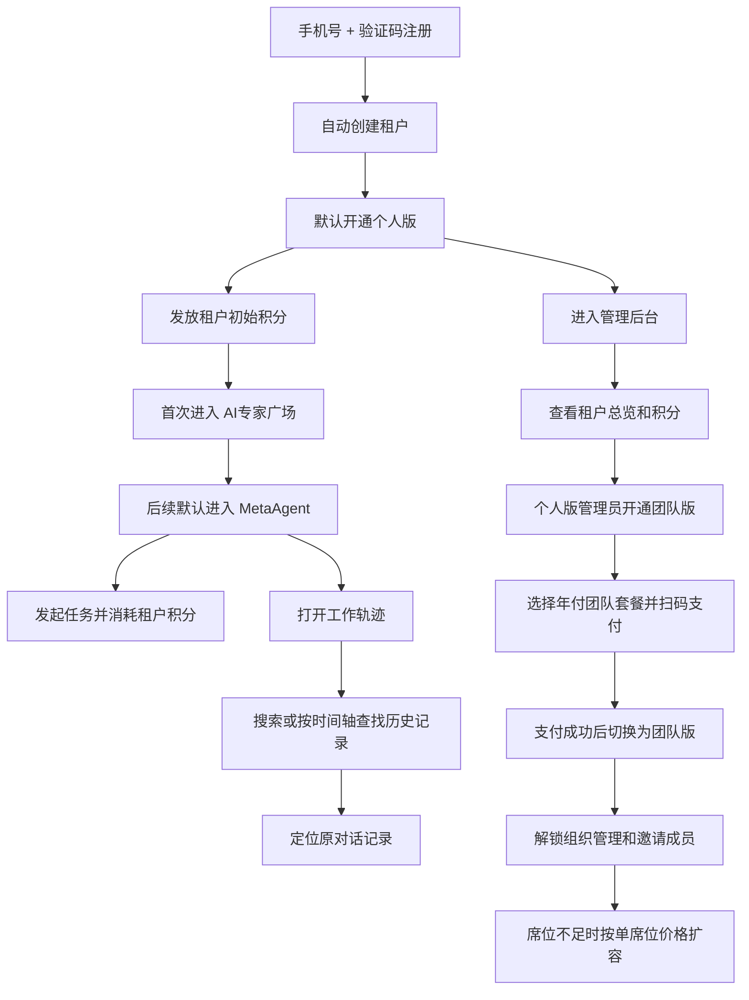

# Frontis AI · 完整 PRD V430

## 1. 文档说明

### 1.1 文档目标

本文档用于沉淀 Frontis AI `430` 版本当前迭代的产品设计，并与当前原型保持一致。

本次文档只覆盖当前迭代已经明确的核心变化，重点包括：

1. 个人用户自主注册
2. 注册即创建租户，但默认落在 `个人版`
3. `个人版 / 团队版` 的租户版本模型
4. 团队版按年订阅购买与席位扩容
5. 租户积分体系与积分包购买
6. AI 专家广场的 `团队分享 / FrontisAI发布` 双来源模型
7. FrontisAI 发布 AI 专家的免费、试用与现金购买链路
8. 运营平台的商品中心、订单与开通、资源池
9. 管理后台能力随租户版本变化
10. `MetaAgent` 一级菜单独立化
11. `MetaAgent` 单线程持续对话与 `工作轨迹`

### 1.2 文档范围

**纳入范围**

- 用户侧：注册、登录、首次进入、MetaAgent、工作轨迹、专家工作室、AI专家广场购买/试用
- 管理后台：租户总览、团队版本开通、席位扩容、积分管理、组织管理
- 平台侧：自注册开关、默认注册版本、团队套餐设置、席位单价设置、积分包设置、商品中心、订单与开通、资源池、AI专家广场管理

### 1.3 当前版本核心范围

当前版本的最小闭环为：

1. 用户通过手机号 + 验证码完成自主注册。
2. 注册成功后，系统自动创建一个新的租户。
3. 新注册租户默认是 `个人版`，只有 1 个管理员席位，不具备组织管理和添加成员能力。
4. 系统向该租户发放初始积分。
5. 用户首次进入系统时，引导至 `AI专家广场`；后续登录默认进入 `MetaAgent`。
6. 租户积分统一归属于租户，积分仅用于模型、第三方接口及 Agent / Skill 运行时消耗。
7. 个人版管理员可在管理后台查看租户概览、积分、AI 专家与模型，但不能进行组织管理。
8. 个人版管理员可在管理后台开通 `团队版`，团队版通过年付套餐购买。
9. 团队版套餐包含基础席位数；开通成功后，管理后台解锁 `组织管理` 与 `邀请成员` 能力。
10. 团队版管理员可在 `组织管理` 中按单席位年付价格扩容席位。
11. 积分包购买、团队版开通、席位扩容均统一走扫码支付原型链路。
12. 管理后台的积分消耗按 `本周 / 本月 / 全部` 做时间范围统计，第一层按使用人聚合展示，不默认展示逐条调用明细。
13. AI 专家广场承接两类供给：
    - `团队分享`：租户内部分享的 AI 专家
    - `FrontisAI发布`：平台运营的商品化 AI 专家
14. `FrontisAI发布` AI 专家按商品规则分为：
    - 免费可直接添加
    - 支持试用后再购买
    - 直接付费购买
15. `FrontisAI发布` AI 专家购买统一走现金扫码支付，不走积分。
16. 平台侧商品中心配置 AI 专家商品价格、试用规则和可见范围；订单与开通、资源池承接开通与交付。
17. `MetaAgent` 作为一级独立入口，采用单线程持续对话模式。
18. 用户可通过 `工作轨迹` 搜索、筛选和按时间轴浏览历史工作记录，并定位到原始对话位置。
19. 用户可进入 `专家工作室` 使用其他 AI 专家的多 topic / 多会话能力。

### 1.4 本次迭代不纳入范围

以下内容在本次迭代中不展开：

1. 设备购买与订阅的用户侧链路
2. 团队版订单、积分订单与 AI 专家订单的统一订单中心
3. 多种积分余额类型
4. 积分收益分账
5. 复杂审批、预算审批或报销流

### 1.5 全局业务原则

1. **个人注册，本质上是自助创建租户。**
   个人用户注册后，不是获得一个“个人空间”，而是自动创建一个新的租户。
2. **新注册租户默认落在个人版。**
   个人版只服务单人使用，不开放组织管理和邀请成员。
3. **团队协作能力通过团队版开通。**
   只有开通团队版后，管理后台才具备组织管理、成员邀请和席位治理能力。
4. **团队版按年订阅购买。**
   团队版不是一次性权限开关，而是带有效期的年付套餐。
5. **团队版套餐决定基础席位。**
   团队版套餐本身包含固定席位数，席位不足后再按单席位年付价格扩容。
6. **积分属于租户，不属于个人。**
   430 当前版本不区分个人钱包和企业钱包，租户内所有成员共用一份积分余额。
7. **积分只用于运行时消耗。**
   包括大模型、第三方接口、集成到 Agent / Skill 中的外部工具调用。
8. **AI 专家广场区分 `团队分享` 和 `FrontisAI发布`。**
   团队分享是租户内共享能力；FrontisAI发布是平台商品化能力。
9. **现金买版本、席位、积分包与资产资格，积分买运行消耗。**
   团队版、席位、积分包、AI 专家、设备等均走现金购买；运行消耗走积分。
10. **MetaAgent 与其他 AI 专家是两种不同工作模式。**
   MetaAgent 是默认协同入口；专家工作室是其他 AI 专家的一对一使用入口。
11. **团队版兼容个人版能力。**
    团队版不是另一套后台体系，而是在个人版能力基础上增加组织、成员、席位和多人消耗统计维度。

---

## 2. 系统总览

### 2.1 系统定位

430 版本的 Frontis AI 是一套支持用户自助注册、自助创建租户、按租户版本解锁能力、并通过统一积分运行 AI 的 SaaS 产品，当前由三个模块构成：

| 模块 | 系统定位 | 核心目标 |
|---|---|---|
| 用户侧 | 用户使用 AI 能力的统一入口 | 让用户完成注册、进入租户、发起协同、查找历史记录 |
| 管理后台 | 租户管理员治理后台 | 让管理员管理租户版本、席位、积分、组织与成员 |
| 平台侧 | 平台治理后台 | 让平台控制自注册、默认版本、团队套餐、席位单价和积分包 |

### 2.2 系统主流程

### 2.3 角色分工

| 角色 | 所属模块 | 核心职责 |
|---|---|---|
| 普通用户 | 用户侧 | 注册、进入租户、使用 MetaAgent 与 AI 专家、消耗租户积分 |
| 租户管理员 | 用户侧、管理后台 | 管理租户版本、席位、积分、组织与成员 |
| 平台运营 | 平台侧 | 管理自注册策略、默认注册版本、团队套餐、席位单价、积分包与相关订单策略 |

---

## 3. 用户侧 PRD

### 3.1 系统定位

本次迭代中，用户侧需要同时解决三类问题：

1. 让任何用户都可以自助注册并直接开始使用。
2. 让新注册用户以 `个人版` 低门槛开始体验。
3. 让有协作需求的用户可以从个人版升级为团队版。

### 3.2 用户故事旅程

#### 3.2.1 新用户注册并进入个人版

1. 新用户进入注册页。
2. 通过手机号 + 验证码完成注册。
3. 系统自动创建一个新的租户。
4. 系统将当前用户设为该租户管理员。
5. 系统为该租户初始化 `个人版` 和一笔初始积分。
6. 用户首次进入系统时，引导至 `AI专家广场`。
7. 用户挑选 AI 专家体验，或返回 `MetaAgent` 开始第一次任务。
8. 首次任务结束后，用户能够理解：
   - 当前用的是租户积分
   - 当前租户版本是个人版
   - 如需协作可在管理后台开通团队版

#### 3.2.2 个人版管理员开通团队版

1. 个人版管理员进入 `管理后台`。
2. 在 `租户总览` 看到当前版本为 `个人版`，以及团队版入口。
3. 点击 `开通团队版`。
4. 系统打开团队版购买弹窗，展示可选团队套餐。
5. 当前版本至少提供两档年付团队套餐：
   - 团队 5 席版
   - 团队 20 席版
6. 管理员选择一个团队套餐后，系统展示订单摘要：
   - 当前版本
   - 套餐名称
   - 包含席位数
   - 订阅周期：按年
   - 支付金额
7. 管理员进入统一扫码支付页。
8. 支付成功后，系统自动：
   - 将当前租户切换为团队版
   - 写入团队套餐与有效期
   - 更新总席位数
   - 解锁组织管理能力
9. 管理员返回后台后，可以看到 `组织管理` 已出现。

#### 3.2.3 团队版管理员扩容席位

1. 团队版管理员进入 `组织管理`。
2. 查看当前已用席位 / 总席位。
3. 如果需要新增成员，但当前席位不足，管理员点击 `扩容席位`。
4. 系统打开席位扩容弹窗。
5. 管理员选择需要购买的席位数。
6. 系统按单席位年付价格计算订单金额，并展示：
   - 当前总席位
   - 新增席位数
   - 扩容后总席位
   - 单席位价格
   - 支付金额
7. 管理员扫码支付。
8. 支付成功后，系统自动更新总席位数。
9. 管理员继续邀请成员加入租户。

#### 3.2.4 租户管理员购买积分包

1. 租户管理员在工作台头像浮窗或管理后台 `积分管理` 页看到当前积分余额。
2. 当余额不足或接近阈值时，管理员点击 `购买积分`。
3. 系统打开积分购买弹窗，默认提供三档积分包：
   - 基础积分包 `5,000 积分 / ¥29`
   - 标准积分包 `20,000 积分 / ¥99`
   - 增长积分包 `60,000 积分 / ¥249`
4. 管理员选择一档积分包后，系统展示订单摘要：
   - 当前积分余额
   - 到账积分
   - 支付金额
   - 到账后余额
   - 当前租户
5. 管理员进入统一扫码支付页，扫码后自动完成支付。
6. 支付成功后，系统自动：
   - 为当前租户增加对应积分
   - 写入一条积分到账流水
7. 管理员返回后台后，继续查看积分余额、积分消耗统计和订单记录。

#### 3.2.5 AI专家广场浏览与获取 FrontisAI发布 AI 专家

1. 用户首次进入系统时，默认先进入 `AI专家广场`。
2. AI 专家广场中同时存在两类来源：
   - `团队分享`
   - `FrontisAI发布`
3. 用户浏览 `团队分享` 时，只看到当前租户内部可直接使用的 AI 专家。
4. 用户浏览 `FrontisAI发布` 时，看到平台商品化 AI 专家。
5. FrontisAI 发布商品按售卖规则分为三类：
   - 免费可直接领取
   - 支持免费试用
   - 直接付费购买
6. 用户侧任何成员都可直接对 `FrontisAI发布` 商品执行领取、试用或购买。
7. 对付费商品，系统打开购买弹窗，展示：
   - 商品名称
   - 订阅方案
   - 包月 / 包季 / 包年价格
   - 试用规则
   - 订单摘要
8. 用户选择包月、包季或包年方案后，进入统一扫码支付。
9. 支付成功后，系统自动完成支付成功处理并开通当前租户。
10. 支持试用的商品在试用开通后会记录试用有效期，到期前用户可继续转正式购买。
11. 免费商品、试用商品和已购买商品在广场中都可直接添加到工作台使用。

#### 3.2.6 租户成员日常使用

1. 用户进入某个租户后，通过 `MetaAgent`、`专家工作室` 或 AI 专家发起任务。
2. 系统在任务发起前或任务过程中校验当前租户积分是否足够。
3. 如果积分足够，系统执行任务，并按实际运行消耗扣减租户积分。
4. 如果积分不足：
   - 普通成员提示联系管理员购买积分
   - 租户管理员直接获得购买积分入口
5. 用户能够看到本次消耗结果和当前余额反馈。

#### 3.2.7 MetaAgent 默认协同与工作轨迹

1. 用户进入工作台后，默认直接进入 `MetaAgent`。
2. `MetaAgent` 在菜单层独立存在，不再放在 AI 专家列表中。
3. `MetaAgent` 采用单线程持续对话模式，不展示 `新对话` 和历史会话列表。
4. 用户围绕同一条工作线程持续补充需求、上传资料并查看协同结果。
5. 当用户需要查找以前某次工作记录时，打开 `工作轨迹`。
6. 如果用户知道时间范围，可通过时间下拉直接筛选。
7. 如果用户记得工作内容、AI 专家或成果文件，可直接搜索。
8. 点击任意工作记录卡片后，系统定位到对应原始对话位置。

### 3.3 功能列表

| 功能模块 | 一级功能 | 二级功能 | 功能描述 | 优先级 |
|---|---|---|---|---|
| 注册与登录 | 自主注册 | 手机号 + 验证码注册 | 用户通过手机号 + 验证码自主完成注册，不再依赖人工开账号。 | P0 |
| 注册与登录 | 租户创建 | 注册即创建租户 | 注册成功后系统自动创建一个新的租户，并将当前用户设为租户管理员。 | P0 |
| 注册与登录 | 默认版本 | 个人版初始化 | 新注册租户默认开通个人版，只有 1 个管理员席位，不开放组织管理。 | P0 |
| 注册与登录 | 首次进入 | 首次引导到 AI专家广场 | 首次进入系统时，引导用户先去 `AI专家广场` 体验；后续登录默认进入 `MetaAgent`。 | P0 |
| AI专家广场 | 来源分类 | 团队分享 / FrontisAI发布 | AI 专家广场统一承接租户内部分享和平台商品化 AI 专家。 | P0 |
| AI专家广场 | 获取方式 | 免费 / 试用 / 购买 | FrontisAI 发布 AI 专家支持免费领取、试用和付费购买三种获取方式。 | P0 |
| AI专家广场 | 订阅方案 | 包月 / 包季 / 包年 | 付费 AI 专家支持按月、季度、年三档订阅方案购买。 | P0 |
| AI专家广场 | 购买方式 | 现金扫码支付 | FrontisAI 发布 AI 专家购买统一走现金扫码支付，不使用积分。 | P0 |
| AI专家广场 | 试用 | 试用后可转购买 | 支持试用的商品可先开通试用，再由用户转正式购买。 | P0 |
| MetaAgent | 入口结构 | 一级菜单独立化 | `MetaAgent` 作为一级独立菜单存在，不归属于 AI 专家列表体系。 | P0 |
| MetaAgent | 布局结构 | 去除专家侧栏和切换下拉 | `MetaAgent` 页面不展示左侧 AI 专家侧栏，也不提供专家切换下拉。 | P0 |
| MetaAgent | 会话管理 | 单线程持续对话 | `MetaAgent` 不提供 `新对话`，也不展示历史会话列表，所有消息沉淀在同一条工作线程中。 | P0 |
| 工作轨迹 | 入口 | 浮窗入口 | `工作轨迹` 通过浮窗形式打开，不进入新页面。 | P0 |
| 工作轨迹 | 搜索 | 统一搜索框 | 支持按时间、工作内容、AI 专家、成果文件查找历史记录。 | P0 |
| 工作轨迹 | 时间筛选 | 时间下拉 | 时间筛选通过下拉交互承接，选项包括 `今天 / 最近一周 / 最近一个月 / 最近三个月 / 自定义范围`。 | P0 |
| 工作轨迹 | 浏览 | 时间轴浏览 | 搜索框为空时，默认按时间轴浏览历史记录。左侧为时间轴，右侧为当前时间段下的记录卡片。 | P0 |
| 积分使用 | 租户积分 | 统一积分余额 | 用户在租户内使用系统时，共用当前租户的统一积分余额。 | P0 |
| 积分购买 | 购买入口 | 双入口触发 | 租户管理员可从工作台头像浮窗和管理后台积分页发起购买积分。 | P0 |
| 积分购买 | 积分包选择 | 三档积分包 | 当前版本提供基础、标准、增长三档积分包供管理员选择。 | P0 |
| 积分购买 | 支付方式 | 统一扫码支付 | 积分包统一通过扫码支付完成到账。 | P0 |
| 团队版本 | 版本升级 | 开通团队版 | 个人版管理员可从管理后台直接购买年付团队套餐，升级为团队版。 | P0 |
| 团队版本 | 套餐定义 | 团队席位套餐 | 团队版套餐包含固定席位数，当前版本支持 5 席版和 20 席版。 | P0 |
| 团队版本 | 购买方式 | 年付扫码支付 | 团队版按年订阅，统一通过扫码支付完成开通。 | P0 |
| 团队版本 | 解锁能力 | 组织管理解锁 | 团队版开通成功后，管理后台出现组织管理和邀请成员能力。 | P0 |
| 席位扩容 | 扩容入口 | 组织管理内扩容 | 只有团队版管理员才能在组织管理中扩容席位。 | P0 |
| 席位扩容 | 计费方式 | 单席位年付 | 席位扩容按单个席位的年付价格计算订单金额。 | P0 |
| 专家工作室 | 结构边界 | 与 MetaAgent 分离 | `专家工作室` 与 `MetaAgent` 在菜单层和使用逻辑上明确分离。 | P0 |

### 3.4 核心业务逻辑梳理

#### 3.4.1 租户版本逻辑

1. 每个租户在 430 当前版本只有两种版本状态：
   - 个人版
   - 团队版
2. 新注册租户默认是个人版。
3. 个人版只能服务单人使用。
4. 团队版才具备组织管理、成员邀请和席位治理能力。
5. 个人版升级团队版后，当前租户不变，只是版本能力变化。

#### 3.4.2 席位逻辑

1. 个人版默认只有 1 个管理员席位。
2. 团队版套餐本身带固定席位数。
3. 团队版席位不足后，可继续按单席位价格扩容。
4. 席位控制“当前最多可有多少成员”，与积分无关。

#### 3.4.3 积分逻辑

1. 430 当前版本只有一个统一积分余额，不区分充值积分和赠送积分余额类型。
2. 该积分余额归属于租户，由租户内所有成员共同使用。
3. 积分只用于：
   - 大模型调用
   - 第三方接口调用
   - 集成到 Agent / Skill 中的外部工具调用
4. 积分不用于购买团队版、席位、AI 专家或设备。

#### 3.4.4 AI专家广场商品逻辑

1. AI 专家广场同时承接 `团队分享` 和 `FrontisAI发布` 两类供给。
2. `团队分享` 是租户内部共享能力，不涉及商品化购买。
3. `FrontisAI发布` 是平台商品化能力，只有平台侧配置为在售且对当前租户可见的商品才会出现在广场。
4. `FrontisAI发布` AI 专家根据商品规则分为：
   - 免费可直接领取
   - 支持试用
   - 付费购买
5. 付费 AI 专家可配置为包月、包季、包年三种订阅方案，并按所选方案计费。
6. AI 专家购买统一走现金扫码支付，不占用积分。
7. AI 专家试用成功后会记录试用有效期；到期前可转正式购买。

---

## 4. 管理后台 PRD

### 4.1 系统定位

本次迭代中，管理后台统一作为租户管理员后台，核心目标是：

1. 让管理员快速理解当前租户状态。
2. 让个人版管理员能直接完成团队版开通。
3. 让团队版管理员管理组织、成员与席位。
4. 让管理员管理积分和积分消耗。

### 4.2 用户旅程

#### 4.2.1 个人版管理员开通团队版

1. 管理员进入 `租户总览`。
2. 看到当前版本为个人版。
3. 点击 `开通团队版`。
4. 选择团队套餐并扫码支付。
5. 支付成功后，系统切换租户为团队版。
6. 管理员返回后台后，可以进入 `组织管理`。

#### 4.2.2 团队版管理员邀请成员并扩容席位

1. 团队版管理员进入 `组织管理`。
2. 查看当前已用席位 / 总席位。
3. 当席位充足时，可直接邀请成员。
4. 当席位不足时，先点击 `扩容席位`。
5. 扩容成功后，再邀请成员。

#### 4.2.3 管理员查看积分消耗统计

1. 管理员进入 `积分管理`。
2. 切换到 `积分消耗`。
3. 选择时间范围：
   - 本周
   - 本月
   - 全部
4. 系统按当前时间范围汇总消耗数据，而不是默认展示逐条调用流水。
5. 个人版下，列表只展示当前管理员本人一行，重点展示本人消耗积分、使用次数、主要消耗来源和最近使用时间。
6. 团队版下，列表按使用人聚合展示成员消耗排行，帮助管理员判断谁消耗最多、是否存在异常使用。
7. 管理员点击某个使用人后，再查看该使用人的能力构成和少量最近明细。

#### 4.2.4 管理员购买积分

1. 管理员进入 `积分管理`。
2. 查看当前积分余额和当前时间范围内的消耗情况。
3. 当余额不足时，点击 `购买积分`。
4. 选择积分包并扫码支付。
5. 支付成功后，积分自动到账。
6. 管理员可在 `订单管理` 中查看对应积分购买订单。

### 4.3 功能列表

| 功能模块 | 一级功能 | 二级功能 | 功能描述 | 优先级 |
|---|---|---|---|---|
| 租户总览 | 版本管理 | 个人版状态 | 展示当前租户是否为个人版，并提供开通团队版入口。 | P0 |
| 租户总览 | 版本管理 | 团队版状态 | 展示当前团队套餐、包含席位数和有效期。 | P0 |
| 租户总览 | 版本购买 | 开通团队版 | 个人版管理员选择团队套餐并扫码支付。 | P0 |
| 积分管理 | 余额查看 | 当前积分余额 | 查看当前租户可用积分余额。 | P0 |
| 积分管理 | 时间范围 | 本周 / 本月 / 全部 | 管理员按时间范围查看积分消耗统计，避免直接暴露大量调用明细。 | P0 |
| 积分管理 | 消耗统计 | 使用人聚合 | 按使用人汇总消耗积分、使用次数、占比、主要来源和最近使用时间。 | P0 |
| 积分管理 | 个人版适配 | 本人消耗概览 | 个人版只有本人一行，重点展示本人消耗和来源构成。 | P0 |
| 积分管理 | 团队版适配 | 成员消耗排行 | 团队版按成员列出消耗排行，辅助管理员发现高消耗成员。 | P0 |
| 积分管理 | 消耗详情 | 使用人详情 | 点击使用人后查看该成员按能力类型聚合的消耗和少量最近明细。 | P0 |
| 积分管理 | 积分购买 | 积分包选择与扫码支付 | 管理员通过现金方式购买积分包，并统一通过扫码支付完成到账。 | P0 |
| 积分管理 | 订单管理 | 积分购买订单 | 查看积分包购买订单和订单详情。 | P0 |
| 组织管理 | 能力门槛 | 团队版解锁 | 只有团队版才出现组织管理入口。 | P0 |
| 组织管理 | 成员管理 | 邀请成员 | 团队版管理员邀请其他账号加入当前租户。 | P0 |
| 组织管理 | 席位管理 | 已用席位 / 总席位查看 | 管理员查看当前团队版席位使用情况。 | P0 |
| 组织管理 | 席位管理 | 单席位扩容 | 席位不足时按单席位价格发起扩容支付。 | P0 |

### 4.4 关键业务规则

1. 管理后台统一定义为 `管理后台`，不再限定为“企业管理后台”。
2. 个人版和团队版共用同一套后台入口，但可见能力不同。
3. 个人版不展示组织管理入口。
4. 团队版才展示组织管理入口，并允许邀请成员。
5. 团队版按年订阅购买，席位扩容也按年计费。
6. 席位和积分都归属于租户，但两者是两种不同资源。
7. 积分消耗的第一层视图是统计，不是调用流水。
8. 个人版和团队版共用同一套积分消耗统计结构；个人版天然只有一个使用人，团队版按成员聚合排行。

### 4.5 页面清单

| 页面 | 页面目标 | 核心内容 |
|---|---|---|
| 租户总览 | 让管理员快速理解当前租户状态 | 当前版本、团队套餐入口、积分余额、席位情况、近期消耗 |
| 团队版购买弹窗 | 完成团队版开通 | 套餐选择、席位数、订阅周期、订单摘要、扫码支付 |
| 积分管理页 | 管理积分 | 当前余额、时间范围筛选、按使用人聚合的积分消耗、订单管理、购买积分 |
| 积分购买弹窗 | 完成积分包购买 | 积分包选择、订单摘要、扫码支付 |
| 组织管理页 | 管理团队成员与席位 | 部门结构、成员列表、席位情况、邀请成员、扩容席位 |
| 席位扩容弹窗 | 完成按席位扩容 | 当前席位、扩容数量、单席位价格、扫码支付 |

---

## 5. 平台侧 PRD

### 5.1 系统定位

本次迭代中，平台侧需要管理四类核心配置：

1. 是否开放个人自注册，以及注册后默认是什么版本。
2. 团队版套餐和单席位价格。
3. 积分包商品配置。
4. FrontisAI 发布 AI 专家的商品、订单与开通、资源池。

### 5.2 用户旅程

#### 5.2.1 平台配置默认注册策略

1. 平台运营进入平台侧。
2. 配置：
   - 是否开放个人注册
   - 默认注册版本：个人版
   - 默认赠送积分
3. 保存后，新注册租户按该策略初始化。

#### 5.2.2 平台配置团队版套餐

1. 平台运营进入 `团队套餐设置`。
2. 查看当前在售团队套餐。
3. 调整套餐名称、包含席位数、年付价格和推荐标记。
4. 调整单席位年付价格。
5. 保存后，管理后台和用户侧购买弹窗同步读取最新配置。

#### 5.2.3 平台配置积分包

1. 平台运营进入 `积分包设置`。
2. 查看当前在售积分包。
3. 调整积分数量、价格、推荐标记和上下架状态。
4. 保存后，用户侧和管理后台购买入口同步读取最新配置。

#### 5.2.4 平台配置 FrontisAI 发布 AI 专家商品

1. 平台运营进入 `商品中心`。
2. 查看当前 FrontisAI 发布商品。
3. 当商品供给类型为 AI 专家时，可配置：
   - 商品名称
   - 包月 / 包季 / 包年价格
   - 是否支持试用
   - 试用时长
   - 在售状态
4. 保存后，用户侧 AI 专家广场同步读取最新商品规则。

#### 5.2.5 平台查看订单与开通并维护资源池

1. 平台运营进入 `订单与开通`。
2. 查看当前商品订单和开通记录。
3. 当商品涉及资源交付时，可查看资源池、分配目标和交付状态。
4. 平台运营进入 `资源池`，维护：
   - 实体设备池
   - 云端工作站池
   - 第三方接口池
5. 资源分配和开通结果会回写到订单与开通记录中。

### 5.3 功能列表

| 功能模块 | 一级功能 | 二级功能 | 功能描述 | 优先级 |
|---|---|---|---|---|
| 注册治理 | 默认策略 | 开放个人注册 | 配置平台是否允许个人手机号自助注册。 | P0 |
| 注册治理 | 默认策略 | 默认注册版本 | 配置新注册租户默认落在个人版。 | P0 |
| 注册治理 | 默认策略 | 默认赠送积分 | 配置新注册租户的初始积分。 | P0 |
| 团队套餐治理 | 套餐配置 | 团队套餐列表 | 配置团队版套餐名称、席位数、年付价格和推荐标记。 | P0 |
| 团队套餐治理 | 单价配置 | 单席位价格 | 配置团队版扩容时的单席位年付价格。 | P0 |
| 积分包治理 | 商品配置 | 积分包列表 | 配置积分包名称、积分数量、价格、状态和推荐标记。 | P0 |
| AI专家商品治理 | 商品中心 | FrontisAI 发布商品 | 配置 AI 专家商品的包月、包季、包年价格、试用规则和在售状态。 | P0 |
| AI专家商品治理 | 订单与开通 | 商品开通记录 | 查看 AI 专家商品对应的订单与开通状态。 | P0 |
| AI专家商品治理 | 资源池 | 供给资源维护 | 维护实体设备、云端工作站和第三方接口资源池。 | P0 |

### 5.4 页面清单

| 页面 | 页面目标 | 核心内容 |
|---|---|---|
| 注册策略页 | 管理自注册默认规则 | 自注册开关、默认版本、默认赠送积分 |
| 团队套餐设置页 | 管理团队版商品 | 套餐名称、席位数、年付价格、推荐标记、单席位价格 |
| 积分包设置页 | 管理积分包商品 | 积分数量、价格、推荐标记、上下架 |
| 商品中心页 | 管理 FrontisAI 发布商品 | 商品名称、包月/包季/包年价格、试用规则、在售状态 |
| 订单与开通页 | 查看商品开通状态 | 商品订单、开通状态、资源池、分配目标、有效期 |
| 资源池页 | 管理供给资源 | 资源池类型、供应商、容量、分配方式、剩余容量 |

---

## 6. 本次迭代结论

430 版本当前迭代的核心，不再是“注册即默认多人租户”，而是：

1. 用户注册后先落到个人版，用最低门槛开始使用。
2. 当用户产生协作需求时，再通过购买团队版开通组织能力。
3. AI 专家广场同时承接 `团队分享` 和 `FrontisAI发布` 两类供给。
4. FrontisAI 发布 AI 专家按商品规则提供免费、试用或付费购买。
5. 团队版、席位和 AI 专家都走现金购买逻辑。
6. 租户积分始终只承接运行消耗，不承接版本、席位或 AI 专家购买。
7. MetaAgent 继续承担默认工作入口，工作轨迹负责历史查找与定位。

一句话概括：

**430 版本要把 Frontis AI 做成“先个人体验，再按团队协作升级”的产品，而不是一上来就给所有新租户多人管理能力。**
