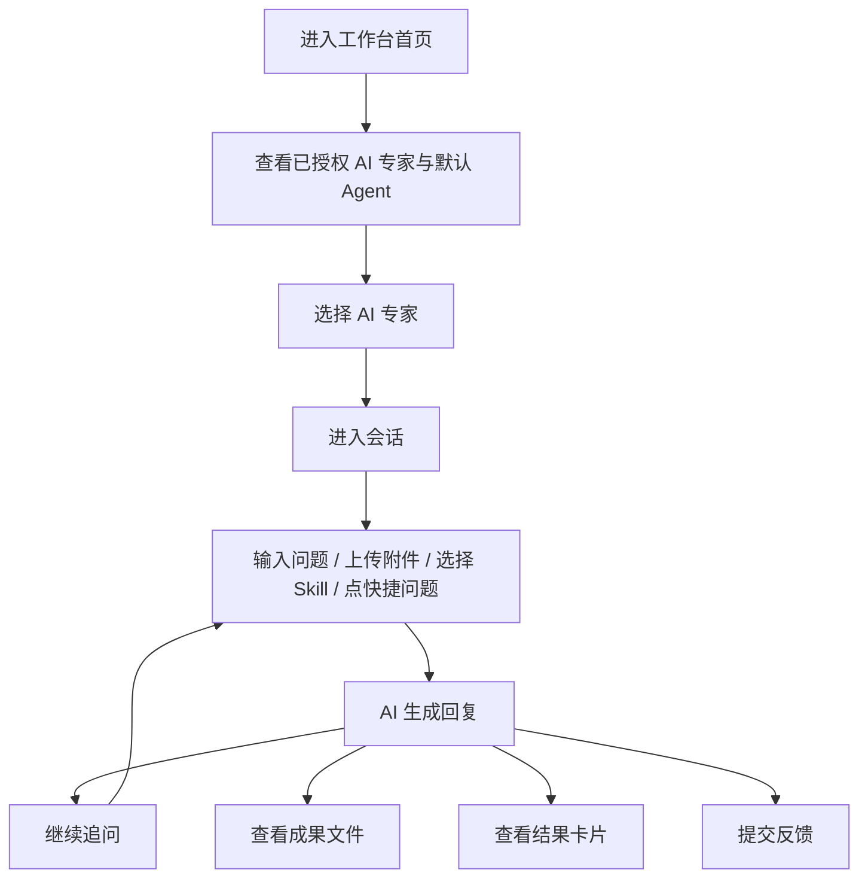
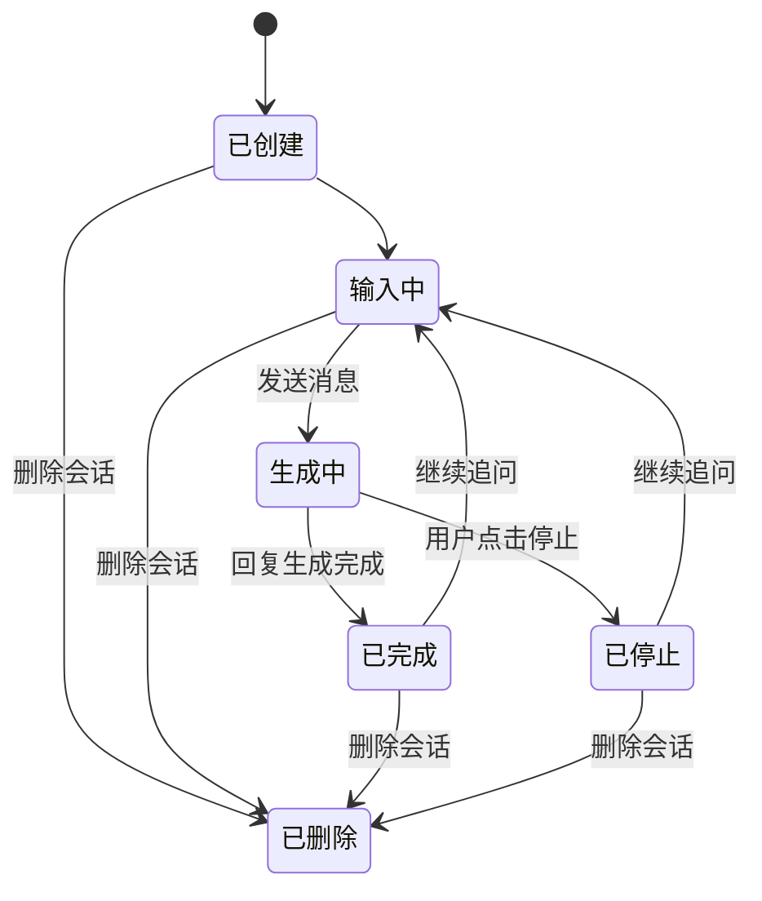
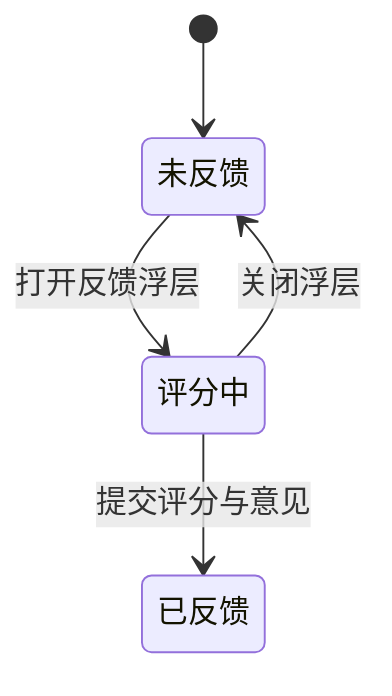

# Frontis AI · 工作台 PRD

## 1. 文档说明

### 1.1 文档目标

本文档用于沉淀 Frontis AI 用户工作台的正式产品设计，聚焦企业内部成员如何查看已授权 AI 专家、发起会话、查看成果，并围绕设备默认 Agent 完成日常协作。

### 1.2 文档范围

**纳入范围**

- 工作台首页
- AI 专家卡片与默认 Agent
- 对话主界面
- 成果面板与结果面板
- 历史会话与消息反馈

**不纳入范围**

- 企业管理后台配置流程
- FDE 订单、交付和资产管理
- AI 专家底层运行机制与模型实现细节

### 1.3 上下游关系

1. 上游依赖企业管理后台完成 AI 专家授权、设备分配和权限配置。
2. 工作台只展示当前账号已被授权且当前可用的 AI 专家，以及按设备自动生成的默认 Agent。
3. 工作台输出的成果和结果属于使用侧产物，不承担后台配置职责。

## 2. 系统定位

用户工作台是企业内部成员使用 AI 专家的统一入口，核心目标是：

1. 让员工快速找到当前可用、适合处理当前问题的 AI 专家。
2. 让用户通过自然语言、附件和 Skill 选择发起任务。
3. 让 AI 输出沉淀为可再利用的成果文件和结构化结果。
4. 通过反馈和历史会话回顾，持续优化后续协作效率。

## 3. 用户角色与用户故事旅程

### 3.1 普通员工旅程

1. 员工进入工作台首页，看到已授权 AI 专家和按已分配设备自动生成的默认 Agent。
2. 员工通过专家卡片理解职责、状态、推荐问题和典型案例。
3. 员工进入某个 AI 专家的对话页，通过输入问题、上传附件、选择 Skill 或点击快捷问题发起任务。
4. AI 回复后，员工继续追问、停止生成、查看成果文件、查看结果卡片并对回复打分反馈。
5. 员工可在同一 AI 专家下切换历史会话，回顾之前的工作记录。

### 3.2 企业管理员 / 企业老板在工作台中的旅程

1. 企业管理员和企业老板也可直接使用工作台里的 AI 专家。
2. 他们在工作台中的交互体验与普通员工一致。
3. 右上角账户菜单提供返回企业管理后台入口，便于在使用与配置之间快速切换。

## 4. 功能列表

| 功能模块 | 一级功能 | 二级功能 | 功能描述 | 优先级 |
|---|---|---|---|---|
| 工作台首页 | AI 专家展示 | 专家卡片列表 | 首页按卡片方式展示当前账号已被授权使用的 AI 专家，以及按已分配设备自动生成的默认 Agent，用户可基于专家名称、职责描述和当前状态快速判断谁更适合处理当前问题，并直接进入对应专家工作台。 | P0 |
| 工作台首页 | AI 专家展示 | 设备默认 Agent | 当账号被分配设备后，系统按设备自动生成对应默认 Agent；用户有几台设备就看到几个默认 Agent，每个默认 Agent 对应一台设备上下文。 | P0 |
| 工作台首页 | AI 专家展示 | 专家状态标识 | 每张专家卡片明确展示在线、运行中、异常、离线 4 种状态，帮助用户形成服务可用性预期。 | P1 |
| 工作台首页 | 快速引导 | 预置快捷问题 | 在专家首页展示该专家最典型的推荐问题，帮助首次使用用户快速理解可处理范围，并直接进入对话。 | P1 |
| 工作台首页 | 快速引导 | 案例回放 | 提供案例回放能力，让用户先看到一个完整的任务处理示例，降低首次使用门槛。 | P2 |
| 对话主界面 | 会话管理 | 新建会话 / 历史会话 | 用户可围绕同一个 AI 专家创建多条独立会话，并在历史会话列表中按时间快速切换和回看。 | P0 |
| 对话主界面 | 会话管理 | 重命名 / 删除会话 | 用户可重命名重要会话，也可删除无价值或错误创建的会话。 | P2 |
| 对话主界面 | 输入框交互 | 发送消息 | 用户通过自然语言直接描述任务背景、目标和问题，发起任务处理。 | P0 |
| 对话主界面 | 输入框交互 | 附件上传 | 用户可以附带文档、表格、图片等材料，让 AI 在首轮就拿到完整上下文。 | P0 |
| 对话主界面 | 输入框交互 | 停止对话 | 用户可中止当前轮生成，及时停止偏题或已无必要继续生成的输出。 | P1 |
| 对话主界面 | 输入框交互 | Skill 快选 | 用户可在发送前选择当前 AI 专家提供的 Skill，帮助 AI 更快理解本轮任务希望优先调动的能力，提升首轮回复的任务命中率。 | P1 |
| 对话主界面 | 消息辅助 | 猜你想问 | AI 完成一轮回复后，系统给出继续追问建议，帮助用户沿当前任务链路继续深入。 | P2 |
| 对话主界面 | 消息操作 | AI 回复反馈 | 用户可对每条 AI 回复进行 1-5 星评分，并补充文字意见。 | P1 |
| 对话主界面 | 成果面板 | 成果文件列表 / 预览 / 下载 | 右侧成果面板集中承接文件型产出，用户可统一查看列表、在线预览和下载。 | P0 |
| 对话主界面 | 结果面板 | 结果卡片查看 | 对结构化结论、阶段性结果或任务摘要，系统以结果卡片方式呈现。 | P1 |
| AI 专家切换 | 专家切换 | 切换专家与会话隔离 | 用户在不同 AI 专家之间切换时，系统同步切换该专家对应的 Skill、预置问题和历史会话，确保上下文隔离。 | P1 |
| AI 专家切换 | 默认 Agent 管理 | 编辑默认 Agent 名称 | 用户可直接编辑默认 Agent 的展示名称，用于区分不同设备对应的默认入口；改名只影响工作台展示，不改变设备绑定关系。 | P1 |

## 5. 核心业务逻辑梳理

### 5.1 AI 专家可见逻辑

1. 用户工作台不允许用户自行添加或购买 AI 专家。
2. 用户可见的 AI 专家包括企业管理后台授权的专家，以及按已分配设备自动生成的默认 Agent。
3. 当用户被分配设备后，系统按设备 1:1 生成默认 Agent；有几台设备就展示几个默认 Agent。
4. 默认 Agent 默认命名为“设备名称 + 默认Agent”，并支持用户在工作台内编辑展示名称。
5. 对于设备绑定型专家，用户是否可用取决于“设备绑定结果 + 设备上的权限配置结果”。
6. 用户侧不要求理解 AI 专家的底层差异，只需要明确当前是否可用以及适合处理什么问题。

### 5.2 会话逻辑

1. 会话按 AI 专家隔离。
2. 新建会话后，标题根据问题内容生成，不是简单截断首条消息。
3. 删除会话后不可恢复。
4. 如果用户当前没有任何已授权 AI 专家，页面展示空状态，并提示联系管理员分配。

### 5.3 输入框逻辑

1. 一条消息可以同时带文本、多个附件和 Skill。
2. Skill 选择是本轮输入增强，不是全局永久开关。
3. 发送完成后，已选 Skill 会清空。
4. 附件显示在输入框上方，可逐个删除。
5. 生成期间用户可以主动中止当前轮回复，停止后本轮对话保留已生成内容并进入终止状态。

### 5.4 成果与结果逻辑

1. 成果面板承载文件型输出，如文档、Markdown、PDF、音视频等。
2. 结果面板承载结构化结果卡片，适合查看本轮任务的核心结论和汇总产物。
3. 成果和结果都服务于“对话完成后的再利用”，不是聊天消息本身的一部分。

### 5.5 反馈逻辑

1. 每条 AI 回复都提供独立反馈入口。
2. 用户提交反馈时必须先打分，可选填写文字意见。
3. 反馈提交后，当前消息变为“已反馈”状态，避免重复提交。

## 6. 状态机

### 6.1 会话状态机

### 6.2 回复反馈状态机

## 7. 状态与字典

### 7.1 AI 专家状态字典

| 状态 | 含义 | 用户感知 |
|---|---|---|
| 在线 | 专家可正常响应 | 可优先选择使用 |
| 运行中 | 专家当前处于活跃处理状态 | 可使用，但说明系统正在高频处理 |
| 异常 | 专家存在服务异常 | 用户需谨慎使用或稍后再试 |
| 离线 | 专家当前不可用 | 不建议发起任务 |

### 7.2 会话行为字典

| 行为 | 说明 |
|---|---|
| 新建会话 | 为当前 AI 专家创建一条新的独立对话 |
| 重命名会话 | 修改会话标题，不影响消息内容 |
| 删除会话 | 删除当前会话及全部消息，且不可恢复 |
| 停止对话 | 中止当前轮回复生成，不删除已产生的内容 |

### 7.3 回复反馈字典

| 字段 | 说明 |
|---|---|
| 星级评分 | 必填，1-5 星 |
| 反馈意见 | 选填，用于补充问题或建议 |
| 已反馈 | 当前消息已经完成反馈提交 |
