# Frontis AI · 正式 PRD

## 1. 文档说明

### 1.1 文档目标

本文档用于沉淀当前原型阶段已经明确的正式产品设计，覆盖以下 3 个系统：

1. 用户工作台
2. 企业管理后台
3. FDE 业务管理

本文档的目标不是复述原型页面，而是把当前原型已经成立的产品能力整理成可用于设计评审、研发排期、后端建模和后续迭代管理的正式 PRD。

### 1.2 文档范围

**纳入范围**

- 用户工作台
- 企业管理后台
- FDE 业务管理

**明确不纳入范围**

- 营销门户
- FDE 开发管理
- 已无页面入口的废弃原型链路

### 1.3 产品核心主线

Frontis AI 当前已经形成 3 条主业务主线：

1. **企业内部使用主线**
   - 企业成员在用户工作台使用已授权的 AI 专家完成工作

2. **企业配置主线**
   - 企业管理员在企业管理后台配置 AI 专家、设备、模型和人员权限

3. **交付运营主线**
   - FDE 团队在 FDE 业务管理中完成商机跟进、订单创建、配置交付、资产续费和版本运营

### 1.4 全局业务原则

1. AI 专家是否能在用户工作台使用，不由用户自行决定，而由企业管理后台授权结果决定。
2. 企业管理后台不向用户暴露 AI 专家的底层差异，只呈现管理员真正需要完成的配置动作和最终可用结果。
3. FDE 交付以租户和订单为主轴：
   - 先有租户
   - 再有订单
   - 一个订单对应一个交付
4. 设备和 AI 专家属于可付费资产，支持到期、续费和重新交付。
5. 续费不是直接改资产时间，而是先生成续费订单，再进入配置交付，交付完成后才更新新的到期时间。

## 2. 系统角色定义

### 2.1 角色矩阵

| 角色 | 所属系统 | 核心目标 | 关键权限 | 典型入口 |
|---|---|---|---|---|
| 普通员工 | 用户工作台 | 使用已授权 AI 专家完成日常任务 | 查看已授权 AI 专家、发起对话、上传附件、查看成果、反馈回复质量 | 用户工作台 |
| 企业管理员 | 用户工作台、企业管理后台 | 管理企业 AI 能力资产并参与使用 | 配置 AI 专家、设备、模型、人员；也可使用工作台 | 企业管理后台 / 用户工作台 |
| 企业老板 | 用户工作台、企业管理后台 | 查看经营协同效果并做关键决策 | 查看驾驶舱、专家团概况、动态与通知；也可使用工作台 | 企业管理后台 / 用户工作台 |
| FDE 团队负责人 | FDE 业务管理 | 统筹商机、交付、资产和版本运营 | 查看全量业务数据、分配商机、管理成员、统筹交付与版本任务 | FDE 业务管理 |
| FDE 团队管理员 | FDE 业务管理 | 负责执行与管理业务运转 | 可管理成员、操作订单、推进交付、查看资产、处理版本任务 | FDE 业务管理 |
| FDE 普通成员 | FDE 业务管理 | 跟进自己负责的业务任务 | 查看分配给自己的商机、订单、交付、资产与版本任务；不可管理成员 | FDE 业务管理 |

### 2.2 角色边界说明

1. **普通员工**
   - 无企业管理后台权限
   - 无 FDE 业务管理权限
   - 只能在工作台使用已授权 AI 专家

2. **企业管理员 / 企业老板**
   - 均可进入企业管理后台
   - 均可进入用户工作台
   - 企业后台以企业内部配置和运营为核心

3. **FDE 团队负责人 / 团队管理员 / 普通成员**
   - 属于交付侧角色，不进入企业管理后台
   - 通过 FDE 业务管理系统处理商机、订单、交付、资产和版本
   - 团队负责人和团队管理员可管理成员
   - 普通成员只能处理分配给自己的业务对象

### 2.3 核心业务对象

| 业务对象 | 定义 | 主归属系统 | 关键关联 |
|---|---|---|---|
| AI 专家 | 面向企业内部员工使用的 AI 能力单元，可单个存在，也可编入专家团 | 企业管理后台、用户工作台 | 由企业管理员配置，由员工使用 |
| 专家团 | 多个 AI 专家的组合资产 | 企业管理后台 | 用于统一授权和交付分组，版本管理仍按团内单个 AI 专家处理 |
| 设备 | AI 专家运行载体，包括云端工作站、本地工作站、本地客户端 | 企业管理后台、FDE 业务管理 | 与设备型专家、设备拥有者、设备额度相关 |
| 租户 | 企业交付对象的业务载体 | FDE 业务管理 | 一个租户下可创建多个订单和多次交付 |
| 订单 | FDE 面向租户创建的业务订单 | FDE 业务管理 | 订单绑定租户；一个订单对应一个交付 |
| 交付 | FDE 对订单执行的配置流程 | FDE 业务管理 | 步骤手动推进，完成后产出资产 |
| 资产 | 已正式交付给租户的设备或 AI 专家授权实例 | FDE 业务管理 | 有资产 ID、到期时间、续费能力 |
| 商机 | 客户需求或销售线索 | FDE 业务管理 | 可转化为订单 |
| 模型供应商 | 企业侧可接入的大模型服务提供方 | 企业管理后台 | 供 AI 专家选择模型 |
| 版本任务 | FDE 跟踪租户下 AI 专家版本状态的运营对象 | FDE 业务管理 | 与租户、AI 专家、企业管理员响应有关 |

## 3. 跨系统业务关系

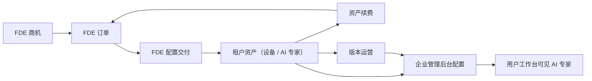

### 3.1 跨系统联动规则

1. FDE 创建订单时必须先关联租户。
2. 配置交付完成后，设备和 AI 专家才成为租户资产。
3. 企业管理后台负责配置企业内部“谁能用哪些 AI 专家”。
4. 用户工作台只展示已经被授权且当前可用的 AI 专家。
5. 资产续费会生成新的续费订单，并回到配置交付继续推进。
6. AI 专家版本运营在 FDE 侧发起，但企业侧是否处理会反映在版本任务结果中。

---

# 4. 用户工作台 PRD

## 4.1 系统定位

用户工作台是企业内部成员使用 AI 专家的统一入口，核心目标是：

1. 让员工快速找到可用的 AI 专家
2. 以会话式方式完成任务协作
3. 让 AI 输出沉淀为成果文件和结构化结果
4. 通过反馈机制持续优化 AI 回复质量

## 4.2 用户角色与用户故事旅程

### 4.2.1 普通员工旅程

1. 员工进入工作台首页，看到已授权 AI 专家和按已分配设备自动生成的默认 Agent 列表。
2. 员工通过专家卡片了解专家职责、状态和推荐问题。
3. 员工进入某个 AI 专家的对话页。
4. 员工可通过：
   - 输入问题
   - 上传附件
   - 多选 Skill
   - 点击快捷问题
   发起任务。
5. AI 专家返回回复后，员工可以：
   - 继续追问
   - 停止生成
   - 使用猜你想问
   - 查看成果文件
   - 查看结果卡片
   - 对回复进行反馈
6. 员工可在同一 AI 专家下切换历史会话，回顾之前任务。

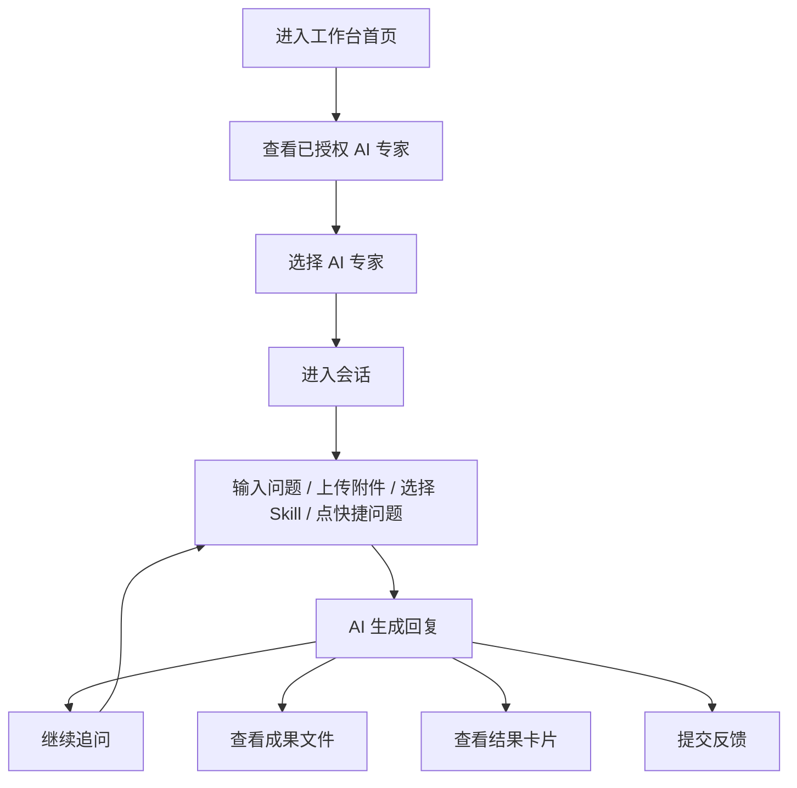

### 4.2.2 企业管理员 / 企业老板在工作台中的旅程

1. 企业管理员和企业老板也可使用工作台内的 AI 专家。
2. 在工作台右上角账户菜单中，可继续进入企业管理后台。
3. 他们在工作台的使用体验与普通员工一致，但可根据业务需要快速切回后台进行配置和管理。

## 4.3 功能列表

| 功能模块 | 一级功能 | 二级功能 | 功能描述 | 优先级 |
|---|---|---|---|---|
| 工作台首页 | AI 专家展示 | 专家卡片列表 | 首页按卡片方式展示当前账号已被授权使用的 AI 专家，以及按已分配设备自动生成的默认 Agent，用户可基于专家名称、职责描述和当前状态快速判断“谁更适合处理当前问题”，并直接进入对应专家的工作台。 | P0 |
| 工作台首页 | AI 专家展示 | 设备默认 Agent | 当账号被分配设备后，系统按设备自动生成对应默认 Agent；用户有几台设备就看到几个默认 Agent，每个默认 Agent 对应一台设备上下文，便于直接进入设备协作。 | P0 |
| 工作台首页 | AI 专家展示 | 专家状态标识 | 每张专家卡片都需要明确展示在线、运行中、异常、离线 4 种状态，帮助用户在发起任务前形成服务可用性预期，避免把任务提交给当前不可用或状态异常的专家。 | P1 |
| 工作台首页 | 快速引导 | 预置快捷问题 | 在专家首页展示该专家最典型、最适合的推荐问题，帮助首次使用用户快速理解专家擅长处理的工作范围，并通过点击推荐问题直接进入正式对话。 | P1 |
| 工作台首页 | 快速引导 | 案例回放 | 提供案例回放能力，让用户在正式提问前先看到一个完整的任务处理示例，理解该专家的输入方式、输出风格和结果呈现方式，降低首次使用门槛。 | P2 |
| 对话主界面 | 会话管理 | 新建会话 / 历史会话 | 用户可围绕同一个 AI 专家创建多条独立会话，并在历史会话列表中按时间快速切换和回看不同任务，避免多个业务问题混在同一条上下文里。 | P0 |
| 对话主界面 | 会话管理 | 重命名 / 删除会话 | 用户可对重要会话进行重命名，便于后续回顾；对无价值或错误创建的会话可直接删除，保持自己的工作台记录清晰可管理。 | P2 |
| 对话主界面 | 输入框交互 | 发送消息 | 用户可通过自然语言直接描述任务背景、目标和问题，让 AI 专家基于当前上下文进入处理流程；消息是所有协作动作的起点，必须保持低门槛和即时可用。 | P0 |
| 对话主界面 | 输入框交互 | 附件上传 | 用户可以把文档、表格、图片等材料直接附在本轮问题中一起提交，让 AI 在首轮就拿到完整上下文，减少来回补充说明，提升任务理解效率。 | P0 |
| 对话主界面 | 输入框交互 | 停止对话 | 当用户发现回复方向偏离预期、内容冗长或已经获取到足够信息时，可手动停止当前轮生成，及时中断无效输出，提升交互可控性。 | P1 |
| 对话主界面 | 输入框交互 | Skill 快选 | 用户可在发送前连续选择多个 Skill，明确告诉 AI 本轮任务希望优先调动哪些能力，从而提升首轮回复的针对性和任务命中率。 | P1 |
| 对话主界面 | 消息辅助 | 猜你想问 | 在 AI 完成一轮回复后，系统基于当前上下文给出继续追问建议，帮助用户沿着当前任务链路继续深入，而不是重新组织下一轮问题。 | P2 |
| 对话主界面 | 消息操作 | AI 回复反馈 | 用户可对每条 AI 回复进行 1-5 星评分，并在需要时补充文字意见，用于沉淀真实使用感受，支持后续产品优化、回复质量分析和专家调优。 | P1 |
| 对话主界面 | 成果面板 | 成果文件列表 / 预览 / 下载 | 右侧成果面板集中承接本次会话产生的文件型产出，用户可统一查看文件列表、在线预览核心内容并在确认无误后下载，用于后续实际业务交付。 | P0 |
| 对话主界面 | 结果面板 | 结果卡片查看 | 对于结构化结论、阶段性结果或任务摘要，系统以结果卡片方式呈现，便于用户快速浏览本轮输出重点，再决定是否展开查看详情或继续追问。 | P1 |
| AI 专家切换 | 专家切换 | 切换专家与会话隔离 | 用户在不同 AI 专家之间切换时，系统需要同时切换该专家对应的 Skill、预置问题和历史会话，确保不同业务场景的上下文完全隔离，避免任务串线。 | P1 |
| AI 专家切换 | 默认 Agent 管理 | 编辑默认 Agent 名称 | 用户可直接编辑默认 Agent 的展示名称，用于区分不同设备对应的默认入口；改名只影响工作台展示，不改变设备绑定关系和可用范围。 | P1 |

## 4.4 核心业务逻辑梳理

### 4.4.1 AI 专家可见逻辑

1. 用户工作台不允许用户自己添加或购买 AI 专家。
2. 用户可见的 AI 专家包括企业管理后台授权的专家，以及按已分配设备自动生成的默认 Agent。
3. 当用户被分配设备后，系统按设备 1:1 生成默认 Agent；有几台设备就展示几个默认 Agent。
4. 默认 Agent 默认命名为“设备名称 + 默认Agent”，并支持用户在工作台内编辑展示名称。
5. 某些 AI 专家的可见性取决于：
   - 是否已经绑定设备
   - 当前设备上是否给该用户配置了权限
6. 用户侧不要求用户理解 AI 专家的底层差异，只需要明确当前是否可用以及适合处理什么问题。

### 4.4.2 会话逻辑

1. 会话按 AI 专家隔离。
2. 新建会话后，标题不是简单截断首条消息，而是根据问题内容生成。
3. 删除会话后不可恢复。
4. 如果用户当前没有任何已授权 AI 专家，页面展示空状态，并提示联系管理员分配。

### 4.4.3 输入框逻辑

1. 一条消息可以同时带：
   - 文本
   - 多个附件
   - 多个 Skill
2. Skill 选择是本轮输入增强，不是全局永久开关。
3. 发送完成后，已选 Skill 会清空。
4. 附件显示在输入框上方，可逐个删除。
5. 生成期间用户可以主动中止当前轮回复，停止后本轮对话会保留已生成内容并进入终止状态。

### 4.4.4 成果与结果逻辑

1. **成果面板**承载文件型输出，如文档、音视频、Markdown、PDF 等。
2. **结果面板**承载结构化结果卡片，适合查看本轮任务的核心结论和汇总产物。
3. 成果和结果都服务于“对话完成后的再利用”，不是聊天消息本身的一部分。

### 4.4.5 反馈逻辑

1. 每条 AI 回复都提供独立反馈入口，便于用户在读完当条内容后直接给出评价。
2. 用户提交反馈时必须先打分，可选填写文字意见。
3. 反馈提交后，当前消息变为“已反馈”状态，避免重复提交。

## 4.5 状态机

### 4.5.1 会话状态机

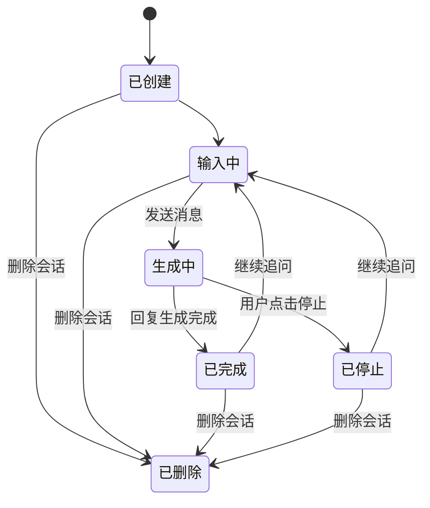

### 4.5.2 回复反馈状态机

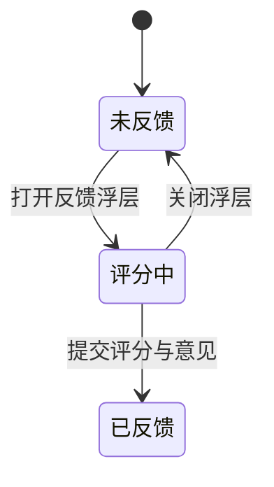

## 4.6 状态与字典

### 4.6.1 AI 专家状态字典

| 状态 | 含义 | 用户感知 |
|---|---|---|
| 在线 | 专家可正常响应 | 可优先选择使用 |
| 运行中 | 专家当前处于活跃处理状态 | 可使用，但说明系统正在高频处理 |
| 异常 | 专家存在服务异常 | 用户需谨慎使用或稍后再试 |
| 离线 | 专家当前不可用 | 不建议发起任务 |

### 4.6.2 会话行为字典

| 行为 | 说明 |
|---|---|
| 新建会话 | 为当前 AI 专家创建一条新的独立对话 |
| 重命名会话 | 修改会话标题，不影响消息内容 |
| 删除会话 | 删除当前会话及全部消息，且不可恢复 |
| 停止对话 | 中止当前轮回复生成，不删除已产生的内容 |

### 4.6.3 回复反馈字典

| 字段 | 说明 |
|---|---|
| 星级评分 | 必填，1-5 星 |
| 反馈意见 | 选填，用于补充问题或建议 |
| 已反馈 | 当前消息已经完成反馈提交 |

---

# 5. 企业管理后台 PRD

## 5.1 系统定位

企业管理后台是企业内部配置中心，核心目标是：

1. 管理企业已拥有的 AI 专家与专家团
2. 完成设备、权限、模型和组织配置
3. 承接 FDE 交付后企业侧的落地操作
4. 让企业老板和管理员持续监控 AI 能力运行情况

## 5.2 用户角色与用户故事旅程

### 5.2.1 企业老板旅程

1. 进入驾驶舱查看整体经营和协同概况。
2. 查看 AI 专家团配置总览和最新动态。
3. 通过通知入口处理重要提醒，如升级、设备或待办。
4. 在需要时进入我的 AI 专家团查看专家配置情况。

### 5.2.2 企业管理员旅程

1. 从“我的AI专家团”查看企业已拥有的专家和推荐专家团。
2. 为专家完成设备绑定、权限配置、模型选择和版本处理。
3. 在设备管理里完成设备新增、归属指定和客户端分发。
4. 在模型配置里维护供应商和模型清单。
5. 在人员管理里维护企业成员、角色和账号状态。

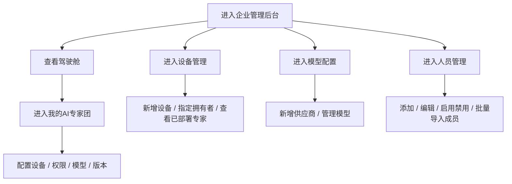

## 5.3 功能列表

| 功能模块 | 一级功能 | 二级功能 | 功能描述 | 优先级 |
|---|---|---|---|---|
| 驾驶舱 | 总览 | 经营总览卡片 | 为企业老板和管理员提供一个“一眼看全局”的入口，集中展示任务量、运行时长、节省工时、活跃 AI 专家等核心指标，帮助管理层快速判断系统当前是否在持续产生业务价值。 | P1 |
| 驾驶舱 | 总览 | 专家团配置概况 | 以专家团为维度展示企业当前 AI 能力资产的整体配置情况，包括专家数量、可用成员、活跃专家、待升级和运行主体，帮助管理者识别哪些专家团已经稳定运行、哪些还需要处理。 | P1 |
| 驾驶舱 | 动态 | AI 专家动态信息流 | 按时间展示 AI 专家最近产生的重要动态，让管理者无需逐个进入详情页面，也能快速了解企业内部 AI 协同的最新进展和使用情况。 | P1 |
| 全局导航 | 通知提醒 | 通知浮窗 | 通过右上角统一通知入口承接系统提醒、升级通知和待办事项，让企业老板和管理员在不离开当前页面的情况下也能及时发现重要事件并快速进入对应页面处理。 | P2 |
| 我的AI专家团 | 资产列表 | 已拥有专家与专家团 | 作为企业 AI 能力资产总入口，统一展示企业当前已拥有的专家团和单个专家，支持按全部、专家团、专家分类查看，便于后续继续做权限、模型和版本处理。 | P0 |
| 我的AI专家团 | 资产列表 | 推荐AI专家团 | 在推荐页签中展示适合当前企业补充的专家团，帮助企业持续扩展 AI 应用场景，而不是只停留在已购买能力的维护层面。 | P2 |
| 我的AI专家团 | 配置流程 | 先绑定设备再配置权限 | 针对需要运行设备支撑的 AI 专家，管理员先明确专家运行在哪台设备上，再继续决定哪些成员可以使用该设备上的专家能力，保证能力开放和运行环境一致。 | P0 |
| 我的AI专家团 | 配置流程 | 直接配置可用权限 | 对无需先绑定设备的 AI 专家，管理员可直接设置开放范围，快速把专家能力开放给全员或指定员工，提高配置效率。 | P0 |
| 我的AI专家团 | 配置流程 | 按设备分配权限 | 当同一个 AI 专家被绑定到多台设备时，管理员可以分别配置每台设备上的使用成员，确保不同设备上的专家能力开放范围与实际使用场景保持一致。 | P0 |
| 我的AI专家团 | 模型配置 | 单个专家选择模型 | 在专家详情中为单个 AI 专家指定模型，帮助企业根据不同专家的任务特点，在效果、稳定性和成本之间做更细粒度的平衡。 | P1 |
| 我的AI专家团 | 版本处理 | 查看版本说明 | 企业管理员在做升级决策前，可直接查看本次版本更新说明，理解新增能力、优化内容和潜在影响，避免在信息不足的情况下被动升级。 | P1 |
| 我的AI专家团 | 版本处理 | 接受或忽略升级 | 企业管理员可根据企业当前业务节奏决定是否接受本次升级，避免专家版本变化打乱内部流程，也便于在暂不适合升级时保留明确处理结果。 | P1 |
| 设备管理 | 概览 | 设备与额度总览 | 集中展示企业当前设备资源的额度使用情况和待处理设备数量，帮助管理员快速判断资源是否足够、是否需要扩容，以及是否存在未完成处理的设备事项。 | P1 |
| 设备管理 | 设备资产 | 设备列表与筛选 | 通过统一设备列表查看设备名称、类型、状态、所属员工和部署位置，并支持按状态和类型筛选，帮助管理员高效管理设备生命周期。 | P1 |
| 设备管理 | 设备资产 | 指定设备拥有者 | 管理员可为设备指定或修改所属员工，明确设备使用责任和归属关系，为后续设备权限、专家部署、默认 Agent 生成和问题排查提供基础。 | P1 |
| 设备管理 | 设备详情 | 查看部署 AI 专家 | 在设备详情中查看当前已经部署到该设备上的 AI 专家，帮助管理员核对设备承载的能力范围，确认设备与专家之间的绑定关系是否符合预期。 | P2 |
| 设备管理 | 设备新增 | 添加设备与激活码 | 支持新增云端或本地设备；其中本地工作站和本地客户端在创建设备后会生成默认 1 天有效的激活码，激活成功后即销毁，未激活前可重新生成，帮助企业持续扩展 AI 运行资源并降低线下部署中的失效和泄露风险。 | P1 |
| 设备管理 | 客户端分发 | 下载客户端安装包 | 为企业管理员提供统一的客户端分发入口，支持下载不同平台安装包，方便将客户端快速发放给企业员工完成终端部署。 | P1 |
| 模型配置 | 供应商管理 | 查看供应商列表 | 集中查看企业当前已接入的模型供应商、连通状态和模型覆盖情况，帮助管理员评估企业现有模型供给是否稳定且充足。 | P1 |
| 模型配置 | 供应商管理 | 新增 / 编辑供应商 | 支持企业新增或调整模型供应商配置，确保企业可以按自身需求接入自有或第三方模型服务，并在供应变更时及时维护。 | P1 |
| 模型配置 | 模型管理 | 管理模型清单 | 对每个供应商下的模型清单进行维护，统一定义企业内部真正可选、可用的模型范围，为专家模型配置提供规范化的基础。 | P1 |
| 人员管理 | 成员列表 | 查看成员列表 | 集中查看企业成员姓名、手机号、角色、权限范围和账号状态，作为企业侧做权限配置、设备归属和协作管理的人事基础视图。 | P1 |
| 人员管理 | 成员操作 | 添加 / 编辑成员 | 支持新增成员或修改成员信息，确保企业组织变化能够及时同步到系统内，并保证后续权限配置、设备绑定和专家开放对象准确。 | P1 |
| 人员管理 | 成员操作 | 启用 / 禁用 / 移除员工 | 当人员发生变动时，管理员可及时控制账号是否继续可用，避免离职、停用或不再参与协作的成员继续保留不必要的系统权限。 | P2 |
| 人员管理 | 批量处理 | 批量导入成员 | 在企业首次接入或批量新增人员时，通过批量导入快速完成成员初始化，降低手动逐条创建的管理成本。 | P2 |

## 5.4 核心业务逻辑梳理

### 5.4.1 企业后台访问逻辑

1. 普通员工不能进入企业管理后台。
2. 企业老板和企业管理员可以进入后台。
3. 企业老板更偏向看板和决策，企业管理员更偏向配置和维护。

### 5.4.2 AI 专家配置逻辑

企业侧的 AI 专家配置存在两条实际业务路径，但页面只呈现管理员需要完成的配置动作，不要求管理员额外区分系统背后的实现路径：

1. **路径一：先绑定设备再配置权限**
   - 适用于需要依赖设备运行的 AI 专家
   - 先绑定设备
   - 再针对每台设备配置可用成员
   - 未完成权限配置前，不能算“已配置”

2. **路径二：直接配置权限**
   - 适用于不需要先绑定设备的 AI 专家
   - 直接配置可用范围
   - 支持“全公司可用 / 指定员工可用”

### 5.4.3 用户侧可见性逻辑

1. 企业管理后台的授权结果会直接影响用户工作台是否展示某个 AI 专家。
2. 当设备被分配给员工后，员工工作台会自动生成该设备对应的默认 Agent，一台设备对应一个默认 Agent。
3. 对于设备绑定型专家：
   - 设备已绑定但设备权限未配置，不应对用户开放
   - 用户是否可用取决于“设备绑定结果 + 设备上的权限配置结果”
4. 对于直接权限型专家：
   - 根据“全公司可用 / 指定员工可用”直接决定可见范围

### 5.4.4 设备管理逻辑

1. 设备分为：
   - 云端工作站
   - 本地工作站
   - 本地客户端
2. 云端设备新增后更偏向进入“待配置”。
3. 本地工作站和本地客户端新增后更偏向进入“待激活”，并在创建时生成激活码。
4. 本地设备激活码默认有效期为 1 天；激活成功后立即销毁，未激活前管理员可重新生成新码。
5. 设备分配给员工后，员工工作台会自动生成该设备对应的默认 Agent，设备与默认 Agent 1:1 对应。
6. 设备必须先有归属员工，后续权限和部署关系才更清晰。

### 5.4.5 模型配置逻辑

1. 企业管理后台统一维护模型供应商。
2. 供应商下面维护可用模型清单。
3. AI 专家在详情中选择的模型必须来自企业当前可用的模型供应商清单。
4. 如果管理员尚未完成模型配置，AI 专家详情会出现引导文案。

### 5.4.6 版本处理逻辑

1. 企业侧版本处理以版本说明为核心入口，先帮助管理员快速理解本次变化。
2. 管理员无需进入额外页面做差异比对，版本说明即可直接支撑升级判断。
3. 企业管理员可执行：
   - 接受升级
   - 忽略升级
4. 如果当前版本已经处理完成，页面只保留说明，不再要求额外动作。
5. 即使某个 AI 专家属于专家团，企业侧的版本处理仍按团内单个 AI 专家分别执行。

## 5.5 状态机

### 5.5.1 AI 专家配置状态机

#### 路径一：先绑定设备再配置权限

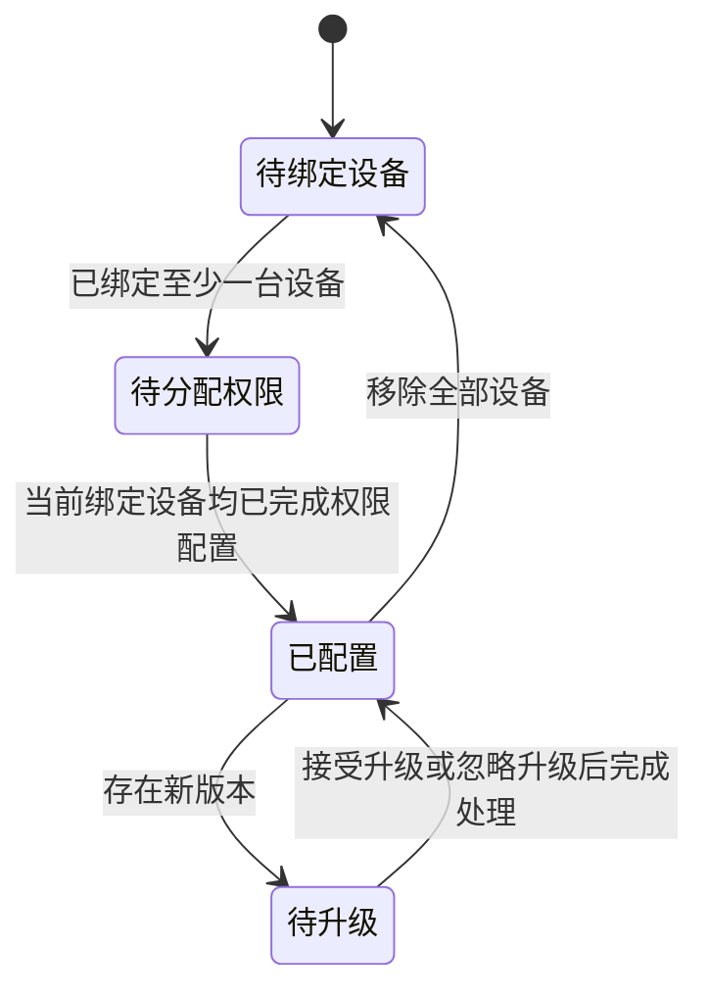

#### 路径二：直接配置可用权限

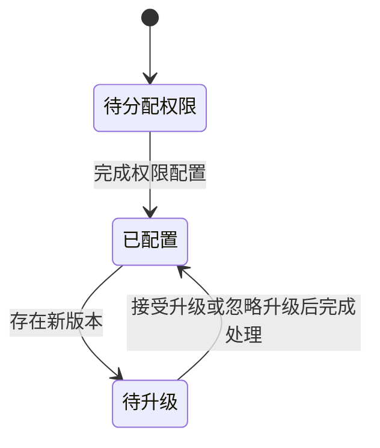

### 5.5.2 设备状态机

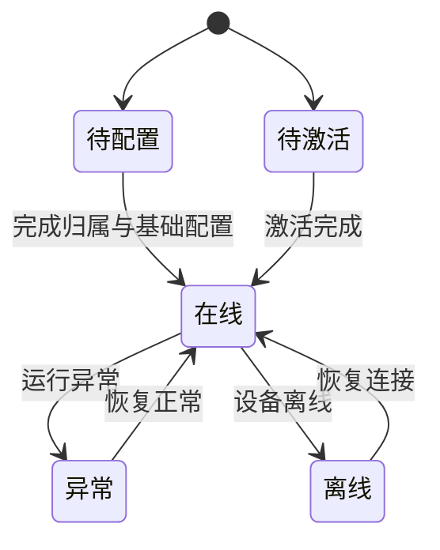

### 5.5.3 员工账号状态机

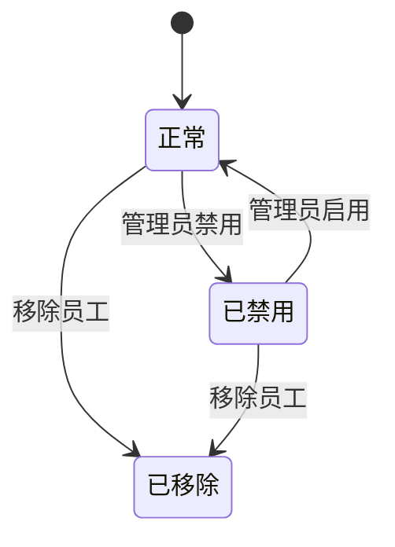

## 5.6 状态与字典

### 5.6.1 AI 专家卡片状态字典

| 状态 | 含义 | 触发条件 |
|---|---|---|
| 待绑定设备 | 当前专家还未绑定运行设备 | 设备型专家未绑定任何设备 |
| 待分配权限 | 当前专家尚未完成权限开放 | 未设置全公司或指定成员权限 |
| 待升级 | 当前专家存在待处理新版本 | 新版本已可见但尚未处理 |
| 已配置 | 当前专家已满足使用条件 | 配置完整且无待处理升级 |

### 5.6.2 权限模式字典

| 状态 | 含义 |
|---|---|
| 全公司可用 | 企业全部成员都可使用该 AI 专家 |
| 指定员工可用 | 仅被明确授权的员工可使用 |

### 5.6.3 设备状态字典

| 状态 | 含义 |
|---|---|
| 待配置 | 设备已存在，但尚未完成归属和基础配置 |
| 待激活 | 设备需要激活后才能正式使用 |
| 在线 | 设备可正常承载服务 |
| 异常 | 设备存在运行异常 |
| 离线 | 设备当前未在线 |

### 5.6.4 模型供应商状态字典

| 状态 | 含义 |
|---|---|
| 已连通 | 供应商配置已通过连通性检测 |
| 连接异常 | 供应商配置当前不可用或检测失败 |

### 5.6.5 企业成员角色与账号状态字典

| 类型 | 取值 | 说明 |
|---|---|---|
| 成员角色 | 企业老板 / 企业管理员 / 普通员工 | 控制后台权限和组织职责 |
| 账号状态 | 正常 / 已禁用 / 已移除 | 控制账号是否可继续使用 |

---

# 6. FDE 业务管理 PRD

## 6.1 系统定位

FDE 业务管理是交付运营系统，核心目标是：

1. 把销售线索沉淀成可跟进的商机
2. 把商机转成订单，并绑定到具体租户
3. 按订单推进配置交付
4. 让交付结果沉淀为可续费、可追踪的租户资产
5. 持续处理版本运营和成员协作

## 6.2 用户角色与用户故事旅程

### 6.2.1 FDE 团队负责人旅程

1. 进入首页看板，掌握销售金额、配置中订单、已交付租户和团队负载。
2. 进入商机管理，分配商机、判断成单与否。
3. 进入订单管理，跟踪履约情况。
4. 进入配置交付，统筹全量租户与交付进度。
5. 进入客户资产管理，查看交付后资产、续费和变更。
6. 进入 AI 专家版本管理，处理租户下 AI 专家的版本任务。
7. 在成员权限管理中新增、导入、编辑和禁用成员。

### 6.2.2 FDE 团队管理员旅程

1. 不以首页看板为主入口，而是直接进入交付执行和业务运营。
2. 可参与商机处理、订单操作、配置交付、资产管理、版本管理和成员管理。
3. 负责把负责人确定的业务目标转成可执行动作。

### 6.2.3 FDE 普通成员旅程

1. 只看分配给自己的商机、订单、交付、租户资产和版本任务。
2. 在商机详情中更新状态、评论跟进。
3. 在订单和交付里推进自己负责的执行步骤。
4. 在资产页里对指定设备或 AI 专家发起续费。
5. 在成员权限管理中只读查看团队成员，不可执行管理动作。

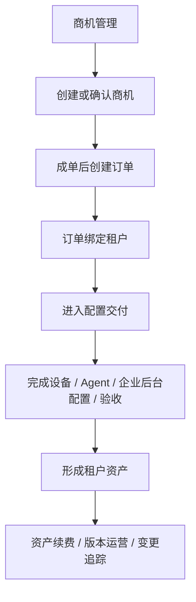

## 6.3 功能列表

| 功能模块 | 一级功能 | 二级功能 | 功能描述 | 优先级 |
|---|---|---|---|---|
| 首页看板 | 汇总指标 | 销售与交付总览 | 通过金额、订单和租户三类关键指标，帮助 FDE 负责人快速判断当前销售推进情况和交付落地情况，决定当天是优先盯商机、推进订单，还是聚焦交付收口。 | P1 |
| 首页看板 | 团队负载 | 成员状态总览 | 从成员视角展示当前状态、配置交付数、运行租户数和版本任务，帮助负责人做任务分配和资源调度。 | P2 |
| 商机管理 | 商机列表 | 商机列表展示 | 以统一列表承接当前所有商机线索，帮助 FDE 团队快速判断每条线索来自哪里、当前推进到什么阶段、由谁负责，避免商机分散在个人记录中。 | P1 |
| 商机管理 | 商机列表 | 手动创建商机 | 支持负责人或管理员把线下沟通、销售转交或非门户来源的线索手动录入系统，确保所有商机最终都能进入统一管理和跟进流程。 | P1 |
| 商机管理 | 商机详情弹窗 | 分配成员 | 负责人和管理员可将商机明确分配给具体 FDE 成员，形成清晰的跟进责任归属，避免出现“大家都知道但没人真正负责”的情况。 | P1 |
| 商机管理 | 商机详情弹窗 | 修改商机状态 | 通过标准化状态记录商机当前进展，让团队能够快速识别哪些商机刚开始、哪些在推进、哪些已经成单、哪些已经停止，不再依赖口头同步。 | P1 |
| 商机管理 | 商机详情弹窗 | 查看需求信息 | 在商机详情中集中展示客户需求背景、联系人、来源、金额和重点诉求，帮助后续跟进、方案沟通和交付承接保持信息完整一致。 | P1 |
| 商机管理 | 商机详情弹窗 | 评论与回复 | 团队成员和负责人都可以在商机详情中持续记录跟进动态、阶段结论和问题回复，让商机推进过程形成完整留痕，而不是只存在于即时沟通中。 | P2 |
| 商机管理 | 看板视图 | 按状态分组看板 | 通过看板方式展示各状态下的商机数量和分布，帮助负责人从全局角度观察商机结构，而不仅仅是逐条查看列表。 | P2 |
| 订单管理 | 订单列表 | 查看 / 搜索 / 租户筛选 | 提供订单列表、搜索和租户筛选能力，帮助 FDE 成员在大量订单中快速定位目标对象，并围绕特定租户持续处理相关订单。 | P0 |
| 订单管理 | 创建订单 | 录入订单信息 | 创建订单时必须先锁定租户并补充订单备注，确保每一张订单从创建开始就有明确归属和业务背景，避免后续交付出现主体不清的问题。 | P0 |
| 订单管理 | 创建订单 | 添加设备 / AI 专家 / Tokens | 在同一张订单里清晰录入本次售卖的设备、AI 专家和 Tokens 资源包，形成完整的售卖清单，为后续交付、资产生成和续费提供依据。 | P0 |
| 订单管理 | 订单详情 | 查看订单类型 | 在订单详情中明确区分新购订单和续费订单，帮助 FDE 成员快速判断本单是首期交付、增量配置还是续期处理。 | P1 |
| 订单管理 | 订单详情 | 跳转配置交付 | 订单确认后可直接进入对应交付详情，确保“下单”和“执行交付”之间形成连续链路，减少跨页面反复查找。 | P1 |
| 订单管理 | 订单详情 | 查看资产信息 | 当订单已经完成交付后，订单详情需要能看到对应形成的资产和到期信息，帮助团队判断这张订单是否真正落成了可运营资产。 | P1 |
| 订单管理 | 订单详情 | 履约任务追踪 | 订单详情中集中展示履约任务状态和执行记录，让团队明确这张订单当前卡在哪个环节、由谁处理过、下一步该推进什么。 | P1 |
| 配置交付 | 租户列表 | 工程师 / 负责人视角 | 配置交付首页以租户为单位组织工作对象，负责人看到全量租户，普通成员只看到自己负责范围，让每个人进入页面就能看到与自己职责相关的交付对象。 | P0 |
| 配置交付 | 租户列表 | 创建租户 | 支持先创建租户，再围绕该租户持续创建订单和推进交付，确保业务主体先被建立，再承接后续多次销售和交付动作。 | P0 |
| 配置交付 | 租户详情 | 查看租户下订单列表 | 进入租户详情后，以订单列表承接该租户下所有待处理和已处理的交付任务，让交付工作按订单逐个推进，而不是混成一个租户级黑盒。 | P0 |
| 配置交付 | 租户详情 | 在租户下新建订单 | 支持在租户上下文中直接建单，减少来回切换，确保新增订单天然绑定到当前租户并能立即进入后续交付流程。 | P0 |
| 配置交付 | 订单交付 | 一订单一交付 | 每个订单都拥有独立交付流程，让新购、增配和续费都能被清晰追踪，避免多次销售动作混在同一条交付记录中。 | P0 |
| 配置交付 | 订单交付 | 按订单预填交付内容 | 订单中的设备和 AI 专家信息会自动带入交付页面，帮助交付人员减少重复录入，但仍保留人工确认和手动推进的控制权。 | P0 |
| 配置交付 | 订单交付 | 设备分配步骤 | 在设备分配阶段完成本次订单设备额度、生效安排和分配确认，确保后续设备资产生成准确，且与订单内容保持一致。 | P0 |
| 配置交付 | 订单交付 | Agent 下发步骤 | 在 Agent 下发阶段完成本次订单对应的专家团或单个 AI 专家下发，让客户租户真正具备可使用的 AI 能力。 | P0 |
| 配置交付 | 订单交付 | 企业后台配置 | 在交付过程中引导企业管理员完成后台必要配置，确保交付不仅停留在“资源已发放”，而是真正达到“企业可开始使用”的状态。 | P1 |
| 配置交付 | 订单交付 | 交付验收 | 在所有关键配置完成后，由 FDE 对本次交付做最终确认和交接收口，确保租户已具备正式上线使用条件。 | P0 |
| 配置交付 | 订单交付 | 已完成步骤只读 | 对已完成或已跳过的阶段只展示结果，不再提供重复操作入口，避免交付过程中对已确认内容产生误改。 | P1 |
| 客户资产管理 | 租户列表 | 查看已交付租户 | 以租户为单位集中管理已交付后的运行资产，让团队进入资产页时先定位业务主体，再查看其设备、专家和变更情况。 | P1 |
| 客户资产管理 | 资产概况 | 查看额度卡片 | 从租户视角查看当前设备额度和 Token 使用情况，帮助 FDE 快速判断客户是否存在扩容需求、使用异常或续费机会。 | P1 |
| 客户资产管理 | 资产明细 | 充值记录查看 | 记录并查看租户的充值历史，便于团队核对资源补充情况、资金流向和后续消耗趋势。 | P2 |
| 客户资产管理 | 资产明细 | 设备资产查看 | 逐台查看设备资产状态、到期时间和剩余时长，帮助团队及时识别哪些设备即将到期、哪些设备需要优先处理续费。 | P1 |
| 客户资产管理 | 资产明细 | AI 专家资产查看 | 逐个查看租户下已下发的 AI 专家当前版本、授权对象、到期时间和状态，帮助团队从运营角度持续管理客户已购买的专家能力。 | P1 |
| 客户资产管理 | 资产明细 | 资产续费 | 针对具体设备或 AI 专家资产发起续费，确保续费动作精准作用到已有资产本身，而不是重新新增一份不必要的资源。 | P1 |
| 客户资产管理 | 资产明细 | 交付变更记录查看 | 把该租户历史上的设备追加、Agent 追加、续费等变更统一沉淀下来，方便团队回溯客户为什么会形成当前资产结构。 | P1 |
| 成员权限管理 | 成员列表 | 查看团队成员 | 统一查看当前 FDE 团队成员、角色、状态和联系方式，为任务分配、权限判断和团队协作提供基础视图。 | P1 |
| 成员权限管理 | 成员操作 | 添加 / 编辑成员 | 负责人和管理员可新增成员或调整成员资料与角色，确保团队结构变化能够及时同步到系统内。 | P1 |
| 成员权限管理 | 成员操作 | 禁用 / 启用成员 | 对不再参与当前工作的成员及时做启用或禁用控制，避免账号继续被错误分配任务或访问业务数据。 | P2 |
| 成员权限管理 | 批量处理 | 批量导入成员 | 在团队扩张或初始化阶段，支持一次性导入多位成员，降低重复维护成本。 | P2 |
| AI 专家版本管理 | 版本列表 | 查看版本状态 | 以租户为单位查看当前已下发 AI 专家的版本现状；若 AI 专家来自专家团，则按专家团做交付分组展示，但升级、忽略和回退仍按团内单个 AI 专家独立处理，帮助团队识别哪些租户需要升级、哪些租户已经处理完成。 | P1 |
| AI 专家版本管理 | 版本操作 | 推送升级 | 当存在更合适的新版本时，由 FDE 向企业管理员发起升级提醒，推动客户逐步获得更优能力，而不是完全依赖企业自己发现。 | P1 |
| AI 专家版本管理 | 版本操作 | 忽略本次升级 | 当当前租户暂不适合升级时，可明确记录“本次先不升”，让版本处理有清晰结果，而不是长期悬而未决。 | P2 |
| AI 专家版本管理 | 版本操作 | 版本回退 | 当升级后出现不兼容、效果问题或客户反馈异常时，可执行回退并记录原因，尽快恢复客户的稳定使用。 | P1 |
| AI 专家版本管理 | 版本历史 | 查看历史版本 | 查看某个 AI 专家在租户侧经历过的版本轨迹和版本说明，帮助团队理解不同版本之间的能力变化和处理背景。 | P2 |
| AI 专家版本管理 | 版本历史 | 企业响应追踪 | 跟踪企业管理员对升级、忽略或回退的处理结果，让 FDE 能够持续掌握每次版本动作是否真正被客户接收和执行。 | P1 |

## 6.4 核心业务逻辑梳理

### 6.4.1 角色与数据可见范围

1. **FDE 团队负责人**
   - 可看首页看板
   - 可看全量商机、订单、交付、租户资产、版本任务
   - 可管理团队成员

2. **FDE 团队管理员**
   - 无首页看板主入口
   - 可看全量业务数据
   - 可管理团队成员

3. **FDE 普通成员**
   - 只看分配给自己的商机、订单、交付、租户资产、版本任务
   - 不能管理团队成员

### 6.4.2 商机逻辑

1. 商机来源包括：
   - 页面已有的需求线索
   - FDE 手动创建的商机
2. 商机进入系统后可分配给 конкретe FDE 成员。
3. 商机详情中支持连续评论和回复评论，用于沉淀跟进过程。
4. 商机不是订单，只有商机成单后才会进入订单环节。

### 6.4.3 订单逻辑

1. 创建订单必须先绑定租户。
2. 订单支持两类业务类型：
   - 新购
   - 续费
3. 订单商品支持 3 类：
   - 设备
   - AI 专家
   - Tokens
4. 设备和 AI 专家商品必须带有效时长，用于后续资产到期与续费。

### 6.4.4 配置交付逻辑

1. 配置交付首页按租户展示，而不是按订单直接平铺。
2. 进入租户后，左侧是该租户下的订单列表。
3. 一个订单对应一个交付。
4. 订单只负责预填交付内容，不自动把步骤标完成。
5. 已完成或已跳过的步骤只读，不再允许重复执行动作。
6. 交付步骤当前包含：
   - 设备分配
   - Agent 下发
   - 企业后台配置
   - 交付验收

### 6.4.5 资产逻辑

1. 资产以租户为单位查看。
2. 当前可管理的付费资产包括：
   - 设备资产
   - AI 专家资产
3. 每个资产都有唯一 `资产ID`。
4. 资产到期时间从交付完成时开始计算。
5. 资产页支持直接发起续费，但续费不是直接改时间。

### 6.4.6 续费逻辑

1. 续费入口在客户资产管理，不在订单页和交付页。
2. 点击续费后：
   - 生成续费订单
   - 自动跳转到配置交付
   - 交付状态仍需手动推进
3. 只有续费交付完成后，资产新的到期时间才生效。

### 6.4.7 版本管理逻辑

1. 版本管理按租户查看，而不是按全局 AI 专家查看。
2. 每个租户下会列出该租户当前已下发 AI 专家的独立版本任务。
3. 如果 AI 专家来自专家团，界面只按专家团做交付分组展示，不把专家团本身当作统一版本对象。
4. 收起列表不直接展示版本号；版本号、发布时间、说明和状态在展开后的历史列表与详情中查看。
5. FDE 可处理的动作包括：
   - 推送升级
   - 忽略本次升级
   - 版本回退
   - 恢复可升级
6. 企业侧是否接受、忽略或反馈异常，最终会回流为单个 AI 专家版本任务的处理结果。

## 6.5 状态机

### 6.5.1 商机状态机

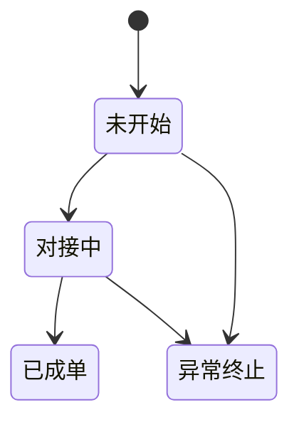

### 6.5.2 订单状态机

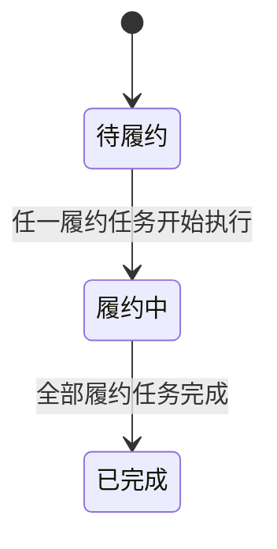

### 6.5.3 配置交付状态机

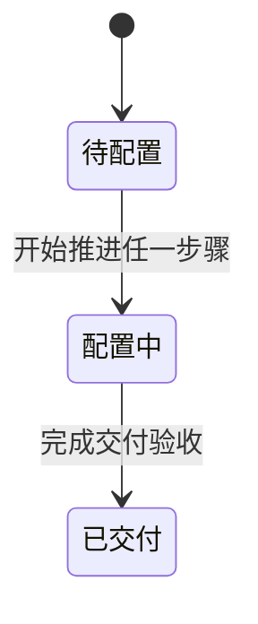

### 6.5.4 交付步骤状态机

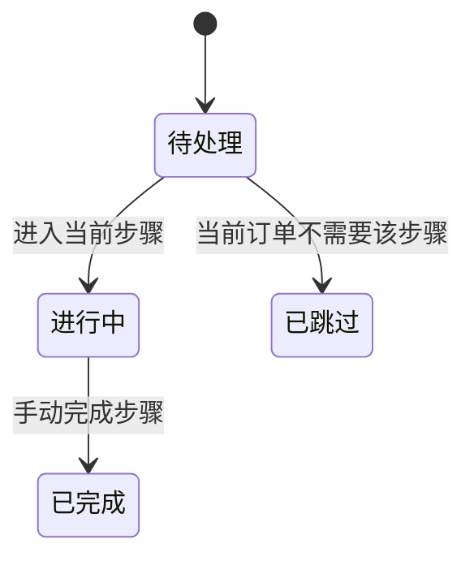

### 6.5.5 资产续费状态机

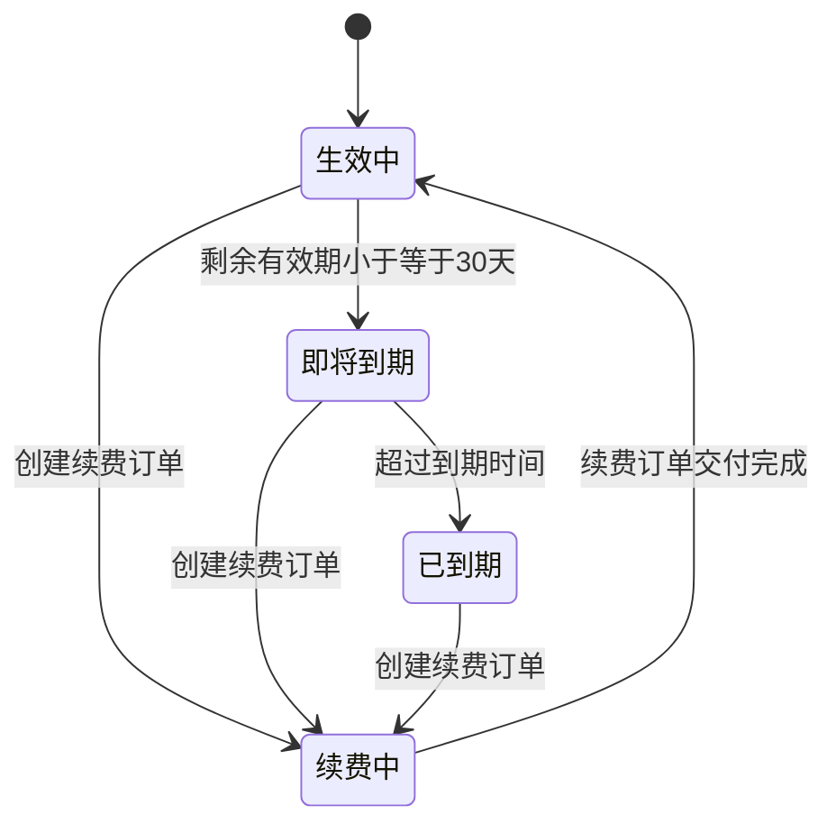

### 6.5.6 版本管理状态机

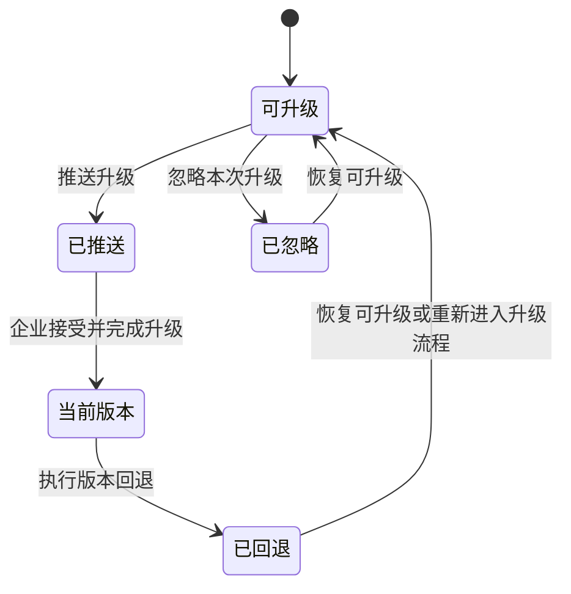

## 6.6 状态与字典

### 6.6.1 FDE 角色字典

| 角色 | 含义 |
|---|---|
| 团队负责人 | 拥有全量业务视图和成员管理能力 |
| 团队管理员 | 无首页看板主入口，但拥有业务执行和成员管理能力 |
| 普通成员 | 只看自己负责范围，不可管理成员 |

### 6.6.2 商机状态字典

| 状态 | 含义 |
|---|---|
| 未开始 | 商机已进入系统，但尚未开始跟进 |
| 对接中 | 正在与客户推进沟通、演示或方案确认 |
| 已成单 | 商机已完成成单，可进入订单阶段 |
| 异常终止 | 商机当前停止推进，但保留全部记录 |

### 6.6.3 订单字典

| 类型 | 取值 | 说明 |
|---|---|---|
| 订单业务类型 | 新购 / 续费 | 用于区分首次购买和续期处理 |
| 订单状态 | 待履约 / 履约中 / 已完成 | 用于描述订单整体执行进度 |
| 履约状态 | 待处理 / 处理中 / 已完成 | 用于描述订单内单个履约任务状态 |

### 6.6.4 交付字典

| 类型 | 取值 | 说明 |
|---|---|---|
| 交付状态 | 待配置 / 配置中 / 已交付 | 描述订单交付整体进度 |
| 步骤状态 | 待处理 / 进行中 / 已完成 / 已跳过 | 描述单个交付步骤状态 |
| 步骤名称 | 设备分配 / 租户 Agent 下发 / 企业后台配置 / 交付验收 | 当前正式交付步骤集 |

### 6.6.5 交付变更字典

| 状态 | 含义 |
|---|---|
| 待执行 | 变更记录已创建，尚未开始执行 |
| 执行中 | 变更流程正在推进 |
| 已完成 | 变更已经落地完成 |
| 已取消 | 变更被中止或取消 |

### 6.6.6 资产状态字典

| 状态 | 含义 |
|---|---|
| 生效中 | 当前资产在有效期内正常可用 |
| 即将到期 | 距离到期时间不超过 30 天 |
| 已到期 | 已超过到期时间 |
| 待确认 | 当前还未形成明确到期时间 |

### 6.6.7 版本任务状态字典

| 状态 | 含义 |
|---|---|
| 当前版本 | 当前租户正在运行的正式版本 |
| 可升级 | 存在可处理的新版本 |
| 已推送 | FDE 已向企业管理员推送升级提醒 |
| 已忽略 | 本次升级已被记录为忽略 |
| 已回退 | 已从当前版本回退到历史稳定版本 |

### 6.6.8 团队成员状态字典

| 类型 | 取值 | 说明 |
|---|---|---|
| 在线状态 | online / busy / offline | 用于首页和成员管理的工作状态展示 |
| 账号状态 | enabled / disabled | 控制成员是否可继续使用 FDE 业务管理 |

## 7. 需求边界与后续建议

### 7.1 当前已明确边界

1. 本 PRD 只覆盖当前页面真实存在且有入口的功能。
2. 不把营销门户和 FDE 开发管理纳入本版正式 PRD。
3. 不在企业管理后台和用户工作台暴露 AI 专家的底层差异。
4. 不把资产续费设计成后台直接顺延，而是继续走订单和交付链路。

### 7.2 后续建议优先项

1. 为跨系统关键对象补统一 ID 体系：
   - AI 专家实例 ID
   - 设备实例 ID
   - 订单 ID
   - 交付 ID
   - 资产 ID
2. 为版本管理补企业响应闭环字段标准化。
3. 为用户工作台补更明确的成果与结果归档策略。
4. 为 FDE 交付与资产续费补更完整的时效、提醒与到期策略。
