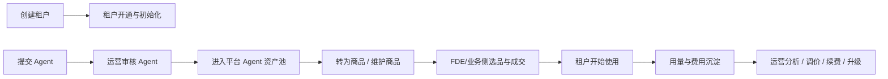

# Frontis AI · 运营平台 PRD

> 日期：2026-04-17  
> 文档目标：定义 `运营平台 / 运营后台` 的完整产品蓝图，并明确 `当前阶段只做最小设计与实现` 的范围。  
> 关联文档：  
> 《Frontis AI · 正式 PRD》  
> 《Frontis AI · 商品中心 PRD v1》  
> 《运营平台功能思维导图》  
> 《Frontis FDE 与企业管理后台调整清单 v1》

---

## 1. 文档说明

### 1.1 文档定位

本文件是 `运营平台` 的独立 PRD，不是企业管理后台的补充页，也不是 FDE 业务管理的延伸页面。

运营平台的核心职责是：

1. 承接平台级运营与治理动作。
2. 承接平台级供给管理动作。
3. 承接平台级商业化配置动作。
4. 承接平台级使用量与费用观察动作。

### 1.2 文档写法原则

本 PRD 采用“两层表达”：

1. `完整平台蓝图`
   说明运营平台最终应该覆盖哪些业务能力。
2. `当前阶段范围`
   明确现阶段只落最小可用设计和实现，避免系统一次性膨胀。

### 1.3 当前阶段最小要求

当前阶段只要求运营平台具备以下 4 项能力：

1. 可以创建租户。
2. 可以审批 Agent。
3. 可以最小创建和管理商品。
4. 可以查看用量和费用。

---

## 2. 系统定位

### 2.1 运营平台在整体系统中的位置

Frontis AI 当前存在 4 类后台或工作台：

1. `用户工作台`
   企业员工使用 AI 专家的地方。
2. `企业管理后台`
   企业管理员完成企业内配置和权限治理的地方。
3. `FDE 业务管理`
   FDE 团队处理交付、客户运营和资产维护的地方。
4. `运营平台`
   平台运营/超管完成平台级租户、供给、商品、收费和运营治理的地方。

运营平台不是“再做一个万能后台”，而是聚焦 `平台级` 控制面：

1. 控制哪些租户进入系统。
2. 控制哪些 Agent 可以进入平台资产池。
3. 控制哪些资产被包装为可售商品。
4. 控制平台从哪些维度观察使用量、成本和费用。

### 2.2 运营平台的业务目标

从业务视角，运营平台要解决 4 个核心问题：

| 业务问题 | 业务目标 | 对应产品模块 |
|---|---|---|
| 新客户或新业务主体如何进入平台 | 把客户承接到正确租户下，形成后续订单、交付、运营的根对象 | 租户中心 |
| 平台供给如何可控 | 让进入平台资产池的 Agent 经过审核，质量和责任可追踪 | Agent 审核中心 |
| 技术资产如何变成可卖资产 | 让可售供给被标准化定义、定价和上下架管理 | 商品中心 |
| 平台是否赚钱、哪些客户在消耗资源 | 能按租户、商品、Agent 观察使用量和费用变化 | 用量与费用中心 |

### 2.3 运营平台的目标用户

| 角色 | 是否本期核心角色 | 说明 |
|---|---|---|
| 平台超管 | 是 | 负责平台规则、租户准入、供给治理和关键审批 |
| 平台运营 | 是 | 负责日常租户创建、Agent 审核、商品管理、用量费用查看 |
| 财务 / 商务支持 | 否 | 后续可查看账单、应收、对账，不是本期主操作角色 |
| FDE 开发提交人 | 否 | 作为 Agent 审核的上游提交人存在，不在运营平台内承担主要操作 |
| FDE 业务负责人 | 否 | 作为商品和租户的下游消费方存在，不在运营平台内承担主要操作 |

---

## 3. 业务蓝图

### 3.1 完整业务闭环



### 3.2 完整平台蓝图下的一级模块

运营平台完整形态建议包含以下一级模块：

| 一级模块 | 模块目标 | 当前阶段 |
|---|---|---|
| 运营驾驶舱 | 看平台总体租户、供给、收入、用量、异常 | 不做 |
| 租户中心 | 创建租户、维护状态、开通能力、查看管理员 | 做最小版 |
| Agent 审核中心 | 审核 Agent 和版本，治理平台技术资产 | 做最小版 |
| 商品中心 | 定义商品、定价、上下架、归档 | 做最小版 |
| 订单与商务规则 | 折扣审批、订单状态、付款确认、履约联动 | 不做 |
| 用量与费用中心 | 查看租户、商品、Agent 维度的使用量和费用 | 做最小版 |
| 版本升级治理 | 平台级升级策略、灰度、收费升级判断 | 不做 |
| 审计与配置中心 | 操作留痕、规则配置、角色权限、口径配置 | 不做 |

### 3.3 平台级业务原则

1. `先有租户，再有后续业务承接`
   租户是平台承接客户、订单、交付、资产、用量、费用的根对象。
2. `先审核 Agent，再进入平台资产池`
   未审核通过的 Agent 不能被视为平台正式供给。
3. `先形成商品，再进入销售与交付`
   Agent 是技术资产，商品是商业资产，二者不能混用。
4. `用量和费用先做运营统计口径，再考虑财务结算口径`
   本期费用是“平台运营观察费用”，不是正式财务账单。

### 3.4 与《平台业务流程图 V2.6 重构版》的对齐关系

当前 PRD 与 `Frontis AI 平台业务流程图 V2.6 重构版` 的对应关系如下：

| 流程图节点 | 流程含义 | PRD 对应模块 | 当前阶段是否实现 |
|---|---|---|---|
| N3 | 运营人员进入后台 | 运营平台入口，不单独成模块 | 不单独做 |
| N4-N7 | 创建租户、开通功能模块、录入业务信息、邀请租户管理员 | 租户中心 | 部分实现 |
| N17-N18 | 运营审核 Agent、进入 Agent Store | Agent 审核中心 | 实现 |
| N19-N23 | 创建商品类目、Agent 转商品、创建非 Agent 商品、创建 SKU、商品上架 | 商品中心 | 部分实现 |
| N27 | 折扣审批 | 订单与商务规则 | 不实现 |
| N35 | 确认付款状态 | 订单与商务规则 | 不实现 |
| N47-N47A | 审核新版本、判断是否涉及收费/权益变化 | 版本升级治理 | 不实现 |
| N49 | 商品上下架/价格维护 | 商品中心 | 部分实现 |

需要特别说明 2 点：

1. `租户中心`
   在流程图中，运营侧租户动作不是只有 `创建租户`，而是 `创建租户 + 开通功能模块 + 录入业务信息 + 邀请租户管理员` 这一整段。
   当前阶段只落最小版，因此先实现 `创建租户 + 业务信息录入 + 基础状态管理`，把 `模块开通` 和 `邀请管理员` 作为后续扩展能力保留。
2. `用量与费用中心`
   该能力在 V2.6 流程图里没有被画成单独交易节点，它更像是建立在 `形成客户资产（N40）`、`进入 workspace 使用能力（N42）`、`资产到期/版本提醒（N43）` 之后的 `运营观察层`。
   也就是说，用量与费用中心与流程图不冲突，但它不是主交易链上的一个审批节点，而是从使用行为和资源消耗中沉淀出来的平台分析视图。

---

## 4. 当前阶段范围定义

### 4.1 当前阶段目标

当前阶段不是把完整运营平台一次性做完，而是优先搭出最小可用骨架，满足 4 个最小要求，并让平台主链真正跑通：

1. 能承接客户主体。
2. 能治理平台供给。
3. 能形成基础可售供给。
4. 能看到平台使用和费用。

### 4.2 当前阶段范围

| 模块 | 当前阶段必须做 | 当前阶段不做 |
|---|---|---|
| 租户中心 | 创建租户、编辑基础信息、查看状态 | 父子租户、多级组织开通、复杂能力包配置 |
| Agent 审核中心 | 待审核列表、详情、通过/驳回 | 多级审批流、自动审核、灰度发布 |
| 商品中心 | 最小创建商品、编辑、上下架 | 多 SKU、套餐、优惠券、复杂定价、归档体系 |
| 用量与费用中心 | 查看汇总、趋势、明细 | 对账单、发票、回款核销、财务结算闭环 |

### 4.3 当前阶段不纳入范围

以下能力明确不在本期：

1. 折扣审批。
2. 付款确认。
3. 订单创建与履约控制。
4. 续费规则。
5. 收费升级与版本收费策略。
6. 多角色精细权限系统。
7. 多级租户能力树。
8. 复杂商品类目和 SKU 体系。

### 4.4 当前阶段与 V2.6 流程图的最小匹配策略

为了保证当前阶段虽然只做最小版，但仍然和 V2.6 主流程不冲突，本期按以下方式对齐：

| 当前最小要求 | 对齐的流程图节点 | 本期处理方式 |
|---|---|---|
| 可以创建租户 | N4、N6 | 先实现创建租户和基础业务信息录入 |
| 可以审批 Agent | N17、N18 | 先实现待审核、通过、驳回 |
| 可以最小创建和管理商品 | N20、N21、N23、N49 | 先实现最小商品创建、编辑、上下架 |
| 可以查看用量和费用 | N40、N42、N43 的数据结果层 | 先做运营统计视图，不进入账单结算 |

本期不做但在流程图中已存在的运营节点：

1. N5 `开通功能模块`
2. N7 `邀请租户管理员`
3. N19 `创建商品类目`
4. N22 `创建 SKU / 规格`
5. N27 `折扣审批`
6. N35 `确认付款状态`
7. N47 / N47A `版本审核与收费升级判断`

---

## 5. 当前阶段产品方案

### 5.1 信息架构

当前阶段运营平台一级导航建议收口为 4 项：

1. `租户管理`
2. `Agent 审核`
3. `商品管理`
4. `用量与费用`

这样可以保证导航和业务目标一一对应，不会出现“完整平台没做出来，导航先膨胀”的问题。

### 5.2 关键业务对象

| 对象 | 定义 | 本期最小字段 |
|---|---|---|
| 租户 | 平台承接客户或业务主体的根对象 | 名称、编码、类型、联系人、管理员信息、状态、创建时间 |
| Agent 审核单 | 运营对 Agent 提交进行审批的业务对象 | Agent 名称、提交人、版本、说明、审核状态、审核意见 |
| 商品 | 可被业务侧选择和销售的标准化供给对象 | 商品名称、商品类型、关联 Agent、描述、价格、单位、状态 |
| 用量统计 | 租户/商品/Agent 在周期内的使用消耗 | 调用量、Token、请求数、活跃用户数、费用金额、统计周期 |

---

## 6. 模块 PRD

## 6.1 租户中心

### 6.1.1 业务目标

从业务角度，租户中心要解决的问题是：

1. 新客户签约后，平台运营可以快速承接业务主体。
2. 后续的商品、订单、交付、资产、用量都能挂在正确租户下。
3. 平台能看清每个租户当前处于什么状态。

### 6.1.2 产品目标

从产品角度，本期租户中心只需要做到：

1. 能新建租户。
2. 能查看租户列表。
3. 能编辑租户基础信息。
4. 能切换租户状态。

从完整运营平台蓝图角度，租户中心最终还应补齐：

1. 开通功能模块。
2. 邀请租户管理员。
3. 查看租户管理员激活情况。

### 6.1.3 页面结构

`租户管理列表页`

1. 顶部：搜索、状态筛选、创建租户按钮。
2. 列表：租户名称、租户编码、租户类型、管理员、联系人、状态、创建时间。
3. 行内操作：查看、编辑、启用/停用。

`创建 / 编辑租户弹窗`

1. 基础信息区。
2. 联系人与管理员信息区。
3. 状态区。

### 6.1.4 字段定义

| 字段 | 必填 | 说明 |
|---|---|---|
| 租户名称 | 是 | 平台内唯一展示名 |
| 租户编码 | 是 | 平台内唯一识别编码 |
| 租户类型 | 是 | 企业租户 / FDE 租户 / 平台内部租户 |
| 联系人姓名 | 是 | 业务联系人 |
| 联系人手机号 | 是 | 联系方式 |
| 管理员姓名 | 否 | 首位管理员，允许后续补充 |
| 管理员邮箱 / 手机号 | 否 | 激活入口承接字段，当前阶段可先记录 |
| 备注 | 否 | 补充业务说明 |
| 状态 | 是 | 待激活 / 启用中 / 已停用 |

### 6.1.5 状态规则

```plaintext
待激活 -> 启用中 -> 已停用
已停用 -> 启用中
```

### 6.1.6 关键规则

1. 租户名称和租户编码不可重复。
2. 已创建租户允许编辑基础信息，但需记录最近编辑时间。
3. 已停用租户默认不应继续产生新用量。
4. 本期先不做父子租户。

### 6.1.7 本期验收标准

1. 运营可在 3 分钟内完成一个新租户创建。
2. 创建后列表立即可见。
3. 支持按名称、编码、状态筛选。
4. 支持停用与再次启用。

---

## 6.2 Agent 审核中心

### 6.2.1 业务目标

从业务角度，Agent 审核中心要解决的问题是：

1. 平台资产池不能直接承接未审核供给。
2. 运营需要对 Agent 的质量、版本和说明做基本把关。
3. 平台需要保留每个审核动作的结果。

### 6.2.2 产品目标

从产品角度，本期只需要做到：

1. 查看待审核 Agent 列表。
2. 查看 Agent 基本资料和版本说明。
3. 审核通过。
4. 审核驳回，并填写驳回原因。

### 6.2.3 页面结构

`Agent 审核列表页`

1. 顶部：状态筛选、提交人筛选、时间筛选。
2. 列表：Agent 名称、版本、提交人、提交时间、状态。
3. 行内操作：查看详情。

`Agent 审核详情抽屉`

1. 基本信息：名称、描述、分类、版本。
2. 提交信息：提交人、提交时间、版本说明。
3. 审核区：通过、驳回、填写意见。

### 6.2.4 状态定义

| 状态 | 说明 |
|---|---|
| 待审核 | 刚提交，等待运营处理 |
| 审核通过 | 可进入平台 Agent 资产池 |
| 审核驳回 | 退回提交人修改后重提 |

### 6.2.5 关键规则

1. 驳回时必须填写驳回意见。
2. 审核通过后，该 Agent 才允许在商品中心被关联。
3. 本期先不做多轮审核记录页，但需要保留最近一次审核结论。
4. 本期先不做版本灰度、批量审核、自动规则审核。

### 6.2.6 本期验收标准

1. 待审核 Agent 能被运营快速识别。
2. 审核动作有明确状态反馈。
3. 驳回意见可回看。
4. 商品创建时只能选择已审核通过 Agent。

---

## 6.3 商品中心

### 6.3.1 业务目标

从业务角度，商品中心要解决的问题是：

1. 平台要有最小的“可售供给”定义能力。
2. 技术资产要能转成面向业务销售和交付的标准商品。
3. 运营要能控制商品是否在售。

### 6.3.2 产品目标

从产品角度，本期只需要做到：

1. 创建商品。
2. 编辑商品。
3. 上下架商品。
4. 查看商品列表。

### 6.3.3 本期商品策略

为了满足“最小创建和管理商品”，本期商品中心采用 `最简模型`：

1. 一期先支持 `单商品、单价格、单版本`。
2. 一期允许两种创建方式：
   `关联已审核 Agent 创建 Agent 商品`
   `手工创建通用商品`
3. 一期不做多 SKU。
4. 一期不做套餐。
5. 一期不做折扣和促销。

这意味着本期商品中心与 V2.6 的关系是：

1. 已覆盖 `Agent 转商品（N20）`
2. 已覆盖 `创建非 Agent 商品（N21）`
3. 已覆盖 `商品上架发布（N23）`
4. 已部分覆盖 `商品上下架/价格维护（N49）`
5. 尚未覆盖 `创建商品类目（N19）`
6. 尚未覆盖 `创建 SKU/规格（N22）`

### 6.3.4 页面结构

`商品列表页`

1. 顶部：搜索、商品状态筛选、商品类型筛选、创建商品按钮。
2. 列表：商品名称、类型、关联 Agent、价格、状态、更新时间。
3. 行内操作：查看、编辑、上架/下架。

`创建 / 编辑商品弹窗`

1. 商品基本信息。
2. 关联信息。
3. 定价信息。
4. 状态设置。

### 6.3.5 字段定义

| 字段 | 必填 | 说明 |
|---|---|---|
| 商品名称 | 是 | 面向业务和销售的商品名 |
| 商品类型 | 是 | Agent 商品 / 通用商品 |
| 关联 Agent | 否 | 当商品类型为 Agent 商品时必填 |
| 商品描述 | 否 | 对外解释用途 |
| 计费单位 | 是 | 次 / 月 / 年 / 套 |
| 售价 | 是 | 当前销售价格 |
| 状态 | 是 | 草稿 / 在售 / 已下架 |

### 6.3.6 状态规则

```plaintext
草稿 -> 在售 -> 已下架
已下架 -> 在售
```

### 6.3.7 关键规则

1. 未审核通过的 Agent 不能被选为商品关联对象。
2. 已在售商品允许编辑描述，但价格修改只影响后续新业务，不追溯历史。
3. 本期删除能力可先不做，避免和历史业务关系冲突。
4. 本期商品中心先不承担复杂类目体系。

### 6.3.8 本期验收标准

1. 运营可以从已审核 Agent 创建 Agent 商品。
2. 运营可以手工创建一个通用商品。
3. 运营可以让商品上架和下架。
4. 业务侧可以明确区分哪些商品当前可售。

---

## 6.4 用量与费用中心

### 6.4.1 业务目标

从业务角度，用量与费用中心要解决的问题是：

1. 平台运营要知道哪些租户在用、用了多少。
2. 平台运营要知道哪些商品或 Agent 消耗最高。
3. 平台运营要知道费用大致落在哪些租户和能力上。

### 6.4.2 产品目标

从产品角度，本期只需要做到：

1. 查看时间范围内的汇总数据。
2. 查看租户维度用量和费用。
3. 查看商品 / Agent 维度用量和费用。
4. 查看明细列表。

### 6.4.3 本期数据口径

本期“费用”定义为 `运营统计费用`，不是正式财务账单。

本期费用口径建议：

1. 模型调用费用。
2. 运行资源费用。
3. 平台服务费用占位字段。

本期先做观察和分析，不做：

1. 回款核对。
2. 发票。
3. 财务出账。
4. 正式账单确认。

### 6.4.4 与 V2.6 流程图的关系

用量与费用中心不是流程图里的单个业务节点，而是以下节点的结果观察层：

1. `N40 形成客户资产`
   表示平台已经正式产生可被使用的资产对象。
2. `N42 进入 workspace 使用能力`
   表示企业员工已经开始真实使用。
3. `N43 资产到期 / 版本提醒`
   表示平台已经在持续跟踪资产生命周期。

因此，本期用量与费用中心的产品定位应是：

1. 看平台运行结果。
2. 看租户、商品、Agent 的消耗结果。
3. 为后续商务规则、定价策略和续费判断提供运营依据。

### 6.4.5 页面结构

`用量与费用页`

1. 顶部筛选：时间范围、租户、商品类型。
2. 汇总卡片：总调用量、总 Token、总费用、活跃租户数。
3. 趋势图：按日或按周展示费用趋势。
4. 排行表：租户排行、商品排行、Agent 排行。
5. 明细表：租户、商品、Agent、调用量、Token、费用。

### 6.4.6 核心指标

| 指标 | 说明 |
|---|---|
| 调用次数 | 请求发起次数 |
| Token 消耗 | 输入 + 输出 Token |
| 活跃用户数 | 周期内有调用行为的用户数 |
| 活跃租户数 | 周期内有调用行为的租户数 |
| 统计费用 | 基于平台计费规则计算出的观察费用 |

### 6.4.7 关键规则

1. 所有数据默认按时间范围过滤。
2. 费用默认保留两位小数。
3. 本期允许“按日聚合 + 明细透出”，不做小时级分析。
4. 本期异常告警先不做自动化，只做查看。

### 6.4.8 本期验收标准

1. 运营可以看到平台总用量与总费用。
2. 运营可以看租户维度排行。
3. 运营可以看商品或 Agent 维度排行。
4. 运营可以导出或复制明细结果作为运营分析输入。

---

## 7. 当前阶段的业务与产品对应关系

| 当前最小要求 | 业务视角要解决的问题 | 产品侧最小交付 |
|---|---|---|
| 可以创建租户 | 新客户没有载体，后续业务无法挂接 | 租户列表 + 创建租户 + 编辑 + 启停状态 |
| 可以审批 Agent | 平台供给没有准入门槛 | 待审核列表 + 详情 + 通过/驳回 |
| 可以最小创建和管理商品 | 技术资产无法成为可售供给 | 商品列表 + 创建商品 + 编辑 + 上下架 |
| 可以查看用量和费用 | 平台无法观察运营结果和成本 | 汇总卡片 + 趋势图 + 排行 + 明细 |

---

## 8. 版本规划建议

### Phase 1：最小可用版

1. 租户管理
2. Agent 审核
3. 商品管理
4. 用量与费用

### Phase 2：商业化闭环版

1. 折扣审批
2. 订单与付款确认
3. 商品类目与基础 SKU
4. 平台驾驶舱

### Phase 3：经营治理版

1. 续费与升级规则
2. 版本治理
3. 审计中心
4. 平台规则配置

---

## 9. 当前阶段验收结论标准

如果本期完成后，运营平台能够满足以下结果，就说明“最小版设计与实现”成立：

1. 新租户可以在平台被创建并持续维护。
2. 新提交 Agent 可以被运营审核并纳入正式供给。
3. 已审核 Agent 可以被快速转为商品并进入在售状态。
4. 平台能按租户、商品、Agent 看见用量和费用。

这 4 点成立后，运营平台就具备了继续扩展到 `订单 / 支付 / 升级 / 规则 / 审计` 的基础。
